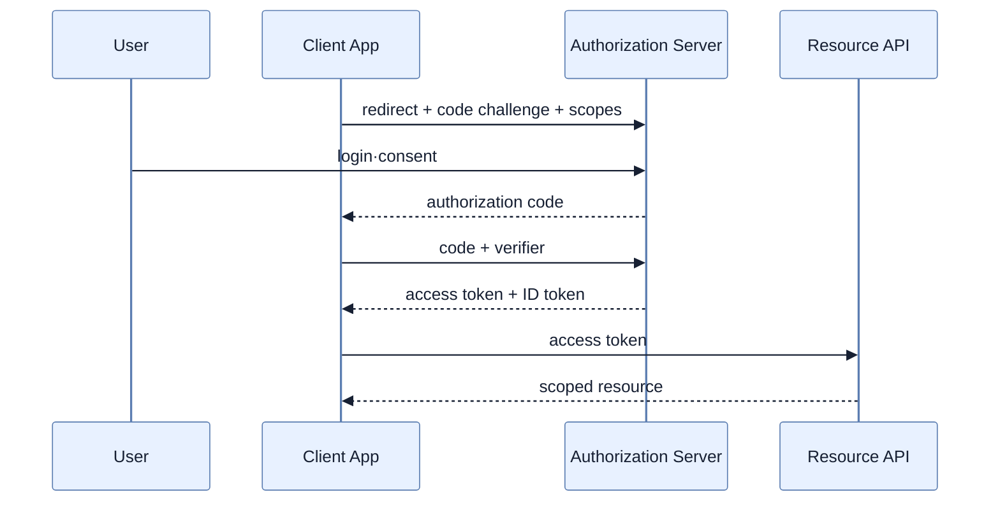

# OAuth 2.1과 OpenID Connect 이해

## 한눈에 보기

OAuth는 사용자의 password를 client에 주지 않고 제한된 **위임 인가**를 access token과 scope로 표현한다. OIDC는 그 위에 ID token과 사용자 identity를 추가한다. 현대 사용자 로그인은 Authorization Code + PKCE, 사용자 없는 서비스 통신은 Client Credentials가 중심이다.

## 1. 왜 이게 필요한가

애플리케이션이 Google password를 직접 받으면 유출 책임과 계정 관리 부담이 커진다. 사용자가 provider에서 직접 인증하고 필요한 YouTube 읽기 권한만 동의하면 client는 목적에 제한된 token만 갖는다.

## 2. 어떻게 동작하는가

Authorization Code 흐름은 client가 사용자를 authorization server로 이동시키고, 로그인·동의 후 짧은 code를 돌려받아 서버 간 통신으로 access/refresh token과 교환한다. PKCE는 처음에 code verifier의 hash인 challenge를 보내고 교환 때 원문 verifier를 요구해 가로챈 code의 재사용을 막는다. OAuth 2.1은 implicit flow를 제거하고 PKCE를 요구하는 방향으로 안전한 관행을 통합한다.

OAuth는 출입 권한 위임장, OIDC ID token은 신분 확인서에 가깝다. access token을 identity 증명으로 임의 해석하면 두 계약을 혼동한다.

## 3. 그림으로 보기

## 4. 이 노트에 나온 용어

- **scope**: client에 위임된 권한의 범위.
- **access token**: resource server에 위임 권한을 제시하는 credential.
- **ID token**: OIDC가 발급하는 검증된 사용자 identity claim 묶음.
- **PKCE**: authorization code 탈취 재사용을 막는 code verifier/challenge 확장.

## 7. 연결

- [[08-authenticating-with-google-and-calling-youtube]] — 개념을 Google 로그인과 YouTube API에 적용한다.
- [[01-spring-security-foundations]] — OAuth 인증 결과도 최종적으로 security context와 인가 규칙에 들어간다.

## 8. 스스로 확인

- 전체 1차 정리 후: OAuth와 OIDC가 각각 답하는 질문을 구분하고 PKCE의 공격 방어를 설명한다.

<!-- ==== 아래는 내 영역 · 스킬 수정 금지 ==== -->

## 내 설명 시도

## 막혔던 지점

## 리뷰 이력

