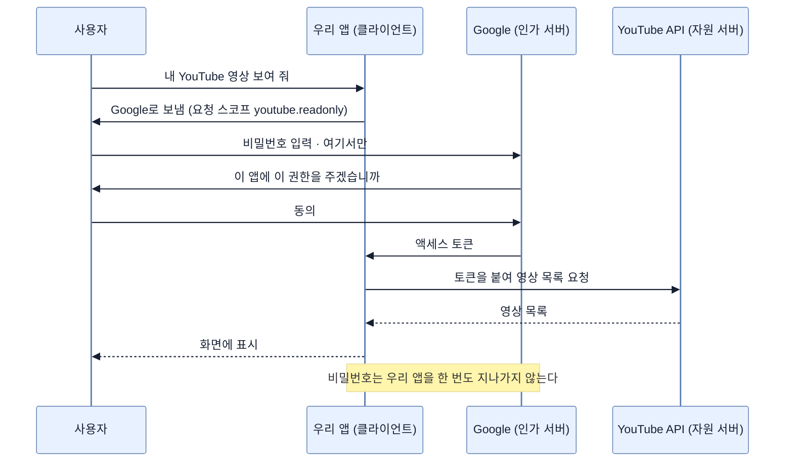
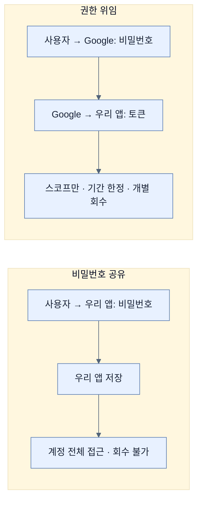

# 비밀번호를 주지 않고 권한만 주기 — OAuth가 푸는 문제

## 한눈에 보기

| 질문 | 핵심 답 |
|---|---|
| OAuth는 "소셜 로그인"인가 | **아니다.** 형식을 갖춘 **인가** 프레임워크다 |
| 푸는 질문 | 비밀번호를 모른 채로 남의 시스템에 있는 사용자 자원에 접근하려면? |
| 사용자가 넘기는 것 | 비밀번호가 아니라 **제한된 접근 권한** |
| 발급되는 것 | 액세스 토큰 |
| 권한 범위를 나타내는 것 | 스코프 |
| 애플리케이션이 보는 비밀번호 | **없다.** 한 번도 지나가지 않는다 |
| 이것만으로 안 되는 것 | "그래서 이 사용자가 **누구인가**" — [[07a-oauth-vs-openid-connect]]로 이어진다 |

## 1. 왜 이게 필요한가

### 출발 장면: YouTube 동영상을 읽어 오려면 비밀번호를 받아야 하나

우리 동영상 사이트에 "내 YouTube 채널 영상 가져오기" 기능을 붙이려 한다. YouTube 데이터는 Google에 있다.

OAuth 이전 방식으로 하면 이렇게 된다.

```text
[우리 사이트]
Google 계정으로 영상을 불러오겠습니다.
  Google 이메일: [            ]
  Google 비밀번호: [           ]
```

사용자의 Google 비밀번호를 우리가 받아서, 우리 서버에 저장해 두고, 그걸로 Google에 로그인해 데이터를 긁어 오는 것이다.

이 방식의 결과를 하나씩 보자.

| 문제 | 구체적 결과 |
|---|---|
| 권한이 전부다 | Google 비밀번호는 Gmail·Drive·결제 정보까지 연다. 우리는 동영상 목록만 필요한데 **전부** 받게 된다 |
| 회수할 수 없다 | 사용자가 우리를 못 믿게 돼도, 비밀번호를 바꾸는 것 말고는 우리 접근을 끊을 방법이 없다. 그러면 **다른 모든 앱도 함께 끊긴다** |
| 유출 범위가 넓다 | 우리 DB가 털리면 사용자의 Google 계정 전체가 털린다 |
| 2단계 인증과 안 맞는다 | 사용자가 2FA를 켜 두면 비밀번호만으로는 로그인이 안 된다 |
| 신뢰를 요구한다 | 사용자가 "이 사이트가 내 비밀번호를 안전하게 다룰까"를 매번 판단해야 한다 |

**[[OAuth]]**(= 비밀번호를 넘기지 않고 사용자 자원 접근 권한을 위임받기 위한 표준 인가 프레임워크)가 푸는 질문이 정확히 이것이다. 책의 문장을 그대로 옮기면,

> 애플리케이션이 사용자의 비밀번호를 모른 채로, 다른 시스템에 저장된 사용자의 보호된 자원에 어떻게 접근할 수 있는가?

### 왜 이름이 "Auth"가 아니라 "OAuth"인가

`Open` + `Auth`다. 특정 회사의 사유 규격이 아니라 공개 표준이라는 뜻이 앞에 붙었다. 그리고 여기서 `Auth`는 **authorization**(인가)이지 authentication(인증)이 아니다. 이 구분이 [[07a-oauth-vs-openid-connect]] 전체의 주제가 된다.

## 2. 어떻게 동작하는가

### 2.1 비밀번호 대신 무엇을 주고받는가

핵심 아이디어는 **[[위임-인가]]**(= 자격 증명 대신 제한된 권한만 제3의 애플리케이션에 넘기는 모델)다.

책이 든 YouTube 예시의 네 단계다.

| 단계 | 일어나는 일 | 이 단계가 필요한 이유 |
|---|---|---|
| 1 | 우리 앱이 "이 사용자의 YouTube 영상을 읽을 권한"을 요청한다 | 무엇이 필요한지 **미리 밝혀야** 사용자가 판단할 수 있다 |
| 2 | 사용자가 **Google에 직접** 인증한다 | 비밀번호가 우리 앱을 거치지 않는다. 이것이 전체 설계의 목적 |
| 3 | Google이 우리 앱에 액세스 토큰을 준다 | 비밀번호를 대신할 무언가가 필요한데, 힘이 제한된 것이어야 한다 |
| 4 | 우리 앱이 그 토큰으로 Google API를 부른다 | — |

2단계가 결정적이다. 사용자는 **Google 도메인의 화면에서** 비밀번호를 입력한다. 우리 앱은 그 화면을 보지도, 그 값을 받지도 못한다. 주소창의 도메인이 곧 보증이 된다.

### 2.2 토큰이 비밀번호보다 나은 이유

**[[액세스-토큰]]**(= 인가 서버가 발급하는, 자원 접근에 쓰는 단기 자격 증명)은 비밀번호를 대신하지만 **힘이 훨씬 약하다.**

| 축 | 비밀번호 | 액세스 토큰 |
|---|---|---|
| 할 수 있는 일 | 계정의 **전부** | 요청한 스코프만 |
| 유효 기간 | 바꿀 때까지 | 보통 수십 분~수 시간 |
| 회수 | 바꾸면 모든 앱이 끊김 | **이 앱 것만** 골라서 취소 |
| 발급 대상 | 사람 하나 | 앱마다 따로 |
| 유출 피해 | 계정 전체 | 그 스코프, 그 기간만 |

권한을 좁히는 장치가 **[[스코프]]**(= 토큰이 무엇까지 할 수 있는지 나타내는 권한 목록)다. 우리 예제가 요청하는 것은 `https://www.googleapis.com/auth/youtube.readonly` — "YouTube를, 읽기만"이다. 이 토큰으로는 Gmail을 열 수도, 동영상을 지울 수도 없다.

이름 그대로 "범위(scope)"다. 토큰의 힘이 미치는 범위를 미리 못 박아 두는 것이고, [[08a-creating-a-google-oauth-application]]에서 이 값이 동의 화면에 그대로 나타나는 것을 보게 된다.

### 2.3 누가 무엇을 맡는가



등장하는 역할이 넷이다.

| 역할 | 누구인가 | 하는 일 |
|---|---|---|
| 자원 소유자 | 사용자 | 권한을 줄지 결정한다 |
| 클라이언트 | 우리 앱 | 권한을 요청하고 토큰으로 API를 부른다 |
| **[[인가-서버]]**(= 사용자를 인증하고 동의를 받아 토큰을 발급하는 쪽) | Google 계정 시스템 | 인증·동의·토큰 발급 |
| 자원 서버 | YouTube Data API | 토큰을 검사하고 데이터를 준다 |

역할이 넷으로 나뉘어 있다는 것이 OAuth 설명이 복잡해 보이는 이유이자, 동시에 **비밀번호가 한 곳에만 머무는** 이유다.

### 2.4 여기까지로 답이 안 되는 것

이 절이 끝나는 지점에서 책은 한계를 짚는다.

OAuth는 **"이 앱이 사용자를 대신해 무엇을 해도 되는가"**를 정한다. 그런데 우리가 흔히 "Google로 로그인"이라 부르는 기능은 다른 것을 원한다 — **"이 사용자가 누구인가."**

토큰을 받았다는 사실만으로는 사용자의 신원을 형식적으로 알 수 없다. 토큰은 권한 증서이지 신분증이 아니기 때문이다. 이 빈틈을 메우는 것이 [[07a-oauth-vs-openid-connect]]의 주제다.

## 3. 그림으로 보기



| 축 | 인증(authentication) | 인가(authorization) | 이 노트의 주제 |
|---|---|---|---|
| 묻는 것 | 누구인가 | 무엇을 해도 되는가 | **인가** |
| 이 장 앞부분 | [[03-creating-users-with-userdetailsservice]] | [[05-securing-web-routes-and-http-verbs]] | — |
| OAuth가 다루는 것 | 형식적으로는 다루지 않는다 | **정확히 이것** | — |
| OIDC가 더하는 것 | **이것** | — | [[07a-oauth-vs-openid-connect]] |

## 4. 이 노트에 나온 용어

| 용어 | 한 줄 뜻 | 정의 위치 |
|---|---|---|
| OAuth | 비밀번호 없이 접근 권한을 위임받는 표준 인가 프레임워크 | [[_glossary#OAuth]] |
| 위임 인가 | 자격 증명 대신 제한된 권한만 넘기는 모델 | [[_glossary#위임-인가]] |
| 스코프 | 토큰이 무엇까지 할 수 있는지 나타내는 권한 목록 | [[_glossary#스코프]] |
| 액세스 토큰 | 자원 접근에 쓰는 단기 자격 증명 | [[_glossary#액세스-토큰]] |
| 인가 서버 | 사용자를 인증하고 토큰을 발급하는 쪽 | [[_glossary#인가-서버]] |
| 인가 | 확정된 사용자가 이 일을 해도 되는지 판정 | [[_glossary#인가]] |
| 인증 | 요청자가 누구인지 확정하는 절차 | [[_glossary#인증]] |

## 5. 자주 헷갈리는 것

**"OAuth는 로그인 방식이다"** — 형식적으로는 아니다. 인가 프레임워크이며, 로그인처럼 쓰려면 OIDC가 얹혀야 한다. 실무에서 둘을 함께 쓰다 보니 구분이 흐려졌을 뿐이다.

**"토큰은 비밀번호의 다른 이름이다"** — 힘의 범위와 수명이 다르다. 스코프로 좁혀지고, 만료되고, 개별 회수된다.

**"우리 앱이 Google 로그인 화면을 그린다"** — 그리면 안 된다. 사용자가 비밀번호를 넣는 화면은 **Google 도메인**에 있어야 하고, 주소창이 그것을 보증한다. 우리가 흉내 내면 그 순간 OAuth의 전제가 무너진다.

**"스코프는 형식적인 것이다"** — 실제로 힘을 제한한다. `youtube.readonly` 토큰으로는 동영상을 지울 수 없다.

## 6. 언제 안 쓰나 / 경계

- **사용자가 개입하지 않는 시나리오.** 배치 작업이나 서비스 간 호출에는 자원 소유자가 없다. 그런 경우를 위한 별도 흐름이 [[07a-oauth-vs-openid-connect]]에 나온다.
- **외부 제공자에 대한 의존.** Google이 내려가면 우리 앱의 로그인도 내려간다. [[08-leveraging-google-to-authenticate-users]]에서 직접 인가 서버를 운영하는 선택지를 다룬다.
- **비유의 한계.** OAuth는 "호텔 발레파킹 키"에 자주 비유된다. 차 키 전체가 아니라 시동과 문만 열리는 제한된 키를 준다. 다만 이 비유는 **키를 회수하는 주체**를 흐린다. 발레파킹 키는 물리적으로 돌려받지만, 액세스 토큰은 사용자가 Google 설정 화면에서 **원격으로** 무효화한다. 우리 앱이 그 토큰을 아직 손에 쥐고 있어도 쓸 수 없게 된다. 열쇠를 뺏는 게 아니라 자물쇠를 바꾸는 쪽에 가깝다.

## 7. 연결

- [[07a-oauth-vs-openid-connect]] — 이 노트가 남긴 "그래서 이 사용자가 누구인가"라는 빈틈을 OIDC가 어떻게 메우는지, 그리고 어떤 흐름이 표준인지를 다룬다.
- [[08-leveraging-google-to-authenticate-users]] — 여기서 설명한 모델을 실제 Google 연동으로 옮기는 첫 단계다.
- [[06f-displaying-user-details-on-the-site]] — 사용자 관리 부담이 커진다는 그 절의 결론이 이 노트의 출발점이다.

## 8. 스스로 확인

1. 비밀번호를 직접 받는 방식의 문제 다섯 가지를 각각의 결과와 함께 말할 수 있는가?
2. 사용자가 Google 도메인에서 비밀번호를 입력해야 하는 이유는?
3. 액세스 토큰이 비밀번호보다 안전한 근거를 네 축으로 정리할 수 있는가?
4. 스코프가 "형식적 표시"가 아니라 실제 제한이라는 것을 예로 보일 수 있는가?
5. OAuth의 네 역할을 우리 예제에 대응시킬 수 있는가?
6. OAuth만으로는 "이 사용자가 누구인가"에 답할 수 없는 이유는?
7. 발레파킹 키 비유가 깨지는 지점은 어디인가?

<!-- ==== 아래는 내 영역 · 스킬 수정 금지 ==== -->

## 내 설명 시도


## 막혔던 지점


## 리뷰 이력
