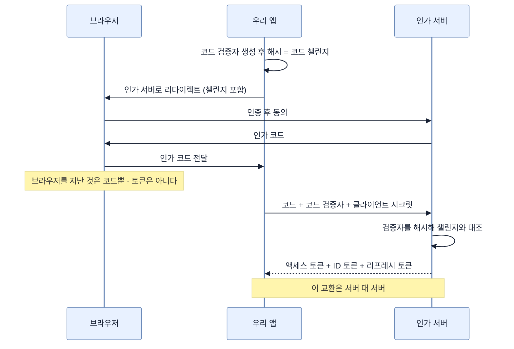

# 권한 증서와 신분증 — OIDC가 더하는 것, OAuth 2.1이 덜어낸 것

## 한눈에 보기

| 질문 | 핵심 답 |
|---|---|
| OAuth가 답하지 않는 것 | **이 사용자가 누구인가** |
| OIDC가 더하는 것 | ID 토큰 — 검증된 신원 정보 |
| 역할 대비 | OAuth = 위임 인가(액세스 토큰, 스코프) · OIDC = 인증(ID 토큰, 신원) |
| 현대 OAuth의 주 흐름 | **Authorization Code Flow** |
| 그 흐름의 두 성질 | 액세스 토큰이 브라우저에 노출되지 않는다 · 토큰 교환이 서버 대 서버로 일어난다 |
| PKCE | 인가 코드를 가로채도 토큰으로 못 바꾸게 막는 확장. **OAuth 2.1에서 모든 클라이언트 의무** |
| 사용자가 없을 때 | Client Credentials Flow |
| 사라진 것 | Implicit Flow — 토큰이 브라우저에 노출돼 제거됨 |
| Spring Security의 기본 | 공개 클라이언트에 PKCE를 자동 적용 |

## 1. 왜 이게 필요한가

### 출발 장면: 토큰을 받았는데 이 사람이 누구인지 모른다

[[07-understanding-oauth-2-1]]의 흐름을 끝까지 따라가면 우리 손에 액세스 토큰이 남는다. 그 토큰으로 YouTube 영상 목록을 가져올 수 있다.

그런데 이제 우리 사이트에 이 사용자의 세션을 만들려고 하면 막힌다. **토큰 어디에도 "이 사람은 alice다"라는 말이 없다.**

액세스 토큰은 대개 불투명한 문자열이다. 우리가 열어 볼 수 없고, 규격상 열어 보라고 만든 것도 아니다. 토큰이 증명하는 것은 **"이 앱이 어떤 자원에 접근할 권한을 받았다"**이지 **"이 앱을 쓰는 사람이 누구다"**가 아니다.

책의 표현대로, **흔한 오해가 "OAuth가 인증을 처리한다"는 것**이다. 엄밀히 말해 OAuth는 인가 프레임워크이지 인증 프로토콜이 아니다.

### 우회로가 왜 위험한가

"그럼 토큰으로 사용자 정보 API를 부르면 되지 않나?"라고 생각할 수 있다. 실제로 그렇게들 했고, 그게 문제였다.

토큰으로 프로필 API를 불러 얻은 정보에는 **"이 토큰이 정말 우리 앱을 위해 발급된 것인가"**를 확인할 수단이 없다. 다른 앱을 위해 발급된 토큰을 누군가 우리에게 들이밀어도 프로필 API는 순순히 답한다. 그러면 그 사람은 남의 계정으로 우리 사이트에 로그인하게 된다.

**신원 확인은 형식을 갖춰야 한다.** 그래서 별도 규격이 필요해졌다.

## 2. 어떻게 동작하는가

### 2.1 OIDC가 얹는 것

**[[OIDC]]**(= OAuth 2.0 위에 신원 확인을 얹은 규격)는 OAuth를 대체하지 않는다. **위에 얹는다.** 더하는 것은 하나, **[[ID-토큰]]**(= 사용자 신원 정보가 담기고 서명이 붙은 토큰)이다.

| | OAuth | OIDC |
|---|---|---|
| 답하는 질문 | 이 앱이 뭘 해도 되나 | 이 사용자가 누구인가 |
| 발급물 | 액세스 토큰 | **ID 토큰** |
| 내용 | 불투명해도 됨 | 사용자 식별자·발급자·**수신 대상**·만료가 담긴 검증 가능한 구조 |
| 검증 | 자원 서버가 한다 | **우리 앱이 서명을 검증한다** |

ID 토큰이 앞의 우회로 문제를 푸는 지점은 **수신 대상(audience)** 필드다. "이 토큰은 클라이언트 ID `xyz`를 위해 발급됐다"가 토큰 안에 적혀 있고, 인가 서버의 서명으로 위조가 막혀 있다. 우리 앱은 그 값이 자기 클라이언트 ID와 같은지 확인한다. 다른 앱용 토큰을 들이밀면 여기서 걸린다.

책의 정리를 그대로 옮기면,

- **OAuth**: 위임 인가 (액세스 토큰, 스코프)
- **OIDC**: 인증 (ID 토큰, 사용자 신원)

그리고 현대의 "Google로 로그인"은 대부분 **둘을 함께** 쓴다. 우리 예제도 스코프에 `openid`가 들어가는데([[08b-adding-oauth-client-to-a-spring-boot-project]]), 그 값이 바로 "OIDC로 동작하라"는 신호다.

### 2.2 Authorization Code Flow

**[[인가-코드-플로우]]**(= 짧은 수명의 코드를 먼저 받고 서버끼리 토큰과 교환하는 흐름)가 현대 OAuth의 주 흐름이자 OAuth 2.1의 토대다.

| 단계 | 일어나는 일 | 이 단계가 필요한 이유 |
|---|---|---|
| 1 | 클라이언트가 사용자를 **[[인가-서버]]**로 리다이렉트 | 비밀번호를 우리가 받지 않으려면 사용자를 그쪽으로 보내야 한다 |
| 2 | 사용자가 인가 서버에서 인증 | 비밀번호가 인가 서버에만 머문다 |
| 3 | 인가 서버가 **인가 코드**를 돌려줌 | 이 값은 브라우저를 거쳐 오므로 노출된다. 그래서 **토큰이 아니라 코드**여야 한다 |
| 4 | 클라이언트가 그 코드를 **액세스 토큰**과 교환 | 이 교환은 서버 대 서버로, 클라이언트 시크릿과 함께 일어난다 |

책이 짚는 두 성질이 여기서 나온다.

1. **액세스 토큰이 브라우저에 노출되지 않는다.** 브라우저를 지나는 것은 코드뿐이고, 코드만으로는 아무것도 못 한다.
2. **토큰 교환이 서버 대 서버로 일어난다.** 그래서 서버 사이드 웹 애플리케이션에 권장되는 방식이다.

3번 단계에서 코드와 토큰을 나눈 것이 이 설계의 핵심이다. 브라우저 리다이렉트는 주소창·히스토리·리퍼러·서버 로그에 값을 남긴다. 그 자리에 토큰을 두면 새어 나가고, 코드를 두면 **코드만으로는 교환이 안 되므로** 새어도 쓸 수 없다.

이때 함께 발급될 수 있는 것이 **[[리프레시-토큰]]**(= 액세스 토큰 만료 시 사용자를 다시 로그인시키지 않고 새 토큰을 받는 장기 자격 증명)이다. 액세스 토큰의 수명을 짧게 유지하면서도 사용자가 계속 로그인 화면을 보지 않게 해 준다.

### 2.3 PKCE — 코드마저 가로채였을 때

3번 단계에는 아직 구멍이 있다. **코드가 가로채졌고 클라이언트 시크릿까지 알려져 있다면** 공격자가 코드를 토큰으로 바꿀 수 있다.

이 상황은 모바일 앱이나 SPA처럼 **시크릿을 숨길 수 없는 클라이언트**에서 실제로 일어난다. 앱을 디컴파일하면 시크릿이 나오기 때문이다.

**[[PKCE]]**(= 인가 코드를 가로채도 토큰으로 바꾸지 못하게 막는 확장, "픽시"라고 읽는다)가 이것을 막는다.

| 단계 | 클라이언트가 하는 일 | 인가 서버가 하는 일 |
|---|---|---|
| 1 | **[[코드-검증자]]**(= 매 요청 새로 만드는 랜덤 비밀값)를 생성 | — |
| 2 | 그것을 해시한 **[[코드-챌린지]]**(= 코드 검증자의 해시)를 인가 요청에 실어 보냄 | 챌린지를 코드와 함께 기억 |
| 3 | 코드를 교환할 때 **원본 검증자**를 제시 | 받은 검증자를 해시해 기억한 챌린지와 비교 |
| 4 | — | 일치하지 않으면 거절 |

공격자가 코드를 가로채도 검증자를 모른다. 검증자는 클라이언트 메모리에만 있었고 네트워크에는 **해시만** 나갔기 때문이다. 해시는 되돌릴 수 없으므로 원본을 만들어 낼 수 없다.

이름을 풀면 "Proof Key for Code Exchange" — **코드 교환을 위한 증명 키**다. 이름이 곧 하는 일이다.

원래 공개 클라이언트용으로 설계됐지만, **OAuth 2.1은 모든 클라이언트에 PKCE를 의무화했다.** 시크릿을 잘 숨긴 서버 클라이언트라도 방어가 한 겹 더 있어서 나쁠 게 없다는 판단이다. 책은 Spring Security의 최신 OAuth 클라이언트가 공개 클라이언트에 대해 PKCE를 **자동으로** 켠다고 덧붙인다.

### 2.4 사용자가 없는 경우

**[[클라이언트-자격-증명-플로우]]**(= 사용자 개입 없이 서비스가 자기 자격 증명으로 토큰을 받는 흐름)는 인가 흐름이 훨씬 짧다.

```text
서비스 → 인가 서버: 내 client_id와 client_secret이다. 토큰 다오.
인가 서버 → 서비스: 액세스 토큰
서비스 → 자원 서버: 토큰을 붙여 API 호출
```

리다이렉트도, 동의 화면도, 코드도 없다. **자원 소유자가 없기 때문이다.** 이 흐름이 접근하는 것은 사용자의 데이터가 아니라 서비스 자신의 권한 범위다.

쓰이는 곳은 머신 대 머신 통신, 마이크로서비스 간 호출, 배치 작업이다.

### 2.5 제거된 흐름

**[[임플리싯-플로우]]**(= 액세스 토큰을 브라우저 리다이렉트로 곧장 돌려주던 옛 흐름)는 OAuth 2.0에 있었지만 OAuth 2.1에서 제거됐다.

문제는 2.2에서 설명한 그 자리다. 코드 대신 **토큰 자체**를 브라우저 리다이렉트로 돌려주었기 때문에 토큰이 주소창·히스토리·리다이렉트 URI 처리 과정에 그대로 노출됐다.

당시에는 이유가 있었다. 브라우저 자바스크립트가 서버 대 서버 교환을 할 수 없던 시절, 그리고 CORS가 지금처럼 정리되기 전이었다. 그 제약이 사라지자 존재 이유도 사라졌고, **Authorization Code Flow + PKCE**가 그 자리를 대신했다.

### 2.6 OAuth 2.1이 한 일

OAuth 2.1은 새 기능을 더한 것이 아니라 **정리**다. 흩어져 있던 모범 사례를 규격 본문으로 끌어들였다.

| 한 일 | 내용 |
|---|---|
| 제거 | Implicit Flow |
| 의무화 | 모든 클라이언트에 PKCE |
| 승격 | Authorization Code Flow를 표준 방식으로 |
| 명확화 | 보안 권고사항 정리 |

Spring Boot 애플리케이션에 대한 권장도 단순해진다 — **사용자 로그인은 Authorization Code Flow + PKCE, 서비스 간 통신은 Client Credentials Flow.**

## 3. 그림으로 보기



| 흐름 | 사용자 개입 | 브라우저에 토큰 노출 | OAuth 2.1에서 | 쓰는 곳 |
|---|---|---|---|---|
| Authorization Code + PKCE | 있음 | 없음 | **표준** | 사용자 로그인 |
| Client Credentials | 없음 | 해당 없음 | 유지 | 서비스 간 호출 |
| Implicit | 있음 | **있음** | **제거** | — |

## 4. 이 노트에 나온 용어

| 용어 | 한 줄 뜻 | 정의 위치 |
|---|---|---|
| OIDC | OAuth 위에 신원 확인을 얹은 규격 | [[_glossary#OIDC]] |
| ID 토큰 | 사용자 신원 정보가 담기고 서명된 토큰 | [[_glossary#ID-토큰]] |
| Authorization Code Flow | 코드를 먼저 받고 서버끼리 토큰과 교환하는 흐름 | [[_glossary#인가-코드-플로우]] |
| PKCE | 코드를 가로채도 토큰으로 못 바꾸게 막는 확장 | [[_glossary#PKCE]] |
| 코드 검증자 | 매 요청 새로 만드는 랜덤 비밀값 | [[_glossary#코드-검증자]] |
| 코드 챌린지 | 코드 검증자의 해시 | [[_glossary#코드-챌린지]] |
| 리프레시 토큰 | 새 액세스 토큰을 받아 오는 장기 자격 증명 | [[_glossary#리프레시-토큰]] |
| Client Credentials Flow | 사용자 없이 서비스가 자기 자격으로 토큰을 받는 흐름 | [[_glossary#클라이언트-자격-증명-플로우]] |
| Implicit Flow | 토큰을 브라우저로 곧장 돌려주던 제거된 흐름 | [[_glossary#임플리싯-플로우]] |
| 액세스 토큰 | 자원 접근에 쓰는 단기 자격 증명 | [[_glossary#액세스-토큰]] |
| 인가 서버 | 사용자를 인증하고 토큰을 발급하는 쪽 | [[_glossary#인가-서버]] |

## 5. 자주 헷갈리는 것

**"OIDC는 OAuth를 대신한다"** — 위에 얹는다. OIDC 흐름은 OAuth 흐름 그 자체이고, 다른 점은 스코프에 `openid`가 들어가고 ID 토큰이 함께 발급된다는 것이다.

**"액세스 토큰으로 사용자를 식별하면 된다"** — 그 토큰이 **우리 앱을 위해** 발급됐는지 알 수 없다. 남의 앱용 토큰으로 로그인당할 수 있고, 그래서 ID 토큰의 수신 대상 필드가 필요하다.

**"인가 코드가 노출되면 끝이다"** — PKCE가 있으면 코드만으로는 교환이 안 된다. 그래서 2.1이 모든 클라이언트에 의무화했다.

**"PKCE는 모바일 앱만의 것이다"** — 그렇게 시작했지만 OAuth 2.1은 **모든 클라이언트**에 요구한다.

**"흐름이 여러 개니 상황마다 골라야 한다"** — 실질적으로 둘이다. 사용자가 있으면 Authorization Code + PKCE, 없으면 Client Credentials.

## 6. 언제 안 쓰나 / 경계

- **ID 토큰을 API 호출에 쓰지 마라.** ID 토큰은 우리 앱을 향한 신분증이고, 자원 서버를 향한 것은 액세스 토큰이다. 바꿔 쓰면 자원 서버가 거절하거나, 더 나쁘게는 받아 주면서 검증 모델이 무너진다.
- **리프레시 토큰은 액세스 토큰보다 훨씬 위험하다.** 수명이 길어 유출되면 오래 악용된다. 서버에만 두어야 한다.
- **비유의 한계.** 액세스 토큰과 ID 토큰의 차이는 "출입증과 신분증"에 비유할 수 있다. 출입증은 문을 열어 주고 신분증은 내가 누구인지 말해 준다. 다만 이 비유는 **신분증을 보여 주는 상대**를 흐린다. ID 토큰은 자원 서버가 아니라 **우리 앱**에게 보이는 것이고, 우리 앱이 서명을 검증한 뒤 버린다. 밖에 들고 다니는 물건이 아니라 입국 심사대에서 한 번 확인하고 회수하는 서류에 가깝다.

## 7. 연결

- [[07-understanding-oauth-2-1]] — 그 노트가 남긴 "그래서 누구인가"라는 질문에 이 노트가 답한다.
- [[08b-adding-oauth-client-to-a-spring-boot-project]] — 여기서 설명한 `openid` 스코프와 Authorization Code Flow가 설정 파일과 빈 정의로 나타난다.
- [[08a-creating-a-google-oauth-application]] — 리다이렉트 URI를 미리 등록해야 하는 이유가 이 노트의 3번 단계에 있다.

## 8. 스스로 확인

1. 액세스 토큰만으로 사용자를 식별하면 어떤 공격이 가능한가?
2. ID 토큰의 어떤 필드가 그 공격을 막는가?
3. Authorization Code Flow가 코드와 토큰을 나눈 이유를 "브라우저를 지나는 값"으로 설명할 수 있는가?
4. PKCE가 막는 상황과, 그것이 원래 모바일용이었던 이유는?
5. 코드 검증자가 네트워크에 나가지 않는다는 사실이 왜 결정적인가?
6. Implicit Flow가 당시에는 합리적이었던 이유와 지금 제거된 이유는?
7. OAuth 2.1이 "새 기능이 아니라 정리"인 이유를 네 항목으로 말할 수 있는가?
8. 출입증/신분증 비유가 깨지는 지점은 어디인가?

<!-- ==== 아래는 내 영역 · 스킬 수정 금지 ==== -->

## 내 설명 시도


## 막혔던 지점


## 리뷰 이력
