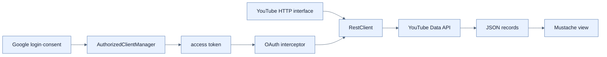

# Google 인증과 YouTube API 호출

## 한눈에 보기

Google Cloud에 OAuth web client, redirect URI, YouTube Data API, test user를 등록한다. Boot OAuth Client 설정은 client ID/secret과 scopes를 읽고, `OAuth2AuthorizedClientManager`와 RestClient interceptor가 현재 사용자의 access token을 YouTube 요청에 자동 첨부한다.

## 1. 왜 이게 필요한가

외부 identity provider를 사용하면 password 저장·복구를 위임하고 검증된 identity와 제한된 API 권한을 받을 수 있다. 단, client 등록·callback·scope·secret이라는 신뢰 계약을 정확히 맞춰야 redirect 공격과 과도한 권한을 막는다.

## 2. 어떻게 동작하는가

1. Google 프로젝트에서 API와 OAuth client를 만들고 `/login/oauth2/code/google` callback을 허용한다.
2. `spring.security.oauth2.client.registration.google`에 client credential과 `openid, profile, email, youtube.readonly` scope를 둔다. secret은 소스에 커밋하지 않는다.
3. Boot가 client registration/authorized client repository를 구성한다.
4. manager가 authorization code, refresh token, client credentials provider를 조율한다.
5. RestClient interceptor가 `google` registration의 token을 outgoing request에 넣는다.
6. `@GetExchange` YouTube 인터페이스가 query parameter와 JSON record 응답 계약을 선언한다.
7. MVC 컨트롤러가 결과를 Mustache model에 넣어 렌더링한다.

CommonOAuth2Provider는 Google endpoint 기본값을 줄이지만 custom scope, provider 정책, credential rotation 책임까지 없애지는 않는다.

## 3. 그림으로 보기

## 4. 이 노트에 나온 용어

- **client registration**: provider endpoint, client ID, secret, redirect URI, scopes를 묶은 OAuth client 설정.
- **redirect URI**: authorization 후 provider가 code를 돌려보낼 사전 등록 callback.
- **authorized client manager**: token 획득·갱신과 client authorization을 조율하는 구성 요소.
- **request interceptor**: 모든 outgoing HTTP 요청에 공통 동작을 적용하는 hook.

## 7. 연결

- [[07-understanding-oauth-2-1-and-oidc]] — token·scope·code flow의 개념 기반이다.
- [[chapter-2-creating-web-and-api-applications-with-spring-boot/09-calling-versioned-apis-with-http-service-clients|HTTP Service Client]] — 원격 API 인터페이스와 proxy 모델을 재사용한다.
- [[09-securing-data-in-transit-with-tls-and-ssl-bundles]] — token이 이동하는 채널도 TLS로 보호해야 한다.

## 8. 스스로 확인

- 전체 1차 정리 후: RestClient interceptor가 current user의 OAuth token을 붙이는 위치를 설명한다.

<!-- ==== 아래는 내 영역 · 스킬 수정 금지 ==== -->

## 내 설명 시도

## 막혔던 지점

## 리뷰 이력

