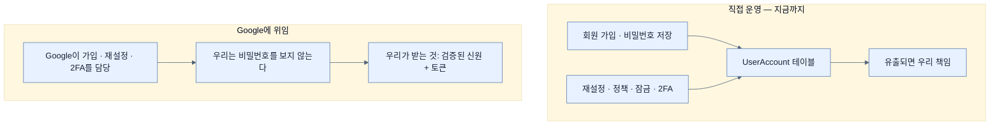
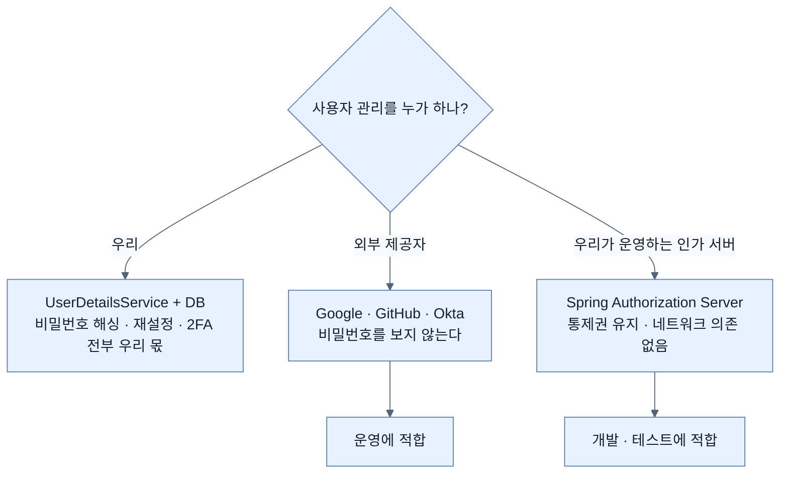

# 사용자 관리를 통째로 넘기기 — 그리고 넘기지 않는 선택지

## 한눈에 보기

| 질문 | 핵심 답 |
|---|---|
| 왜 넘기나 | 신원 시스템을 만들고 유지하는 일이 **복잡하고 보안에 민감**해서 |
| 넘기면 무엇을 안 다뤄도 되나 | 사용자 비밀번호를 **직접 다루지 않는다** |
| 대신 받는 것 | 검증된 신원 정보 + 위임된 권한을 담은 토큰 |
| 얻는 것 세 가지 | 위험 감소 · 사용자 관리 단순화 · 검증된 플랫폼에 의존 |
| 선택지 | Google, GitHub, Microsoft, 상용 신원 서비스 … |
| 넘기지 않는 선택지 | **Spring Authorization Server**로 직접 인가 서버를 운영 |
| 언제 직접 운영하나 | 개발·실험·자동화 테스트 — 외부 네트워크 의존을 없애고 싶을 때 |
| 이 책의 선택 | Google |

## 1. 왜 이게 필요한가

### 출발 장면: 계정 하나를 제대로 만들려면 무엇이 필요한가

[[06f-displaying-user-details-on-the-site]]의 끝에서 나온 결론이 여기서 구체화된다. 지금까지 만든 사용자 시스템은 alice·bob·admin 세 명이 전부인데, 이걸 실제 서비스로 만들려면 무엇이 더 필요한지 적어 보자.

| 필요한 것 | 왜 어려운가 |
|---|---|
| 회원 가입 | 이메일 소유 확인, 중복 검사, 봇 차단 |
| 비밀번호 저장 | 적절한 해시 알고리즘, 솔트, 반복 횟수 조정 |
| 비밀번호 재설정 | 안전한 일회용 링크, 만료, 재사용 방지 |
| 비밀번호 정책 | 최소 길이, 유출된 비밀번호 목록 대조 |
| 계정 잠금 | 무차별 대입 탐지, 잠금 해제 흐름 |
| 2단계 인증 | TOTP 또는 하드웨어 키 지원 |
| 세션 관리 | 만료, 동시 로그인 제한, 강제 로그아웃 |
| 감사 로그 | 누가 언제 로그인했는지, 누가 권한을 바꿨는지 |

이 목록 전체가 **우리 앱의 본업(동영상 목록)과 아무 관련이 없다.** 그런데 하나라도 잘못하면 사고가 난다.

책의 표현대로 "신원·비밀번호·자격 증명 복구를 관리하는 일은 복잡하고 보안에 민감하다." 그래서 많은 팀이 이 목록을 통째로 남에게 넘긴다.

## 2. 어떻게 동작하는가

### 2.1 넘기면 무엇이 달라지는가

**[[신원-제공자]]**(= 사용자 계정과 인증을 대신 책임지는 외부 서비스)에 위임하면 구조가 이렇게 바뀐다.

책이 정리하는 이득은 셋이다.

| 이득 | 구체적으로 |
|---|---|
| 보안 위험 감소 | 우리 DB가 털려도 **거기에 비밀번호가 없다** |
| 사용자 관리 단순화 | 위의 목록 전체가 우리 일이 아니게 된다 |
| 검증된 플랫폼 활용 | 수억 명이 쓰며 다듬어진 시스템을 쓴다 |

첫 번째가 가장 크다. **없는 데이터는 유출될 수 없다.** [[09b-securing-data-at-rest]]에서 배울 비밀번호 해싱조차 필요 없어진다 — 보관할 비밀번호가 아예 없기 때문이다.

### 2.2 무엇을 받아 오는가

**[[OAuth]]**(= 비밀번호 없이 접근 권한을 위임받는 프레임워크)와 **[[OIDC]]**(= OAuth 위에 신원 확인을 얹은 규격)를 함께 쓰면 두 가지를 받는다([[07a-oauth-vs-openid-connect]]).

- **검증된 신원 정보** — "이 사람은 Google 계정 X다"
- **위임된 권한을 나타내는 토큰** — "이 앱은 X의 YouTube를 읽을 수 있다"

우리 예제는 둘 다 쓴다. 로그인에는 신원이, YouTube 데이터에는 **[[액세스-토큰]]**(= 자원 접근에 쓰는 단기 자격 증명)이 필요하다.

### 2.3 넘기지 않는 선택지

책이 Note로 균형을 잡아 준다. 외부 제공자만이 답은 아니다.

Spring 생태계에는 **[[Spring-Authorization-Server]]**(= 직접 운영하는 인가 서버를 만들 수 있게 해 주는 Spring 프로젝트)가 있다. 이걸 쓰면 **[[인가-서버]]**(= 사용자를 인증하고 동의를 받아 토큰을 발급하는 쪽)를 우리가 돌린다.

| 축 | 외부 제공자 (Google) | 직접 운영 (Spring Authorization Server) |
|---|---|---|
| 테스트 사용자 | 실제 Google 계정이 필요 | **내가 정의한다** |
| 스코프·토큰 정책 | 제공자가 정한 범위 | **내가 통제한다** |
| 개발 시 네트워크 | 외부 호출 필요 | **불필요** |
| 자동화 테스트 | 외부 서비스에 의존 | 로컬에서 완결 |
| 운영 부담 | 없음 | 서버 하나를 더 운영 |
| 권장 상황 | 운영 시스템 | 개발·실험·통제된 환경 |

책의 결론은 **상황에 따라 고르라**는 것이다. 운영에서는 외부 제공자나 전용 인가 인프라가 대체로 낫고, 개발과 통제된 환경에서는 로컬 인가 서버가 매우 유용하다.

이 대비가 중요한 이유는, 외부 제공자에 위임하는 것이 **의존성을 만든다**는 사실 때문이다. Google이 내려가면 우리 로그인도 내려간다. 개발 중에 네트워크가 없으면 로그인 테스트를 못 한다. 위임은 책임을 넘기는 대신 통제권도 넘기는 거래다.

### 2.4 왜 Google인가

OAuth와 OIDC를 지원하는 곳은 많다 — Google, GitHub, Microsoft, 그리고 상용 신원 서비스들. 책이 Google을 고른 이유는 **YouTube 데이터까지 함께 다루기 위해서**다.

그냥 로그인만 보여 줄 거라면 어느 제공자나 비슷하다. Google을 쓰면 로그인에 더해 **"위임받은 권한으로 남의 API를 호출하는"** 부분까지 한 예제로 보여 줄 수 있다. [[07-understanding-oauth-2-1]]에서 설명한 위임 인가가 실제로 무엇을 가능하게 하는지가 그 부분에서 드러난다.

## 3. 그림으로 보기

| 이 장에서 사용자 출처가 걸어온 길 | 사용자 저장 위치 | 비밀번호를 누가 보관하나 | 노트 |
|---|---|---|---|
| 자동 설정 임시 사용자 | 메모리(랜덤) | 우리(평문, 콘솔 출력) | [[02-adding-spring-security-to-the-project]] |
| `InMemoryUserDetailsManager` | 메모리(고정) | 우리(평문) | [[03-creating-users-with-userdetailsservice]] |
| JPA 리포지토리 | 우리 DB | 우리(평문 → 나중에 BCrypt) | [[04-spring-data-backed-users]] |
| **Google** | **Google** | **Google** | **이 노트 이후** |

## 4. 이 노트에 나온 용어

| 용어 | 한 줄 뜻 | 정의 위치 |
|---|---|---|
| 신원 제공자 | 사용자 계정과 인증을 대신 책임지는 외부 서비스 | [[_glossary#신원-제공자]] |
| OIDC | OAuth 위에 신원 확인을 얹은 규격 | [[_glossary#OIDC]] |
| OAuth | 비밀번호 없이 접근 권한을 위임받는 프레임워크 | [[_glossary#OAuth]] |
| Spring Authorization Server | 직접 운영하는 인가 서버를 만드는 Spring 프로젝트 | [[_glossary#Spring-Authorization-Server]] |
| 인가 서버 | 사용자를 인증하고 토큰을 발급하는 쪽 | [[_glossary#인가-서버]] |
| 액세스 토큰 | 자원 접근에 쓰는 단기 자격 증명 | [[_glossary#액세스-토큰]] |

## 5. 자주 헷갈리는 것

**"외부 제공자를 쓰면 보안을 신경 쓸 필요가 없다"** — 인증만 넘어간다. **인가는 여전히 우리 몫이다.** "이 사용자가 이 동영상을 지워도 되는가"는 Google이 답해 주지 않는다. [[06d-locking-down-access-to-the-owner]]의 규칙은 그대로 필요하다.

**"Google 로그인을 붙이면 사용자 테이블이 필요 없다"** — 대개는 여전히 필요하다. 우리 앱만의 정보(역할, 설정, 소유한 동영상)를 어딘가에 저장해야 하고, Google 식별자를 열쇠로 그 행을 찾게 된다.

**"직접 인가 서버를 운영하는 건 무모하다"** — 개발·테스트 환경에서는 오히려 실용적이다. 외부 네트워크 없이 테스트가 완결되고 테스트 사용자를 마음대로 만들 수 있다.

## 6. 언제 안 쓰나 / 경계

- **오프라인·폐쇄망 환경.** 외부 제공자에 도달할 수 없으면 로그인 자체가 불가능하다.
- **모든 사용자가 그 계정을 갖고 있어야 한다.** Google 계정이 없는 사용자를 배제하게 된다. 그래서 실제 서비스는 보통 여러 제공자를 함께 지원한다.
- **가용성이 남의 손에 있다.** 제공자의 장애가 곧 우리 서비스의 로그인 장애다.
- **비유의 한계.** 이 위임은 "신분 확인을 여권 심사대에 맡기는 것"에 가깝다. 우리는 여권을 발급하지도, 진위를 판별하지도 않고, 심사대의 결과만 신뢰한다. 다만 이 비유는 **심사대가 우리 건물 밖에 있다**는 점을 흐린다. 심사대가 문을 닫으면 우리 건물에는 아무도 들어올 수 없다. 그리고 심사대는 "이 사람이 누구인지"만 알려 줄 뿐 "이 사람이 우리 건물의 어느 층에 갈 수 있는지"는 여전히 우리가 정해야 한다.

## 7. 연결

- [[06f-displaying-user-details-on-the-site]] — "사용자 관리 부담이 커진다"는 그 절의 결론이 이 노트의 출발점이다.
- [[07a-oauth-vs-openid-connect]] — 여기서 "검증된 신원 정보"라고 부른 것의 형식이 ID 토큰이고, 그 구조를 그 노트가 설명한다.
- [[08a-creating-a-google-oauth-application]] — 위임하기로 결정했으니 이제 Google 쪽에 우리 앱을 등록하러 간다.

## 8. 스스로 확인

1. 사용자 시스템을 직접 만들 때 필요한 기능을 다섯 개 이상 나열할 수 있는가? 각각이 왜 어려운가?
2. "없는 데이터는 유출될 수 없다"가 이 맥락에서 뜻하는 바는?
3. 위임하면 무엇을 얻고 무엇을 잃는가?
4. Spring Authorization Server가 개발 환경에서 유용한 이유 세 가지는?
5. 외부 제공자를 써도 여전히 우리가 해야 하는 보안 작업은 무엇인가?
6. 책이 여러 제공자 중 Google을 고른 예제상의 이유는?
7. 여권 심사대 비유가 깨지는 지점은 어디인가?

<!-- ==== 아래는 내 영역 · 스킬 수정 금지 ==== -->

## 내 설명 시도

## 막혔던 지점

## 리뷰 이력
