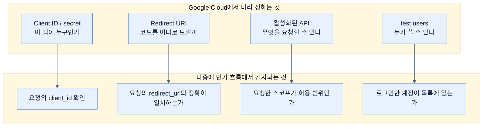

# Google에 우리 앱을 등록하기 — 15단계 뒤에 남는 네 가지

## 한눈에 보기

| 질문 | 핵심 답 |
|---|---|
| 무엇을 하나 | Google Cloud 대시보드에 앱을 등록하고 **자격 증명을 받아 온다** |
| 얻어 오는 값 | **Client ID**와 **Client secret** |
| 등록해야 하는 주소 | `http://localhost:8080/login/oauth2/code/google` |
| 왜 미리 등록하나 | 인가 서버가 **등록된 주소로만** 코드를 보내기 때문 |
| 활성화하는 API | YouTube Data API v3 |
| test users | 지금 앱은 **test mode**라 등록한 이메일만 로그인 가능 |
| 어느 플랫폼이든 공통인 것 | 앱 정의 · 승인된 API · 지원 사용자 · 우리 앱으로의 콜백 |

## 1. 왜 이게 필요한가

### 출발 장면: 왜 코드 한 줄 쓰기 전에 남의 대시보드에 들어가야 하나

[[08-leveraging-google-to-authenticate-users]]에서 Google에 위임하기로 정했다. 그런데 코드를 쓰기 전에 브라우저를 열고 Google Cloud 콘솔에서 15단계를 밟아야 한다.

지루한 절차처럼 보이지만, 이 단계들이 없으면 **[[07a-oauth-vs-openid-connect]]의 흐름이 성립하지 않는다.**

흐름의 첫 줄을 다시 보자 — "클라이언트가 사용자를 인가 서버로 리다이렉트한다." 이때 **[[인가-서버]]**(= 사용자를 인증하고 토큰을 발급하는 쪽) 입장에서 던져야 할 질문이 있다.

| Google이 알아야 하는 것 | 모르면 |
|---|---|
| 이 요청을 보낸 앱이 누구인가 | 아무나 사용자 동의를 요구할 수 있다 |
| 인증 후 사용자를 **어디로** 돌려보내나 | 공격자가 지정한 주소로 인가 코드를 보내게 된다 |
| 이 앱이 요청할 수 있는 권한은 어디까지인가 | 아무 데이터나 요구할 수 있다 |
| 누가 이 앱을 쓸 수 있나 | 개발 중인 앱이 전 세계에 열린다 |

이 네 질문에 미리 답해 두는 것이 등록이다.

## 2. 어떻게 동작하는가

### 2.1 15단계가 하는 일

책이 나열하는 절차를 목적별로 묶으면 이렇게 된다.

| 묶음 | 단계 | 무엇을 정하나 |
|---|---|---|
| 프로젝트 만들기 | 1–3 | Google Cloud에 새 프로젝트를 만들고 선택 |
| API 활성화 | 4–6 | **YouTube Data API v3**를 켠다 |
| 자격 증명 발급 | 7–12 | OAuth Client ID를 만들고 **Client ID/secret**과 **redirect URI**를 설정 |
| 사용자 제한 | 13–15 | 동의 화면 설정과 **test users** 등록 |

각 묶음의 결과가 앞의 네 질문에 대응한다.

### 2.2 Client ID와 Client secret

발급받는 두 값의 성격이 완전히 다르다.

| | **[[클라이언트-ID]]**(= 등록된 애플리케이션의 공개 식별자) | **[[클라이언트-시크릿]]**(= 애플리케이션이 자신을 증명하는 비밀 값) |
|---|---|---|
| 비밀인가 | **아니다** | **그렇다** |
| 어디에 실리나 | 인가 요청 URL에 그대로 | 서버 대 서버 토큰 교환에만 |
| 브라우저가 보나 | 본다 | 보면 안 된다 |
| 유출되면 | 큰 문제 없음 | **우리 앱을 사칭할 수 있다** |
| 비유 | 가게 이름 | 가게 금고 열쇠 |

Client ID가 공개여도 되는 이유는, 그것만으로는 아무것도 못 하기 때문이다. 인가 코드를 토큰으로 바꾸려면 시크릿이 필요하고([[07a-oauth-vs-openid-connect]]), 코드는 등록된 주소로만 간다.

시크릿이 소스 코드나 형상 관리에 들어가면 안 되는 이유가 여기 있다. **시크릿 하나로 우리 앱 행세를 할 수 있다.**

### 2.3 redirect URI가 정확히 일치해야 하는 이유

11단계에서 등록하는 값이다.

```text
http://localhost:8080/login/oauth2/code/google
```

이 주소의 각 조각에 의미가 있다.

| 조각 | 의미 |
|---|---|
| `http://localhost:8080` | 우리 앱이 도는 곳 |
| `/login/oauth2/code/` | Spring Security가 OAuth 콜백을 받는 **기본 경로** |
| `google` | 등록 이름(registration id). 여러 제공자를 쓸 때 어느 쪽 응답인지 구분한다 |

**[[리다이렉트-URI]]**(= 인가 서버가 인증을 마친 뒤 사용자를 되돌려 보낼 주소)를 미리 등록하고 정확히 일치할 때만 응답을 보내는 것은 OAuth 보안의 핵심 장치다.

만약 이 검사가 없다면 공격자가 이렇게 할 수 있다.

```text
https://accounts.google.com/o/oauth2/auth
  ?client_id=<우리 앱의 공개 ID>
  &redirect_uri=https://attacker.example/steal      ← 마음대로 지정
  &scope=...
```

Client ID는 공개값이라 공격자도 안다. 이 링크를 사용자에게 보내면 사용자는 진짜 Google 화면에서 동의하고, **인가 코드는 공격자에게 배달된다.**

redirect URI를 사전 등록해 두면 Google이 이 요청을 거절한다. 그래서 **부분 일치나 와일드카드가 아니라 정확한 일치**여야 한다. 이 엄격함이 불편함의 이유이자 안전의 이유다.

### 2.4 스코프와 동의 화면

6단계에서 YouTube Data API v3를 켜 두는 것은, 우리 앱이 그 API에 대한 **[[스코프]]**(= 토큰이 무엇까지 할 수 있는지 나타내는 권한 목록)를 요청할 수 있게 하는 준비다. API를 켜지 않으면 스코프를 요청해도 거절된다.

13–14단계의 **[[동의-화면]]**(= 이 앱에 이런 권한을 주겠느냐고 사용자에게 묻는 인가 서버의 화면) 설정은 사용자가 보게 될 문구와 앱 이름을 정한다. 여기 적은 이름이 실제 화면에 그대로 나온다 — [[08d-creating-an-oauth2-powered-web-app]]에서 "to continue to **YouTube Manager**"라는 문구로 확인하게 된다.

### 2.5 test mode

15단계에서 test users에 이메일을 등록한다. 책이 Note로 짚듯 지금 앱은 **test mode**다.

| | test mode | 게시(published) 후 |
|---|---|---|
| 로그인 가능한 사람 | **등록한 test users만** | 누구나 |
| Google 심사 | 불필요 | 민감한 스코프면 심사 필요 |
| 개발 중 위험 | 없음 — 남이 못 들어온다 | — |

이 기본값도 [[01-spring-security-filter-chain-foundations]]에서 본 것과 같은 방향이다. **잘못 설정하면 열리는 게 아니라 닫힌다.** 등록을 잊으면 나만 못 들어가고, 남이 들어오는 사고는 나지 않는다.

### 2.6 어느 플랫폼이든 같은 네 가지

책이 마지막에 일반화한다. Google이든 GitHub이든 Okta든, **[[신원-제공자]]**(= 사용자 계정과 인증을 대신 책임지는 외부 서비스)를 붙이려면 대개 이 넷이 필요하다.

| 공통 항목 | Google에서의 대응 |
|---|---|
| 애플리케이션 정의 | 프로젝트 + OAuth Client ID 생성 |
| 승인된 플랫폼 API | YouTube Data API v3 활성화 |
| 지원 사용자 | test users 등록 |
| 우리 앱으로의 콜백 | Authorized redirect URIs |

메뉴 위치와 이름만 다를 뿐 구조는 같다. **한 번 이해하면 다른 제공자에서도 어디를 찾아야 하는지 안다.**

## 3. 그림으로 보기



| 값 | 어디에 두나 | 유출되면 |
|---|---|---|
| Client ID | 설정 파일, URL | 문제 없음 |
| Client secret | **서버 설정에만** | 앱 사칭 가능 |
| Redirect URI | Google 대시보드 + Spring 기본 경로 | (공개값) |

## 4. 이 노트에 나온 용어

| 용어 | 한 줄 뜻 | 정의 위치 |
|---|---|---|
| Client ID | 등록된 애플리케이션의 공개 식별자 | [[_glossary#클라이언트-ID]] |
| Client secret | 애플리케이션이 자신을 증명하는 비밀 값 | [[_glossary#클라이언트-시크릿]] |
| 리다이렉트 URI | 인증 후 사용자를 되돌려 보낼 주소 | [[_glossary#리다이렉트-URI]] |
| 동의 화면 | 권한을 주겠느냐고 사용자에게 묻는 화면 | [[_glossary#동의-화면]] |
| 스코프 | 토큰이 무엇까지 할 수 있는지 나타내는 권한 목록 | [[_glossary#스코프]] |
| 인가 서버 | 사용자를 인증하고 토큰을 발급하는 쪽 | [[_glossary#인가-서버]] |
| 신원 제공자 | 사용자 계정과 인증을 대신 책임지는 외부 서비스 | [[_glossary#신원-제공자]] |

## 5. 자주 헷갈리는 것

**"Client ID도 비밀로 해야 한다"** — 공개값이다. 인가 요청 URL에 그대로 실려 브라우저가 본다. 비밀로 지켜야 하는 것은 secret뿐이다.

**"redirect URI는 도메인만 맞으면 된다"** — 등록한 문자열과 정확히 일치해야 한다. 이 엄격함이 인가 코드 탈취를 막는 장치다.

**"test mode는 기능 제한이다"** — 기능은 같고 **접근 가능한 사람**만 제한된다. 개발 중에는 오히려 안전장치다.

**"경로 `/login/oauth2/code/google`을 내가 만들어야 한다"** — Spring Security가 자동으로 처리한다. 컨트롤러를 만들 필요가 없다. 마지막 조각 `google`이 설정의 등록 이름과 맞아야 할 뿐이다.

## 6. 언제 안 쓰나 / 경계

- **운영 배포 시 redirect URI를 다시 등록해야 한다.** `localhost:8080`은 개발용이다. 실제 도메인과 HTTPS 주소를 추가로 등록해야 하며, 잊으면 배포 직후 로그인이 전부 실패한다.
- **민감한 스코프는 심사를 받는다.** `youtube.readonly`처럼 범위가 넓은 스코프로 앱을 게시하려면 Google의 검증 절차를 거쳐야 한다.
- **비유의 한계.** 이 등록 절차는 "건물 관리사무소에 입주 신고를 하는 것"에 가깝다. 이름을 등록하고, 출입 카드를 받고, 택배를 받을 호수를 지정한다. 다만 이 비유는 **호수를 잘못 적었을 때의 결과**를 가볍게 보이게 한다. 실제로는 잘못된 주소로 배달되는 것이 남의 인가 코드이고, 그것을 받은 사람은 사용자를 사칭할 수 있다. 택배 오배송이 아니라 열쇠 오배송에 가깝다.

## 7. 연결

- [[08-leveraging-google-to-authenticate-users]] — 위임하기로 한 결정을 이 노트가 실제 등록 작업으로 옮긴다.
- [[08b-adding-oauth-client-to-a-spring-boot-project]] — 여기서 받아 온 Client ID와 secret이 `application.yaml`에 들어간다.
- [[07a-oauth-vs-openid-connect]] — redirect URI를 미리 등록해야 하는 이유가 Authorization Code Flow의 3번 단계에 있다.

## 8. 스스로 확인

1. 코드를 쓰기 전에 등록부터 해야 하는 이유를 인가 서버의 입장에서 네 가지 질문으로 정리할 수 있는가?
2. Client ID가 공개여도 되는 근거는 무엇인가?
3. redirect URI 사전 등록이 없다면 가능한 공격을 구체적으로 그릴 수 있는가?
4. 왜 부분 일치나 와일드카드가 아니라 정확한 일치여야 하는가?
5. API 활성화 단계를 건너뛰면 무슨 일이 생기는가?
6. test mode의 기본값이 이 장의 다른 기본값들과 같은 방향인 이유는?
7. 다른 제공자를 붙일 때도 찾아야 할 네 가지는 무엇인가?
8. 입주 신고 비유가 깨지는 지점은 어디인가?

<!-- ==== 아래는 내 영역 · 스킬 수정 금지 ==== -->

## 내 설명 시도


## 막혔던 지점


## 리뷰 이력
