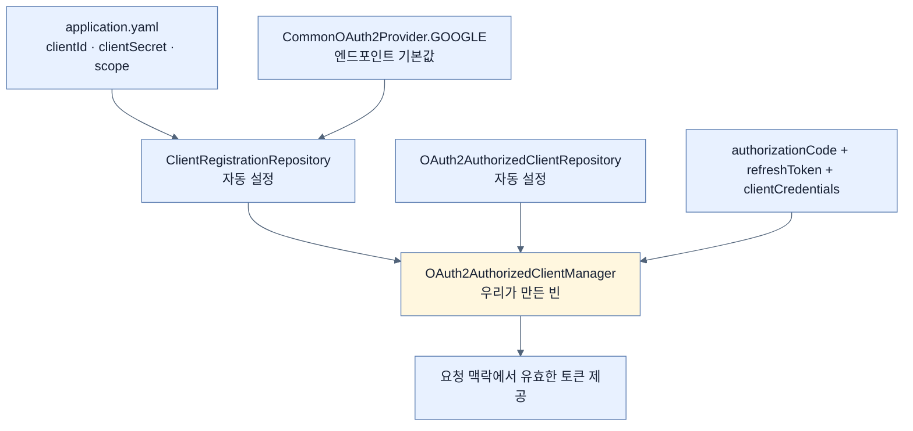

# 설정 열 줄과 빈 하나 — OAuth 클라이언트 배선하기

## 한눈에 보기

| 질문 | 핵심 답 |
|---|---|
| 왜 새 프로젝트인가 | 앞의 앱에 얹지 않고 `ch4-oauth`로 **처음부터 다시** 만든다 |
| 왜 YAML로 바꾸나 | `spring.security.oauth2.client.registration.google.*`처럼 **접두사가 반복**되어서 |
| 설정에 적는 것 | Client ID, Client secret, scope |
| 그것만으로 되나 | **된다.** `CommonOAuth2Provider`가 Google 엔드포인트를 미리 알고 있다 |
| 자동 설정되는 빈 | `ClientRegistrationRepository`, `OAuth2AuthorizedClientRepository` |
| 우리가 만드는 빈 | `OAuth2AuthorizedClientManager` |
| 왜 그 빈이 필요한가 | 토큰을 **획득·갱신해서 요청 맥락에 붙여 주는** 일을 할 주체가 필요하다 |
| 결과 | 앱이 잠기되, 랜덤 비밀번호가 아니라 **Google 로그인**으로 잠긴다 |

## 1. 왜 이게 필요한가

### 출발 장면: 왜 새 프로젝트로 시작하나

책은 여기서 "실제로 처음부터 시작해야 한다(we actually need to start afresh)"고 말한다. 지금까지의 앱에 OAuth를 얹지 않고 `ch4-oauth`라는 새 프로젝트를 만든다.

이유를 짚어 보면 인증 모델이 근본적으로 다르기 때문이다.

| | 지금까지의 앱 | OAuth 앱 |
|---|---|---|
| 사용자 출처 | 우리 DB(`UserDetailsService`) | Google |
| 비밀번호 | 우리가 보관 | 보지 않는다 |
| 로그인 화면 | Spring Security가 렌더링 | Google로 리다이렉트 |
| 필요한 의존성 | `starter-security` + JPA | OAuth 2 Client + HTTP Client |
| 도메인 | `VideoEntity` | YouTube 검색 응답 |

둘을 한 앱에 섞으면 "어느 쪽으로 로그인해야 하는가"부터 정해야 하고, 그건 이 절이 가르치려는 것과 다른 주제다.

Initializr에서 고르는 **[[스타터]]**(= 라이브러리와 자동 설정을 묶은 의존성)는 넷이다 — **OAuth 2 Client**, Spring Web, HTTP Client, Mustache. Boot 4에서 이 OAuth 클라이언트 스타터의 아티팩트 이름은 `spring-boot-starter-security-oauth2-client`다(Boot 4.1.0 배포물에서 확인). Boot 3까지 쓰던 `spring-boot-starter-oauth2-client`는 `spring-boot-starter-security-*` 접두사로 정리되며 자리를 넘겼다.

## 2. 어떻게 동작하는가

### 2.1 properties에서 YAML로

Initializr는 `application.properties`를 만들어 준다. 책은 그것을 `application.yaml`로 **이름만 바꾼다.**

이유는 반복이다. properties로 쓰면 이렇게 된다.

```properties
spring.security.oauth2.client.registration.google.client-id=...
spring.security.oauth2.client.registration.google.client-secret=...
spring.security.oauth2.client.registration.google.scope=...
```

같은 접두사가 세 번 반복된다. 제공자를 하나 더 추가하면 여섯 번이 된다. YAML은 계층을 들여쓰기로 표현하므로 접두사를 한 번만 쓴다.

```yaml
spring:
    security:
      oauth2:
        client:
            registration:
                google:
                  clientId: **your Google Client ID**
                  clientSecret: **your Google Client secret**
                  scope: openid,profile,email,
                                     https://www.googleapis.com/auth/youtube.readonly
```

세 값의 역할이 각각 다르다.

| 키 | 무엇 | [[08a-creating-a-google-oauth-application]]에서 얻은 것 |
|---|---|---|
| `clientId` | **[[클라이언트-ID]]**(= 등록된 앱의 공개 식별자) | 12단계에서 복사한 Client ID |
| `clientSecret` | **[[클라이언트-시크릿]]**(= 앱이 자신을 증명하는 비밀 값) | 12단계에서 복사한 Client secret |
| `scope` | **[[스코프]]**(= 토큰의 권한 범위) | 요청할 권한들 |

`google`이라는 이름이 중요하다. 이것이 등록 이름(registration id)이고, [[08a-creating-a-google-oauth-application]]에서 등록한 redirect URI의 마지막 조각(`/login/oauth2/code/google`)과 같아야 한다.

> **표기 참고.** Boot 4.1 공식 문서의 정규 표기는 kebab-case인 `client-id`·`client-secret`이다. 책의 `clientId`가 동작하는 것은 **[[완화된-바인딩]]**(= 표기가 달라도 같은 설정 키로 묶어 주는 규칙) 덕분이다. 새 코드는 정규 표기를 쓰는 편이 문서와 대조하기 쉽다.

### 2.2 스코프 네 개가 하는 일

```text
openid, profile, email, https://www.googleapis.com/auth/youtube.readonly
```

| 스코프 | 요청하는 것 | 없으면 |
|---|---|---|
| `openid` | **OIDC로 동작하라**는 신호. ID 토큰이 발급된다 | 신원 확인이 형식을 갖추지 못한다([[07a-oauth-vs-openid-connect]]) |
| `profile` | 이름·프로필 사진 같은 기본 정보 | 사용자 표시 이름을 알 수 없다 |
| `email` | 이메일 주소 | 사용자를 이메일로 식별할 수 없다 |
| `youtube.readonly` | YouTube 데이터 **읽기** | [[08c-invoking-an-oauth-2-api-remotely]]의 API 호출이 거절된다 |

앞의 셋은 로그인용, 마지막 하나는 데이터 접근용이다. **한 번의 동의로 두 목적을 함께 처리한다**는 것이 OAuth+OIDC 조합의 실용적 이점이다.

`youtube.readonly`가 `.readonly`로 끝나는 것도 의도적이다. 우리는 목록을 읽기만 하므로 쓰기 권한을 요구할 이유가 없다. **필요한 최소만 요청하는 것**이 스코프 설계의 원칙이다.

### 2.3 엔드포인트를 안 적어도 되는 이유

OAuth 흐름을 완성하려면 원래 주소가 여럿 필요하다 — 인가 엔드포인트, 토큰 엔드포인트, 사용자 정보 엔드포인트, JWK 세트 주소. 그런데 우리 설정에는 그런 게 하나도 없다.

책이 Note로 설명한다. Spring Security에 **[[CommonOAuth2Provider]]**(= Google·GitHub·Facebook·Okta의 엔드포인트와 기본 스코프를 미리 담아 둔 열거형)가 있어서, 등록 이름이 그 목록과 맞으면 나머지를 채워 준다. Spring Security 7.1.0의 이 열거형을 열어 보면 상수가 정확히 `GOOGLE`·`GITHUB`·`FACEBOOK`·`OKTA` 넷이다.

우리가 등록 이름을 `google`이라고 쓴 것이 그래서 두 가지 일을 한다.

1. redirect URI의 마지막 조각과 맞춘다
2. `CommonOAuth2Provider.GOOGLE`의 기본값을 끌어온다

책의 표현대로 "기술적으로는 그것만으로 Google 인증이 된다." 우리가 `scope`를 추가로 적은 것은 순전히 **YouTube API를 쓰려고**다. 기본 스코프만으로도 로그인은 된다.

### 2.4 자동 설정되는 두 저장소

`clientId`와 `clientSecret`을 읽어 들이는 것은 Spring Boot가 자동 설정하는 빈들이다.

| 빈 | 하는 일 | 왜 필요한가 |
|---|---|---|
| **[[ClientRegistrationRepository]]**(= 제공자별 등록 정보를 담아 두는 저장소) | 설정에 적은 등록들을 보관하고 이름으로 조회 | **여러 제공자를 동시에 지원**하려면 조회 창구가 필요하다 |
| `OAuth2AuthorizedClientRepository` | 발급받은 토큰을 사용자·제공자별로 보관 | 요청마다 다시 로그인시킬 수는 없다 |

책이 짚는 "여러 제공자" 이야기가 이 구조의 이유다. Facebook·Twitter·Google·Apple 로그인을 동시에 제공하는 사이트를 본 적이 있을 것이다. 그런 앱에서는 등록이 여러 벌이고, "지금 요청은 어느 제공자 것인가"를 이름으로 구분해야 한다.

여기서 **[[OAuth2AuthorizedClient]]**(= 어떤 사용자가 어떤 제공자에서 어떤 토큰을 받아 둔 상태를 묶은 객체)라는 개념이 나온다. 토큰 하나만 들고 있으면 안 되고, "누구의, 어느 제공자의, 어떤 스코프의 토큰인가"가 함께 묶여야 재사용할 수 있다.

### 2.5 우리가 만드는 빈 하나

```java
@Configuration
public class SecurityConfig {

    @Bean
    public OAuth2AuthorizedClientManager clientManager(
                    ClientRegistrationRepository clientRegRepo,
                    OAuth2AuthorizedClientRepository authClientRepo) {

                    OAuth2AuthorizedClientProvider clientProvider =
                        OAuth2AuthorizedClientProviderBuilder.builder()
                                           .authorizationCode()
                                           .refreshToken()
                                           .clientCredentials()
                                           .build();

                    DefaultOAuth2AuthorizedClientManager clientManager =
                       new DefaultOAuth2AuthorizedClientManager(
                            clientRegRepo, authClientRepo);

                    clientManager.setAuthorizedClientProvider(clientProvider);

                    return clientManager;
    }
}
```

**[[OAuth2AuthorizedClientManager]]**(= 필요할 때 토큰을 받거나 갱신해 인가된 클라이언트를 마련해 주는 관리자 빈)가 하는 일은 이름 그대로 **관리**다. 두 저장소를 재료로 받아, 들어오는 요청 맥락에서 "이 사용자를 위한 유효한 토큰"을 준비한다.

빌더에 이어 붙인 세 provider가 각각 하나의 흐름에 대응한다.

| provider | 대응하는 흐름 | 언제 쓰이나 |
|---|---|---|
| `.authorizationCode()` | **[[인가-코드-플로우]]** | 사용자가 처음 Google로 로그인할 때 |
| `.refreshToken()` | **[[리프레시-토큰]]** 갱신 | 액세스 토큰이 만료됐을 때 재로그인 없이 |
| `.clientCredentials()` | **[[클라이언트-자격-증명-플로우]]** | 사용자 없이 서비스가 호출할 때 |

[[07a-oauth-vs-openid-connect]]에서 개념으로 배운 흐름들이 여기서 **코드 한 줄씩**으로 나타난다. 필요한 흐름만 켤 수도 있지만, 셋을 다 켜 두면 상황에 맞는 것이 선택된다.

책은 Tip에서 솔직하게 인정한다 — "이건 보일러플레이트다. 하지만 한 번 만들어 두면 앱 전체가 쓸 수 있는 자산이 된다."

### 2.6 그래서 앱은 어떻게 잠기나

OAuth2 클라이언트가 classpath에 오면 Spring Boot 자동 설정이 앱을 잠근다. [[02-adding-spring-security-to-the-project]]와 같은 동작이다.

다른 점은 **잠그는 방식**이다. 랜덤 비밀번호가 있는 `user`를 만드는 대신, 앞에서 만든 OAuth2 빈들과 `OAuth2AuthorizedClientManager`가 결합해 **Google 로그인으로 잠근다.**



## 3. 그림으로 보기

| 이 절에서 만든 것 | 만든 주체 | 하는 일 |
|---|---|---|
| 등록 정보 | 내 설정 파일 | 우리가 누구이고 무엇을 요청하는지 |
| 엔드포인트 주소 | `CommonOAuth2Provider` | Google의 어디로 갈지 |
| `ClientRegistrationRepository` | 자동 설정 | 등록 정보 조회 |
| `OAuth2AuthorizedClientRepository` | 자동 설정 | 발급받은 토큰 보관 |
| `OAuth2AuthorizedClientManager` | **내 코드** | 토큰 획득·갱신 조율 |
| 리다이렉트 처리 | Spring Security 필터 | `/login/oauth2/code/google` 콜백 |

## 4. 이 노트에 나온 용어

| 용어 | 한 줄 뜻 | 정의 위치 |
|---|---|---|
| Client ID | 등록된 애플리케이션의 공개 식별자 | [[_glossary#클라이언트-ID]] |
| Client secret | 애플리케이션이 자신을 증명하는 비밀 값 | [[_glossary#클라이언트-시크릿]] |
| 스코프 | 토큰의 권한 범위 | [[_glossary#스코프]] |
| CommonOAuth2Provider | 주요 제공자의 엔드포인트를 미리 담은 열거형 | [[_glossary#CommonOAuth2Provider]] |
| ClientRegistrationRepository | 제공자별 등록 정보를 담는 저장소 빈 | [[_glossary#ClientRegistrationRepository]] |
| OAuth2AuthorizedClient | 사용자·제공자·토큰을 묶은 상태 객체 | [[_glossary#OAuth2AuthorizedClient]] |
| OAuth2AuthorizedClientManager | 토큰을 획득·갱신해 주는 관리자 빈 | [[_glossary#OAuth2AuthorizedClientManager]] |
| 완화된 바인딩 | 표기가 달라도 같은 설정 키로 묶는 규칙 | [[_glossary#완화된-바인딩]] |
| Authorization Code Flow | 코드를 먼저 받고 서버끼리 토큰과 교환 | [[_glossary#인가-코드-플로우]] |
| 리프레시 토큰 | 새 액세스 토큰을 받아 오는 장기 자격 증명 | [[_glossary#리프레시-토큰]] |
| Client Credentials Flow | 사용자 없이 서비스가 토큰을 받는 흐름 | [[_glossary#클라이언트-자격-증명-플로우]] |
| 스타터 | 라이브러리와 자동 설정을 묶은 의존성 | [[_glossary#스타터]] |

## 5. 자주 헷갈리는 것

**"YAML로 바꾸면 기능이 달라진다"** — 같다. 같은 설정을 계층으로 적을 뿐이다. 접두사 반복을 줄이는 표기 선택이다.

**"등록 이름은 아무거나 써도 된다"** — `google`이라야 `CommonOAuth2Provider.GOOGLE`의 기본값이 적용되고, redirect URI의 마지막 조각과도 맞는다. 다른 이름을 쓰려면 엔드포인트를 직접 다 적고 redirect URI도 새로 등록해야 한다.

**"`OAuth2AuthorizedClientManager`도 자동 설정된다"** — 이 예제에서는 직접 만든다. 자동 설정에 맡길 수 있는 경우도 있지만, 어떤 흐름을 지원할지 명시하려면 직접 조립한다.

**"provider 세 개를 다 켜면 세 번 호출된다"** — 아니다. 상황에 맞는 것 하나가 선택된다. 켜 둔다는 것은 "이 흐름도 지원한다"는 뜻이다.

## 6. 언제 안 쓰나 / 경계

- **시크릿을 설정 파일에 그대로 두면 안 된다.** 책의 예제는 학습용이라 값을 직접 적지만, 실제로는 환경 변수나 비밀 관리 도구에서 주입해야 한다. `application.yaml`은 보통 형상 관리에 들어간다.
- **`CommonOAuth2Provider`에 없는 제공자.** 사내 인가 서버나 목록에 없는 서비스는 엔드포인트를 직접 적어야 한다.
- **비유의 한계.** 이 설정은 "출장 갈 회사의 주소록과 사원증을 미리 등록해 두는 것"에 가깝다. `CommonOAuth2Provider`가 주소록의 유명한 항목들을 미리 채워 준 상태다. 다만 이 비유는 **사원증이 매번 새로 발급된다**는 점을 담지 못한다. 실제로 우리가 들고 있는 것은 사원증이 아니라 "사원증을 발급받을 수 있는 자격"이고, 실제 출입증(액세스 토큰)은 만료되면 관리자 빈이 조용히 새로 받아 온다.

## 7. 연결

- [[08a-creating-a-google-oauth-application]] — 거기서 받아 온 Client ID와 secret이 이 노트의 설정 파일로 들어간다.
- [[08c-invoking-an-oauth-2-api-remotely]] — 여기서 만든 `OAuth2AuthorizedClientManager`를 인터셉터에 넘겨 실제 API를 호출한다.
- [[07a-oauth-vs-openid-connect]] — 그 노트의 흐름 세 가지가 여기서 빌더의 메서드 세 개로 나타난다.

## 8. 스스로 확인

1. OAuth 앱을 새 프로젝트로 시작하는 이유를 인증 모델 차이로 설명할 수 있는가?
2. 엔드포인트를 하나도 적지 않았는데 동작하는 이유는?
3. 등록 이름 `google`이 하는 두 가지 일은?
4. 스코프 네 개를 목적별로 나누고, `.readonly`로 끝나는 이유를 말할 수 있는가?
5. 두 저장소 빈이 각각 무엇을 보관하며, 왜 나뉘어 있는가?
6. `OAuth2AuthorizedClient`가 토큰 하나가 아니라 묶음인 이유는?
7. 빌더에 이어 붙인 세 provider가 각각 어느 흐름에 대응하는가?
8. 사원증 비유가 깨지는 지점은 어디인가?

<!-- ==== 아래는 내 영역 · 스킬 수정 금지 ==== -->

## 내 설명 시도


## 막혔던 지점


## 리뷰 이력
