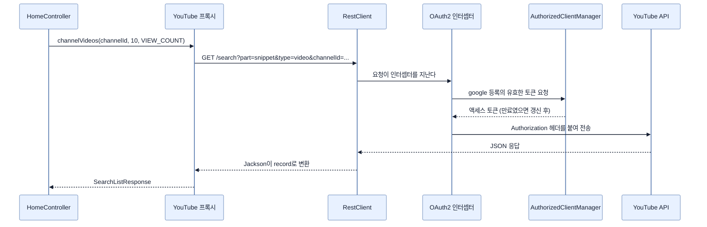

# 토큰을 자동으로 붙여 주는 클라이언트 — RestClient와 @GetExchange

## 한눈에 보기

| 질문 | 핵심 답 |
|---|---|
| HTTP 클라이언트 | `RestClient` — `RestTemplate`을 대신하는 동기 클라이언트 |
| 토큰은 누가 붙이나 | `OAuth2ClientHttpRequestInterceptor`가 **매 요청 자동으로** |
| 인터셉터의 정체 | `RestClient` 파이프라인 안의 서블릿 필터 같은 것 |
| 어느 등록을 쓸지 | `setClientRegistrationIdResolver(request -> "google")` |
| API 호출을 어떻게 선언하나 | 인터페이스 + `@GetExchange`. 구현은 Spring이 만든다 |
| `@GetMapping`과의 관계 | 받는 쪽이 `@GetMapping`, **보내는 쪽이 `@GetExchange`** |
| 응답을 담는 타입 | 자바 `record` — 필드 이름만 JSON과 맞으면 된다 |
| 원문 공백 | `YouTube` 인터페이스를 **빈으로 등록하는 코드**가 나오지 않는다 |

## 1. 왜 이게 필요한가

### 출발 장면: 토큰을 손으로 붙이면 어떻게 되나

[[08b-adding-oauth-client-to-a-spring-boot-project]]까지 마치면 Google 로그인이 되고 **[[액세스-토큰]]**(= 자원 접근에 쓰는 단기 자격 증명)이 손에 들어온다. 이제 YouTube API를 부를 차례다.

직접 짜면 이렇게 된다.

```java
OAuth2AuthorizedClient client = manager.authorize(request);   // 토큰 확보
String token = client.getAccessToken().getTokenValue();
// 만료됐으면? 리프레시 토큰으로 갱신하고 다시...
// URL 조립, 쿼리 파라미터 인코딩...
// 헤더에 Bearer 붙이고...
// 응답 JSON을 객체로 파싱하고...
```

문제가 여럿이다.

| 문제 | 결과 |
|---|---|
| 토큰 확보·갱신 코드가 **호출 지점마다** 반복된다 | API가 열 개면 열 번 복사된다 |
| 만료 처리를 빠뜨리기 쉽다 | 한동안 잘 되다가 갑자기 401이 난다 |
| URL과 파라미터 조립이 문자열 작업이다 | 오타가 런타임에야 드러난다 |
| JSON 파싱이 수작업이다 | 응답 구조가 바뀌면 조용히 깨진다 |

이 절은 이 넷을 각각 다른 도구로 해결한다.

## 2. 어떻게 동작하는가

### 2.1 `RestClient`를 고른 이유

**[[RestClient]]**(= Spring Framework 6.1이 들여온 동기 HTTP 클라이언트)는 `RestTemplate`을 대체한다. `RestTemplate`도 여전히 쓸 수 있지만 책의 표현대로 `RestClient`가 "더 앞을 내다본 선택"이다.

| 축 | `RestTemplate` | `RestClient` |
|---|---|---|
| API 모양 | 메서드 오버로드가 많다 | 이어 붙이는 유연한 API |
| 인터셉터 | 지원 | 지원 |
| HTTP 서비스 프록시 연동 | 제한적 | **자연스럽다** |
| 위치 | 유지보수 모드 | 권장 |

마지막 두 줄이 이 절에서 실제로 중요하다. 아래에서 만들 `YouTube` 인터페이스가 `RestClient` 위에 얹힌다.

### 2.2 토큰을 자동으로 붙이기

```java
@Configuration
public class YouTubeConfig {
       static final String YOUTUBE_V3_API =
                      "https://www.googleapis.com/youtube/v3";
       @Bean
       RestClient youtubeRestClient(
                      OAuth2AuthorizedClientManager clientManager) {
                                       OAuth2ClientHttpRequestInterceptor oauth2 =
                                          new OAuth2ClientHttpRequestInterceptor(clientManager);

                           oauth2.setClientRegistrationIdResolver(request -> "google");

                          return RestClient.builder()
                               .baseUrl(YOUTUBE_V3_API)
                               .requestInterceptor(oauth2)
                               .build();
       }
}
```

세 줄이 각각 하나씩 해결한다.

| 줄 | 하는 일 | 없으면 |
|---|---|---|
| `new OAuth2ClientHttpRequestInterceptor(clientManager)` | [[08b-adding-oauth-client-to-a-spring-boot-project]]에서 만든 **[[OAuth2AuthorizedClientManager]]**(= 토큰을 획득·갱신해 주는 관리자 빈)를 인터셉터에 넘긴다 | 인터셉터가 토큰을 구할 방법이 없다 |
| `setClientRegistrationIdResolver(request -> "google")` | "이 클라이언트가 나가는 요청은 `google` 등록의 토큰을 쓴다" | 여러 제공자 중 어느 토큰인지 알 수 없다 |
| `.baseUrl(...)` + `.requestInterceptor(oauth2)` | 기준 주소를 박고 인터셉터를 파이프라인에 끼운다 | 매번 전체 URL을 적고 토큰을 손으로 붙여야 한다 |

**[[요청-인터셉터]]**(= HTTP 클라이언트가 요청을 보내기 직전에 끼어드는 훅)의 성격을 책은 Note로 설명한다 — 서블릿 필터와 역할이 같되, 위치가 `RestClient`의 요청 파이프라인 안이라는 것이다.

방향이 반대라는 점이 이해의 열쇠다.

| | 서블릿 필터 | 요청 인터셉터 |
|---|---|---|
| 대상 | **들어오는** 요청 | **나가는** 요청 |
| 하는 일 | 인증 정보를 꺼내 검증 | 인증 정보를 붙여 내보냄 |
| 이 장에서 | [[01-spring-security-filter-chain-foundations]] | 이 노트 |

인터셉터를 한 번 등록해 두면 **이 `RestClient`를 지나는 모든 요청**이 토큰을 갖게 된다. 토큰이 만료됐으면 매니저가 조용히 갱신한다. 앞의 네 문제 중 첫 둘이 여기서 해결된다.

### 2.3 인터페이스만 선언하기

남은 두 문제(URL 조립, JSON 파싱)는 **[[HTTP-서비스-프록시]]**(= 표기가 붙은 인터페이스를 Spring이 런타임 구현체로 만들어 주는 기능)가 해결한다.

```java
interface YouTube {
                    @GetExchange("/search?part=snippet&type=video")
                    SearchListResponse channelVideos(
                     @RequestParam String channelId,
                     @RequestParam int maxResults,
                     @RequestParam Sort order);
     enum Sort {
          DATE("date"),
          VIEW_COUNT("viewCount"),
          TITLE("title"),
          RATING("rating");
          private final String type;
          Sort(String type) {
              this.type = type;
          }
     }
}
```

책이 짚는 대비가 이 절의 핵심 개념이다.

| | 요청을 **받는** 쪽 | 요청을 **보내는** 쪽 |
|---|---|---|
| 애노테이션 | `@GetMapping` | **[[GetExchange]]**(= 인터페이스 메서드를 원격 HTTP GET 호출로 바꾸는 애노테이션) |
| 뜻 | "이 URL로 GET이 오면 이 메서드를 실행하라" | "이 메서드를 부르면 이 URL로 GET을 보내라" |
| 구현 | 내가 쓴다 | **Spring이 만든다** |
| 어디서 | Chapter 2의 컨트롤러 | 이 노트 |

같은 개념을 거울에 비춘 짝이다. 하나를 이해하면 나머지가 따라온다.

동작의 세부는 이렇다.

| 요소 | 하는 일 |
|---|---|
| `"/search?..."` | `baseUrl`에 이어 붙어 `https://www.googleapis.com/youtube/v3/search?...`가 된다 |
| `part=snippet&type=video` | 항상 같은 값이라 경로에 박아 둔다 |
| `@RequestParam` | 인자를 쿼리 파라미터로 붙인다. **이름은 인자 이름에서 가져온다** |
| `enum Sort` | API가 받는 값만 쓰도록 컴파일 시점에 제한한다 |
| 메서드 이름 `channelVideos` | **아무 의미 없다.** 동작을 정하는 것은 애노테이션이다 |

`@RequestParam`이 인자 이름을 쓴다는 점 때문에 책은 팁을 하나 준다 — **인자 이름을 API의 파라미터 이름과 똑같이 짓는 게 편하다.** 애노테이션으로 덮어쓸 수도 있지만 그러면 두 곳을 관리해야 한다.

`enum Sort`가 왜 좋은지도 분명하다. `order`를 `String`으로 두면 `"viewCounts"` 같은 오타가 런타임에 400을 부른다. enum이면 컴파일이 막는다. **API 명세를 타입으로 옮기는 것**이다.

> **원문 공백.** 이 인터페이스는 선언일 뿐 구현이 없다. 누군가 `HttpServiceProxyFactory`나 `@ImportHttpServices`로 프록시 빈을 만들어 등록해야 [[08d-creating-an-oauth2-powered-web-app]]의 `HomeController`가 `YouTube`를 주입받을 수 있는데, 책은 그 코드를 끝내 보여 주지 않는다. Boot 4의 선언 방식은 [[../chapter-2-creating-web-and-api-applications-with-spring-boot/09-calling-versioned-apis-with-http-service-clients|Chapter 2 · HTTP Service Client]]에 나온다.
>
> 같은 대목에 조판 사고도 있다. 책은 쿼리 문자열 예시를 `?channelId=<value>&maxResults=<value>ℴ=<value>`로 인쇄하는데, `&order`가 HTML 엔티티 `&order;`로 해석돼 한 글자로 뭉개진 것이다. 실제 파라미터 이름은 `order`다.

### 2.4 응답을 record로 옮기기

Search API의 응답은 이런 구조다.

```json
{
    "kind": "youtube#searchListResponse",
    "etag": "etag",
    "nextPageToken": "string",
    "prevPageToken": "string",
    "regionCode": "string",
    "pageInfo": {
                        "totalResults": 0,
                        "resultsPerPage": 0
    },
    "items": []
}
```

이것을 자바로 옮기는데, 책은 **[[record]]**(= 필드·생성자·접근자를 자동 생성하는 자바의 불변 데이터 타입)를 고른다.

```java
record SearchListResponse(String kind, String etag, String
    nextPageToken, String prevPageToken, PageInfo pageInfo,
                    SearchResult[] items) {
}
```

record가 잘 맞는 이유는 목적이 겹치기 때문이다. 이 타입들은 **데이터를 담아 옮기는 것 말고 하는 일이 없다.** 동작이 없으니 캡슐화할 상태도 없고, 응답은 한 번 만들어지면 바뀌지 않으니 불변이 맞다. 클래스로 쓰면 필드·생성자·getter·`equals`·`hashCode`가 전부 보일러플레이트가 된다.

중첩 구조는 중첩 record로 그대로 따라간다.

```java
record PageInfo(Integer totalResults, Integer
    resultsPerPage) {
}
record SearchResult(String kind, String etag, SearchId id,
       SearchSnippet snippet) {
}
record SearchId(String kind, String videoId, String
       channelId, String playlistId) {
}
record SearchSnippet(String publishedAt, String channelId,
       String title, String description,
                         Map<String, SearchThumbnail> thumbnails, String
                             channelTitle) {
}
record SearchThumbnail(String url, Integer width, Integer
       height) {
}
```

작업 방식은 기계적이다. **Google 문서의 각 중첩 타입을 따라가며 필드를 옮기고, 자체 절이 있는 타입마다 record를 하나씩 만든다.**

책은 Tip으로 규칙 하나를 못 박는다 — **record 타입의 이름은 아무래도 상관없고, 필드 이름이 JSON과 맞아야 한다.** **[[마샬링]]**(= 객체와 전송 형식 사이를 변환하는 일)을 담당하는 Jackson이 이름으로 짝을 찾기 때문이다. `SearchListResponse`를 `YouTubeSearchResult`라고 불러도 되지만 `nextPageToken`을 `nextToken`으로 줄이면 값이 들어오지 않는다.

`thumbnails`가 `Map<String, SearchThumbnail>`인 것도 API 구조를 그대로 따른 결과다. YouTube는 썸네일을 `default`·`medium`·`high` 같은 이름표가 붙은 객체로 준다. 이 형태가 [[08d-creating-an-oauth2-powered-web-app]]에서 문제가 되고, 거기서 record에 메서드를 더해 해결한다.

## 3. 그림으로 보기



| 앞에서 든 문제 | 해결한 도구 |
|---|---|
| 토큰 확보 코드가 반복된다 | `OAuth2ClientHttpRequestInterceptor` |
| 만료 처리를 빠뜨린다 | `OAuth2AuthorizedClientManager` |
| URL·파라미터 조립이 문자열 작업 | `@GetExchange` + `@RequestParam` + `enum` |
| JSON 파싱이 수작업 | `record` + Jackson |

## 4. 이 노트에 나온 용어

| 용어 | 한 줄 뜻 | 정의 위치 |
|---|---|---|
| RestClient | Spring의 현대적 동기 HTTP 클라이언트 | [[_glossary#RestClient]] |
| 요청 인터셉터 | 나가는 요청 직전에 끼어드는 훅 | [[_glossary#요청-인터셉터]] |
| OAuth2AuthorizedClientManager | 토큰을 획득·갱신해 주는 관리자 빈 | [[_glossary#OAuth2AuthorizedClientManager]] |
| @GetExchange | 인터페이스 메서드를 원격 GET 호출로 바꾸는 애노테이션 | [[_glossary#GetExchange]] |
| HTTP 서비스 프록시 | 선언된 인터페이스의 구현체를 Spring이 만들어 주는 기능 | [[_glossary#HTTP-서비스-프록시]] |
| record | 필드·생성자·접근자를 자동 생성하는 불변 데이터 타입 | [[_glossary#record]] |
| 마샬링 | 객체와 전송 형식 사이의 변환 | [[_glossary#마샬링]] |
| 액세스 토큰 | 자원 접근에 쓰는 단기 자격 증명 | [[_glossary#액세스-토큰]] |

## 5. 자주 헷갈리는 것

**"메서드 이름이 API 경로를 정한다"** — 정하지 않는다. `@GetExchange`의 문자열이 정한다. 메서드 이름은 우리가 읽기 위한 것이다.

**"`@RequestParam`은 컨트롤러에서만 쓴다"** — 여기서는 반대 방향으로 쓰인다. 받은 요청에서 값을 꺼내는 게 아니라 **보낼 요청에 값을 붙인다.**

**"record 이름을 API 타입과 똑같이 지어야 한다"** — 상관없다. **필드 이름**만 맞으면 된다.

**"인터셉터는 첫 요청에만 토큰을 붙인다"** — 매 요청 붙인다. 그래서 중간에 만료돼도 다음 요청이 갱신된 토큰을 갖는다.

## 6. 언제 안 쓰나 / 경계

- **비동기·스트리밍이 필요하면 다른 도구가 낫다.** `RestClient`는 동기 클라이언트다.
- **응답 구조가 자주 바뀌는 API.** record는 컴파일 시점에 구조를 박아 두므로, 유연한 처리가 필요하면 `Map`이나 트리 모델이 나을 수 있다.
- **인터셉터는 이 `RestClient` 인스턴스에만 적용된다.** 다른 API를 부르는 별도 클라이언트를 만들면 그쪽에도 따로 붙여야 한다. 등록 이름을 `"google"`로 고정해 두었으므로 이 빈은 Google 전용이다.
- **비유의 한계.** 인터셉터는 "사무실 우편물이 나갈 때 우체국 직인을 자동으로 찍어 주는 발송실"에 가깝다. 보내는 사람은 직인을 신경 쓸 필요가 없다. 다만 이 비유는 **직인이 만료된다**는 점을 담지 못한다. 실제로는 발송실이 매번 "이 직인이 아직 유효한가"를 확인하고, 만료됐으면 새로 받아 온 뒤에 찍는다. 도장통이 아니라 도장을 매번 발급받는 창구에 가깝다.

## 7. 연결

- [[08b-adding-oauth-client-to-a-spring-boot-project]] — 거기서 만든 `OAuth2AuthorizedClientManager`가 이 노트의 인터셉터 생성자에 그대로 들어간다.
- [[08d-creating-an-oauth2-powered-web-app]] — 여기서 만든 `YouTube` 인터페이스와 record들을 컨트롤러와 템플릿이 소비한다.
- [[07-understanding-oauth-2-1]] — "토큰으로 API를 부른다"는 마지막 단계가 이 노트의 코드다.

## 8. 스스로 확인

1. 토큰을 손으로 붙이는 방식의 문제 네 가지와, 각각을 해결한 도구를 짝지을 수 있는가?
2. 요청 인터셉터와 서블릿 필터의 방향 차이를 설명할 수 있는가?
3. `setClientRegistrationIdResolver`가 없으면 무엇이 모호해지는가?
4. `@GetMapping`과 `@GetExchange`가 거울상인 이유를 각각의 뜻으로 말할 수 있는가?
5. `order`를 `String`이 아니라 enum으로 둔 것이 막아 주는 실수는?
6. record 타입 이름은 자유롭고 필드 이름은 자유롭지 않은 이유는?
7. 이 절의 코드만으로 `YouTube` 빈이 만들어지는가? 무엇이 빠져 있는가?
8. 발송실 비유가 깨지는 지점은 어디인가?

<!-- ==== 아래는 내 영역 · 스킬 수정 금지 ==== -->

## 내 설명 시도


## 막혔던 지점


## 리뷰 이력
