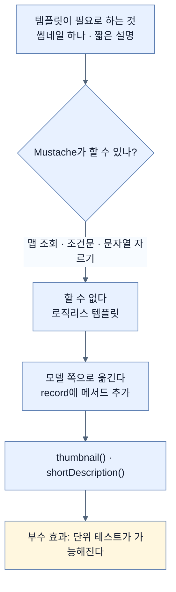

# 로직 없는 템플릿에 로직이 필요할 때 — record에 메서드를 더하기

## 한눈에 보기

| 질문 | 핵심 답 |
|---|---|
| 컨트롤러가 하는 일 | `YouTube` 서비스를 주입받아 호출하고 결과를 모델에 담는다 |
| 템플릿 문법 세 가지 | `{{값}}` · `{{#배열}}`로 반복 · **로직 없음** |
| 문제 | 썸네일이 `Map`이라 "default 하나만" 고를 수단이 템플릿에 없다 |
| 설명이 너무 길면? | 자를 수단도 템플릿에 없다 |
| 해결 | **record에 메서드를 추가**한다 — `thumbnail()`, `shortDescription()` |
| CSS 두는 곳 | `src/main/resources/static` — Spring MVC가 자동 서빙 |
| 실행하면 | Google 로그인 → **채널 선택 프롬프트** → 우리 템플릿 |
| 원문 오류 | CSS 선택자가 `thead th`인데 템플릿의 헤더는 `<td>`다 |

## 1. 왜 이게 필요한가

### 출발 장면: 데이터는 손에 있는데 화면에 못 그린다

[[08c-invoking-an-oauth-2-api-remotely]]까지 마치면 `SearchListResponse`가 손에 들어온다. 이제 표로 그리기만 하면 되는데, 두 곳에서 막힌다.

**첫째, 썸네일.** `SearchSnippet.thumbnails`는 `Map<String, SearchThumbnail>`이다. YouTube가 여러 크기를 함께 주기 때문이다.

```json
"thumbnails": {
  "default": { "url": "...", "width": 120, "height": 90 },
  "medium":  { "url": "...", "width": 320, "height": 180 },
  "high":    { "url": "...", "width": 480, "height": 360 }
}
```

우리는 `default` 하나만 쓰고 싶다. 그런데 **[[Mustache]]**(= `{{ }}` 표기의 가벼운 템플릿 엔진)에는 맵에서 특정 키를 골라내는 문법이 없다.

**둘째, 설명 길이.** `description`이 수백 자짜리도 있어 표를 망가뜨린다. 자르고 싶은데 `substring` 같은 것을 템플릿에서 쓸 수 없다.

두 문제의 뿌리가 같다. **[[로직리스-템플릿]]**(= 프로그램 로직을 템플릿에 두지 않는다는 설계 원칙)이라서다.

## 2. 어떻게 동작하는가

### 2.1 컨트롤러

```java
@Controller
public class HomeController {
    private final YouTube youTube;
    public HomeController(YouTube youTube) {
         this.youTube = youTube;
    }
    @GetMapping
    String index(Model model) {
         model.addAttribute("channelVideos",
              youTube.channelVideos("UCjukbYOd6pjrMpNMFAOKYyw",
                                            10, YouTube.Sort.VIEW_COUNT));
         return "index";
    }
}
```

| 요소 | 하는 일 |
|---|---|
| `@Controller` | 템플릿 기반 컨트롤러. 반환값이 **뷰 이름**이다 |
| 생성자 주입 | `YouTube`를 필드에 받는다. 필수 의존성임이 타입으로 드러난다 |
| `channelVideos(...)` | [[08c-invoking-an-oauth-2-api-remotely]]의 **[[GetExchange]]**(= 인터페이스 메서드를 원격 GET 호출로 바꾸는 애노테이션) 메서드. 평범한 메서드 호출처럼 보이지만 네트워크 호출이다 |
| 인자 세 개 | 채널 ID, 10건, 조회수 정렬 |
| `return "index"` | `src/main/resources/templates/index.mustache`로 해석된다 |

`youTube.channelVideos(...)`가 **평범한 자바 호출처럼 보인다**는 점이 HTTP 서비스 프록시의 목적이다. 호출부는 URL도, 토큰도, JSON도 모른다.

### 2.2 템플릿

```html
<h2>Your Videos</h2>
<table>
      <thead>
      <tr>
          <td>Id</td>
          <td>Published</td>
          <td>Thumbnail</td>
          <td>Title</td>
          <td>Description</td>
      </tr>
      </thead>
      <tbody>
       {{#channelVideos.items}}
          <tr>
                <td>{{id.videoId}}</td>
                <td>{{snippet.publishedAt}}</td>
                <td>
                   <a href="https://www.youtube.com/watch?v={{id.videoId}}"
                      target="_blank">
                   
                   </a>
                </td>
                <td>{{snippet.title}}</td>
                <td>{{snippet.shortDescription}}</td>
          </tr>
       {{/channelVideos.items}}
      </tbody>
</table>
```

Mustache 문법이 하는 일은 셋뿐이다.

| 표기 | 뜻 |
|---|---|
| `{{값}}` | 값 하나를 출력 |
| `{{#배열}}` … `{{/배열}}` | 배열이면 안쪽 HTML을 항목마다 반복 |
| `{{a.b.c}}` | 점으로 중첩 접근 |

`{{#channelVideos.items}}`가 반복인 이유는 `items`가 `SearchResult[]` 배열이기 때문이다. Mustache는 **타입을 보고 동작을 정한다** — 배열이면 반복, 값이면 출력. `if`가 없어도 되는 이유가 이 규칙이다.

그런데 마지막 두 줄에 우리가 정의한 적 없는 것이 있다. `{{snippet.thumbnail.url}}`의 `thumbnail`과 `{{snippet.shortDescription}}`의 `shortDescription`이다. `SearchSnippet` record에는 그런 필드가 없다.

### 2.3 record에 메서드를 더한다

```java
record SearchSnippet(String publishedAt, String channelId,
    String title, String description,
        Map<String, SearchThumbnail> thumbnails, String
                           channelTitle) {
    String shortDescription() {
        if (this.description.length() <= 100) {
                           return this.description;
        }
        return this.description.substring(0, 100);
    }
    SearchThumbnail thumbnail() {
        return this.thumbnails.entrySet().stream()
                           .filter(entry -> entry.getKey().equals("default"))
                           .findFirst()
                           .map(Map.Entry::getValue)
                           .orElse(null);
    }
}
```

**[[record]]**(= 필드·생성자·접근자를 자동 생성하는 불변 데이터 타입)에도 메서드를 추가할 수 있다. 컴포넌트 목록은 그대로 두고 본문에 메서드를 쓰면 된다.

| 메서드 | 하는 일 | 무엇을 대신하나 |
|---|---|---|
| `shortDescription()` | 100자를 넘으면 잘라서 반환 | 템플릿에 없는 조건문과 문자열 자르기 |
| `thumbnail()` | 맵에서 `default` 키를 골라 반환, 없으면 `null` | 템플릿에 없는 맵 조회 |

Mustache가 `{{snippet.shortDescription}}`을 만나면 **필드를 먼저 찾고 없으면 같은 이름의 메서드를 부른다.** 그래서 필드처럼 쓰이지만 실제로는 계산이 일어난다.

이 해법이 알려 주는 원칙이 있다. **[[로직리스-템플릿]]에서 판단이 필요하면 그 판단을 모델 쪽으로 옮긴다.** 템플릿에 로직을 넣을 수 없는 것이 제약처럼 보이지만, 결과적으로 "화면이 필요로 하는 계산"이 테스트 가능한 자바 코드로 남는다. `shortDescription()`은 단위 테스트를 쓸 수 있지만 템플릿 안의 `{{#if}}`는 그렇지 않다.

### 2.4 CSS

```css
table {
    table-layout: fixed;
    width: 100%;
    border-collapse: collapse;
    border: 3px solid #039E44;
}
thead th:nth-child(1) { width: 30%; }
thead th:nth-child(2) { width: 20%; }
thead th:nth-child(3) { width: 15%; }
thead th:nth-child(4) { width: 35%; }
th, td { padding: 20px; }
```

파일을 `src/main/resources/static/style.css`에 두면 끝이다. Spring MVC가 그 디렉터리 아래를 **[[정적-자원]]**(= 서버가 가공 없이 그대로 내려 주는 파일)으로 자동 서빙한다. 설정도 컨트롤러도 필요 없다.

> **원문 오류.** `thead th:nth-child(n)` 규칙은 적용되지 않는다. 템플릿의 헤더 행이 `<th>`가 아니라 `<td>`이기 때문이다. 열 너비를 지정하려면 템플릿을 `<th>`로 고치거나 선택자를 `thead td:nth-child(n)`로 바꿔야 한다. 또 열이 다섯인데 너비 규칙은 넷뿐이고, 합이 100%라 다섯째 열의 몫이 없다.

### 2.5 실행하면 무엇이 보이나

`localhost:8080`을 열면 Google 로그인으로 넘어간다. Google Cloud 대시보드에 test user로 등록한 계정을 골라야 한다([[08a-creating-a-google-oauth-application]]).

그리고 프롬프트가 **하나 더** 나온다.

![[_assets/lsb4-p144-fig4-7-google-brand-account-selection.png]]

책이 짚는 인과가 여기 있다. **[[CommonOAuth2Provider]]의 기본 Google 스코프만 썼다면** 계정 정보만 요청하고 곧장 우리 앱으로 돌아왔을 것이다. 우리가 **[[스코프]]**(= 토큰의 권한 범위)에 `youtube.readonly`를 더했기 때문에 Google이 **"어느 YouTube 채널에 대한 권한인가"**를 추가로 묻는다.

**[[동의-화면]]**(= 권한을 주겠느냐고 묻는 인가 서버의 화면)에 "to continue to **YouTube Manager**"라고 적힌 것도 확인할 수 있다. 그 이름은 우리가 Google Cloud 대시보드에서 정한 애플리케이션 이름이다. 설정한 값이 사용자에게 그대로 보인다.

채널을 고르면 우리 템플릿으로 돌아온다.

![[_assets/lsb4-p145-fig4-8-youtube-data-rendered-in-mustache.png]]

이 화면에서 앞에서 만든 것들이 눈에 보인다.

| 화면에서 보이는 것 | 어디서 왔나 |
|---|---|
| 초록색 3px 테두리 | `style.css`의 `border: 3px solid #039E44` |
| 썸네일 이미지 | `thumbnail()`이 맵에서 고른 `default` |
| 잘린 설명("…enjoy thes", "…What is something you can do") | `shortDescription()`의 100자 자르기 |
| 클릭되는 썸네일 | 템플릿의 `<a href="...watch?v={{id.videoId}}">` |
| 열 너비가 균등한 표 | **CSS 선택자가 안 맞아 규칙이 적용되지 않은 결과** |

책은 Tip으로 채널 ID를 바꿔 보라고 한다. **vanity URL이 아니라 채널 ID**여야 한다는 단서를 붙이는데, 이건 `@GetExchange`가 그 값을 그대로 API 파라미터로 보내기 때문이다. API가 아는 식별자는 채널 ID뿐이다.

### 2.6 무엇을 얻었나

이 절이 끝나면서 책이 정리한다. **[[신원-제공자]]**(= 사용자 계정과 인증을 대신 책임지는 외부 서비스)에 사용자 관리를 넘겨 우리 위험을 크게 줄였고, 덤으로 위임받은 권한으로 남의 API 데이터까지 화면에 올렸다.

그리고 남은 주제로 넘어간다. 인증과 인가를 다뤘으니 이제 **데이터 자체**를 보호할 차례다 — 오갈 때와 머물 때.

## 3. 그림으로 보기



| 계층 | 이 절에서 맡은 일 |
|---|---|
| `HomeController` | API를 부르고 결과를 모델에 담는다 |
| `SearchSnippet` (record) | 화면이 필요로 하는 계산을 담는다 |
| `index.mustache` | 값을 배치하고 반복한다. **판단은 하지 않는다** |
| `style.css` | 표현을 담당한다. 정적 자원으로 자동 서빙 |

## 4. 이 노트에 나온 용어

| 용어 | 한 줄 뜻 | 정의 위치 |
|---|---|---|
| Mustache | `{{ }}` 표기의 가벼운 템플릿 엔진 | [[_glossary#Mustache]] |
| 로직리스 템플릿 | 프로그램 로직을 템플릿에 두지 않는 원칙 | [[_glossary#로직리스-템플릿]] |
| record | 필드·생성자·접근자를 자동 생성하는 불변 데이터 타입 | [[_glossary#record]] |
| 정적 자원 | 서버가 가공 없이 그대로 내려 주는 파일 | [[_glossary#정적-자원]] |
| 스코프 | 토큰의 권한 범위 | [[_glossary#스코프]] |
| 동의 화면 | 권한을 주겠느냐고 묻는 인가 서버의 화면 | [[_glossary#동의-화면]] |
| @GetExchange | 인터페이스 메서드를 원격 GET 호출로 바꾸는 애노테이션 | [[_glossary#GetExchange]] |
| 신원 제공자 | 사용자 계정과 인증을 대신 책임지는 외부 서비스 | [[_glossary#신원-제공자]] |
| CommonOAuth2Provider | 주요 제공자의 엔드포인트를 미리 담은 열거형 | [[_glossary#CommonOAuth2Provider]] |

## 5. 자주 헷갈리는 것

**"record에는 메서드를 못 넣는다"** — 넣을 수 있다. 컴포넌트가 자동으로 필드·접근자를 만들어 줄 뿐, 본문은 보통 클래스처럼 쓸 수 있다.

**"`{{snippet.thumbnail.url}}`은 필드 접근이다"** — 메서드 호출이다. Mustache는 필드가 없으면 같은 이름의 메서드를 찾는다.

**"채널 선택 프롬프트는 Google이 늘 보여 준다"** — 우리가 `youtube.readonly` 스코프를 요청했기 때문에 나온다. 기본 스코프였다면 뜨지 않는다.

**"CSS가 적용됐으니 열 너비도 맞을 것"** — Figure 4.8을 보면 테두리는 적용됐지만 열 너비는 균등하다. 선택자가 `<th>`를 찾는데 템플릿은 `<td>`를 쓴다.

## 6. 언제 안 쓰나 / 경계

- **`thumbnail()`이 `null`을 돌려줄 수 있다.** `default` 키가 없는 응답이면 `{{snippet.thumbnail.url}}`이 아무것도 출력하지 않는다. Mustache가 조용히 넘어가 주지만 이미지가 깨진 채 남는다.
- **`substring(0, 100)`은 문자 단위로 자른다.** 단어 중간이나 서로게이트 쌍(이모지 등) 중간에서 잘릴 수 있다.
- **채널 ID가 하드코딩돼 있다.** 실제 앱이라면 로그인한 사용자의 채널을 조회해야 한다.
- **비유의 한계.** 로직리스 템플릿은 "요리사가 손질까지 끝낸 재료만 받는 조리대"에 가깝다. 조리대에서는 썰거나 고르지 않고 담기만 한다. 다만 이 비유는 **누가 손질을 하느냐**를 흐린다. 여기서는 손질하는 주방이 따로 있는 게 아니라 **재료 자신(record)**이 손질 방법을 들고 있다. 재료에 "나를 이렇게 썰어 내라"는 메서드가 붙어 있는 셈이라, 화면이 바뀌면 재료 정의를 고치게 된다는 결합이 남는다.

## 7. 연결

- [[08c-invoking-an-oauth-2-api-remotely]] — 거기서 만든 `YouTube` 인터페이스와 record들을 이 노트의 컨트롤러와 템플릿이 소비한다.
- [[08a-creating-a-google-oauth-application]] — 대시보드에 등록한 앱 이름과 활성화한 API가 이 화면에서 눈으로 확인된다.
- [[09-securing-data-in-transit]] — 인증·인가를 마쳤으니 이제 데이터 자체를 보호하는 주제로 넘어간다.

## 8. 스스로 확인

1. 썸네일과 설명 길이 문제의 뿌리가 같은 이유는?
2. Mustache가 `if` 없이도 반복과 출력을 구분하는 규칙은?
3. 판단을 템플릿이 아니라 record로 옮겼을 때 생기는 부수적 이점은?
4. `{{snippet.shortDescription}}`이 실제로 무엇을 부르는가?
5. `style.css`를 서빙하기 위해 우리가 쓴 설정 코드는 몇 줄인가? 왜인가?
6. 채널 선택 프롬프트가 뜨는 인과를 스코프로 설명할 수 있는가?
7. Figure 4.8에서 CSS가 부분적으로만 먹은 것을 어떻게 알 수 있는가?
8. 조리대 비유가 깨지는 지점은 어디인가?

<!-- ==== 아래는 내 영역 · 스킬 수정 금지 ==== -->

## 내 설명 시도


## 막혔던 지점


## 리뷰 이력
