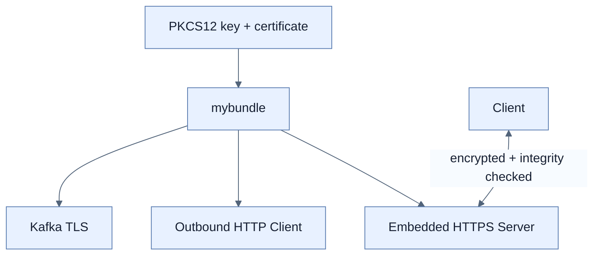

# TLS와 SSL Bundle로 전송 데이터 보호

## 한눈에 보기

HTTPS는 HTTP를 TLS 위에서 실행해 기밀성, 무결성, 서버 인증을 제공한다. embedded server는 PKCS#12 keystore의 private key와 certificate를 사용한다. SSL Bundle은 이 자료를 한 번 이름 붙여 server, RestClient, Kafka 등에 재사용하게 한다.

## 1. 왜 이게 필요한가

인증·인가가 완벽해도 평문 네트워크에서 password와 token이 탈취·변조되면 소용없다. 시스템마다 인증서 경로와 password를 중복하면 rotation 시 누락·불일치가 생긴다. 전송 암호화와 certificate lifecycle을 공통 구성으로 관리해야 한다.

## 2. 어떻게 동작하는가

개발에서는 `keytool`로 self-signed certificate와 private key를 `keystore.p12`에 만들 수 있다. `server.ssl.*` 설정은 8443 같은 HTTPS port, keystore, alias를 지정한다. 브라우저 경고는 certificate가 trusted CA chain에 없기 때문이며 운영에서 이를 무시하면 안 된다.

`spring.ssl.bundle.pkcs12.mybundle...`로 key material을 정의하고 `server.ssl.bundle=mybundle`, `spring.kafka.ssl.bundle=mybundle`처럼 소비자가 이름을 참조한다. Bundle은 복제를 줄이지만 key password의 secret 관리와 certificate 자동 갱신 자체를 대신하지 않는다.

## 3. 그림으로 보기

## 4. 이 노트에 나온 용어

- **TLS**: 전송 데이터 암호화·무결성·peer 인증을 제공하는 프로토콜.
- **certificate**: public key와 identity를 서명해 연결한 디지털 문서.
- **keystore**: private key와 certificate chain을 보호해 저장하는 컨테이너.
- **SSL Bundle**: TLS key/trust material과 옵션을 이름 붙여 재사용하는 Boot 구성.

## 7. 연결

- [[08-authenticating-with-google-and-calling-youtube]] — OAuth code와 token 전송은 HTTPS를 전제로 한다.
- [[10-securing-data-at-rest]] — 이동 중 보호와 저장 중 보호는 서로 대체할 수 없다.
- [[chapter-12-messaging-and-asynchronous-communication-in-spring-boot-4/03-apache-kafka-fundamentals|Kafka]] — 같은 bundle을 broker 연결에도 적용할 수 있다.

## 8. 스스로 확인

- 전체 1차 정리 후: self-signed certificate에서 브라우저 경고가 나는 이유와 SSL Bundle의 역할을 설명한다.

<!-- ==== 아래는 내 영역 · 스킬 수정 금지 ==== -->

## 내 설명 시도

## 막혔던 지점

## 리뷰 이력

