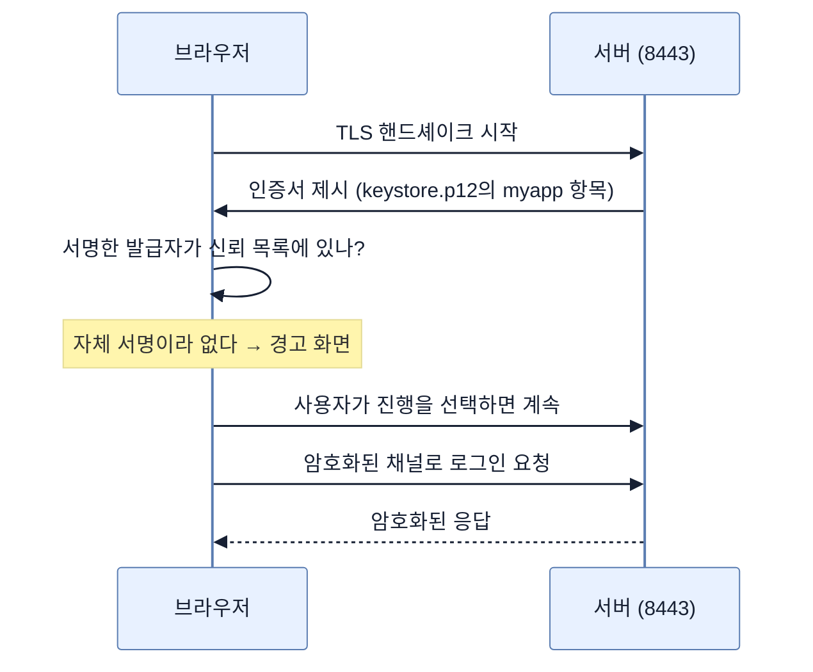

# 오가는 데이터 지키기 — HTTPS, 인증서, 그리고 자체 서명의 대가

## 한눈에 보기

| 질문 | 핵심 답 |
|---|---|
| 보호 대상 두 종류 | **전송 중**(이동하는 중) vs **저장 중**(머물러 있는) |
| HTTPS의 정체 | HTTP를 **TLS 위에** 얹은 것 |
| TLS가 주는 셋 | 암호화 · 무결성 · **서버 신원 증명** |
| 신원 증명의 수단 | 인증서 — 발급자의 서명이 붙은 문서 |
| 운영에서의 발급자 | Let's Encrypt, DigiCert, 사내 CA 같은 **인증기관** |
| 개발에서는 | `keytool`로 만드는 **자체 서명 인증서** |
| 그 대가 | 브라우저가 `NET::ERR_CERT_AUTHORITY_INVALID` 경고를 띄운다 |
| 설정 | `server.port=8443` + `server.ssl.*` 다섯 줄 |
| 이 절의 소스 | 저장소의 `ch4-data-transit-rest-security` 폴더 |

## 1. 왜 이게 필요한가

### 출발 장면: 로그인 폼이 평문으로 나간다

지금까지 만든 앱은 인증도 인가도 갖췄다. 그런데 `http://localhost:8080/login`에서 비밀번호를 입력하면 그 값이 네트워크에 **평문으로** 흐른다.

같은 카페 와이파이에 있는 누군가가 패킷을 들여다보면 아이디와 비밀번호가 그대로 보인다. [[09b-securing-data-at-rest]]에서 배울 BCrypt 해싱은 **DB에 저장된 값**을 보호하지, 브라우저에서 서버로 가는 구간을 보호하지 않는다.

### 두 종류의 데이터

책은 보호 대상을 둘로 나눈다.

| | **[[전송-중-데이터]]**(= 이동하는 중인 데이터) | **[[저장-중-데이터]]**(= 머물러 있는 데이터) |
|---|---|---|
| 어디 | 브라우저↔서버, 서비스↔서비스 | 데이터베이스, 파일 시스템, 백업 |
| 위협 | 도청, 변조 | 저장소 통째 유출 |
| 보호가 주는 것 | 기밀성 + 무결성 | 키 없이는 읽을 수 없음 |
| 이 장의 수단 | TLS/HTTPS | 비밀번호 해싱 |
| 노트 | **이 노트**, [[09a-introducing-ssl-bundles]] | [[09b-securing-data-at-rest]] |

둘은 서로를 대신하지 못한다. **HTTPS를 켜도 DB가 털리면 비밀번호가 새고, 비밀번호를 해시해도 세션 쿠키는 도청될 수 있다.** 둘 다 필요하다.

## 2. 어떻게 동작하는가

### 2.1 HTTPS = HTTP + TLS

**[[HTTPS]]**(= HTTP를 TLS 위에서 주고받는 방식)는 새 프로토콜이 아니다. HTTP는 그대로이고, 그 밑에 **[[TLS]]**(= 전송 구간을 암호화하고 무결성을 지키며 서버 신원을 증명하는 프로토콜) 한 층이 들어간다.

TLS가 주는 것이 셋이다. 각각이 없으면 무엇이 깨지는지 보자.

| 보장 | 없으면 |
|---|---|
| **암호화** | 중간에서 내용을 읽는다 |
| **무결성** | 중간에서 내용을 바꿔치기해도 모른다 |
| **서버 인증** | 진짜 서버인 줄 알고 공격자와 대화하게 된다 |

셋째가 특히 중요하다. 암호화만으로는 부족하다 — **누구와 암호화된 대화를 하고 있는지** 모르면 공격자와 안전하게 대화하는 셈이 된다. 그 신원을 증명하는 것이 **[[인증서]]**(= 이 공개 키가 이 도메인의 것임을 발급자가 서명으로 보증하는 문서)다.

### 2.2 누가 보증하는가

인증서가 신뢰받으려면 **[[인증기관]]**(= 인증서를 발급하고 그 내용을 보증하는 신뢰받는 제3자)의 서명이 있어야 한다. 브라우저와 운영체제는 신뢰하는 CA 목록을 미리 들고 있다.

운영에서는 Let's Encrypt, DigiCert, 또는 사내 CA가 발급한다. 개발에서는 그렇게까지 할 필요가 없어서 **[[자체-서명-인증서]]**(= 인증기관 없이 스스로 서명해 만든 인증서)를 쓴다.

자체 서명 인증서는 **암호화는 정상적으로 되지만 신원 보증이 없다.** 셋 중 둘만 갖춘 것이다.

### 2.3 인증서 만들기

```bash
keytool -genkeypair \
    -alias myapp \
    -keyalg RSA \
    -keysize 2048 \
    -storetype PKCS12 \
    -keystore keystore.p12 \
    -validity 3650
```

**[[keytool]]**(= JDK가 함께 배포하는 키·인증서 관리 명령줄 도구)의 옵션이 각각 무엇을 정하는지 보자.

| 옵션 | 정하는 것 | 이 값인 이유 |
|---|---|---|
| `-genkeypair` | 키 쌍(개인 키 + 공개 키) 생성 | TLS에는 비대칭 키 쌍이 필요하다 |
| `-alias myapp` | **[[별칭]]**(= 키스토어 안의 항목 하나를 가리키는 이름표) | 한 키스토어에 여러 키가 있을 수 있다 |
| `-keyalg RSA` | 키 알고리즘 | 가장 널리 지원된다 |
| `-keysize 2048` | 키 길이 | 현재 기준 최소 권장치 |
| `-storetype PKCS12` | **[[PKCS12]]**(= 키와 인증서를 하나로 묶는 표준 키스토어 형식) | JKS를 대신하는 표준 형식 |
| `-keystore keystore.p12` | 만들 파일 이름 | — |
| `-validity 3650` | 유효 기간 10년 | 개발용이라 갱신 부담을 없앴다 |

암호를 물어보면 `changeit`을 입력한다. 나머지 항목(이름·조직·지역)은 아무 값이나 넣어도 된다 — 자체 서명이라 아무도 검증하지 않는다.

그다음 만들어진 **[[키스토어]]**(= 개인 키와 인증서를 함께 담는 암호화된 파일)를 classpath에 놓는다.

```text
src/main/resources/keystore.p12
```

### 2.4 설정

```properties
server.port=8443
server.ssl.enabled=true
server.ssl.key-store=classpath:keystore.p12
server.ssl.key-store-password=changeit
server.ssl.key-store-type=PKCS12
server.ssl.key-alias=myapp
```

| 프로퍼티 | 하는 일 |
|---|---|
| `server.port=8443` | HTTPS의 개발 관례 포트. 8080의 짝이다 |
| `server.ssl.enabled=true` | SSL을 켠다 |
| `server.ssl.key-store` | 키스토어 위치. `classpath:` 접두사로 jar 안을 가리킨다 |
| `server.ssl.key-store-password` | 키스토어를 열 암호. `keytool`에서 입력한 값과 같아야 한다 |
| `server.ssl.key-store-type` | 형식 |
| `server.ssl.key-alias` | 어느 항목을 쓸지. `-alias`와 같아야 한다 |

`8443`이라는 숫자에 규칙적 의미가 있다. HTTPS 표준 포트가 443이고, 개발용 비특권 포트로 그 앞에 8을 붙인 것이다. HTTP의 80 → 8080과 같은 관례다.

### 2.5 그리고 브라우저가 경고한다

`https://localhost:8443`을 열면 이런 화면이 나온다.

![[_assets/lsb4-p148-fig4-9-self-signed-certificate-warning.png]]

경고의 원인이 화면에 코드로 적혀 있다.

```text
NET::ERR_CERT_AUTHORITY_INVALID
```

**"발급자를 신뢰할 수 없다"**는 뜻이다. 인증서가 손상됐다거나 도메인이 안 맞는다는 게 아니라, 서명한 주체가 브라우저의 신뢰 목록에 없다는 것이다. 우리가 직접 서명했으니 당연한 결과다.

브라우저 설명문도 정확하다 — "이 서버는 자신이 localhost임을 증명하지 못했습니다." **암호화는 되고 있지만 신원 증명이 안 된다**는 앞의 설명 그대로다.

개발 환경에서는 예상된 일이므로 **Advanced → Proceed to localhost (unsafe)**로 넘어가면 로그인 페이지가 나온다.

주의할 것은 이 경고를 **무시하는 습관**이다. 개발에서는 정상이지만, 운영 사이트에서 같은 경고가 뜬다면 중간자 공격일 수 있다. 화면은 똑같이 생겼고 구분해 주는 것은 맥락뿐이다.

## 3. 그림으로 보기



| 축 | CA 발급 인증서 | 자체 서명 인증서 |
|---|---|---|
| 암호화 | 된다 | **된다** |
| 무결성 | 된다 | **된다** |
| 서버 신원 증명 | 된다 | **안 된다** |
| 브라우저 경고 | 없다 | **있다** |
| 비용·절차 | 발급 절차 필요 | 명령 한 줄 |
| 쓰는 곳 | 운영 | 개발·테스트 |

## 4. 이 노트에 나온 용어

| 용어 | 한 줄 뜻 | 정의 위치 |
|---|---|---|
| 전송 중 데이터 | 이동하는 중인 데이터 | [[_glossary#전송-중-데이터]] |
| 저장 중 데이터 | 머물러 있는 데이터 | [[_glossary#저장-중-데이터]] |
| TLS | 전송 구간을 암호화·인증하는 프로토콜 | [[_glossary#TLS]] |
| HTTPS | HTTP를 TLS 위에서 주고받는 방식 | [[_glossary#HTTPS]] |
| 인증서 | 공개 키의 소유자를 발급자가 보증하는 문서 | [[_glossary#인증서]] |
| 인증기관 | 인증서를 발급·보증하는 신뢰받는 제3자 | [[_glossary#인증기관]] |
| 자체 서명 인증서 | CA 없이 스스로 서명한 인증서 | [[_glossary#자체-서명-인증서]] |
| 키스토어 | 개인 키와 인증서를 담는 암호화된 파일 | [[_glossary#키스토어]] |
| PKCS#12 | 키와 인증서를 묶는 표준 키스토어 형식 | [[_glossary#PKCS12]] |
| keytool | JDK의 키·인증서 관리 명령줄 도구 | [[_glossary#keytool]] |
| 별칭 | 키스토어 안의 항목을 가리키는 이름표 | [[_glossary#별칭]] |

## 5. 자주 헷갈리는 것

**"HTTPS는 다른 프로토콜이다"** — HTTP 그대로이고 밑에 TLS 층이 들어간다. 애플리케이션 코드는 바뀌지 않는다.

**"자체 서명 인증서는 암호화가 안 된다"** — 암호화는 정상이다. 빠진 것은 **신원 보증**뿐이다.

**"경고는 인증서가 잘못됐다는 뜻이다"** — `AUTHORITY_INVALID`는 "발급자를 모른다"는 뜻이다. 인증서 자체는 유효하다.

**"HTTPS를 켜면 CSRF도 막힌다"** — 무관하다. TLS는 구간을 보호할 뿐 요청의 출처를 따지지 않는다([[05a-to-csrf-or-not-to-csrf]]).

**"운영에서도 `changeit`을 써도 된다"** — `changeit`은 자바 세계의 관용적인 기본값이며 사실상 공개 상수다. 개발 편의를 위한 값이다.

## 6. 언제 안 쓰나 / 경계

- **자체 서명 인증서는 개발용이다.** 사용자에게 경고를 무시하도록 훈련시키는 것 자체가 보안 부채다.
- **키스토어를 형상 관리에 넣지 마라.** `src/main/resources`에 두면 jar에 포함되고, 저장소에 커밋하면 개인 키가 공개된다.
- **`server.ssl.*`은 웹 서버 하나만 설정한다.** 아웃바운드 클라이언트나 메시징 연결에는 적용되지 않는다. 그 한계가 [[09a-introducing-ssl-bundles]]의 출발점이다.
- **비유의 한계.** 인증서는 "여권"에 자주 비유된다. 발급 기관이 신원을 보증하고, 위조를 막는 장치가 있다. 다만 이 비유는 **자체 서명 인증서가 왜 쓸모가 있는지**를 설명하지 못한다. 스스로 만든 여권은 아무 데서도 안 통하지만, 자체 서명 인증서는 신원 증명만 못 할 뿐 **암호화 채널은 정상적으로 열어 준다.** 여권보다는 "이름을 밝히지 않은 채로도 잠금은 걸리는 봉투"에 가깝다.

## 7. 연결

- [[08d-creating-an-oauth2-powered-web-app]] — 인증·인가를 마친 뒤 데이터 자체를 보호하는 주제로 넘어오는 지점이다.
- [[09a-introducing-ssl-bundles]] — 여기서 쓴 `server.ssl.*` 방식이 컴포넌트가 늘어나면 반복된다는 문제를 다룬다.
- [[09b-securing-data-at-rest]] — 같은 "데이터 보호"의 나머지 절반. 이동 중이 아니라 머물러 있는 데이터를 다룬다.

## 8. 스스로 확인

1. 전송 중 데이터와 저장 중 데이터가 서로를 대신할 수 없는 이유를 예로 들 수 있는가?
2. TLS가 주는 세 가지 중 암호화만으로 부족한 이유는?
3. 자체 서명 인증서가 갖춘 것과 못 갖춘 것을 구분할 수 있는가?
4. `-alias`와 `server.ssl.key-alias`가 같아야 하는 이유는?
5. `NET::ERR_CERT_AUTHORITY_INVALID`가 정확히 무엇을 뜻하는가?
6. 이 경고를 습관적으로 무시하는 것이 왜 위험한가?
7. 키스토어를 저장소에 커밋하면 무엇이 새는가?
8. 여권 비유가 깨지는 지점은 어디인가?

<!-- ==== 아래는 내 영역 · 스킬 수정 금지 ==== -->

## 내 설명 시도


## 막혔던 지점


## 리뷰 이력
