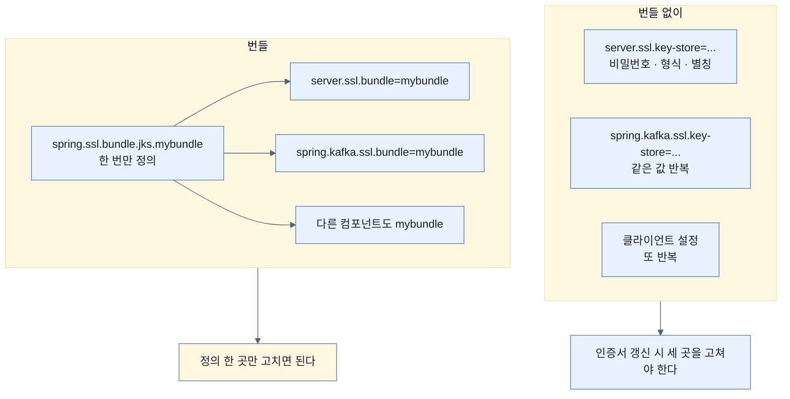
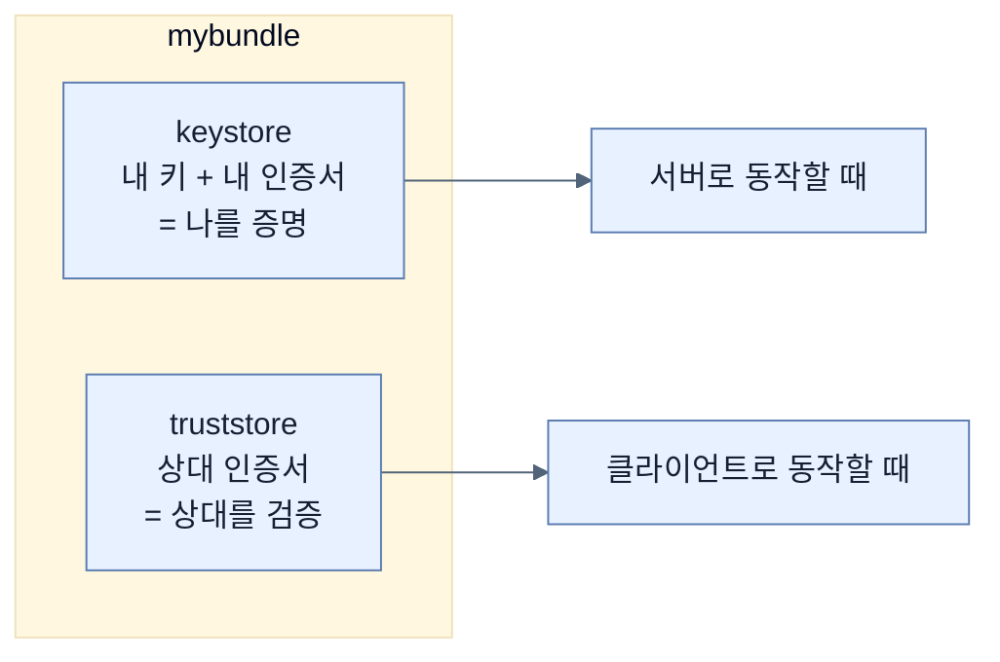

# TLS 재료를 한 번만 적기 — SSL Bundle

## 한눈에 보기

| 질문 | 핵심 답 |
|---|---|
| 무엇이 문제인가 | TLS 설정이 웹 서버·HTTP 클라이언트·Kafka 등 **여러 곳에서 반복**된다 |
| 반복이 낳는 것 | 불일치와 **인증서 교체의 어려움** |
| 해법 | 인증서 재료를 **이름 붙여 한 번 정의**하고 그 이름을 참조한다 |
| 도입 시점 | Spring Boot **3.1** |
| 정의하는 자리 | `spring.ssl.bundle.*` |
| 참조하는 자리 | `server.ssl.bundle`, `spring.kafka.ssl.bundle`, … |
| 원문 오류 | 책은 번들 타입을 `pkcs12`라 쓴다. Boot 4.1의 타입은 **`jks`와 `pem`** 둘뿐 |
| 핵심 이점 | 한 번 정의하고 일관되게 재사용, 교체가 한 곳에서 끝난다 |

## 1. 왜 이게 필요한가

### 출발 장면: 같은 키스토어 경로를 네 번 적는다

[[09-securing-data-in-transit]]의 설정은 웹 서버 하나를 HTTPS로 바꿨다. 그런데 시스템이 자라면 TLS가 필요한 곳이 늘어난다.

| 어디 | 무엇을 위해 |
|---|---|
| 임베디드 웹 서버 | 브라우저의 HTTPS 접속을 받는다 |
| 아웃바운드 HTTP 클라이언트 | 사내 API를 mTLS로 호출한다([[08c-invoking-an-oauth-2-api-remotely]]의 `RestClient` 같은 것) |
| Kafka 클라이언트 | 브로커와 TLS로 연결한다 |
| 데이터베이스 드라이버 | DB 연결을 암호화한다 |

번들이 없으면 각 컴포넌트마다 키스토어 경로·비밀번호·형식·별칭을 **따로** 적는다. 결과는 이렇다.

| 문제 | 구체적으로 |
|---|---|
| 중복 | 같은 값이 설정 파일 여러 곳에 흩어진다 |
| 불일치 | 한 곳만 오타가 나면 그 컴포넌트만 조용히 실패한다 |
| **교체가 어렵다** | 인증서를 갱신할 때 **모든 자리를 빠짐없이** 고쳐야 한다 |

세 번째가 가장 아프다. 인증서는 만기가 있다. 갱신은 정기적으로 반복되는 작업이고, 그때마다 "다 고쳤나?"를 확인해야 한다면 언젠가 한 곳이 남는다.

## 2. 어떻게 동작하는가

### 2.1 이름을 붙여 한 번 정의한다

**[[SSL-번들]]**(= TLS 재료를 이름 붙여 한 번 정의해 두고 여러 곳에서 재사용하게 해 주는 Spring Boot 3.1의 기능)의 아이디어는 단순하다. **재료에 이름을 준다.**

책이 보여 주는 설정은 이렇다.

```properties
spring.ssl.bundle.pkcs12.mybundle.key.store=classpath:keystore.p12
spring.ssl.bundle.pkcs12.mybundle.key.password=changeit
```

그리고 참조한다.

```properties
server.ssl.bundle=mybundle
```

Kafka도 같은 번들을 쓴다.

```properties
spring.kafka.ssl.bundle=mybundle
```

**정의는 한 번, 참조는 여러 번.** 인증서를 갱신할 때 고칠 곳은 정의 두 줄뿐이다.

> **원문 오류.** 책의 프로퍼티 이름은 Boot 4.1과 맞지 않는다. Boot 4.1의 번들 타입은 **`jks`와 `pem` 둘뿐**이고 `pkcs12`라는 타입 세그먼트는 없다. PKCS#12 파일도 `jks` 아래에 놓으며, 키스토어 경로 키는 `key.store`가 아니라 `keystore.location`이다. 공식 문서 기준 표기는 이렇다.
>
> ```yaml
> spring:
>   ssl:
>     bundle:
>       jks:
>         mybundle:
>           key:
>             alias: "myapp"
>           keystore:
>             location: "classpath:keystore.p12"
>             password: "changeit"
>             type: "PKCS12"
> ```
>
> 참조하는 쪽(`server.ssl.bundle=mybundle`, `spring.kafka.ssl.bundle=mybundle`)은 책 그대로 맞다.

### 2.2 `key`와 `keystore`가 다른 이유

정정된 표기를 보면 `key`와 `keystore`가 나뉘어 있다. 헷갈리기 쉬운데, 계층이 다르기 때문이다.

| 키 | 가리키는 대상 |
|---|---|
| `keystore.location` | **[[키스토어]]**(= 개인 키와 인증서를 담는 암호화된 파일)의 경로 |
| `keystore.password` | 그 **파일**을 여는 암호 |
| `key.alias` | 파일 안의 여러 항목 중 어느 것을 쓸지 (**[[별칭]]**) |
| `key.password` | 그 **항목의 개인 키**를 여는 암호 |

키스토어는 여러 키를 담을 수 있는 상자이고, 상자에도 자물쇠가 있고 안의 항목에도 각각 자물쇠가 있을 수 있다. `keytool`로 만들 때 둘을 같은 값으로 두는 게 보통이라 구분이 흐려지지만, 다르게 둘 수도 있다.

책의 `key.password=changeit`은 **개인 키의 암호**를 지정한 것이고, 키스토어 파일 자체의 암호는 지정되지 않은 상태다.

### 2.3 keystore와 truststore

번들에는 두 종류의 재료가 들어갈 수 있다. 방향이 반대다.

| | keystore | **[[트러스트스토어]]**(= 내가 신뢰하는 상대 인증서 목록을 담는 저장소) |
|---|---|---|
| 담는 것 | **내** 개인 키 + **내** **[[인증서]]** | **상대의** 인증서 |
| 쓰는 쪽 | 서버 — 자기 신원을 증명 | 클라이언트 — 상대를 검증 |
| 우리 예제 | 웹 서버가 브라우저에게 | 사내 API를 호출할 때 그쪽 인증서 검증 |

한 애플리케이션이 둘 다 필요할 수 있다. 브라우저 요청을 받으면서(keystore) 동시에 다른 서비스를 호출한다면(truststore) 그렇다. 번들은 그 둘을 한 이름 아래 묶는다.

### 2.4 무엇이 좋아지나



책이 요약하는 핵심 이점 그대로다 — **TLS 설정을 한 번 정의하고 일관되게 재사용해, 중복을 줄이고 인증서 관리를 단순화한다.**

## 3. 그림으로 보기

| 축 | `server.ssl.*` 직접 설정 | SSL 번들 |
|---|---|---|
| 대상 | 웹 서버 하나 | 이름을 참조하는 모든 컴포넌트 |
| 정의 위치 | `server.ssl` 아래 | `spring.ssl.bundle.<type>.<name>` |
| 참조 방법 | 없음(직접 값) | `<component>.ssl.bundle=<name>` |
| 인증서 교체 | 모든 자리 수정 | **정의 한 곳** |
| 도입 | 오래됨 | Boot 3.1 |
| 이 장에서 | [[09-securing-data-in-transit]] | 이 노트 |



## 4. 이 노트에 나온 용어

| 용어 | 한 줄 뜻 | 정의 위치 |
|---|---|---|
| SSL 번들 | TLS 재료를 이름 붙여 재사용하는 Boot 3.1 기능 | [[_glossary#SSL-번들]] |
| 키스토어 | 개인 키와 인증서를 담는 암호화된 파일 | [[_glossary#키스토어]] |
| 트러스트스토어 | 신뢰하는 상대 인증서 목록을 담는 저장소 | [[_glossary#트러스트스토어]] |
| TLS | 전송 구간을 암호화·인증하는 프로토콜 | [[_glossary#TLS]] |
| PKCS#12 | 키와 인증서를 묶는 표준 키스토어 형식 | [[_glossary#PKCS12]] |
| 별칭 | 키스토어 안의 항목을 가리키는 이름표 | [[_glossary#별칭]] |
| 인증서 | 공개 키의 소유자를 발급자가 보증하는 문서 | [[_glossary#인증서]] |

## 5. 자주 헷갈리는 것

**"번들은 `server.ssl.bundle` 아래에 정의한다"** — 책 본문이 그렇게 서술하지만 틀렸다. 정의는 `spring.ssl.bundle.*`에서 하고, `server.ssl.bundle`은 **이미 정의된 번들을 참조**하는 키다.

**"`pkcs12`라는 번들 타입이 있다"** — Boot 4.1의 타입은 `jks`와 `pem`뿐이다. PKCS#12 **파일**은 `jks` 타입 아래에서 `keystore.type: "PKCS12"`로 지정한다. 형식 이름과 타입 세그먼트가 헷갈리기 쉬운 자리다.

**"`key.password`가 키스토어 암호다"** — 개인 키 항목의 암호다. 키스토어 파일 자체의 암호는 `keystore.password`다.

**"번들을 쓰면서 `server.ssl.ciphers` 같은 걸 같이 써도 된다"** — 안 된다. 번들을 쓰면 `server.ssl` 아래의 개별 옵션이 무시된다. 그런 설정은 `spring.ssl.bundle.<type>.<name>.options` 아래로 옮겨야 한다.

## 6. 언제 안 쓰나 / 경계

- **TLS가 한 곳에만 필요하면 과할 수 있다.** 책도 인정한다 — 단순한 애플리케이션에는 `server.ssl.*` 직접 설정으로 충분하다. 번들의 가치는 **재사용처가 둘 이상일 때** 나온다.
- **번들과 개별 옵션을 섞을 수 없다.** 위의 혼동 항목 참고.
- **비유의 한계.** SSL 번들은 "상수를 정의해 여러 곳에서 참조하는 것"에 가깝다. 매직 넘버를 없애는 것과 같은 이유로 좋다. 다만 이 비유는 **번들이 값의 묶음이 아니라 살아 있는 자원**이라는 점을 흐린다. Spring Boot는 번들을 통해 인증서를 다시 읽고 갱신을 반영하는 것까지 지원하므로, 텍스트 치환보다는 "관리되는 재료 공급원"에 가깝다.

## 7. 연결

- [[09-securing-data-in-transit]] — 그 노트의 `server.ssl.*` 설정이 컴포넌트가 늘어나면 반복된다는 문제가 이 노트의 출발점이다.
- [[09b-securing-data-at-rest]] — 전송 구간 보안을 정리했으니 저장 중 데이터로 넘어간다.
- [[08c-invoking-an-oauth-2-api-remotely]] — 거기서 만든 아웃바운드 `RestClient`도 TLS 재료가 필요해지면 이 번들을 참조하는 대상이 된다.

## 8. 스스로 확인

1. TLS 설정 중복이 낳는 문제 세 가지 중 가장 아픈 것과 그 이유는?
2. 번들을 "정의하는 자리"와 "참조하는 자리"를 구분해 말할 수 있는가?
3. `keystore.password`와 `key.password`가 가리키는 대상이 어떻게 다른가?
4. keystore와 truststore의 방향 차이를 우리 앱의 두 역할로 설명할 수 있는가?
5. 인증서 갱신 작업이 번들 도입 전후로 어떻게 달라지는가?
6. 번들을 쓰면서 `server.ssl.ciphers`를 함께 쓰면 왜 안 되는가?
7. 상수 정의 비유가 깨지는 지점은 어디인가?

<!-- ==== 아래는 내 영역 · 스킬 수정 금지 ==== -->

## 내 설명 시도


## 막혔던 지점


## 리뷰 이력
