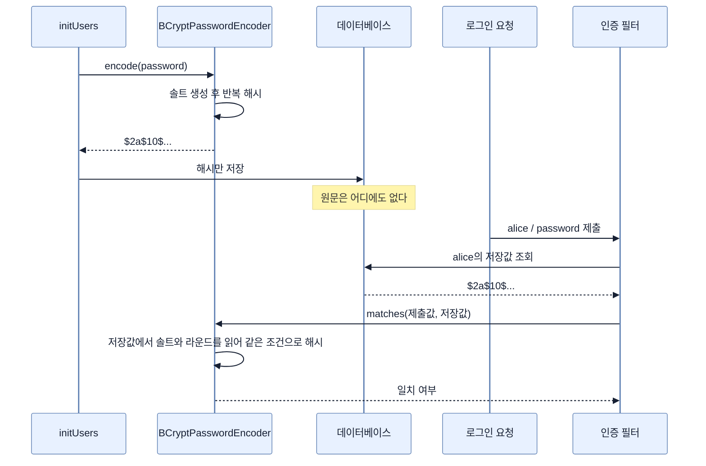
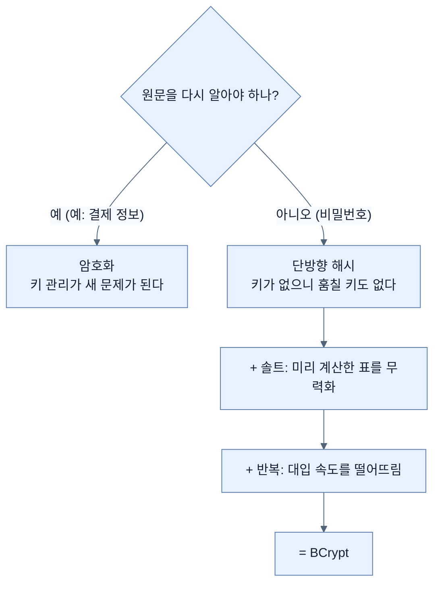

# 복구할 수 없게 저장하기 — BCrypt와 단방향 해시

## 한눈에 보기

| 질문 | 핵심 답 |
|---|---|
| 무엇을 고치나 | 이 장 내내 미뤄 둔 **평문 비밀번호** |
| 왜 암호화가 아니라 해시인가 | 비밀번호는 **복호화할 필요가 없다.** 비교만 하면 된다 |
| 쓰는 알고리즘 | `BCryptPasswordEncoder` |
| BCrypt가 자동으로 하는 것 | **솔트 생성**과 **여러 라운드 반복** |
| 저장 시점 | `initUsers`에서 `encoder.encode(...)`를 거쳐 저장 |
| 인증 시점 | Spring Security가 제출값을 해시해 저장값과 비교 |
| `asUser()` 변경 | `withDefaultPasswordEncoder()` → **`withUsername()`** |
| 결과 | DB가 털려도 원래 비밀번호를 복구할 수 없다 |

## 1. 왜 이게 필요한가

### 출발 장면: 이 장 내내 남겨 둔 빚

[[03-creating-users-with-userdetailsservice]]에서 `withDefaultPasswordEncoder()`를 쓸 때 책은 Tip으로 경고했다 — deprecated이고 운영에서는 절대 쓰지 말라고. [[04-spring-data-backed-users]]에서도 Note로 "비밀번호 인코딩은 사용자 관리 도구의 몫"이라며 미뤘다.

그동안 DB에는 이렇게 저장돼 있었다.

```text
USER_ACCOUNT
| id | username | password  |
|  1 | alice    | password  |
|  2 | bob      | password  |
|  3 | admin    | password  |
```

이 테이블이 유출되면 세 계정이 즉시 끝난다. 더 나쁜 것은 **사용자들이 다른 사이트에서도 같은 비밀번호를 쓴다는 것**이다. 우리 DB 유출이 남의 서비스 침해로 번진다.

**[[저장-중-데이터]]**(= 머물러 있는 데이터)를 보호한다는 것은, **저장소가 통째로 유출된 상황을 전제로** 설계한다는 뜻이다.

### 왜 암호화하지 않고 해시하는가

"그럼 비밀번호를 암호화해서 저장하면 되지 않나?" — 암호화는 복호화가 가능해야 하고, 그러려면 **키를 어딘가에 보관**해야 한다. 그 키가 같은 서버에 있으면 DB를 턴 공격자가 키도 가져간다.

근본적인 질문은 이것이다. **우리가 비밀번호 원문을 알아야 할 이유가 있는가?**

없다. 로그인할 때 하는 일은 "제출된 값이 저장된 값과 같은가"를 판정하는 것뿐이다. **복호화가 필요 없다면 복호화가 불가능한 편이 낫다.**

## 2. 어떻게 동작하는가

### 2.1 단방향 해시

**[[해시]]**(= 임의 길이 입력을 고정 길이 값으로 바꾸는 계산)는 **[[단방향-함수]]**(= 계산은 쉽지만 역산이 현실적으로 불가능한 함수)다.

```text
"password"  --해시-->  $2a$10$N9qo8uLOickgx2ZMRZoMye...
                       (되돌릴 수 없음)
```

로그인 흐름은 이렇게 바뀐다.

| 단계 | 하는 일 | 왜 이렇게 되나 |
|---|---|---|
| 저장 | 원문을 해시해 그 결과만 저장 | 원문은 어디에도 남지 않는다 |
| 로그인 | 제출된 원문을 **같은 방식으로** 해시 | 원문끼리 비교할 수 없으니 해시끼리 비교한다 |
| 판정 | 두 해시가 같으면 통과 | 같은 입력은 같은 해시를 낸다 |

**서버조차 사용자의 비밀번호를 모른다.** 그래서 "비밀번호를 잊었다"에 대한 답이 "알려 드리겠습니다"가 아니라 "재설정하세요"인 것이다. 서비스가 원문을 이메일로 보내 준다면 그건 해시하지 않았다는 뜻이다.

### 2.2 그냥 해시로는 부족한 이유

해시만으로는 두 공격이 남는다.

**첫째, [[레인보우-테이블]]**(= 흔한 비밀번호의 해시값을 미리 계산해 둔 표). `password`, `123456` 같은 값의 해시는 이미 다 계산돼 있다. 유출된 해시를 그 표에서 찾으면 원문이 나온다. 그리고 같은 비밀번호를 쓴 사용자들은 **해시도 같아서** 한 번에 드러난다.

→ 해법은 **[[솔트]]**(= 해시 계산에 섞어 넣는, 사용자마다 다른 랜덤 값)다. 같은 `password`라도 솔트가 다르면 저장값이 달라지므로 미리 만든 표가 무력해진다.

**둘째, [[무차별-대입-공격]]**(= 가능한 값을 하나씩 대입해 알아내려는 공격). 현대 GPU는 초당 수십억 번 해시를 계산한다. 솔트가 있어도 계정 하나를 골라 집중하면 짧은 비밀번호는 뚫린다.

→ 해법은 **해시 한 번을 일부러 느리게** 만드는 것이다. 같은 계산을 수천 번 반복하면 정상 로그인은 0.1초쯤 걸리지만 공격자의 초당 시도 횟수는 수십억에서 수백으로 떨어진다.

### 2.3 BCrypt가 둘 다 처리한다

```java
@Bean
PasswordEncoder passwordEncoder() {
    return new BCryptPasswordEncoder();
}
```

**[[BCrypt]]**(= 비밀번호 저장을 위해 설계된 적응형 해시 알고리즘)를 **[[비밀번호-인코더]]**(= 평문을 저장·비교 가능한 형태로 바꾸는 전략) 빈으로 등록한다. 책의 설명대로 BCrypt는 **솔트를 자동으로 만들고 여러 라운드를 적용해** 무차별 대입을 훨씬 어렵게 만든다.

"적응형(adaptive)"이라는 이름이 핵심이다. 반복 횟수를 설정으로 올릴 수 있어서, 하드웨어가 빨라져도 **같은 알고리즘으로 난이도를 따라 올릴 수 있다.** 몇 년 뒤에 알고리즘을 갈아엎지 않아도 된다.

BCrypt가 만드는 값은 솔트와 반복 횟수를 자기 안에 담는다.

```text
$2a$10$N9qo8uLOickgx2ZMRZoMye...
 │   │  └─ 솔트 + 해시
 │   └─ 반복 횟수 (2^10)
 └─ 알고리즘 식별자
```

그래서 솔트를 따로 저장할 컬럼이 필요 없다. 검증할 때 저장값에서 솔트와 라운드를 읽어 같은 조건으로 다시 계산한다.

### 2.4 저장할 때 인코딩하기

```java
@Bean
CommandLineRunner initUsers(
    UserManagementRepository repository, PasswordEncoder encoder) {
    return args -> {
         repository.save(new UserAccount("alice",
             encoder.encode("password"), "ROLE_USER"));
             repository.save(new UserAccount("bob",
             encoder.encode("password"), "ROLE_USER"));
             repository.save(new UserAccount("admin",
             encoder.encode("password"), "ROLE_ADMIN"));
    };
}
```

[[04-spring-data-backed-users]]의 **[[CommandLineRunner]]**(= 컨텍스트 기동 직후 한 번 실행되는 콜백)에 인자가 하나 늘고, 각 비밀번호가 `encoder.encode(...)`를 통과한다.

세 사용자가 **같은 원문 `"password"`**를 쓰는데도 저장값은 셋 다 다르다. 솔트가 매번 새로 만들어지기 때문이다. 이것이 레인보우 테이블 방어가 실제로 동작하는 모습이다.

### 2.5 조회 쪽도 바꾼다

```java
public UserDetails asUser() {
    return User.withUsername(getUsername())
            .password(getPassword())
            .authorities(getAuthorities())
            .build();
}
```

**[[04-spring-data-backed-users]]와 딱 한 줄 다르다.** `User.withDefaultPasswordEncoder()`가 `User.withUsername()`으로 바뀌었다.

이 변경이 왜 필요한지는 두 메서드가 하는 일을 보면 드러난다.

| | `withDefaultPasswordEncoder()` | `withUsername()` |
|---|---|---|
| 비밀번호를 어떻게 다루나 | 자체적으로 인코딩(사실상 평문) | **손대지 않는다** |
| 검증은 누가 | 그 자체 규칙 | **등록된 `PasswordEncoder` 빈** |
| deprecated | 예 | 아니오 |

이제 저장된 값은 이미 BCrypt 해시다. `withDefaultPasswordEncoder()`를 계속 쓰면 **이미 해시된 값을 또 인코딩**하려 들어 검증이 깨진다. `withUsername()`은 값을 그대로 두고, 검증은 컨테이너에 등록된 `PasswordEncoder`가 맡는다.

**[[UserDetails]]**(= Spring Security가 이해하는 사용자 정보의 표준 모양)를 만드는 방식은 그대로이고 **책임의 위치만 옮겼다.** 인코딩 전략이 빌더 안에 박혀 있던 것을 빈으로 빼낸 것이다. 그래서 나중에 BCrypt를 다른 알고리즘으로 바꾸려면 빈 하나만 교체하면 된다.

### 2.6 전체 흐름



책의 결론대로 **데이터베이스가 침해돼도 공격자는 원래 비밀번호를 복구할 수 없다.**

## 3. 그림으로 보기

| 공격 | 그냥 해시 | + 솔트 | + 느린 해시(BCrypt) |
|---|---|---|---|
| 레인보우 테이블 조회 | **통한다** | 막힌다 | 막힌다 |
| 같은 비밀번호 사용자 일괄 노출 | **통한다** | 막힌다 | 막힌다 |
| 계정 하나 집중 무차별 대입 | 통한다 | 통한다 | **비용이 수백만 배** |
| 하드웨어 발전 대응 | 불가 | 불가 | **라운드를 올린다** |



## 4. 이 노트에 나온 용어

| 용어 | 한 줄 뜻 | 정의 위치 |
|---|---|---|
| 저장 중 데이터 | 머물러 있는 데이터 | [[_glossary#저장-중-데이터]] |
| 해시 | 임의 길이 입력을 고정 길이 값으로 바꾸는 계산 | [[_glossary#해시]] |
| 단방향 함수 | 계산은 쉽고 역산은 불가능한 함수 | [[_glossary#단방향-함수]] |
| BCrypt | 비밀번호 저장용 적응형 해시 알고리즘 | [[_glossary#BCrypt]] |
| 솔트 | 사용자마다 다른 랜덤 값 | [[_glossary#솔트]] |
| 무차별 대입 공격 | 가능한 값을 하나씩 대입하는 공격 | [[_glossary#무차별-대입-공격]] |
| 레인보우 테이블 | 흔한 비밀번호의 해시를 미리 계산해 둔 표 | [[_glossary#레인보우-테이블]] |
| 비밀번호 인코더 | 평문을 저장·비교 가능한 형태로 바꾸는 전략 | [[_glossary#비밀번호-인코더]] |
| UserDetails | Spring Security가 이해하는 사용자 정보의 표준 모양 | [[_glossary#UserDetails]] |
| CommandLineRunner | 컨텍스트 기동 직후 한 번 실행되는 콜백 | [[_glossary#CommandLineRunner]] |

## 5. 자주 헷갈리는 것

**"해시는 암호화의 일종이다"** — 다르다. 암호화는 되돌릴 수 있고(키가 있으면) 해시는 되돌릴 수 없다. 비밀번호에 해시를 쓰는 이유가 정확히 그 되돌릴 수 없음이다.

**"솔트는 비밀이어야 한다"** — 비밀이 아니다. 저장값에 그대로 들어 있다. 역할은 숨기는 게 아니라 **미리 계산한 표를 무력화**하는 것이다.

**"BCrypt가 느린 건 단점이다"** — 의도된 설계다. 정상 로그인의 0.1초는 견딜 만하고, 공격자의 초당 시도 횟수는 그만큼 떨어진다.

**"`withUsername()`으로 바꾸는 건 스타일 차이다"** — 동작이 달라진다. `withDefaultPasswordEncoder()`를 그대로 두면 이미 해시된 값을 또 인코딩해 검증이 깨진다.

**"HTTPS를 켜면 비밀번호 해싱은 필요 없다"** — 다른 구간을 보호한다. HTTPS는 전송 중, 해싱은 저장 중이다([[09-securing-data-in-transit]]).

## 6. 언제 안 쓰나 / 경계

- **되돌려 읽어야 하는 데이터에는 해시를 쓸 수 없다.** 카드번호나 주소처럼 다시 표시해야 하는 값은 암호화가 맞고, 그러면 키 관리가 새로운 과제가 된다.
- **초기 데이터 적재는 여전히 원문을 코드에 담고 있다.** `encoder.encode("password")`의 `"password"`는 소스에 평문으로 남는다. 학습용이라 그런 것이고, 실제로는 사용자가 스스로 정하거나 안전한 경로로 주입해야 한다.
- **라운드 수를 정하지 않았다.** `new BCryptPasswordEncoder()`는 기본값을 쓴다. 운영에서는 자기 하드웨어에서 목표 지연 시간을 측정해 정하는 편이 낫다.
- **비유의 한계.** 해시는 "문서를 파쇄하는 것"에 비유된다. 되돌릴 수 없고, 같은 문서는 늘 같은 모양으로 잘린다. 다만 이 비유는 **같은 문서인지 확인할 수 있다**는 핵심을 담지 못한다. 진짜 파쇄기는 조각을 보고 원본을 대조할 수 없지만, 해시는 **새 문서를 같은 파쇄기에 넣어 조각이 일치하는지** 볼 수 있다. 그 비교 가능성이 없으면 로그인이 성립하지 않는다.

## 7. 연결

- [[03-creating-users-with-userdetailsservice]] — 거기서 `withDefaultPasswordEncoder()`로 남겨 둔 빚을 이 노트가 갚는다.
- [[04-spring-data-backed-users]] — `asUser()`와 `initUsers`의 최종 형태가 이 노트에서 완성된다.
- [[09-securing-data-in-transit]] — 같은 "데이터 보호"의 나머지 절반. 둘은 서로를 대신하지 못한다.

## 8. 스스로 확인

1. 비밀번호를 암호화가 아니라 해시로 저장하는 근본 이유는?
2. 서비스가 잊은 비밀번호를 이메일로 보내 준다면 무엇을 알 수 있는가?
3. 솔트가 막는 공격과 반복 라운드가 막는 공격을 구분할 수 있는가?
4. 솔트를 별도 컬럼에 저장하지 않아도 되는 이유는?
5. "적응형"이라는 성질이 몇 년 뒤에 무엇을 가능하게 하는가?
6. `withDefaultPasswordEncoder()`를 그대로 두면 정확히 무엇이 깨지는가?
7. 같은 원문을 쓴 세 사용자의 저장값이 다른 이유는?
8. 파쇄기 비유가 깨지는 지점은 어디인가?

<!-- ==== 아래는 내 영역 · 스킬 수정 금지 ==== -->

## 내 설명 시도


## 막혔던 지점


## 리뷰 이력
