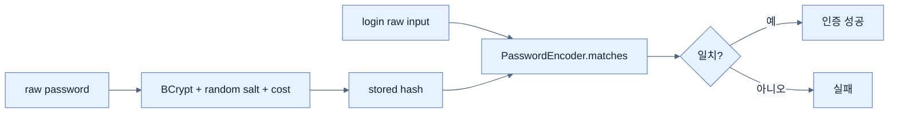

# 저장 데이터와 Password 보호

## 한눈에 보기

Password는 복호화 가능한 평문·일반 암호화로 저장하지 않고 `BCryptPasswordEncoder`로 salt가 포함된 adaptive one-way hash를 만들어 저장한다. 인증 때 입력 password를 같은 encoder의 `matches` 의미로 검증한다.

## 1. 왜 이게 필요한가

DB·backup이 유출되더라도 저장값에서 원문 password를 바로 얻지 못하게 해야 한다. 많은 사용자가 다른 서비스에서 password를 재사용하므로 한 DB의 평문 유출은 외부 계정까지 위험하게 한다.

## 2. 어떻게 동작하는가

1. `PasswordEncoder` Bean으로 BCrypt 구현을 선택한다.
2. 계정 생성·변경 경계에서 `encoder.encode(rawPassword)`를 한 번 수행한다.
3. DB에는 hash, salt, cost 정보가 담긴 인코딩 문자열만 저장한다.
4. 로그인 시 Spring Security가 raw 입력과 저장 hash를 encoder로 비교한다.
5. 향후 cost를 높일 때 성공 로그인 후 재해시하는 migration 전략을 둘 수 있다.

Hash는 지문과 비슷해 원문을 되돌리는 기능이 없다. 그러나 약한 password 자체, credential stuffing, 로그·메모리 노출, 무제한 로그인 시도까지 막지는 않으므로 MFA·rate limit·secret redaction 같은 층이 추가로 필요하다.

## 3. 그림으로 보기

## 4. 이 노트에 나온 용어

- **data at rest**: DB, 파일, backup 같은 persistent storage에 머무는 데이터.
- **salt**: 같은 password도 다른 hash가 나오게 하는 임의 값.
- **work factor**: hash 계산 비용을 조절해 brute-force를 늦추는 값.
- **BCrypt**: salt와 조정 가능한 비용을 포함한 password hashing 알고리즘.

## 7. 연결

- [[03-using-spring-data-backed-users]] — password hash를 저장·조회할 계정 모델이다.
- [[09-securing-data-in-transit-with-tls-and-ssl-bundles]] — 입력 password의 이동 구간도 TLS가 보호한다.
- [[02-adding-spring-security-and-custom-users]] — 데모용 default encoder를 교체한다.

## 8. 스스로 확인

- 전체 1차 정리 후: password 인증에서 복호화가 필요 없는 이유를 설명한다.

<!-- ==== 아래는 내 영역 · 스킬 수정 금지 ==== -->

## 내 설명 시도

## 막혔던 지점

## 리뷰 이력

