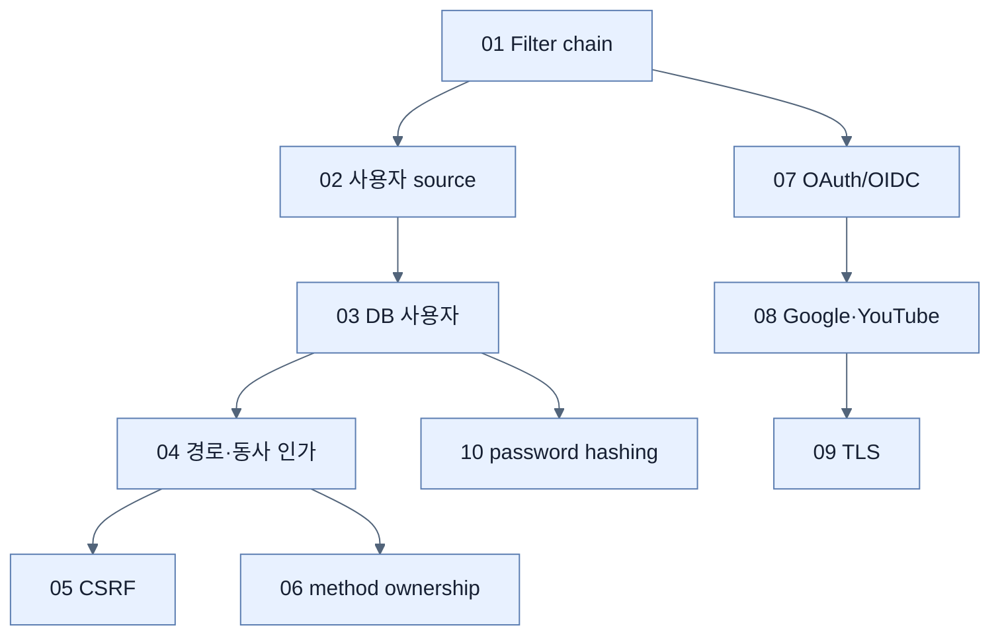

# Chapter 4 지도 — Securing an Application

## 보호 대상 축

| 대상 | 주된 위협 | 방어 경계 |
|---|---|---|
| 요청자 identity | credential 위조 | 인증 filter·UserDetails/OIDC |
| URL·행동 | 과도한 권한 | request authorization |
| 브라우저 상태 변경 | CSRF | token 검증 |
| 개별 데이터 | 타 사용자 자원 접근 | method security·ownership |
| 이동 데이터 | 도청·변조 | TLS·certificate |
| 저장 password | DB 유출 | BCrypt hash |

## 핵심 원칙

인증, URL 인가, 객체 인가, 전송 보호, 저장 보호는 겹치는 층이다. 한 층이 다른 층을 대체하지 않는다.

