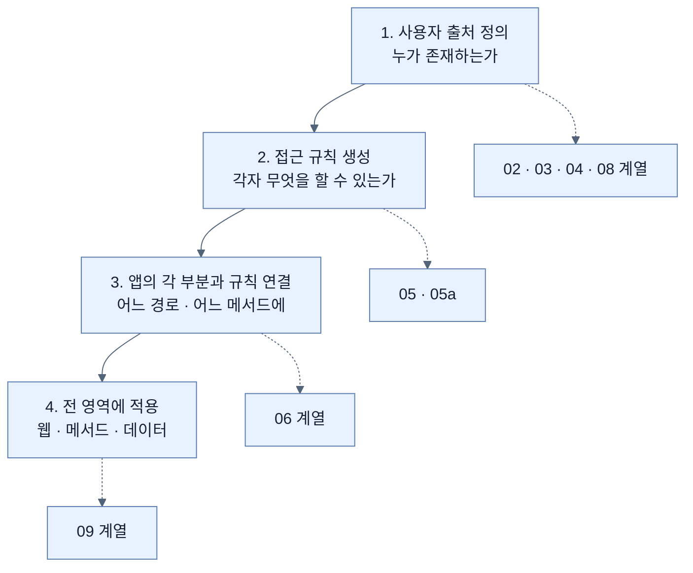
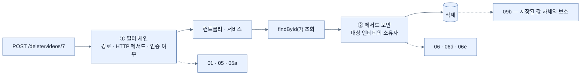
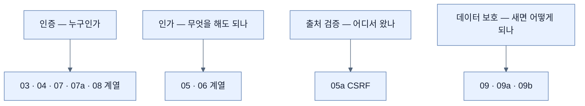
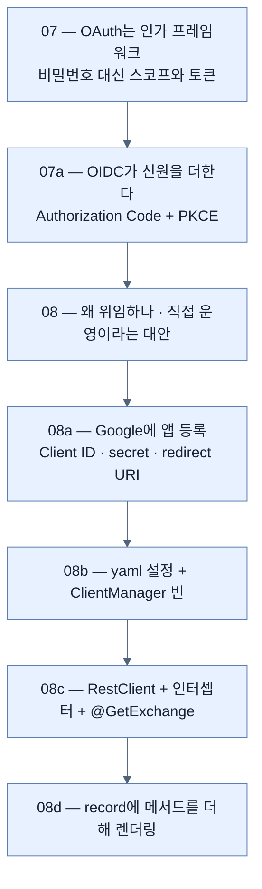

# Chapter 4 개념 지도 — Securing an Application with Spring Boot

> 책 pp. 97–151 / PDF pp. 122–176. 노트 23개, 용어 100개, 책 이미지 5개.
> 원문 커버리지는 [[_coverage]], 용어 정의는 [[_glossary]]에 있다.

이 장은 "무엇을 배웠는가"보다 **"검사하는 지점이 어떻게 안쪽으로 옮겨 가는가"**로 읽으면 구조가 한 번에 보인다. 아래 다섯 축은 같은 23개 노트를 서로 다른 방향에서 꿴 것이다.

---

## 축 1 — 보안의 네 단계 (책이 스스로 제시한 순서)

책은 [[03-creating-users-with-userdetailsservice]] 앞머리에서 "애플리케이션을 보안한다"는 일을 네 단계로 나눈다. 장 전체가 그 순서를 따른다.

| 단계 | 담당 노트 | 왜 이 순서인가 |
|---|---|---|
| 1. 사용자 출처 | [[02-adding-spring-security-to-the-project]] · [[03-creating-users-with-userdetailsservice]] · [[04-spring-data-backed-users]] | 존재하지 않는 사용자에게 권한을 줄 수 없다 |
| 2. 접근 규칙 | [[05-securing-web-routes-and-http-verbs]] · [[05a-to-csrf-or-not-to-csrf]] | 사용자 목록이 있어야 역할을 붙인다 |
| 3. 규칙 배치 | [[06-securing-spring-data-methods]] 이하 7개 | 규칙이 있어야 배치할 수 있다 |
| 4. 전 영역 적용 | [[09-securing-data-in-transit]] · [[09a-introducing-ssl-bundles]] · [[09b-securing-data-at-rest]] | 한 군데라도 빠지면 우회로가 된다 |

---

## 축 2 — 검사 지점이 안쪽으로 옮겨 간다

이 장에서 **같은 요청이 세 번 검사된다.** 각 검사는 앞 검사가 볼 수 없는 것을 본다.

| 검사 지점 | 볼 수 있는 것 | 볼 수 없는 것 | 대표 노트 |
|---|---|---|---|
| ① 필터 체인 | 경로, HTTP 메서드, 현재 사용자, CSRF 토큰 | **대상 데이터의 소유자** | [[01-spring-security-filter-chain-foundations]] |
| ② 메서드 보안 | 위에 더해 **호출 인자와 대상 객체** | 아직 조회되지 않은 것 | [[06d-locking-down-access-to-the-owner]] |
| ③ 저장·전송 | 데이터 자체 | 요청의 맥락 | [[09b-securing-data-at-rest]] |

**핵심 긴장.** ①은 빠르고 정책이 한곳에 모이지만 데이터를 못 본다. ②는 데이터를 보지만 조회가 먼저 일어나야 하고 정책이 흩어진다. 그래서 **둘 다 쓴다** — [[06-securing-spring-data-methods]]가 이 판단 기준을 정리한다.

---

## 축 3 — 사용자가 어디에서 오는가 (같은 계약, 다른 구현)

[[03-creating-users-with-userdetailsservice]]가 세운 `UserDetailsService` 계약 하나로 이 장의 네 단계가 전부 표현된다.

| 단계 | 사용자 위치 | 비밀번호 보관 주체 | 재시작에 견디나 | 노트 |
|---|---|---|---|---|
| 자동 설정 임시 사용자 | 메모리(랜덤) | 우리 · 평문 · 콘솔 출력 | 아니오 | [[02-adding-spring-security-to-the-project]] |
| `InMemoryUserDetailsManager` | 메모리(고정) | 우리 · 평문 | 값은 유지, 데이터는 휘발 | [[03-creating-users-with-userdetailsservice]] |
| JPA 리포지토리 | 우리 DB | 우리 · 평문 → **BCrypt** | 예 | [[04-spring-data-backed-users]] → [[09b-securing-data-at-rest]] |
| Google | Google | **Google** | 예 | [[08-leveraging-google-to-authenticate-users]] 이하 |

읽는 방법 하나. **오른쪽으로 갈수록 "우리가 보관하는 비밀"이 줄어든다.** 마지막 칸에서는 보관할 비밀번호가 아예 없어진다.

---

## 축 4 — 인증 · 인가 · 데이터 보호의 삼분

세 관심사는 각각 **다른 질문**에 답하며, 하나가 다른 하나를 대신하지 못한다.

| 관심사 | 답하는 질문 | 실패 시 코드 | 이것만으로 못 막는 것 |
|---|---|---|---|
| 인증 | 누구인가 | 401 / 로그인 화면 | 로그인한 사용자의 월권 |
| 인가 | 무엇을 해도 되나 | 403 | **위조된 요청** |
| CSRF 방어 | 어디서 출발했나 | 403 | 저장소 유출 |
| 전송 보안 | 중간에서 볼 수 있나 | (연결 실패) | DB 유출 |
| 저장 보안 | 유출돼도 읽히나 | — | 도청 |

[[05a-to-csrf-or-not-to-csrf]]가 이 표에서 특별한 자리를 차지한다. **인증·인가를 모두 통과하는 공격**이라 별도의 질문이 필요하다.

---

## 축 5 — OAuth 계열의 내부 구조

08 계열 다섯 노트는 "개념 → 등록 → 배선 → 호출 → 렌더링" 순서로 한 줄로 이어진다.

| 노트 | 이론이 코드로 나타나는 지점 |
|---|---|
| [[07a-oauth-vs-openid-connect]] → [[08b-adding-oauth-client-to-a-spring-boot-project]] | 세 흐름이 빌더의 `.authorizationCode()` · `.refreshToken()` · `.clientCredentials()` 세 줄로 |
| [[07-understanding-oauth-2-1]] → [[08b-adding-oauth-client-to-a-spring-boot-project]] | 스코프 개념이 `scope: openid,profile,email,youtube.readonly`로 |
| [[07a-oauth-vs-openid-connect]] → [[08a-creating-a-google-oauth-application]] | 인가 코드가 갈 곳을 미리 고정하는 것이 redirect URI 사전 등록으로 |
| [[07-understanding-oauth-2-1]] → [[08c-invoking-an-oauth-2-api-remotely]] | "토큰으로 API를 부른다"가 인터셉터 한 줄로 |
| 스코프 확장 → [[08d-creating-an-oauth2-powered-web-app]] | `youtube.readonly` 때문에 채널 선택 화면이 하나 더 뜬다 |

---

## 축 6 — 이 장이 남긴 원문의 오류와 공백

노트를 읽을 때 책과 다르게 적힌 부분이 나오면 이 표를 먼저 본다. 전체 목록은 [[_coverage]] 5절에 있다.

| 위치 | 원문 | 실제 | 노트 |
|---|---|---|---|
| p.108 | `loadUserByName` / `loadUserName()` | `loadUserByUsername(String)` | [[04-spring-data-backed-users]] |
| pp.112–113 | 규칙 6줄인데 설명 5개, `/admin` 규칙 누락 | — | [[05-securing-web-routes-and-http-verbs]] |
| p.115 | "마지막 줄 하나만 다르다" | `/admin` 규칙도 사라졌다 | [[05a-to-csrf-or-not-to-csrf]] |
| p.105 | `@ElementCollection List<GrantedAuthority>` | 인터페이스는 element collection 대상이 아니다 | [[04-spring-data-backed-users]] |
| pp.119–121 | `/delete/videos/**` 허용 규칙이 없다 | 앞 정책 그대로면 소유자도 403 | [[06c-adding-a-delete-button]] |
| pp.136·139 | `YouTube` 빈 등록 코드가 없다 | `@ImportHttpServices` 등이 필요 | [[08c-invoking-an-oauth-2-api-remotely]] |
| p.149 | `spring.ssl.bundle.pkcs12.*.key.store` | Boot 4.1 타입은 `jks`·`pem`, 키는 `keystore.location` | [[09a-introducing-ssl-bundles]] |
| p.148 | "`server.ssl.bundle` 아래에 정의한다" | 정의는 `spring.ssl.bundle.*`, 저건 참조 키 | [[09a-introducing-ssl-bundles]] |
| pp.140·142 | CSS는 `thead th`, 템플릿은 `<td>` | 열 너비 규칙이 적용되지 않는다 | [[08d-creating-an-oauth2-powered-web-app]] |
| p.136 | `&maxResults=<value>ℴ=<value>` | `&order=` — HTML 엔티티 조판 사고 | [[08c-invoking-an-oauth-2-api-remotely]] |

---

## 앞뒤 Chapter와의 연결

- **← Chapter 3** — [[../chapter-3-querying-for-data-with-spring-boot/_map|Querying for Data]]: `VideoEntity`·리포지토리·파생 질의가 이 장의 `UserAccount`와 `findByUsername`으로 그대로 재사용된다.
- **← Chapter 2** — [[../chapter-2-creating-web-and-api-applications-with-spring-boot/_map|Creating Web and API Applications]]: `@GetMapping`·Mustache·`@ImportHttpServices`가 [[08c-invoking-an-oauth-2-api-remotely]]의 `@GetExchange`와 짝을 이룬다.
- **→ Chapter 5** — [[../chapter-5-testing-with-spring-boot/_map|Testing with Spring Boot]]: 이 장에서 만든 규칙들의 **성공·실패 두 경로**를 `@WithMockUser`와 `csrf()`로 검증한다.
- **↔ Chapter 15** — [[../../part-7-whats-new-in-spring-boot-4/chapter-15-whats-new-in-spring-boot-4/_map|What's New in Spring Boot 4]]: `ServletWebSecurityAutoConfiguration`, `spring-boot-starter-security-oauth2-client` 개명 등 Boot 4의 모듈 재편이 이 장의 이름들에 반영돼 있다.

특히 **Chapter 5와의 짝**이 중요하다. [[05-securing-web-routes-and-http-verbs]]에서 책이 직접 말한다 — 직접 쓴 접근 규칙일수록 "통과해야 할 사람이 막히는" 실수와 "막혀야 할 사람이 통과하는" 실수가 동시에 가능하므로 테스트가 필수다. 그리고 [[06e-enabling-method-level-security]]의 조용한 실패는 **테스트 말고는 발견할 방법이 없다.**
