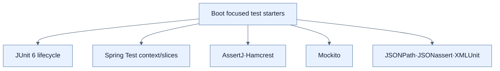

# JUnit 6과 세분화된 Test Starter

## 한눈에 보기

Spring Boot 4는 JUnit 6을 기본으로 사용하고, 하나의 거대한 test starter 대신 web, data, security, template 등 관심사별 테스트 지원을 더 명시적으로 나눈다. Spring Test, AssertJ, Mockito, JSONPath, JSONassert, XMLUnit 같은 도구를 Boot가 호환 조합으로 제공한다.

## 1. 왜 이게 필요한가

테스트 도구 버전을 개별 선택하면 실제 기능보다 설정 충돌에 시간을 쓴다. 반대로 모든 테스트 라이브러리를 무조건 넣으면 클래스패스와 자동 구성이 불투명해진다. 기능별 starter는 어떤 계층을 시험하는지 빌드 파일에 드러낸다.

## 2. 어떻게 동작하는가

Initializr가 선택한 application starter에 맞춰 관련 test dependency를 구성한다. JUnit이 lifecycle과 test discovery를, Spring Test/Boot Test가 application context와 slice를, AssertJ/Hamcrest가 assertion을, Mockito가 collaborator 대체를 담당한다. JUnit 5 테스트는 같은 programming model/package를 사용해 대부분 그대로 이동하지만 JUnit 4는 legacy로 별도 설정이 필요하다.

도구 상자는 테스트를 자동으로 잘 만들지는 않는다. 어떤 위험을 어떤 범위에서 검증할지 먼저 정하고 가장 작은 필요한 context를 선택해야 한다.

## 3. 그림으로 보기

## 4. 이 노트에 나온 용어

- **test starter**: 특정 application concern의 테스트 의존성을 묶은 Boot starter.
- **assertion**: 실제 결과가 기대 조건을 만족하는지 검증하는 표현.
- **mocking**: 실제 collaborator 대신 통제된 대역으로 호출·결과를 검증하는 기법.

## 7. 연결

- [[02-testing-domain-objects]] — 가장 작은 단위에서 JUnit과 AssertJ를 사용한다.
- [[03-testing-web-controllers-with-mockmvc]] — web test starter가 MVC slice를 제공한다.
- [[08-testing-security-policies]] — security test starter로 principal과 CSRF를 시뮬레이션한다.

## 8. 스스로 확인

- 전체 1차 정리 후: Boot 4가 테스트 지원을 관심사별 starter로 나눈 의도를 설명한다.

<!-- ==== 아래는 내 영역 · 스킬 수정 금지 ==== -->

## 내 설명 시도

## 막혔던 지점

## 리뷰 이력

