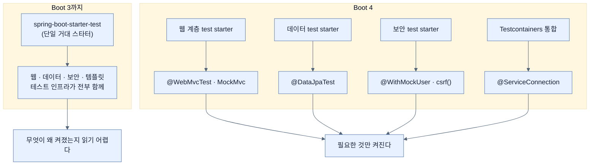

# 테스트 도구 갖추기 — 해야 할 일이 없는 이유

## 한눈에 보기

| 질문 | 핵심 답 |
|---|---|
| JUnit을 넣으려면? | **아무것도 안 해도 된다.** Initializr가 이미 넣었다. |
| Boot 4의 기본 프레임워크 | **JUnit 6** |
| Boot 3과 달라진 점 | 단일 거대 test starter → **관심사별 집중형 test starter** |
| 딸려 오는 도구 | 9종 — Spring Boot Test, Spring Test, JUnit 6, JSONPath, AssertJ, Hamcrest, JSONassert, XMLUnit, Mockito |
| JUnit 5 테스트는? | 대부분 **그대로 동작**한다 |
| JUnit 4는? | 레거시. 기본 미포함이며 쓰려면 명시적 설정이 필요하다 |

## 1. 왜 이게 필요한가

### 출발 장면: 첫 테스트를 쓰려는데 무엇부터 깔아야 하나

Chapter 4까지 만든 애플리케이션에 이제 테스트를 붙이려 한다. 다른 언어·프레임워크에서 오면 보통 이 순서를 밟는다.

1. 테스트 프레임워크를 고른다.
2. 단언 라이브러리를 고른다.
3. 모킹 라이브러리를 고른다.
4. 각각의 호환 버전을 찾아 빌드 파일에 적는다.
5. 서로 충돌하지 않는지 확인한다.

책이 던지는 질문이 그것이다 — **"JUnit을 우리 애플리케이션에 추가하려면 무엇이 필요한가?"**

그리고 답이 한 줄이다.

> **아무것도 필요 없다.**

### 여기서 뭐가 무너지나

"아무것도 안 해도 된다"가 왜 중요한지는 그 반대를 상상하면 안다. 위 다섯 단계를 매 프로젝트마다 밟는다면 무엇이 무너지는가.

1. **선택 자체가 마찰이 된다.** 무엇을 고를지 조사하는 시간이 첫 테스트를 쓰기 전에 소모된다.
2. **버전 조합이 또 하나의 위험이 된다.** [[../chapter-2-creating-web-and-api-applications-with-spring-boot/01-using-start-spring-io-to-build-apps|Chapter 2]]에서 본 그 문제가 테스트 영역에서 반복된다.
3. **가장 나쁜 결과 — 테스트를 안 쓰게 된다.** 마찰이 있으면 "나중에 하자"가 되고, 나중은 오지 않는다.

### 그래서 나온 생각

**테스트를 선택 사항이 아니라 기본값으로 만든다.** 책의 표현대로 Spring Initializr로 프로젝트를 만들거나 확장하면 Spring Boot가 **테스트의 토대를 자동으로 마련해 준다.** 그리고 이렇게 못 박는다.

> 우리는 올바른 테스트 키트를 찾아 헤맬 필요가 없고, **테스트를 하기로 선택할 필요조차 없다.** Spring Initializr가 우리가 기억해 내야 할 필요도 없이 그것들을 전부 넣어 준다.
>
> **테스트는 Spring 팀에게 일급 관심사다.**

다만 Boot 4에서 그 방식이 바뀌었다. 책의 서술 — 이 구성은 **더 이상 하나의 모든 것을 포괄하는 test starter를 중심으로 하지 않는다.** 대신 Spring Boot는 **각각 특정 애플리케이션 관심사에 맞춰진 집중형 [[테스트-스타터]]**(= 테스트에 필요한 도구 묶음을 하나의 좌표로 제공하는 스타터) 집합을 도입한다. 웹 계층 테스트, 데이터 접근 테스트, 보안 테스트, 템플릿 테스트가 각각 전용 스타터를 갖는다.

비유하자면 Boot 3까지의 방식은 **모든 공구가 들어 있는 대형 공구함 하나**였고, Boot 4는 **작업별 소형 공구함 여러 개**다. 배관 작업에는 배관 공구함만 들고 간다.

→ 비유가 깨지는 지점: 공구함은 안 쓰는 공구가 들어 있어도 **무겁기만 할 뿐** 작업 결과를 바꾸지 않는다. 하지만 테스트 의존성은 그렇지 않다 — 클래스패스에 올라온 라이브러리는 **자동 구성 조건을 켜고 테스트 컨텍스트에 빈을 추가한다.** 즉 무게가 아니라 **동작이 달라진다.** 이것이 Boot 4가 굳이 나눈 이유이며, 무게 비유로는 설명되지 않는 부분이다.

## 2. 어떻게 동작하는가

### 2.1 딸려 오는 아홉 가지

책은 Boot 4의 테스트 스타터들이 통틀어 제공하는 도구를 나열한다. 각각이 푸는 문제를 붙여 보면 왜 아홉 개나 되는지가 보인다.

| 도구 | 무엇을 하나 | 왜 필요한가 |
|---|---|---|
| **Spring Boot Test** | Boot 지향 테스트 유틸리티 | `@WebMvcTest`·`@DataJpaTest` 같은 슬라이스 애노테이션이 여기 있다 |
| **Spring Test** | 코어 Spring Framework 테스트 유틸리티 | 테스트용 애플리케이션 컨텍스트를 만들고 캐시한다 |
| **[[JUnit]]**(= Java에서 가장 널리 쓰이는 테스트 프레임워크) 6 | 테스트 케이스를 쓰는 초석 | 무엇이 테스트인지 표시하고 실행·보고한다 |
| **[[JSONPath]]**(= JSON 문서의 값을 경로 표현식으로 집어내는 질의 언어) | JSON 문서 질의 | 응답 전체가 아니라 **특정 필드만** 단언하기 위해 |
| **[[AssertJ]]**(= 점으로 이어 쓰는 유창한 단언 API 라이브러리) | 결과 단언 | `assertThat(x).isEqualTo(y)`처럼 읽히는 단언과 자세한 실패 메시지 |
| **[[Hamcrest]]**(= matcher 객체를 조합해 조건을 표현하는 라이브러리) | matcher 모음 | `containsString(...)`처럼 **조건을 값으로 넘겨야 하는** API에서 |
| **[[JSONassert]]**(= 키 순서·공백 차이를 무시하고 JSON을 의미 단위로 비교하는 라이브러리) | JSON 단언 | 문자열 비교로는 무의미한 차이에 걸리기 때문 |
| **[[XMLUnit]]**(= XML 문서를 구조 단위로 비교·검증하는 도구) | XML 검증 | JSON 쪽 JSONassert의 XML 대응 |
| **[[Mockito]]**(= Java에서 가장 널리 쓰이는 모킹 프레임워크) | 모킹 | 협력자를 가짜로 바꿔 대상만 격리하기 위해 |

책은 여기서 **[[모킹]]**(= 협력 객체를 가짜로 바꾸고 결과가 아니라 어떤 메서드가 불렸는지를 검증하는 방식)이 처음이라면 이렇게 이해하라고 덧붙인다 — **결과를 확인하는 대신 호출된 메서드를 검증하는** 형태의 테스트다. 실제 사용은 [[04-testing-services-with-mocks]]에서 본다.

아홉 개가 **역할이 겹치지 않는다**는 점이 중요하다. AssertJ와 Hamcrest가 둘 다 있는 것이 중복처럼 보이지만, AssertJ는 "값을 받아 점으로 잇는" 문체이고 Hamcrest는 "조건을 객체로 만들어 넘기는" 문체다. MockMvc의 `content().string(containsString(...))`처럼 **조건을 인자로 요구하는 API**에서는 Hamcrest가 필요하다.

책도 범위를 정직하게 긋는다 — 이 장에서 아홉 개를 전부 쓰지는 않지만 기능의 단면은 두루 보게 된다.

### 2.2 JUnit 6이 기본이라는 것의 의미

> **Tip (책 p.155)**: Spring Boot 4는 기본으로 **JUnit 6**을 쓴다. **JUnit 5용으로 작성된 대부분의 테스트는 수정 없이 계속 동작한다** — JUnit 6이 같은 프로그래밍 모델과 패키지 구조를 유지하기 때문이다. 반면 **JUnit 4는 레거시로 간주된다.** Spring Boot 4에는 기본으로 포함되지 않으며, 필요하면 명시적으로 설정해야 한다.

이 Tip이 담고 있는 정보는 셋이다.

| 버전 | Boot 4에서의 위치 | 옮기는 비용 |
|---|---|---|
| JUnit 6 | **기본** | — |
| JUnit 5 | 사실상 호환 | **거의 없음** (같은 애노테이션·패키지) |
| JUnit 4 | 레거시, 기본 미포함 | 명시적 의존성 선언 필요. `org.junit.Test`와 `org.junit.jupiter.api.Test`는 다른 타입이라 import부터 바뀐다 |

"같은 프로그래밍 모델과 패키지 구조를 유지한다"가 두 번째 줄의 근거다. JUnit 4 → 5 전환이 아팠던 이유가 정확히 그 반대였기 때문이다 — 패키지가 통째로 바뀌고 `@Before`가 `@BeforeEach`가 됐다. JUnit 5 → 6은 그런 종류의 이동이 아니다.

### 2.3 집중형 스타터가 실제로 무엇을 바꾸나

책은 이 장에서 스타터 좌표를 직접 나열하지는 않지만, 관심사별로 나뉜다는 사실은 이후 절의 코드에서 드러난다.

| 이 장에서 쓰는 것 | 어느 관심사의 스타터가 필요한가 | 등장 노트 |
|---|---|---|
| `@WebMvcTest`, `MockMvc` | 웹 계층 테스트 | [[03-testing-web-controllers-with-mockmvc]] |
| `@DataJpaTest` | 데이터 접근 테스트 | [[05-testing-repositories-with-embedded-databases]] |
| `@WithMockUser`, `csrf()` | 보안 테스트 (Spring Security Test) | [[08-testing-security-policies]] |
| `@Testcontainers`, `@ServiceConnection` | Testcontainers 통합 | [[06-adding-testcontainers]] |

**[[의존성-scope]]**(= 의존성이 어느 단계에 필요한지 표시하는 Maven 값) 관점에서 이들은 전부 `test` scope다. 운영 산출물에는 들어가지 않는다는 뜻이며, 그래서 테스트 도구를 많이 넣는 것이 배포물을 무겁게 만들지는 않는다.

그렇다면 왜 나눴는가? §1의 비유가 깨지던 지점이 답이다 — **테스트 컨텍스트가 무엇을 켜는지가 달라지기** 때문이다. 웹 테스트에 데이터 접근 인프라까지 딸려 오면 테스트가 느려지고, 무엇이 왜 켜졌는지 읽기 어려워진다.

## 3. 그림으로 보기

### 하나의 공구함에서 여러 개로



### 아홉 도구의 역할 분담

```text
  [테스트를 실행하는 층]
    JUnit 6          — 무엇이 테스트인지 표시하고 순서·생명주기를 관리
    Spring Test      — 테스트용 애플리케이션 컨텍스트를 만들고 캐시
    Spring Boot Test — 슬라이스 애노테이션 (@WebMvcTest · @DataJpaTest …)

  [협력자를 다루는 층]
    Mockito          — 가짜 객체 생성 · 스텁 · 호출 검증

  [결과를 단언하는 층]
    AssertJ          — assertThat(값).isEqualTo(...)      "값을 받아 점으로 잇는다"
    Hamcrest         — containsString(...)                "조건을 객체로 만들어 넘긴다"
    JSONPath         — $.videos[0].name                   "JSON에서 한 부분만 집는다"
    JSONassert       — JSON 두 개를 의미 단위로 비교
    XMLUnit          — XML 두 개를 구조 단위로 비교

  ▶ AssertJ 와 Hamcrest 는 중복이 아니다.
    MockMvc 의 content().string(containsString("…")) 처럼
    조건을 인자로 요구하는 API 에서는 Hamcrest 문체가 필요하다.
```

## 4. 이 노트에 나온 용어

| 용어 | 한 줄 풀이 | 자세히 |
|---|---|---|
| JUnit | Java에서 가장 널리 쓰이는 테스트 프레임워크 | [[_glossary#JUnit]] |
| 테스트 스타터 | 테스트 도구 묶음을 한 좌표로 제공하는 스타터 | [[_glossary#테스트-스타터]] |
| 모킹 | 협력자를 가짜로 바꾸고 호출을 검증하는 방식 | [[_glossary#모킹]] |
| AssertJ | 점으로 이어 쓰는 유창한 단언 API | [[_glossary#AssertJ]] |
| Hamcrest | matcher 객체로 조건을 표현하는 라이브러리 | [[_glossary#Hamcrest]] |
| Mockito | Java의 대표적인 모킹 프레임워크 | [[_glossary#Mockito]] |
| JSONPath | JSON 값을 경로 표현식으로 집어내는 질의 언어 | [[_glossary#JSONPath]] |
| JSONassert | JSON을 의미 단위로 비교하는 단언 라이브러리 | [[_glossary#JSONassert]] |
| XMLUnit | XML을 구조 단위로 비교·검증하는 도구 | [[_glossary#XMLUnit]] |
| 의존성 scope | 의존성이 어느 단계에 필요한지 표시하는 Maven 값 | [[_glossary#의존성-scope]] |

## 5. 자주 헷갈리는 것

### AssertJ vs Hamcrest

**문체가 다르다.** AssertJ는 값을 받아 점으로 잇고(`assertThat(x).contains(...)`), Hamcrest는 조건을 객체로 만들어 넘긴다(`containsString(...)`). 조건을 **인자로 요구하는 API**를 만나면 Hamcrest다.

### 모킹 vs 스텁

이 장에서 계속 갈리는 구분이다. 지금은 "가짜로 바꾼다"까지만 알면 되고, 정확한 경계는 [[04-testing-services-with-mocks]]에서 다룬다.

### JUnit 5 → 6과 JUnit 4 → 5

같은 "메이저 버전 올리기"처럼 보이지만 비용이 완전히 다르다. 4 → 5는 패키지와 애노테이션이 통째로 바뀌었고, 5 → 6은 **모델과 패키지가 유지된다.**

### 테스트 도구가 많다 = 배포물이 무겁다

아니다. 전부 `test` scope라 운영 산출물에 안 들어간다. Boot 4가 스타터를 나눈 이유는 **무게가 아니라 테스트 컨텍스트가 무엇을 켜는가**다.

## 6. 언제 안 쓰나 / 경계

- 아홉 개가 전부 필요한 프로젝트는 드물다. JSON API가 없으면 JSONPath·JSONassert를 쓸 일이 없고, XML을 안 쓰면 XMLUnit도 마찬가지다. **있다는 것과 써야 한다는 것은 다르다.**
- 집중형 스타터는 **필요한 것을 안 넣으면 안 켜진다.** Boot 3에서 올라온 프로젝트가 "예전엔 되던 슬라이스 애노테이션이 없다"고 느끼는 원인이다.
- JUnit 4 기반 레거시 테스트를 가진 프로젝트는 이 장의 전제를 그대로 적용할 수 없다. 명시적 설정이 먼저 필요하다.
- 이 절은 도구가 **있다**는 것까지만 다룬다. 각 도구를 언제 쓰는지는 이후 일곱 절의 내용이다.

## 7. 연결

- [[02-testing-domain-objects]] — 여기서 갖춰진 JUnit과 AssertJ로 첫 테스트를 쓴다. 가장 안쪽 계층부터 시작한다.
- [[03-testing-web-controllers-with-mockmvc]] — 웹 계층 집중형 스타터가 주는 `@WebMvcTest`와 `MockMvc`를 쓴다.
- [[04-testing-services-with-mocks]] — 여기서 이름만 나온 모킹을 Mockito로 실제로 한다.

## 8. 스스로 확인

1. 테스트 도구를 매번 직접 고르고 맞춰야 한다면 무엇이 무너지는가? 가장 나쁜 결과는?
2. "테스트를 하기로 선택할 필요조차 없다"는 말이 설계 의도로서 무엇을 뜻하는가?
3. 공구함 비유가 깨지는 지점은 어디인가? 테스트 의존성이 무게 말고 무엇을 바꾸는가?
4. AssertJ와 Hamcrest가 둘 다 필요한 이유를 구체적인 API 예로 설명할 수 있는가?
5. JUnit 5 → 6이 4 → 5보다 훨씬 싼 이유는?
6. Boot 4가 test starter를 나눈 이유가 "배포물 크기"가 아닌 근거는?
7. 이 장에서 쓸 네 가지 관심사(웹·데이터·보안·컨테이너)를 각각 어떤 애노테이션이 대표하는가?

<!-- ==== 아래는 내 영역 · 스킬 수정 금지 ==== -->

## 내 설명 시도


## 막혔던 지점


## 리뷰 이력
