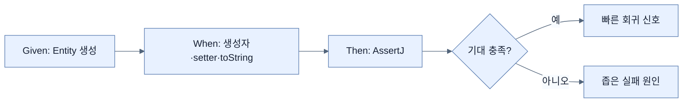

# 도메인 객체 테스트

## 한눈에 보기

`VideoEntity`를 Spring context 없이 직접 생성해 새 Entity의 null ID, field 값, setter mutation, `toString` 계약을 작은 JUnit test로 나눠 검증한다. AssertJ의 fluent assertion으로 기대를 읽기 좋게 표현한다.

## 1. 왜 이게 필요한가

도메인 타입은 controller·service·repository의 공통 기반이다. 단순해 보여도 생성 규칙과 값 표현이 깨지면 여러 계층이 함께 흔들린다. 외부 collaborator 없이 빠른 unit test를 두면 편집할 때마다 회귀를 즉시 확인할 수 있다.

## 2. 어떻게 동작하는가

테스트 method 이름은 `newVideoEntityShouldHaveNullId`처럼 상황과 기대를 문서화한다. 하나의 method가 한 행동에 집중하면 첫 실패가 다른 검증을 가리지 않는다. `assertThat(actual).isEqualTo(...)`, `isNull()`로 상태를 확인한다. coverage는 실행되지 않은 line을 보여주는 탐색 도구지만 높은 percentage가 중요한 behavior와 edge case를 검증했다는 뜻은 아니다.

Unit test는 부품을 작업대에서 검사하는 것과 같다. 빠르고 원인을 찾기 쉽지만 DB mapping, transaction, framework proxy와 결합했을 때의 문제는 보지 못한다.

## 3. 그림으로 보기

## 4. 이 노트에 나온 용어

- **unit test**: 한 논리 단위를 외부 시스템과 격리해 검증하는 빠른 테스트.
- **test isolation**: 한 테스트의 상태·실패가 다른 테스트에 영향을 주지 않는 성질.
- **code coverage**: 테스트 실행 중 지나간 코드 위치를 측정한 지표.

## 7. 연결

- [[04-testing-services-with-mocks]] — collaborator가 있는 service를 unit-test 범위로 유지한다.
- [[05-testing-repositories-with-embedded-databases]] — Entity가 실제 JPA와 결합하는 behavior를 검증한다.

## 8. 스스로 확인

- 전체 1차 정리 후: coverage 100%가 올바른 테스트 집합을 보장하지 않는 이유를 설명한다.

<!-- ==== 아래는 내 영역 · 스킬 수정 금지 ==== -->

## 내 설명 시도

## 막혔던 지점

## 리뷰 이력

