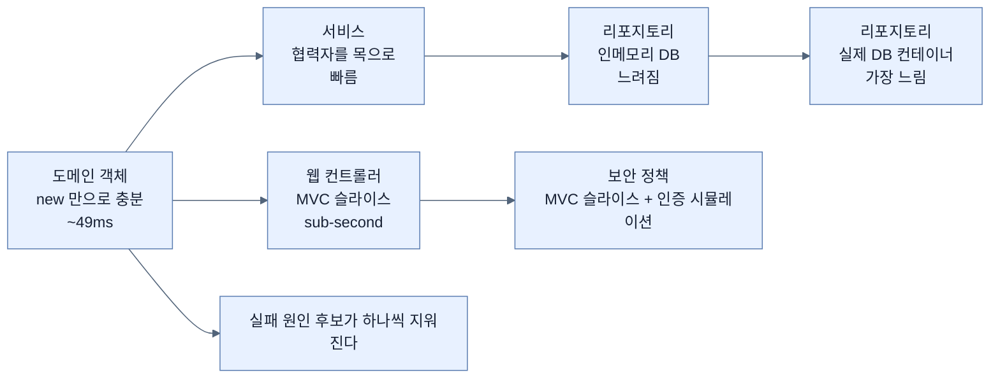

# 도메인 객체 테스트 — 가장 안쪽부터 시작하는 이유

## 한눈에 보기

| 질문 | 핵심 답 |
|---|---|
| 왜 도메인 객체부터인가 | 컨트롤러·서비스·리포지토리가 **전부 그 위에 얹히기** 때문이다 |
| 테스트 클래스 이름 | 관례상 `…Test`. `…UnitTest`·`…IntegrationTest`로 구분하기도 한다 |
| 메서드 이름 | 기술적 요구가 아니라 **정보를 담을 기회**다. `should`를 넣는다 |
| 단언 도구 | AssertJ의 `assertThat(값).isNull()` / `.isEqualTo(...)` |
| 왜 테스트를 잘게 쪼개나 | **한 실패가 다른 실패를 가리지 않게** 하기 위해 |
| 커버리지가 말해 주는 것 | "실행됐다"까지. **"검증됐다"는 아니다** |
| 실행 시간 | 이 테스트는 약 **49밀리초**. 자주 돌릴 수 있다는 뜻이다 |

## 1. 왜 이게 필요한가

### 출발 장면: 어디부터 테스트할 것인가

[[01-junit-6-and-focused-test-starters]]에서 도구는 이미 갖춰졌다. 그런데 애플리케이션에는 컨트롤러도, 서비스도, 리포지토리도, 보안 설정도 있다. 어디부터 손대야 하나?

직관은 "가장 중요한 것부터"라고 말하고, 대개 그것은 웹 화면이나 API처럼 **눈에 보이는 것**이다. 책은 다른 곳을 가리킨다.

> 어떤 애플리케이션에서든 가장 결정적인 테스트 지점 중 하나는 **[[도메인-모델]]**(= 시스템의 핵심 업무 개념을 나타내는 클래스들), 즉 시스템의 핵심 비즈니스 개념을 표현하는 클래스들이다. **단순해 보일 때조차** 도메인 객체는 컨트롤러, 서비스, 리포지토리의 **기반**이다.

### 여기서 뭐가 무너지나

도메인 객체를 건너뛰고 컨트롤러부터 테스트한다고 해 보자. 컨트롤러 테스트가 실패했다. 원인 후보가 몇 개인가?

```text
  컨트롤러 테스트 실패
        │
        ├─ 요청 매핑이 틀렸나?
        ├─ 보안 정책에 막혔나?
        ├─ 서비스 호출이 잘못됐나?
        ├─ 리포지토리 쿼리가 틀렸나?
        └─ 도메인 객체의 생성자가 필드를 잘못 넣었나?   ← 이게 원인이어도 여기서는 안 보인다
```

가장 안쪽이 틀렸는데 가장 바깥에서 발견하면 **원인까지 거슬러 올라가는 데 시간이 든다.** 반대로 도메인 테스트가 먼저 통과해 있으면 그 후보가 목록에서 지워진다.

또 하나. 도메인 테스트는 **가장 싸다.** 이 절의 테스트는 49밀리초에 끝난다. 컨테이너도, 컨텍스트도 없이 그냥 `new`로 객체를 만들어 확인하기 때문이다.

### 그래서 나온 생각

**가장 안쪽에서 시작해 바깥으로 나간다.** 이 장 전체의 순서가 그렇다 — 도메인 → 컨트롤러 → 서비스 → 리포지토리 → 보안.

비유하자면 도메인 객체 테스트는 **건물의 기초 콘크리트 강도 시험**이다. 위층이 전부 그 위에 얹히므로 가장 먼저, 가장 싸게 확인한다.

→ 비유가 깨지는 지점: 콘크리트 강도는 한 번 재면 그 값이 변하지 않는다. 하지만 도메인 객체는 **기능이 늘 때마다 바뀐다.** 실제로 이 장의 `VideoEntity`는 [[../chapter-3-querying-for-data-with-spring-boot/02a-entities-in-jpa|Chapter 3에서 만든 것]]과 이미 다르다 — Chapter 4에서 소유권 개념이 들어오면서 `username` 필드와 3-인자 생성자가 추가됐다. **한 번 하고 끝나는 검사가 아니라 코드와 함께 자라는 검사**이며, 그래서 책이 장 도입에서 "테스트는 결코 끝나지 않는다"고 말한 것이다.

## 2. 어떻게 동작하는가

### 2.1 첫 테스트 한 장

`VideoEntity`를 대상으로 시작한다.

```java
public class CoreDomainTest {
       @Test
       void newVideoEntityShouldHaveNullId() {
           VideoEntity entity = new VideoEntity("alice",
                "title", "description");
           assertThat(entity.getId()).isNull();
           assertThat(entity.getUsername()).isEqualTo("alice");
           assertThat(entity.getName()).isEqualTo("title");
           assertThat(entity.getDescription())
                .isEqualTo("description");
       }
}
```

책의 항목별 설명을 따라가되, 각 항목이 왜 그런지를 붙여 본다.

1. **`CoreDomainTest`** — 테스트 스위트의 이름이다. 관례상 테스트 스위트 클래스는 `Test`로 끝난다. 단위 테스트에 `UnitTest`, 통합 테스트에 `IntegrationTest` 같은 한정어를 붙이는 것도 드물지 않다. — **빌드 도구가 어떤 클래스를 테스트로 실행할지 이름 패턴으로 고르기 때문**이며, 동시에 사람이 목록만 보고 성격을 알게 하기 위해서다.
2. **`@Test`** — 이 메서드가 **[[테스트-케이스]]**(= 하나의 시나리오를 검증하는 테스트 메서드)임을 알리는 **[[JUnit]]**(= Java의 대표 테스트 프레임워크) 애노테이션이다. — 클래스 안의 모든 메서드를 실행할 수는 없으므로 표시가 필요하다.
3. **`newVideoEntityShouldHaveNullId`** — 메서드 이름이 **무엇을 검증하는지의 요지를 전달해야** 한다. 이것은 기술적 요구사항이 아니라 **정보를 담을 기회**다. 이 메서드는 `VideoEntity`를 새로 만들면 `id` 필드가 `null`이어야 함을 검증한다.
4. **`new VideoEntity("alice", "title", "description")`** — username, name, description을 주어 인스턴스를 만든다.
5. **`assertThat()`** — **[[AssertJ]]**(= 점으로 이어 쓰는 유창한 단언 API 라이브러리)가 제공하며, 값을 감싸 **[[유창한-API]]**(= 메서드가 자기 자신을 돌려주어 점으로 이어 쓰게 만든 문체)로 검증할 수 있게 한다.
6. **`isNull()`** — 엔티티의 `id`가 `null`임을 검증한다. **아직 영속화되지 않았으므로** 기대되는 값이다.
7. **`isEqualTo()`** — username·name·description이 생성자에 의해 올바로 할당됐음을 확인한다.

6번이 이 테스트의 진짜 내용이다. `id == null`은 그냥 초기값이 아니라 [[../chapter-3-querying-for-data-with-spring-boot/02a-entities-in-jpa|Chapter 3에서 본]] **"새 행을 만들라"는 신호**다. 그 계약이 깨지면 `save()`가 INSERT 대신 UPDATE를 낸다.

### 2.2 자주 돌릴 수 있다는 것

IDE에서 클래스를 우클릭해 실행하면 결과가 나온다. 책이 여기에 숫자를 하나 붙인다.

> 이 출력에서 잘려 나간 사실은, 이 테스트 케이스가 **약 49밀리초** 걸렸다는 것이다. **테스트를 자주 돌리는 것은 테스트 철학을 받아들이는 데 결정적이다.** 코드를 고칠 때마다 테스트 스위트를 돌려야 한다 — 가능하면 전부.

49밀리초라는 숫자가 왜 중요한가. **비용이 이 정도면 "고칠 때마다 돌린다"가 실제로 가능해지기** 때문이다. 테스트 한 번에 30초가 걸리면 사람은 돌리지 않게 되고, 돌리지 않는 테스트는 없는 것과 같다. 이 장 뒤에서 컨테이너를 띄우는 테스트가 나올 때 이 숫자와 대비된다 — [[07-testing-repositories-with-testcontainers]].

### 2.3 공개 메서드는 전부 대상이다 — `toString()`도

책이 원칙을 확장한다 — 공개된 메서드는 테스트해야 한다고 했으니, 도메인 클래스의 `toString()`도 여기 포함된다.

```java
@Test
void toStringShouldAlsoBeTested() {
     VideoEntity entity = new VideoEntity("alice", "title", "description");
     assertThat(entity.toString())
         .isEqualTo("VideoEntity{id=null, username='alice', name='title', description='description'}");
}
```

메서드 이름에 대한 책의 설명이 여기서 더 구체적이다 — 테스트 메서드 이름은 **의도를 분명히 표현해야** 하며, **`should`라는 단어를 넣으면 기대 동작을 전달하는 데 도움이 된다.**

`should`가 하는 일은 문법 장식이 아니다. 이름이 **명세 문장**이 되게 한다.

```text
  toStringShouldAlsoBeTested
  → "toString 도 테스트되어야 한다"

  newVideoEntityShouldHaveNullId
  → "새 VideoEntity 는 null id 를 가져야 한다"

  ▶ 실패 목록만 봐도 "무엇이 지켜지지 않았는가"가 읽힌다.
  ▶ 반대로 testToString1 같은 이름은 실패했을 때 코드를 열어 봐야 한다.
```

### 2.4 왜 한 메서드에 몰아넣지 않는가

> **Note (책 p.159)**: 이 테스트 메서드의 단언은 앞 테스트 메서드에 넣어도 될 법하다. 어차피 둘 다 같은 `VideoEntity`를 쓴다. 그런데 왜 별도 메서드로 쪼개는가? **엔티티의 `toString()`을 테스트한다는 의도를 아주 분명히 담기 위해서다.** 앞 테스트 메서드는 생성자로 엔티티를 채우고 getter를 확인하는 데 초점이 있다. `toString()`은 별개의 메서드다. **단언을 더 작은 테스트 메서드들로 쪼개면, 한 실패가 다른 실패를 가릴 가능성이 줄어든다.**

마지막 문장이 기술적 근거다. JUnit은 **첫 단언이 실패하면 그 메서드를 거기서 중단한다.**

```text
[한 메서드에 몰아넣었을 때]

  @Test void everything() {
      assertThat(entity.getId()).isNull();          ← 여기서 실패하면
      assertThat(entity.getUsername())...;          ← 이 아래는 실행되지 않는다
      assertThat(entity.toString())...;             ← toString 이 깨졌는지 알 수 없다
  }
  ▶ 실패 1건으로 보고되지만, 실제로 몇 개가 깨졌는지는 모른다


[쪼갰을 때]

  @Test void newVideoEntityShouldHaveNullId()  → 실패
  @Test void toStringShouldAlsoBeTested()      → 실패
  @Test void settersShouldMutateState()        → 통과
  ▶ 무엇이 깨지고 무엇이 멀쩡한지 한 번에 보인다
```

### 2.5 상태 변경도 확인한다

```java
@Test
void settersShouldMutateState() {
       VideoEntity entity = new VideoEntity("alice", "title", "description");
       entity.setId(99L);
       entity.setName("new name");
       entity.setDescription("new desc");
       entity.setUsername("bob");
       assertThat(entity.getId()).isEqualTo(99L);
       assertThat(entity.getUsername()).isEqualTo("bob");
       assertThat(entity.getName()).isEqualTo("new name");
       assertThat(entity.getDescription()).isEqualTo("new desc");
}
```

같은 인스턴스를 만들고, setter를 전부 호출하고, 같은 AssertJ 단언으로 **상태가 제대로 바뀌었는지** 확인한다.

이 테스트가 존재하는 이유가 [[../chapter-3-querying-for-data-with-spring-boot/02a-entities-in-jpa|Chapter 3]]과 이어진다. 엔티티가 **가변이어야 하는 것은 JPA의 요구**였다. 그 가변성이 실제로 동작해야 변경 추적과 flush가 성립한다.

### 2.6 커버리지 — 무엇을 말해 주고 무엇을 말해 주지 않나

IntelliJ를 비롯한 최신 IDE는 **Run with Coverage**를 제공한다. 책의 설명 — 테스트 스위트를 실행하면서 **어떤 코드 줄이 실제로 실행됐는지 측정**한다. IntelliJ에서는 커버된 줄이 **초록**, 커버되지 않은 줄이 **빨강**으로 강조되어 테스트의 빈틈을 찾는 데 도움을 준다.

그리고 결과를 짚는다 — `VideoEntity` 클래스가 **protected 무인자 생성자만 빼고 전부 커버**됐으며, 그 생성자를 검증하는 테스트를 쓰는 것은 독자의 연습 과제로 남긴다.

![[_assets/lsb4-p186-fig5-4-intellij-coverage-highlighting.png]]
> 출처: *Learning Spring Boot 4*, p.161 (Figure 5.4)

이 화면에서 읽을 것이 셋이다.

1. **왼쪽 gutter의 색.** 16행 `this(username: null, name: null, description: null);`만 빨강이고 19–38행의 생성자·getter·setter는 초록이다. 서술과 정확히 일치한다.
2. **오른쪽 Coverage 패널.** `VideoEntity`가 선택돼 있고 같은 패키지의 다른 클래스들(`HomeController`, `SecurityConfig`, `VideoService`, `UserAccount` …)이 나열된다. **이 테스트는 도메인 클래스 하나만 건드렸다**는 사실이 목록으로 드러난다.
3. **`VideoEntity`의 실제 모양.** `id`·`username`·`name`·`description` 네 필드와 `protected` 무인자 생성자, 3-인자 생성자 — §1에서 말한 Chapter 3판과의 차이가 여기 보인다.

**[[테스트-커버리지]]**(= 테스트 실행 중 실제로 실행된 코드의 비율)에는 반드시 붙여 둘 경계가 있다. 커버리지는 **"이 줄이 실행됐다"만 말한다.** **[[단언]]**(= 기대와 실제를 비교해 다르면 실패시키는 문장)이 하나도 없는 테스트도 100% 커버리지를 낼 수 있다.

```text
  @Test
  void 아무것도검증하지않는테스트() {
      VideoEntity e = new VideoEntity("a", "b", "c");
      e.getId(); e.getName(); e.getUsername(); e.getDescription();
      e.toString();
      // 단언 없음
  }
  ▶ 커버리지: 초록 (전부 실행됨)
  ▶ 검증된 것: 없음 (예외만 안 나면 통과)

  ▶ 커버리지는 "테스트가 닿지 않은 곳"을 찾는 데 좋다.
  ▶ "테스트가 충분하다"의 근거로 쓰면 틀린다.
```

책이 protected 생성자를 "연습 과제"로 남긴 것도 이 맥락에서 읽을 값이 있다 — **빨간 줄이 하나 있다는 사실 자체가 정보**이고, 그것을 채울지 말지는 그 코드가 무엇인지에 달렸다.

## 3. 그림으로 보기

### 안쪽에서 바깥으로 — 이 장의 순서



바깥으로 갈수록 **현실에 가까워지고 대신 느려진다.** 안쪽 테스트가 통과해 있으면 바깥 테스트가 실패했을 때 원인 후보가 줄어든다.

### 테스트 이름이 하는 일

| 이름 | 실패 목록에서 읽히는 것 |
|---|---|
| `testEntity1` | 아무것도. 코드를 열어야 한다 |
| `testToString` | 대상은 알겠으나 **무엇이 기대인지**는 모른다 |
| `toStringShouldAlsoBeTested` | "toString도 검증 대상이다"라는 의도 |
| `newVideoEntityShouldHaveNullId` | **기대 동작 전체**가 문장으로 읽힌다 |

## 4. 이 노트에 나온 용어

| 용어 | 한 줄 풀이 | 자세히 |
|---|---|---|
| 도메인 모델 | 시스템의 핵심 업무 개념을 나타내는 클래스들 | [[_glossary#도메인-모델]] |
| 테스트 케이스 | 하나의 시나리오를 검증하는 테스트 메서드 | [[_glossary#테스트-케이스]] |
| 단언 | 기대와 실제를 비교해 다르면 실패시키는 문장 | [[_glossary#단언]] |
| AssertJ | 점으로 이어 쓰는 유창한 단언 API | [[_glossary#AssertJ]] |
| 유창한 API | 메서드가 자기 자신을 돌려주어 점으로 잇는 문체 | [[_glossary#유창한-API]] |
| JUnit | Java의 대표 테스트 프레임워크 | [[_glossary#JUnit]] |
| 테스트 커버리지 | 테스트 중 실제로 실행된 코드의 비율 | [[_glossary#테스트-커버리지]] |

## 5. 자주 헷갈리는 것

### 커버리지가 높다 = 테스트가 충분하다

**아니다.** 커버리지는 "실행됐다"만 센다. 단언 없는 테스트도 초록을 만든다. 커버리지는 **빈틈을 찾는 도구**이지 충분함의 증거가 아니다.

### 단언을 한 메서드에 모으면 효율적이다

실행은 빨라도 **정보가 줄어든다.** 첫 단언이 실패하면 나머지는 실행조차 되지 않으므로, 몇 개가 깨졌는지 알 수 없다.

### 도메인 객체는 단순하니 테스트할 게 없다

책이 정면으로 반박한다 — "단순해 보일 때조차 도메인 객체는 컨트롤러·서비스·리포지토리의 기반이다." 게다가 `id == null`처럼 **단순해 보이지만 계약인** 것들이 있다.

### `toString()`을 테스트하는 것은 과하다

이 장의 기준은 "공개 메서드는 테스트한다"이다. 다만 `toString()` 문자열을 정확히 단언하면 **포맷을 바꿀 때마다 테스트가 깨진다.** 로그·디버깅용이라면 이 테스트가 오히려 변경을 방해할 수 있다(§6).

## 6. 언제 안 쓰나 / 경계

- `toString()`의 **정확한 문자열**을 단언하는 것은 깨지기 쉬운 테스트다. 그 문자열이 계약이 아니라면(로그용이라면) 부분 일치나 핵심 필드 포함 여부로 완화하는 편이 낫다.
- 커버리지를 목표 숫자로 관리하면 **단언 없는 테스트를 양산하는 유인**이 생긴다. 도구는 그 차이를 구별하지 못한다.
- 이 절의 테스트는 전부 `new`로 객체를 만든다. Spring 컨텍스트도, 데이터베이스도 없다. 그래서 빠르지만 **객체들이 연결됐을 때의 동작은 아무것도 검증하지 않는다** — 그것이 이 장 나머지 절의 몫이다.
- getter/setter를 기계적으로 전부 테스트하는 것은 값이 낮을 수 있다. 이 장이 그렇게 하는 것은 **테스트 작성 방법을 보여 주기 위한 교재적 선택**으로 읽는 편이 맞다.

## 7. 연결

- [[01-junit-6-and-focused-test-starters]] — 여기서 쓰는 `@Test`와 `assertThat`이 그 절에서 갖춰진 도구다.
- [[03-testing-web-controllers-with-mockmvc]] — 한 계층 바깥으로 나간다. `new`만으로는 안 되고 Spring MVC 기계가 필요해지는 지점이다.
- [[04-testing-services-with-mocks]] — 협력자가 있는 클래스를 테스트할 때 무엇이 달라지는지 다룬다.

## 8. 스스로 확인

1. 컨트롤러부터 테스트하면 실패했을 때 무엇이 곤란해지는가? 원인 후보를 나열해 보라.
2. 콘크리트 강도 시험 비유가 깨지는 지점은 어디인가? 이 장의 `VideoEntity`가 그 증거인 이유는?
3. `assertThat(entity.getId()).isNull()`이 검증하는 것이 단순한 초기값이 아닌 이유는?
4. 49밀리초라는 숫자가 왜 중요한가?
5. 테스트 이름에 `should`를 넣는 것이 실패 목록에서 어떤 차이를 만드는가?
6. 단언을 여러 메서드로 쪼개는 기술적 근거는 무엇인가? JUnit의 어떤 동작 때문인가?
7. 단언이 하나도 없는 테스트가 100% 커버리지를 낼 수 있는 이유를 설명할 수 있는가?
8. 커버리지를 목표 숫자로 관리하면 어떤 유인이 생기는가?

<!-- ==== 아래는 내 영역 · 스킬 수정 금지 ==== -->

## 내 설명 시도


## 막혔던 지점


## 리뷰 이력
