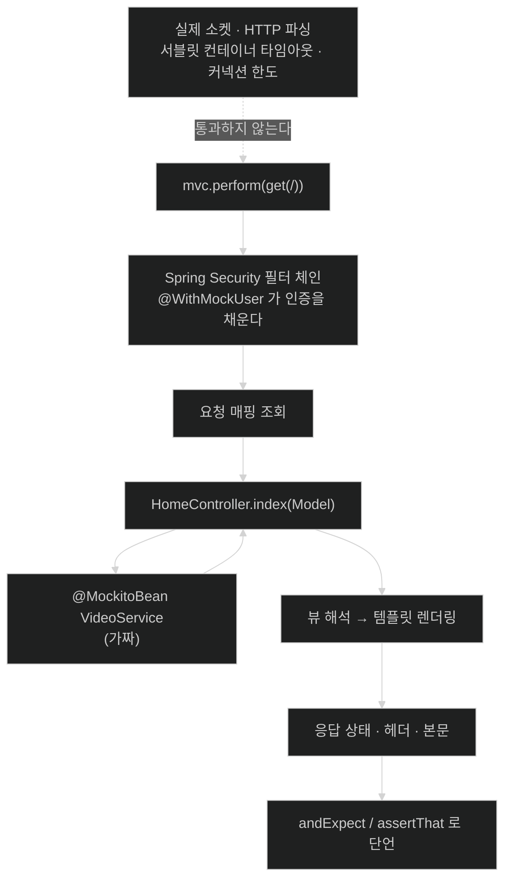

# MockMvc로 웹 컨트롤러 테스트 — 서버 없이 MVC 기계 통과시키기

## 한눈에 보기

| 질문 | 핵심 답 |
|---|---|
| 컨트롤러를 `new`로 만들어 부르면? | **투박하다.** 그리고 Spring MVC 기계를 건너뛴다 |
| 그래서 필요한 것 | 웹 호출을 만들어 넣고 응답을 기다릴 방법 |
| 도구 | `@WebMvcTest` 슬라이스 + `MockMvc` |
| 협력자는? | `@MockitoBean`으로 가짜를 컨텍스트에 넣는다 |
| 보안은? | `@WebMvcTest`는 **보안 정책을 켠 채로** 온다. `@WithMockUser`로 통과 |
| Boot 4 변경 | `@WebMvcTest` import 경로 변경, `@MockBean` → **`@MockitoBean`** |
| 검증 두 방향 | 응답 내용 단언(상태) + `verify()`로 호출 확인(행위) |

## 1. 왜 이게 필요한가

### 출발 장면: 컨트롤러를 그냥 불러 보면 안 되나

[[02-testing-domain-objects]]에서는 `new VideoEntity(...)`로 충분했다. 컨트롤러도 같은 방식이면 좋겠다.

```java
HomeController controller = new HomeController(videoService);
String viewName = controller.index(model);
assertThat(viewName).isEqualTo("index");
```

컴파일되고 실행된다. 그런데 이 테스트가 검증하지 **못하는** 것이 무엇인지 세어 보자.

### 여기서 뭐가 무너지나

책의 진단이 두 부분이다.

> Spring MVC 웹 컨트롤러를 인스턴스화해서 여러 단언으로 캐물을 수도 있겠지만, **이건 투박해진다.** 그리고 우리가 원하는 것의 일부는 **Spring MVC의 기계를 통과하는 것**이다. 본질적으로 우리는 **웹 호출을 만들고 컨트롤러가 응답하기를 기다려야** 한다.

"기계를 통과한다"가 무엇을 뜻하는지 구체적으로 보면 이렇다.

| 직접 호출로는 검증 안 되는 것 | 왜 |
|---|---|
| `@GetMapping("/")`이 실제로 그 경로에 매핑되는가 | 메서드를 직접 부르면 매핑을 안 거친다 |
| HTTP 상태 코드가 200인가 | 반환값은 뷰 이름 문자열일 뿐이다 |
| 뷰 이름이 실제 HTML로 렌더링되는가 | 템플릿 엔진을 안 거친다 |
| 보안 정책이 이 경로를 막는가 | 필터 체인을 안 거친다 |
| 폼 파라미터가 객체로 바인딩되는가 | 인자를 내가 직접 만들어 넘겼다 |
| `redirect:/`가 302로 나가는가 | 문자열 비교로 끝난다 |

즉 **애노테이션이 하는 일 전부가 검증 밖에 있다.** [[../chapter-2-creating-web-and-api-applications-with-spring-boot/02-creating-a-spring-mvc-web-controller|Chapter 2]]에서 "중요한 부분은 애노테이션이다"라고 했는데, 직접 호출은 정확히 그 부분을 건너뛴다.

### 그래서 나온 생각

**실제 서버를 띄우지 않되 Spring MVC의 요청 처리 경로는 그대로 통과시킨다.** 그것이 **[[MockMvc]]**(= 실제 서버 없이 Spring MVC의 요청 처리 기계를 그대로 통과시키는 테스트 도구)다.

비유하자면 MockMvc는 **비행 시뮬레이터**다. 진짜 비행기를 띄우지 않고도 조종간·계기·자동조종 같은 계통 전체를 그대로 거친다.

→ 비유가 깨지는 지점: 좋은 시뮬레이터는 공기역학까지 흉내 내지만, MockMvc는 **네트워크 계층을 아예 통과하지 않는다.** 실제 소켓 연결, HTTP 텍스트 파싱, 서블릿 컨테이너의 타임아웃·커넥션 한도·헤더 인코딩은 검증되지 않는다. 그래서 **MockMvc가 전부 통과해도 실제 배포에서 다르게 동작할 수 있다.** "서버를 안 띄운다"는 장점과 "서버를 안 띄운다"는 한계가 같은 사실이다.

## 2. 어떻게 동작하는가

### 2.1 테스트 클래스 골격

`src/test/java` 아래 `HomeController`와 **같은 패키지**에 `HomeControllerTest.java`를 만든다.

```java
@WebMvcTest(controllers = HomeController.class)
public class HomeControllerTest {
     @Autowired MockMvc mvc;
     @MockitoBean VideoService videoService;
     ...
}
```

세 줄이 각각 무엇을 하는지, 그리고 왜 필요한지 보자.

1. **`@WebMvcTest`** — Spring MVC의 기계를 켜는 Spring Boot 테스트 애노테이션이다. `controllers` 파라미터가 이 스위트를 **`HomeController` 하나로 제한**한다. — 애플리케이션의 모든 컨트롤러와 웹 인프라를 다 띄우면 느려지고, 실패 원인도 넓어지기 때문이다. 이것이 **[[테스트-슬라이스]]**(= 애플리케이션 전체가 아니라 특정 계층만 띄워 검증하는 테스트 구성)다.
2. **`@Autowired MockMvc mvc`** — 슬라이스가 `MockMvc` 인스턴스를 컨텍스트에 자동으로 제공하므로 주입만 하면 된다. — 요청을 만들어 넣을 진입점이 필요하기 때문이다.
3. **`@MockitoBean VideoService videoService`** — `HomeController`가 요구하는 협력자다. 이 애노테이션이 **가짜를 만들어 컨텍스트에 넣는다.** — 슬라이스는 웹 계층만 켜므로 진짜 `VideoService` 빈이 없고, 없으면 컨트롤러 생성 자체가 실패하기 때문이다.

3번이 **[[빈-오버라이드]]**(= 테스트 컨텍스트의 특정 빈을 가짜 객체로 갈아 끼우는 기능)이며, 뒤에 **[[Mockito]]**(= Java의 대표 모킹 프레임워크)가 있다.

> **Tip (책 p.163)**: Spring Boot 4에서 웹 MVC 테스트 애노테이션이 갱신됐다. `@WebMvcTest`는 이제 **`org.springframework.boot.webmvc.test.autoconfigure`**에서 import한다. 또 하나의 변경은 `@MockitoBean` 애노테이션인데, **`@MockBean`에서 이름이 바뀌었다.** Mockito를 쓴다는 사실을 명시하고, 그것이 **Spring 테스트 컨텍스트 안의 Mockito 기반 빈 오버라이드**임을 분명히 하기 위해서다.

이 Tip은 [[../../part-7-whats-new-in-spring-boot-4/chapter-15-whats-new-in-spring-boot-4/01-whats-new-in-spring-boot-4|Chapter 15]]에서 정리한 두 방향의 사례다 — import 경로 변경은 **모듈 세분화**의 결과이고, `@MockBean` → `@MockitoBean`은 Spring Framework의 공통 빈 오버라이드 모델로 옮겨 간 **벤더 중립·표준화** 쪽이다. 참고로 그 Chapter가 밝히듯 새 애노테이션은 테스트 클래스 필드에는 쓸 수 있지만 `@Configuration` 클래스에는 쓸 수 없다.

### 2.2 GET 요청 테스트

```java
@Test
@WithMockUser
void indexPageHasSeveralHtmlForms() throws Exception {
    String html = mvc.perform(
                    get("/"))
                    .andExpect(status().isOk())
                    .andExpect(
                        content().string(
                            containsString("Username: user")))
                    .andExpect(
                        content().string(
                            containsString("Authorities: [ROLE_USER]")))
                    .andReturn()
                    .getResponse().getContentAsString();
    assertThat(html).contains(
                    "<form action=\"/logout\"",
                    "<form action=\"/search\"",
                    "<form action=\"/new-video\"");
}
```

책의 항목별 설명이다.

- **`@Test`** — JUnit 6 테스트 케이스임을 표시한다.
- **`@WithMockUser`** — Spring Security Test의 애노테이션으로, 사용자 이름 `user`와 권한 `ROLE_USER`(기본값)로 **로그인한 사용자를 시뮬레이션**한다.
- **`mvc.perform(get("/"))`** — MockMvc로 루트 경로에 대한 HTTP GET 요청을 시뮬레이션한다.
- 이어지는 절들이 일련의 단언을 수행한다 — 결과가 HTTP 200인지, 내용에 사용자 이름 `user`와 권한 `ROLE_USER`가 들어 있는지. 그런 다음 응답 전체를 문자열로 받아 온다.
- MockMvc 호출 뒤에 **AssertJ 단언**이 이어져 HTML 출력의 일부를 검증한다.

여기서 눈여겨볼 것이 **한 메서드 안에 두 가지 단언 문체가 함께 있다**는 점이다.

```text
  .andExpect(content().string( containsString("Username: user") ))
                               └──────────┬──────────┘
                                   Hamcrest matcher
                            "조건을 객체로 만들어 인자로 넘긴다"
                            → andExpect 가 matcher 를 요구하기 때문

  assertThat(html).contains("<form action=\"/logout\"", ...)
  └────────┬───────┘
        AssertJ
  "값을 받아 점으로 잇는다"
  → 이미 문자열을 손에 넣은 뒤라 자유롭게 쓸 수 있다
```

[[01-junit-6-and-focused-test-starters]]에서 "**[[AssertJ]]**(= 값을 받아 점으로 잇는 단언 API)와 **[[Hamcrest]]**(= 조건을 matcher 객체로 표현하는 라이브러리)는 중복이 아니다"라고 한 이유가 이 코드에 그대로 있다.

`@WithMockUser`가 필요한 이유도 중요하다. **`@WebMvcTest`는 Spring Security 정책을 켠 채로 온다.** 이 애노테이션이 없으면 요청이 필터 체인에 막혀 200이 아니라 401이 나온다. **[[인증]]**(= 당신이 누구인지 증명하는 일)을 시뮬레이션해야 컨트롤러까지 도달한다. 이 성질을 정면으로 이용하는 것이 [[08-testing-security-policies]]다.

### 2.3 POST 요청 테스트 — 그리고 행위 검증

렌더링만 확인하는 것은 절반이다. 책의 표현대로 **폼을 제출해 새 비디오를 만드는 것이 이 웹 앱의 핵심 기능**이다.

```java
@Test
@WithMockUser
void postNewVideoShouldWork() throws Exception {
      mvc.perform(
          post("/new-video")
               .param("name", "new video")
               .param("description", "new desc")
               .with(csrf()))
          .andExpect(redirectedUrl("/"));
      verify(videoService).create(
          new NewVideo("new video", "new desc"),
          "user");
}
```

항목별로 보면 이렇다.

- **`post("/new-video")` + `.param(...)`** — 폼으로 보낼 두 필드를 준다.
- **`.with(csrf())`** — 웹 페이지가 **[[CSRF]]**(= 로그인한 사용자의 브라우저로 의도하지 않은 요청을 보내게 만드는 공격) 보호를 쓰므로, 올바른 CSRF 토큰을 자동으로 공급해 **공격이 아니라 정당한 요청임을 시뮬레이션**한다.
- **`redirectedUrl("/")`** — 컨트롤러가 **[[리다이렉트]]**(= 다른 URL로 다시 요청하라는 지시를 돌려주는 방식)를 발행하는지 검증한다.
- **`verify(videoService)`** — Mockito의 훅으로, 모킹된 `VideoService` 빈의 `create()` 메서드가 **MockMvc가 넣어 준 값과 `@WithMockUser`의 사용자 이름으로** 호출됐는지 확인한다.

마지막 줄이 앞의 테스트와 성격이 다르다. 앞에서는 **응답 내용**을 단언했지만 여기서는 **협력자가 어떻게 불렸는지**를 확인한다. 이것이 **[[행위-검증]]**(= 반환값 대신 어떤 메서드가 어떤 인자로 불렸는지 확인하는 방식)이며, 자세한 구분은 [[04-testing-services-with-mocks]]에서 다룬다.

왜 여기서는 행위 검증이 맞는가? **컨트롤러가 리다이렉트만 돌려주기 때문**이다. 응답 본문에는 저장이 실제로 일어났다는 증거가 없다. 그리고 `videoService`는 가짜이므로 진짜로 저장되지도 않는다. **"위임이 제대로 일어났는가"가 이 컨트롤러 메서드의 전부**이고, 그것을 확인할 방법은 `verify()`뿐이다.

### 2.4 이 방식이 주는 것

책이 결과를 요약한다 — 이 스크린샷은 컨트롤러의 메서드 두 개를 **1초 미만**에 성공적으로 실행했음을 보여 준다. 나머지 컨트롤러 메서드 테스트는 독자의 연습 과제다.

> 근본적인 컨트롤러 동작을 이렇게 빠르게 증명할 수 있다는 것은 결정적이다. 이는 모든 컨트롤러를 검증하는 테스트 체계를 세울 수 있게 해 준다. 그리고 **테스트를 많이 쓸수록 시스템에 대한 확신을 더 심을 수 있다.**

[[02-testing-domain-objects]]의 49밀리초와 대비하면 한 자릿수 느려졌지만 여전히 "고칠 때마다 돌린다"가 가능한 범위다. 이 숫자는 [[07-testing-repositories-with-testcontainers]]에서 다시 크게 달라진다.

## 3. 그림으로 보기

### 무엇을 통과하고 무엇을 통과하지 않는가



### 두 테스트가 검증하는 방향이 다르다

```text
[indexPageHasSeveralHtmlForms — 상태를 본다]

   요청 ──▶ 컨트롤러 ──▶ 템플릿 ──▶ 응답 본문
                                      │
                                      ▼
                            "이 HTML 안에 form 셋이 있는가"
                            → 결과물을 단언


[postNewVideoShouldWork — 행위를 본다]

   요청 ──▶ 컨트롤러 ──▶ videoService.create(...) 호출
                              │            │
                              │            └──▶ verify(videoService).create(...)
                              ▼                  "제대로 위임했는가"
                        302 리다이렉트
                              │
                              ▼
                        redirectedUrl("/")

  ▶ 응답에 저장 결과가 없고 서비스도 가짜이므로,
    "위임이 일어났는가"를 확인하는 것 말고 검증할 방법이 없다.
```

### 단언 문체가 갈리는 자리

| 자리 | 문체 | 이유 |
|---|---|---|
| `.andExpect(content().string(…))` | **Hamcrest** matcher | `andExpect`가 **조건 객체**를 인자로 요구한다 |
| `.andExpect(status().isOk())` | MockMvc 전용 matcher | 상태 코드 전용 헬퍼 |
| `assertThat(html).contains(…)` | **AssertJ** | 이미 문자열을 손에 넣은 뒤라 자유롭다 |
| `verify(videoService).create(…)` | **Mockito** | 값이 아니라 호출을 본다 |

## 4. 이 노트에 나온 용어

| 용어 | 한 줄 풀이 | 자세히 |
|---|---|---|
| MockMvc | 서버 없이 Spring MVC 처리 경로를 통과시키는 도구 | [[_glossary#MockMvc]] |
| 테스트 슬라이스 | 특정 계층만 띄워 검증하는 테스트 구성 | [[_glossary#테스트-슬라이스]] |
| 빈 오버라이드 | 컨텍스트의 특정 빈을 가짜로 갈아 끼우는 기능 | [[_glossary#빈-오버라이드]] |
| Mockito | Java의 대표 모킹 프레임워크 | [[_glossary#Mockito]] |
| CSRF | 사용자의 브라우저로 의도치 않은 요청을 보내게 하는 공격 | [[_glossary#CSRF]] |
| 리다이렉트 | 다른 URL로 다시 요청하라는 지시 | [[_glossary#리다이렉트]] |
| 행위 검증 | 어떤 메서드가 어떤 인자로 불렸는지 확인하는 방식 | [[_glossary#행위-검증]] |
| Hamcrest | 조건을 matcher 객체로 표현하는 라이브러리 | [[_glossary#Hamcrest]] |
| AssertJ | 값을 받아 점으로 잇는 단언 API | [[_glossary#AssertJ]] |
| 인증 | 당신이 누구인지 증명하는 일 | [[_glossary#인증]] |

## 5. 자주 헷갈리는 것

### MockMvc가 컨트롤러를 mock한다

**아니다.** 컨트롤러는 **진짜**다. mock되는 것은 **서블릿 컨테이너 쪽**이다. 이름 때문에 가장 자주 오해되는 지점이며, 그래서 `@MockitoBean VideoService`가 따로 필요하다 — 컨트롤러는 진짜라서 협력자를 요구한다.

### `@WebMvcTest`는 보안을 끈다

**켠다.** 그래서 `@WithMockUser` 없이 요청하면 401이 나온다. 이 성질을 몰라 "왜 200이 아니지?"로 헤매기 쉽다. 반대로 [[08-testing-security-policies]]는 이 성질을 그대로 이용한다.

### `@MockBean`과 `@MockitoBean`

Boot 4에서 **`@MockBean`은 제거됐다.** 이름만 바뀐 것이 아니라 Spring Framework의 빈 오버라이드 모델로 옮겨 갔고, `@Configuration` 클래스에는 못 쓴다는 제약이 붙는다.

### `.with(csrf())`가 CSRF를 끄는 것이다

반대다. **CSRF 보호를 켠 채로** 올바른 토큰을 공급하는 것이다. 끄는 것과 통과하는 것은 다르며, 이 차이는 [[08-testing-security-policies]]에서 다시 나온다.

### MockMvc가 통과하면 실제로도 동작한다

네트워크 계층을 안 거치므로 보장되지 않는다. 헤더 인코딩, 대용량 본문, 타임아웃, 프록시 앞단의 동작은 별개다.

## 6. 언제 안 쓰나 / 경계

- MockMvc는 **실제 서버를 띄우지 않는다.** 서블릿 컨테이너 자체의 동작이나 네트워크 관련 문제는 잡지 못한다. 그런 검증이 필요하면 `@SpringBootTest(webEnvironment = RANDOM_PORT)`와 실제 HTTP 클라이언트가 필요하다.
- `@WebMvcTest`는 웹 계층만 켠다. 데이터 접근 빈은 없으므로 **모든 협력자를 `@MockitoBean`으로 채워야** 하고, 협력자가 많으면 그 목록 자체가 부담이 된다.
- 응답 HTML 문자열을 통째로 단언하면 템플릿을 조금만 고쳐도 깨진다. 이 절의 예제가 `contains`로 **부분 일치**를 쓰는 이유다.
- Boot 4에서 `@SpringBootTest`는 더 이상 `MockMvc`를 자동 구성하지 않는다. 전체 컨텍스트 테스트에서 쓰려면 `@AutoConfigureMockMvc`를 명시해야 한다 — [[../../part-7-whats-new-in-spring-boot-4/chapter-15-whats-new-in-spring-boot-4/01-whats-new-in-spring-boot-4|Chapter 15]] 참고.

## 7. 연결

- [[02-testing-domain-objects]] — 한 계층 안쪽. 거기서는 `new`로 충분했지만 여기서는 MVC 기계가 필요해진다.
- [[04-testing-services-with-mocks]] — 여기서 `@MockitoBean`으로 가짜를 넣었던 `VideoService`가 그 절에서는 **테스트 대상**이 된다.
- [[08-testing-security-policies]] — `@WebMvcTest`가 보안 정책을 켜고 온다는 이 절의 성질을 정면으로 이용한다.

## 8. 스스로 확인

1. 컨트롤러를 `new`로 만들어 직접 부르면 검증되지 않는 것을 네 가지 이상 들 수 있는가?
2. 비행 시뮬레이터 비유가 깨지는 지점은 어디인가? "서버를 안 띄운다"가 왜 장점이자 한계인가?
3. `@WebMvcTest(controllers = …)`에서 `controllers`를 지정하는 이유는?
4. 컨트롤러는 진짜인데 왜 `@MockitoBean`이 필요한가?
5. 한 테스트 메서드 안에 Hamcrest와 AssertJ가 함께 있는 이유를 API 형태로 설명할 수 있는가?
6. `@WithMockUser`를 빼면 무슨 일이 벌어지는가? 왜인가?
7. POST 테스트에서 응답 단언이 아니라 `verify()`를 쓰는 것이 맞는 이유는?
8. `.with(csrf())`가 CSRF를 끄는 것이 아니라는 말은 무슨 뜻인가?


> 여덟 문항을 스스로 답한 **뒤에** [[_03-testing-web-controllers-with-mockmvc]]에서 모범답안과 대조한다. 먼저 열면 이 문항들은 다시 인출 문제로 쓸 수 없다.

<!-- ==== 아래는 내 영역 · 스킬 수정 금지 ==== -->

## 내 설명 시도


## 막혔던 지점


## 리뷰 이력
