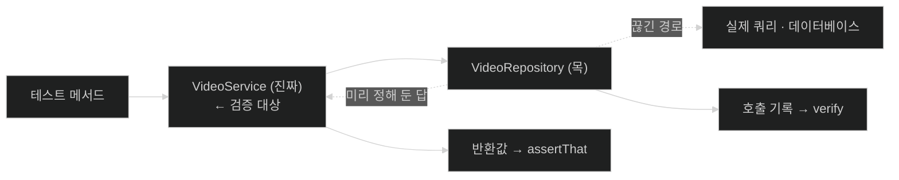

# 목으로 서비스 테스트 — 협력자를 끊고 대상만 남기기

## 한눈에 보기

| 질문 | 핵심 답 |
|---|---|
| 무엇을 테스트하나 | 원문 제목과 달리 **`VideoService`**. 리포지토리는 모킹되는 쪽이다 |
| 첫 단계 | 대상의 **협력자를 식별**한다 |
| 격리 방법 | `@ExtendWith(MockitoExtension.class)` + `@Mock` |
| 조립 | `@BeforeEach`에서 `new VideoService(repository)` — **컨테이너 없이** |
| 테스트 구조 | given · when · then 세 단계 (BDD) |
| 두 가지 검증 | 스텁 + 단언(**상태**) / `verify()`(**행위**) |
| 언제 행위 검증인가 | 반환값에 증거가 없을 때 (예: `delete()`) |
| 이 방식의 한계 | 자칫 **목 자신을 테스트**하게 된다 |

## 1. 왜 이게 필요한가

### 출발 장면: 이번 대상은 서비스다

[[03-testing-web-controllers-with-mockmvc]]에서 컨트롤러를 검증했다. 그때 `VideoService`는 `@MockitoBean`으로 **가짜를 넣었다.** 이제 그 가짜였던 것이 테스트 대상이 된다.

책이 첫 단계를 명확히 한다.

> 어떤 컴포넌트를 테스트할 때 중요한 것은 **[[협력자]]**(= 어떤 객체가 자기 일을 하기 위해 호출하는 다른 객체)**를 식별하는 것**이다. 즉 그 객체가 일을 하기 위해 의존하는 다른 객체들이다. `HomeController`에 주입된 유일한 서비스가 `VideoService`이므로, 그것을 자세히 보자.
>
> `VideoService`는 [[../chapter-3-querying-for-data-with-spring-boot/03-creating-repositories-and-declarative-queries|Chapter 3]]에서 정의한 대로 협력자가 하나 있다 — `VideoRepository`다.

> **원문 제목에 대한 주의**: 이 절의 제목은 *Testing data repositories with mocks*(목으로 데이터 리포지토리 테스트하기)지만, **실제로 테스트하는 대상은 리포지토리가 아니라 `VideoService`**이고 리포지토리는 **모킹되는 쪽**이다. 이 노트의 파일 이름을 `04-testing-services-with-mocks`로 둔 이유이며, 원문 제목을 그대로 읽으면 대상과 도구가 뒤바뀐다.

### 여기서 뭐가 무너지나

`VideoService`를 그냥 테스트하려면 진짜 `VideoRepository`가 필요하고, 그러면 진짜 데이터베이스가 필요하다. 그 순간 세 가지가 무너진다.

1. **느려진다.** [[02-testing-domain-objects]]의 49밀리초가 수백 밀리초 또는 수 초가 된다.
2. **실패 원인이 넓어진다.** 테스트가 빨갛게 되면 서비스 로직이 틀린 건지, 쿼리가 틀린 건지, 데이터베이스 연결이 안 된 건지 알 수 없다.
3. **환경에 의존한다.** 데이터베이스가 떠 있지 않은 CI에서는 아예 못 돌린다.

책의 표현대로 **`VideoService` 빈을 단위 테스트 방식으로 테스트하려면 바깥 영향으로부터 격리해야** 하고, 그 방법이 **[[모킹]]**(= 협력자를 가짜로 바꾸고 결과가 아니라 호출을 검증하는 방식)이다.

### 그래서 나온 생각

**협력자를 가짜로 바꿔 대상만 남긴다.**

비유하자면 모킹은 영화의 **스턴트 대역**이다. 주연의 연기를 찍어야 하는데 위험한 장면(진짜 데이터베이스 접근)이 끼어 있으면 그 부분만 대역이 맡는다.

→ 비유가 깨지는 지점: 스턴트 대역은 **실제로 그 동작을 수행한다.** 다만 다른 사람이 할 뿐이다. 그런데 목은 아무것도 수행하지 않고 **미리 정해 둔 답만 돌려준다.** 그래서 "대역이 잘 해냈다"가 "진짜도 할 수 있다"의 근거가 되지 못한다. 책이 Note에서 경고하는 **"주어진 테스트 케이스가 목 자신 말고는 아무것도 테스트하지 않을 위험"**이 정확히 이 지점이다.

> **Note (책 p.165)**: 활용할 수 있는 테스트 전략은 여러 가지다. 핵심적인 것 하나가 **[[단위-테스트]]**(= 원칙적으로 클래스 하나만 검증하는 테스트) 대 **[[통합-테스트]]**(= 협력자들의 실제 또는 시뮬레이션 버전을 함께 띄워 검증하는 테스트)다. 원칙적으로 단위 테스트는 **한 클래스만** 테스트하며 외부 서비스는 목이나 스텁으로 대체한다. 그 짝인 통합 테스트는 이 협력자들의 실제 또는 시뮬레이션 변종을 만든다.
>
> 당연히 둘 다 이득과 비용이 있다. **단위 테스트는 빠른 경향**이 있다 — 외부 영향이 전부 미리 정해 둔 답으로 바뀌기 때문이다. 그러나 **주어진 테스트 케이스가 목 자신 말고는 아무것도 테스트하지 않을 위험**이 있다. **통합 테스트는 확신을 높인다** — 더 현실에 가깝기 때문이다. 그러나 설계와 준비가 더 들고, 내장 데이터베이스를 쓰든 Docker 컨테이너로 운영 서비스를 흉내 내든 **그만큼 빠르지 않다.**
>
> **그래서 진짜 애플리케이션은 대개 둘을 섞는다.** 어느 정도의 단위 테스트가 핵심 기능을 검증할 수 있다. 그러나 컴포넌트들이 연결됐을 때 함께 제대로 동작한다는 감각도 필요하다.

이 Note가 이 장 전체의 지도다. 이 절이 단위 쪽 끝이고, [[05-testing-repositories-with-embedded-databases]]와 [[07-testing-repositories-with-testcontainers]]가 통합 쪽으로 나아간다.

## 2. 어떻게 동작하는가

### 2.1 컨테이너 없이 조립하기

앞 절에서는 Spring Boot Test의 슬라이스 애노테이션을 썼다. 여기서는 다른 전술이다.

```java
@ExtendWith(MockitoExtension.class)
public class VideoServiceTest {
    VideoService service;
    @Mock VideoRepository repository;

    @BeforeEach
    void setUp() {
        this.service = new VideoService(repository);
    }
}
```

책의 항목별 설명이다.

- **`@ExtendWith(MockitoExtension.class)`** — `@Mock`이 붙은 필드를 목으로 만들어 주는 **[[Mockito]]**(= Java의 대표 모킹 프레임워크)의 JUnit 6 훅이다.
- **`VideoService`** — 테스트 대상. 웹 컨트롤러가 호출하는 비즈니스 로직을 담고 있다.
- **`VideoRepository`** — `VideoService`가 요구하는 협력자이며 모킹 대상으로 표시된다.
- **`@BeforeEach`** — 이 setup 메서드를 매 테스트 메서드 전에 실행하게 하는 JUnit 6 애노테이션이다.
- **`setUp()`** — `VideoService`가 목 `VideoRepository`를 **생성자로 주입받아** 만들어진다.

여기서 결정적으로 중요한 것이 **Spring이 하나도 안 나온다**는 점이다. `@SpringBootTest`도, 슬라이스 애노테이션도, 애플리케이션 컨텍스트도 없다. 그냥 `new`다.

이것이 가능한 이유는 [[../chapter-2-creating-web-and-api-applications-with-spring-boot/04c-injecting-dependencies-through-constructor-calls|Chapter 2]]에서 본 **[[생성자-주입]]**(= 필요한 협력자를 생성자 매개변수로 받는 방식) 덕분이다. 그 노트에서 "테스트에서 `new HomeController(가짜서비스)`로 만들 수 있다"고 한 것이 여기서 실제로 회수된다. 필드 주입이었다면 이 한 줄이 성립하지 않는다.

책이 `@Mock` 애노테이션을 쓰는 이유도 덧붙인다 — Mockito는 늘 정적 `mock()` 메서드로도 목 생성을 지원해 왔지만, `@Mock`과 `MockitoExtension`을 쓰면 **모킹된 협력자가 명시적으로 드러나고 테스트 준비 코드의 가독성이 좋아진다.**

### 2.2 첫 테스트 — given · when · then

```java
@Test
void getVideosShouldReturnAll() {
     // given
     VideoEntity video1 = new VideoEntity("alice", "Spring Boot 4 Intro", "Learn the basics!");
     VideoEntity video2 = new VideoEntity("alice", "Spring Boot 4 Deep Dive", "Go deep!");
     when(repository.findAll()).thenReturn(List.of(video1, video2));

     // when
     List<VideoEntity> videos = service.getVideos();

     // then
     assertThat(videos).containsExactly(video1, video2);
}
```

세 주석이 세 단계를 나눈다. 책의 설명 — `given`, `when`, `then` 개념은 **[[BDD]]**(= "주어진 상황에서 어떤 행동을 하면 이런 결과를 기대한다" 형식으로 요구사항과 테스트를 표현하는 방식) 뒤에 있는 핵심이다. 발상은 **주어진 입력들이 있을 때, 행동 X를 하면, Y를 기대할 수 있다**는 것이다.

그리고 왜 이 형식이 좋은지를 밝힌다.

> 이런 식으로 흐르는 테스트 케이스는 **읽기 쉬운 경향**이 있다. 소프트웨어 개발자만이 아니라, 코드 작성보다 **고객 의도를 포착하는 데 집중하는 비즈니스 분석가나 다른 팀원들**도 읽을 수 있다.

`when(repository.findAll()).thenReturn(...)`이 **[[스텁]]**(= 특정 호출에 미리 정해 둔 값을 돌려주도록 설정한 가짜)을 만드는 부분이다. "이 목의 `findAll()`이 불리면 이 목록을 줘라"는 뜻이다.

`stub`이라는 이름은 "그루터기, 몽당"이라는 뜻에서 왔다 — 진짜 구현을 잘라내고 **최소한의 답만 남긴 것**이다.

> **Tip (책 p.167)**: 주석을 넣어야 한다는 요구사항은 없지만 이 관례는 읽기를 쉽게 한다. 그리고 주석만의 문제가 아니다. 테스트 케이스를 사방으로 흩어지게 쓸 때가 있다. 메서드를 given·when·then으로 흐르게 만들면 더 조리 있고 초점이 분명해진다. 예를 들어 **단언이 너무 많고 방향이 너무 여러 갈래로 뻗는다면, 그 테스트를 여러 메서드로 쪼개야 한다는 신호**일 수 있다.

이 Tip의 마지막 문장이 [[02-testing-domain-objects]]에서 본 "쪼개는 이유"와 이어진다. 거기서는 **실패가 가려진다**는 근거였고, 여기서는 **의도가 흐려진다**는 근거다.

### 2.3 매처와 BDD 문법

```java
@Test
void creatingANewVideoShouldReturnTheSameData() {
      // given
      given(repository.saveAndFlush(any(VideoEntity.class)))
          .willReturn(new VideoEntity("alice", "name", "des"));
      // when
      VideoEntity newVideo = service.create(new NewVideo("name", "des"), "alice");
      // then
      assertThat(newVideo.getName()).isEqualTo("name");
      assertThat(newVideo.getDescription()).isEqualTo("des");
      assertThat(newVideo.getUsername()).isEqualTo("alice");
}
```

- **`given()`** — Mockito의 `BDDMockito.given` 연산자로, **`when()`의 동의어**다.
- **`any(VideoEntity.class)`** — 리포지토리의 `saveAndFlush()`가 **어떤 `VideoEntity`로든 불릴 때** 일치시키는 매처다.

`any(...)`가 필요한 이유가 중요하다. 서비스가 내부에서 `NewVideo`를 `VideoEntity`로 변환해 저장하므로, **테스트가 그 인스턴스를 미리 손에 쥘 수 없다.** 정확히 같은 객체를 지정할 수 없으니 "그 타입이면 무엇이든"으로 넓힌다.

책은 `BDDMockito`에 `then()` 연산자도 있어 단언 대신 쓸 수 있다고 하며, 선택 기준을 한 줄로 준다 — **"데이터를 테스트하는가, 행위를 테스트하는가에 달렸다."**

그리고 저자 자신의 선택도 밝힌다 — `BDDMockito`가 좋은 대안을 주지만, **적어도 저자에게는 어디서나 같은 연산자를 쓰는 편이 쉽다.** 스텁을 하는지 모킹을 하는지는 테스트 케이스에 달린 것이지 연산자 이름에 달린 것이 아니다.

### 2.4 두 가지 검증 방식

> **Note (책 p.168)**: Mockito로 테스트를 쓸 때 우리는 보통 두 방식 중 하나로 검증한다 — **반환된 데이터를 단언**하거나(**[[상태-검증]]**(= 호출 뒤의 반환값이나 상태를 단언해 확인하는 방식)), **특정 메서드가 호출됐음을 확인**하거나(**[[행위-검증]]**(= 어떤 메서드가 어떤 인자로 불렸는지 확인하는 방식)).
>
> 지금까지 우리는 `when(something).thenReturn(value)`를 썼는데 이것을 **스텁**이라 한다. 이 방식에서는 특정 메서드 호출에 대해 미리 정해 둔 데이터를 반환하도록 구성하고 나중에 그 값들을 단언한다.
>
> 대안은 Mockito의 `verify()` 연산자로, 다음 테스트 케이스에서 보게 된다. 반환 데이터를 단언하는 대신 `verify()`는 **목 객체에서 특정 메서드가 호출됐는지**를 확인한다.
>
> **한 가지 테스트 전략만 고를 필요는 없다.** 어떤 상황에서는 스텁이 테스트 의도를 더 명확히 하고, 다른 상황에서는 메서드 호출 검증이 기대 동작을 더 잘 포착한다. Mockito는 두 방식을 모두 지원한다.

### 2.5 행위 검증이 필요해지는 지점

```java
@Test
void deletingAVideoShouldWork() {
    // given
    VideoEntity entity = new VideoEntity("alice", "name", "desc");
    entity.setId(1L);
    when(repository.findById(1L)).thenReturn(Optional.of(entity));
    // when
    service.delete(1L);
    // then
    verify(repository).findById(1L);
    verify(repository).delete(entity);
}
```

책이 앞의 테스트들과 다른 점을 짚는다.

- **`when()`** — `given()`은 동의어일 뿐이니 어디서나 같은 `when()`을 쓰는 편이 쉽다.
- 이 테스트는 `VideoService`의 `delete()` 연산을 호출한다.
- **`verify()`** — **서비스의 동작이 더 복잡하므로 미리 정해 둔 데이터로는 안 된다.** 대신 서비스 내부에서 **호출된 메서드들을 검증**하는 쪽으로 전환해야 한다.

왜 여기서는 상태 검증이 안 되는가? `service.delete(1L)`가 **아무것도 돌려주지 않기 때문**이다. 단언할 반환값이 없다. 그리고 리포지토리가 목이므로 실제로 지워지지도 않는다. **"삭제가 일어났다"의 유일한 증거는 `repository.delete(entity)`가 불렸다는 사실**이다.

`verify`가 두 줄인 것도 의미가 있다. 이 서비스는 **먼저 찾고 그다음 지운다.** 두 단계가 모두 일어났는지를 각각 확인한다.

```text
  반환값이 있는가?
        │
        ├─ 예 ──▶ 상태 검증이 자연스럽다
        │         when(...).thenReturn(...) + assertThat(결과)
        │         예: getVideos() · create()
        │
        └─ 아니오 ─▶ 행위 검증밖에 없다
                    verify(mock).method(args)
                    예: delete()

  ▶ "부수 효과가 본질인 연산"은 결과를 볼 수 없으므로 호출을 본다.
  ▶ 앞 절의 컨트롤러 POST 테스트가 같은 이유로 verify() 를 썼다.
```

[[03-testing-web-controllers-with-mockmvc]]의 `postNewVideoShouldWork()`가 정확히 그 경우다 — 응답이 리다이렉트뿐이라 위임 여부를 호출로만 확인할 수 있었다.

### 2.6 여기까지의 한계

책은 이 절을 정직하게 닫는다.

> Mockito에 대해서는 책이 통째로 여러 권 나와 있다. 우리는 이 도구가 주는 정교함의 표면을 긁고 있을 뿐이다. 그럼에도 **스텁과 행위 검증을 결합함으로써 `VideoService` API의 상당 부분을 명확하고 읽기 쉬운 테스트 시나리오로 이미 실행해 봤다.**
>
> 다만 한 가지 중요한 점이 남는다 — **이 테스트 케이스들은 단위 기반이고, 단위 테스트에는 특정 한계가 따른다.** 확신을 키우려면 다음 절에서 인메모리 데이터베이스를 통해 테스트 범위를 넓혀야 한다.

한계가 무엇인지 구체적으로 짚어 두면 이렇다. 이 절의 테스트는 전부 통과하는데도 **`findByNameContainsIgnoreCase`가 잘못된 쿼리를 만들고 있어도 알 수 없다.** 목이 그냥 정해 둔 목록을 돌려주기 때문이다. §1의 스턴트 대역 비유가 깨지던 그 지점이다.

## 3. 그림으로 보기

### 목이 끊는 것과 남기는 것



점선이 **검증되지 않는 영역**이다. 쿼리가 옳은지는 여기서 알 수 없다.

### 단위와 통합 사이 — 이 장의 이동

| | [[04-testing-services-with-mocks]] | [[05-testing-repositories-with-embedded-databases]] | [[07-testing-repositories-with-testcontainers]] |
|---|---|---|---|
| 협력자 | 목 | **인메모리 DB** | **실제 PostgreSQL 컨테이너** |
| Spring 컨텍스트 | 없음 | `@DataJpaTest` 슬라이스 | 슬라이스 + 컨테이너 |
| 속도 | 가장 빠름 | 중간 | 가장 느림 |
| 검증되는 것 | 서비스 로직 | 쿼리 + JPA 매핑 | **+ 실제 DB 방언** |
| 위험 | 목 자신만 테스트 | DB 방언 차이 | 도커 의존 |

### 스텁과 verify의 문법

```text
[스텁 — 입력을 고정한다]

  when( repository.findAll() ).thenReturn( List.of(v1, v2) )
        └────────┬────────┘        └────────┬────────┘
          "이게 불리면"                "이걸 줘라"

  given( ... ).willReturn( ... )     ← BDDMockito. 같은 뜻, 다른 이름


[verify — 출력을 확인한다]

  verify( repository ).delete( entity )
          └────┬───┘   └──┬─┘  └──┬──┘
             어느 목      어떤     어떤 인자로
                        메서드가   불렸는가

  ▶ 스텁은 given 단계, verify 는 then 단계에 놓인다.
  ▶ 한 테스트에 둘이 함께 있어도 된다 — deletingAVideoShouldWork 가 그렇다.
```

## 4. 이 노트에 나온 용어

| 용어 | 한 줄 풀이 | 자세히 |
|---|---|---|
| 협력자 | 어떤 객체가 일을 하기 위해 호출하는 다른 객체 | [[_glossary#협력자]] |
| 단위 테스트 | 원칙적으로 클래스 하나만 검증하는 테스트 | [[_glossary#단위-테스트]] |
| 통합 테스트 | 협력자의 실제·시뮬레이션 버전을 함께 띄우는 테스트 | [[_glossary#통합-테스트]] |
| 모킹 | 협력자를 가짜로 바꾸고 호출을 검증하는 방식 | [[_glossary#모킹]] |
| Mockito | Java의 대표 모킹 프레임워크 | [[_glossary#Mockito]] |
| 스텁 | 특정 호출에 정해 둔 값을 돌려주는 가짜 | [[_glossary#스텁]] |
| 상태 검증 | 반환값·상태를 단언해 확인하는 방식 | [[_glossary#상태-검증]] |
| 행위 검증 | 어떤 메서드가 어떤 인자로 불렸는지 확인하는 방식 | [[_glossary#행위-검증]] |
| BDD | given·when·then 형식으로 기대를 표현하는 방식 | [[_glossary#BDD]] |
| 생성자 주입 | 협력자를 생성자 매개변수로 받는 방식 | [[_glossary#생성자-주입]] |

## 5. 자주 헷갈리는 것

### 절 제목과 테스트 대상

원문 제목은 "리포지토리를 목으로 테스트"지만 **테스트 대상은 서비스**이고 리포지토리가 목이다. 대상과 도구가 뒤바뀌어 읽히기 쉬운 제목이다.

### 목(mock) vs 스텁(stub)

엄밀히는 **스텁이 "답을 준비해 둔 가짜"**, **목이 "호출을 기록하는 가짜"**다. Mockito에서는 같은 객체가 둘 다 할 수 있어서 경계가 흐리다. 실무적 판별은 **그 테스트가 무엇을 단언하는가**다 — 반환값이면 스텁 용법, 호출이면 목 용법.

### `when()`과 `given()`

**완전한 동의어**다. `given()`은 BDD 문체에 맞춘 이름일 뿐이며, 책의 저자도 어디서나 `when()`을 쓰는 편을 택한다.

### 목을 썼으니 이 테스트는 믿을 만하다

정확히 반대의 위험이 있다. 목이 돌려주는 값은 **내가 정한 값**이므로, 진짜 협력자가 그렇게 동작한다는 보장이 전혀 없다. 이 절의 테스트가 전부 통과해도 쿼리가 틀렸을 수 있다.

### Spring이 안 나오는데 Spring 테스트인가

이 절의 테스트에는 애플리케이션 컨텍스트가 없다. **그것이 장점**이다 — 가장 빠르고, 실패 범위가 가장 좁다. 생성자 주입 덕분에 가능한 일이다.

## 6. 언제 안 쓰나 / 경계

- 목을 많이 쓸수록 테스트는 **구현 세부에 묶인다.** `verify(repository).findById(1L)`은 서비스가 내부적으로 어떻게 하는지를 고정하므로, 구현을 바꾸면 동작이 같아도 테스트가 깨진다.
- 쿼리·매핑·방언처럼 **협력자 쪽에 있는 문제**는 이 방식으로 절대 잡히지 않는다. 그래서 이 장이 여기서 멈추지 않는다.
- `any(...)` 같은 넓은 매처는 편하지만 **잘못된 인자로 불려도 통과**시킨다. 인자를 특정할 수 있으면 특정하는 편이 낫다.
- Note가 말하듯 단위와 통합은 **둘 중 하나를 고르는 문제가 아니다.** 어느 쪽만 쌓아도 확신에 구멍이 남는다.

## 7. 연결

- [[03-testing-web-controllers-with-mockmvc]] — 거기서 `@MockitoBean`으로 가짜였던 `VideoService`가 여기서는 대상이 된다. POST 테스트의 `verify()`도 같은 원리다.
- [[05-testing-repositories-with-embedded-databases]] — 이 절이 남긴 "쿼리가 옳은지는 모른다"는 한계를 실제 DB 엔진으로 메우기 시작한다.
- [[02-testing-domain-objects]] — 협력자가 없는 클래스는 목도 필요 없다. 계층이 안쪽일수록 테스트가 단순해지는 이유다.

## 8. 스스로 확인

1. 이 절의 원문 제목이 왜 오해를 부르는가?
2. 진짜 리포지토리를 쓰면 무너지는 세 지점은 무엇인가?
3. 스턴트 대역 비유가 깨지는 지점은 어디인가? 책의 어떤 경고와 맞물리는가?
4. 이 테스트에 Spring 컨텍스트가 하나도 없는 것이 가능한 이유는? 어느 설계 결정 덕분인가?
5. given·when·then이 읽기 쉬운 것 외에 주는 실질적 이득은 무엇인가?
6. `any(VideoEntity.class)`가 필요한 이유를 서비스 내부 동작으로 설명할 수 있는가?
7. `delete()` 테스트에서 상태 검증이 불가능한 이유는?
8. 이 절의 테스트가 전부 통과해도 여전히 모르는 것은 무엇인가?


> 여덟 문항을 스스로 답한 **뒤에** [[_04-testing-services-with-mocks]]에서 모범답안과 대조한다. 먼저 열면 이 문항들은 다시 인출 문제로 쓸 수 없다.

<!-- ==== 아래는 내 영역 · 스킬 수정 금지 ==== -->

## 내 설명 시도


## 막혔던 지점


## 리뷰 이력
