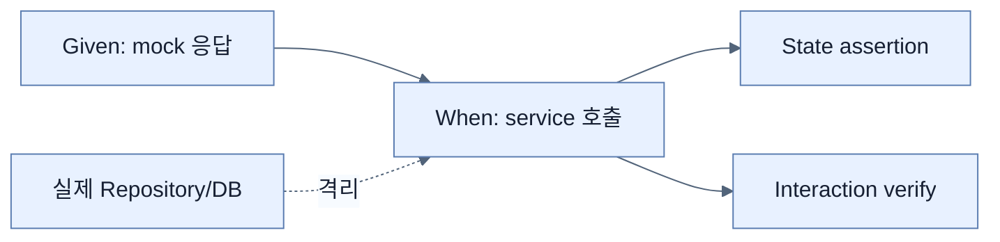

# Mock으로 Service와 Repository 협력 테스트

## 한눈에 보기

`MockitoExtension`과 `@Mock VideoRepository`로 실제 DB 없이 `VideoService`만 격리한다. `when(...).thenReturn(...)`은 결과를 stub하고, `verify(...)`는 필요한 collaborator 호출이 실제 발생했는지 확인한다.

## 1. 왜 이게 필요한가

service test가 DB 시작과 schema에 의존하면 느리고 실패 원인이 넓어진다. collaborator의 대답을 통제하면 서비스의 변환·분기·호출 순서를 빠르게 검증할 수 있다. 다만 mock의 기대를 잘못 정의하면 실제 통합과 다른 허구를 검증할 수 있다.

## 2. 어떻게 동작하는가

`@BeforeEach`에서 repository mock을 constructor로 service에 넣는다. Given에서 `findAll` 또는 `saveAndFlush` 반환값을 준비하고, When에서 service method를 호출하며, Then에서 결과 상태를 AssertJ로 확인한다. `delete`처럼 반환값보다 side effect가 중요한 경우 `verify(repository).findById(id)`와 `verify(repository).delete(entity)`를 쓴다.

State verification은 “무엇이 나왔나”, interaction verification은 “어떤 협력 호출이 일어났나”를 본다. 구현 세부 호출을 과도하게 verify하면 안전한 refactoring에도 테스트가 깨지므로 observable behavior와 중요한 protocol에 집중한다.

## 3. 그림으로 보기

## 4. 이 노트에 나온 용어

- **collaborator**: 테스트 대상이 작업을 위해 호출하는 다른 객체.
- **stub**: 특정 호출에 준비된 응답을 돌려주는 test double 설정.
- **interaction verification**: mock의 method가 기대한 인자와 횟수로 호출됐는지 확인하는 방식.

## 7. 연결

- [[02-testing-domain-objects]] — collaborator 없는 가장 단순한 unit test다.
- [[05-testing-repositories-with-embedded-databases]] — mock이 놓치는 실제 mapping과 query를 보완한다.
- [[07-testing-repositories-with-testcontainers]] — production DB engine까지 통합 범위를 넓힌다.

## 8. 스스로 확인

- 전체 1차 정리 후: stub과 verify가 각각 답하는 질문을 예로 설명한다.

<!-- ==== 아래는 내 영역 · 스킬 수정 금지 ==== -->

## 내 설명 시도

## 막혔던 지점

## 리뷰 이력

