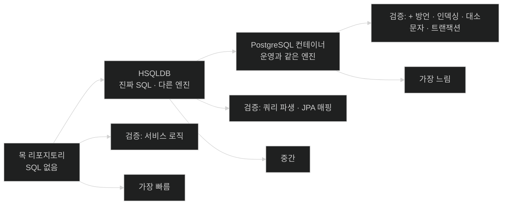

# 인메모리 데이터베이스로 리포지토리 테스트 — 진짜 SQL, 다른 극장

## 한눈에 보기

| 질문 | 핵심 답 |
|---|---|
| 인메모리 DB란 | **애플리케이션과 같은 메모리 공간**에서 도는 데이터베이스 |
| 이 절의 선택 | HSQLDB. `runtime` scope로 넣는다 |
| 슬라이스 | `@DataJpaTest` — 엔티티와 Spring Data JPA 리포지토리를 스캔한다 |
| 무엇을 검증하나 | Spring Data JPA가 아니라 **우리가 쓴 쿼리** |
| 왜 엔티티 객체로 단언하지 않나 | `id`가 `saveAll()`에서 채워지기 때문 |
| 왜 순서를 단언하지 않나 | `ORDER BY`가 없으면 순서가 보장되지 않는다 |
| 테스트에서 필드 주입은? | **괜찮다.** 생명주기를 JUnit이 관리하기 때문이다 |
| 남는 문제 | **운영 DB가 내장형이 아니라면?** |

## 1. 왜 이게 필요한가

### 출발 장면: 목이 통과시켜 준 것들

[[04-testing-services-with-mocks]]의 테스트는 전부 통과한다. 그런데 그 절이 스스로 남긴 한계가 있었다 — **쿼리가 옳은지는 아무것도 모른다.** `findByNameContainsIgnoreCase`가 엉뚱한 SQL을 만들고 있어도 목은 정해 둔 목록을 그대로 돌려준다.

쿼리를 검증하려면 **진짜 데이터베이스에 실제로 물어봐야** 한다.

### 여기서 뭐가 무너지나

책은 그 일이 역사적으로 얼마나 비쌌는지를 먼저 그린다.

> 실제 데이터베이스를 상대로 테스트하는 것은 늘 **시간과 자원 양쪽에서 비쌌다.** 전통적으로 애플리케이션을 띄우고, 손으로 쓴 스크립트를 손에 쥐고, 애플리케이션의 여러 페이지를 클릭해 가며 동작을 확인해야 했기 때문이다.
>
> **이런 테스트 문서를 쓰고, 변경이 나올 때마다 갱신하고, 따로 마련된 테스트 랩에서 애플리케이션에 실행하는 것만이 일인 테스트 엔지니어 팀**을 둔 회사들이 있다.
>
> 새 기능이 이 체계를 통과하기를 **일주일** 기다린다고 상상해 보라.

자동화된 테스트가 이 판을 바꿨지만, 책이 짚듯 개발자들은 **여전히 진짜 데이터베이스와 대화해야 하는 문제**에 부딪혔다 — 솔직히 말해 **물리적인 데이터베이스와 이야기하지 않으면 테스트가 진짜가 아니기** 때문이다. 그러다 SQL을 말하면서도 로컬에서, 메모리 안에서 도는 데이터베이스가 나왔다.

### 그래서 나온 생각

**진짜 SQL 엔진을 쓰되, 설치도 서버 프로세스도 없이 애플리케이션 안에서 띄운다.**

> **Note (책 p.170)**: 데이터베이스는 다 메모리에서 도는 것 아닌가? 운영급 데이터베이스 시스템은 메모리에서 돈다. 서버에는 데이터베이스 서버를 받치기 위한 거대한 메모리와 디스크가 붙는다. **하지만 우리가 말하는 것은 그게 아니다.** 애플리케이션 관점에서 **[[인메모리-데이터베이스]]**(= 애플리케이션과 같은 메모리 공간에서 도는 데이터베이스)란 **여러분의 애플리케이션과 같은 메모리 공간에서 도는 데이터베이스**다.

이 Note가 없으면 용어가 헷갈린다. 핵심은 "메모리를 쓴다"가 아니라 **"별도 프로세스가 아니다"**이다.

비유하자면 [[04-testing-services-with-mocks]]의 목이 **스턴트 대역**이었다면, 인메모리 데이터베이스는 **진짜 배우의 리허설**이다. 대역이 아니라 본인이 실제로 SQL을 실행한다 — 다만 **극장이 다르다.**

→ 비유가 깨지는 지점: 리허설 극장과 본 공연장의 차이는 음향이나 동선처럼 눈에 보이는 것들이다. 하지만 HSQLDB와 PostgreSQL의 차이는 **눈에 안 보이는 곳에 있다** — SQL 방언, 인덱싱 동작, 대소문자 처리, 트랜잭션 처리다. 그래서 **리허설을 완벽히 마쳐도 본 공연에서 처음 드러나는 것이 남는다.** 책이 이 절 끝에서 곧바로 Testcontainers로 넘어가는 이유가 이것이다.

## 2. 어떻게 동작하는가

### 2.1 HSQLDB 넣기

책이 선택지를 든다 — H2, HSQLDB, Apache Derby 같은 여러 인메모리 데이터베이스가 있고, 이 절에서는 **[[HSQLDB]]**(= Java로 작성된 관계형 데이터베이스로 인메모리 모드로 띄울 수 있다)를 쓴다. Spring Initializr에서 고를 수 있다.

```xml
<dependency>
     <groupId>org.hsqldb</groupId>
     <artifactId>hsqldb</artifactId>
     <scope>runtime</scope>
</dependency>
```

책이 짚는 핵심 하나 — 이것은 **`runtime` 의존성**이며, 우리 코드의 어떤 것도 이것을 상대로 컴파일할 필요가 없다는 뜻이다. **애플리케이션이 실행될 때만 필요하다.**

**[[의존성-scope]]**(= 의존성이 어느 단계에 필요한지 표시하는 Maven 값)의 이 선택은 [[../chapter-3-querying-for-data-with-spring-boot/01b-adding-spring-data-jpa-to-our-project|Chapter 3에서 H2를 넣을 때]]와 같은 이유다. 컴파일 경로에서 밀어내면 애플리케이션 코드가 특정 데이터베이스 클래스를 직접 import하는 일이 원천적으로 막힌다.

### 2.2 테스트 클래스 골격

```java
@DataJpaTest
public class VideoRepositoryHsqlTest {
     @Autowired VideoRepository repository;

     @BeforeEach
     void setUp() {
         repository.saveAll(
             List.of(
                 new VideoEntity("alice",
                     "Need HELP with your SPRING BOOT 4 App?",
                     "SPRING BOOT 4 will only speed things up."),
                 new VideoEntity("alice",
                     "Don't do THIS to your own CODE!",
                     "As a pro developer, never ever EVER do this to your code."),
                 new VideoEntity("bob",
                     "SECRETS to fix BROKEN CODE!",
                     "Discover ways to not only debug your code")));
     }
}
```

책의 항목별 설명이다.

- **`@DataJpaTest`** — Spring Boot의 테스트 애노테이션으로, **엔티티 클래스 정의와 Spring Data JPA 리포지토리를 자동으로 스캔**하기를 원한다는 표시다.
- **`@Autowired VideoRepository`** — 테스트할 `VideoRepository` 인스턴스를 자동 주입한다.
- **`@BeforeEach`** — 이 메서드가 매 테스트 메서드 전에 돌게 한다.
- **`repository.saveAll()`** — 테스트 데이터 한 묶음을 저장한다.

`@DataJpaTest`가 [[03-testing-web-controllers-with-mockmvc]]의 `@WebMvcTest`와 같은 계열의 **[[테스트-슬라이스]]**(= 특정 계층만 띄워 검증하는 테스트 구성)라는 점이 중요하다. 웹 인프라는 켜지 않고 JPA 계층만 켠다. 그래서 컨트롤러나 보안 설정이 잘못돼 있어도 이 테스트는 영향을 받지 않는다.

`@BeforeEach`로 매번 데이터를 다시 넣는 이유도 슬라이스의 성질과 맞물린다. `@DataJpaTest`는 기본적으로 각 테스트를 트랜잭션 안에서 돌리고 끝나면 롤백하므로, **테스트끼리 데이터가 새어 나가지 않는다.** 대신 매번 다시 채워야 한다.

### 2.3 무엇을 검증하는 것이 우리 일인가

책이 범위를 분명히 긋는다.

> 이제 중요한 것은, 우리가 **Spring Data JPA가 동작하는지 확인하는 데 초점을 두는 것이 아니라는** 점을 이해하는 것이다. 그것은 **프레임워크를 검증하는 일**이며 우리 범위 밖이다. 아니다 — 우리는 **우리가 올바른 쿼리를 썼는지** 검증해야 한다. 커스텀 finder든, Query by Example이든, 어떤 전략을 쓰든 말이다.

이 구분이 실무적으로 중요하다. `findAll()`이 전부를 돌려주는지 확인하는 것은 사실상 Spring Data JPA를 테스트하는 것에 가깝다. 반면 `findByNameContainsOrDescriptionContainsAllIgnoreCase`가 의도한 결과를 내는지는 **우리가 만든 것**이다.

### 2.4 세 개의 테스트

**① 가장 단순한 것**

```java
@Test
void findAllShouldProduceAllVideos() {
     List<VideoEntity> videos = repository.findAll();
     assertThat(videos).hasSize(3);
}
```

`findAll()`을 실행하고 **[[AssertJ]]**(= 값을 받아 점으로 잇는 단언 API)로 크기를 확인한다. 책도 "단언을 좀 더 파고들 수 있다"고 하며 더 촘촘한 검증을 독자 과제로 남긴다.

**② 대소문자 무시 부분 검색**

```java
@Test
void findByNameShouldRetrieveOneEntry() {
     List<VideoEntity> videos = repository
         .findByNameContainsIgnoreCase("SpRinG bOOt 4");
     assertThat(videos).hasSize(1);
     assertThat(videos).extracting(VideoEntity::getName)
         .containsExactlyInAnyOrder(
              "Need HELP with your SPRING BOOT 4 App?");
}
```

책의 설명이 다섯 항목이다.

- 테스트 메서드 이름만 봐도 무엇을 하는지 감이 온다.
- `findByNameContainsIgnoreCase()`에 **뒤죽박죽 섞인 부분 문자열**을 넣는다.
- AssertJ로 결과 크기가 1인지 확인한다.
- AssertJ의 `extracting()` 연산자와 Java 8 메서드 참조로 **각 항목의 `name` 필드만 뽑아낸다.**
- `containsExactlyInAnyOrder()`로 마무리한다. **순서는 중요하지 않지만 구체적 내용은 중요할 때** 딱 맞는 연산자다.

`"SpRinG bOOt 4"`라는 입력이 우연이 아니다. **대소문자를 일부러 뒤섞어** `IgnoreCase` 한정어가 실제로 작동하는지를 증명한다. 이것이 §2.3에서 말한 "우리가 만든 것을 검증한다"의 구체적 모습이다.

**③ 왜 엔티티 객체로 단언하지 않는가**

책이 예상 질문을 먼저 던진다 — Java record로 인스턴스를 만드는 게 쉬운데 왜 `VideoEntity` 객체끼리 비교하지 않는가?

> 실제 데이터베이스와 대화하는 테스트 케이스에서 이것을 피하는 이유는, **`id` 필드가 `setUp()`의 `saveAll()` 연산으로 채워지기 때문**이다. `setUp()`과 특정 테스트 메서드 사이에서 이것을 동적으로 다룰 방법을 궁리해 볼 수도 있지만, **기본 키를 확인하는 것이 결정적으로 중요하지는 않다.**
>
> 대신 **애플리케이션 관점에서** 검증하는 데 집중하라. 이 상황에서 우리가 알고 싶은 것은 대소문자가 섞인 부분 입력이 올바른 비디오를 찾아내는가, 그리고 `name` 필드가 정확히 들어맞는가다.

**[[단언]]**(= 기대와 실제를 비교해 다르면 실패시키는 문장)의 대상을 무엇으로 고르는가에 대한 원칙이다 — **테스트가 통제하지 않는 값(`id`)은 단언 대상에서 뺀다.**

**④ 두 필드 검색과 순서**

```java
@Test
void findByNameOrDescriptionShouldFindTwo() {
     List<VideoEntity> videos = repository
         .findByNameContainsOrDescriptionContainsAllIgnoreCase("CoDe", "YOUR CODE");
     assertThat(videos).hasSize(2);
     assertThat(videos)
         .extracting(VideoEntity::getDescription)
         .contains("As a pro developer, never ever EVER do this to your code.",
             "Discover ways to not only debug your code");
}
```

책이 마지막 항목에서 중요한 이유를 밝힌다 — 마지막으로 뽑아낸 description들이 기대값을 포함하는지 단언한다. **의도적으로 순서는 확인하지 않는데, `ORDER BY` 절이 없으면 관계형 데이터베이스가 삽입 순서로 결과를 돌려줄 의무가 없기 때문**이다.

[[../chapter-3-querying-for-data-with-spring-boot/04a-sorting-the-results|Chapter 3]]에서 본 그 성질이 여기서 **테스트 작성 방식을 바꾼다.** 순서를 단언하면 "지금은 통과하지만 언제든 깨질 수 있는" 테스트가 된다.

### 2.5 테스트 클래스에서의 필드 주입

책이 짚고 넘어가는 예외가 하나 있다.

> 이 테스트 클래스는 `VideoRepository`를 autowire하는 데 **[[필드-주입]]**(= 필드에 직접 애노테이션을 붙여 의존성을 받는 방식)을 썼다. 현대 Spring 앱에서는 보통 **[[생성자-주입]]**(= 협력자를 생성자 매개변수로 받는 방식)이 권장된다. [[../chapter-2-creating-web-and-api-applications-with-spring-boot/04c-injecting-dependencies-through-constructor-calls|Chapter 2]]에서 더 자세히 봤다.
>
> 필드 주입은 보통 `NullPointerException`으로 이어질 수 있는 위험으로 여겨지지만, **테스트 클래스에서는 괜찮다.** 테스트 클래스를 만들고 파괴하는 생명주기를 **우리나 Spring Framework가 아니라 JUnit이 관리하기 때문**이다.

근거가 명확하다는 점이 좋다. 필드 주입이 위험한 이유는 "누군가 `new`로 만들면 필드가 비어 있다"인데, 테스트 클래스는 **JUnit만이 인스턴스를 만든다.** 그 위험 자체가 성립하지 않는다.

### 2.6 남는 결정적 문제

책은 `delete()` 테스트를 [[08-testing-security-policies]]로 미루고, 그 대신 더 큰 질문을 던진다.

> 그동안 우리는 바로 앞에 있는 결정적인 문제를 마주해야 한다 — **우리 대상 데이터베이스가 내장형이 아니라면 어떻게 하는가?**
>
> 운영에서 PostgreSQL, MySQL, MariaDB, Oracle 같은 더 주류인 것을 쓴다면, 그것들이 **내장형·동일 프로세스로는 제공되지 않는다**는 사실을 다뤄야 한다.
>
> 계속 HSQL을 테스트 작성의 기반으로 쓸 수도 있다. 하지만 JPA를 표준 추상화로 구현한다 해도 **우리의 SQL 연산이 운영에서 다르게 동작할 수 있다.**
>
> SQL이 표준화되어 있긴 하지만(더 정확히는 여러 표준에 걸쳐 정의되어 있지만) **그 표준들에는 빈틈이 있다.** 각 데이터베이스 엔진은 그 빈틈을 자기 방식으로 메우고, 종종 명세를 넘어서는 추가 기능을 제공한다. 결과적으로 **[[SQL-방언]]**(= 제품마다 다른 문법·함수·타입·인덱싱·대소문자·트랜잭션 동작의 차이)**의 특이점, 인덱싱 동작, 대소문자 민감성, 트랜잭션 처리**가 내장 데이터베이스에서는 되던 코드를 PostgreSQL에서 실패하게 만들 수 있다.

이 문단이 왜 이 절이 끝이 아닌지의 이유 전부다. **[[통합-테스트]]**(= 협력자의 실제·시뮬레이션 버전을 함께 띄우는 테스트)를 한 단계 더 진짜에 가깝게 만드는 것이 [[06-adding-testcontainers]]다.

특히 **대소문자 민감성**이 이 절의 테스트와 직결된다는 점을 놓치면 안 된다. 우리가 방금 검증한 것이 `IgnoreCase` 동작인데, 대소문자 처리는 데이터베이스마다 다른 대표적인 항목이다.

## 3. 그림으로 보기

### 세 단계의 "진짜에 가까움"



### 무엇을 단언하고 무엇을 단언하지 않는가

```text
  [단언한다]
    결과 개수            hasSize(3)
    특정 필드의 값        extracting(VideoEntity::getName).containsExactlyInAnyOrder(...)
    포함 여부            contains(...)

  [단언하지 않는다]                      왜
    id 값               ────────────▶  saveAll() 이 채운다. 테스트가 통제하지 않는 값
    결과 순서           ────────────▶  ORDER BY 가 없으면 DB 가 보장하지 않는다
    엔티티 객체 전체     ────────────▶  id 때문에 동등 비교가 성립하지 않는다

  ▶ 원칙: 테스트가 통제하지 못하는 값은 단언 대상에서 뺀다.
  ▶ 그러지 않으면 "지금은 통과하지만 언제든 깨지는" 테스트가 된다.
```

### 필드 주입이 테스트에서만 괜찮은 이유

| | 운영 코드 | 테스트 클래스 |
|---|---|---|
| 누가 인스턴스를 만드나 | 컨테이너 **또는 아무나** (`new`) | **JUnit만** |
| `new`로 만들면 | 필드가 비어 `NullPointerException` | 그런 경로가 없다 |
| 필수 의존성이 드러나나 | 안 드러남 | 테스트라 문제되지 않음 |
| 결론 | 생성자 주입 권장 | **필드 주입 허용** |

## 4. 이 노트에 나온 용어

| 용어 | 한 줄 풀이 | 자세히 |
|---|---|---|
| 인메모리 데이터베이스 | 애플리케이션과 같은 메모리 공간에서 도는 DB | [[_glossary#인메모리-데이터베이스]] |
| HSQLDB | Java로 작성돼 인메모리로 띄울 수 있는 관계형 DB | [[_glossary#HSQLDB]] |
| SQL 방언 | 제품마다 다른 SQL 문법·동작의 차이 | [[_glossary#SQL-방언]] |
| 테스트 슬라이스 | 특정 계층만 띄워 검증하는 테스트 구성 | [[_glossary#테스트-슬라이스]] |
| 의존성 scope | 의존성이 어느 단계에 필요한지 표시하는 값 | [[_glossary#의존성-scope]] |
| AssertJ | 값을 받아 점으로 잇는 단언 API | [[_glossary#AssertJ]] |
| 단언 | 기대와 실제를 비교해 다르면 실패시키는 문장 | [[_glossary#단언]] |
| 필드 주입 | 필드에 직접 애노테이션을 붙여 의존성을 받는 방식 | [[_glossary#필드-주입]] |
| 생성자 주입 | 협력자를 생성자 매개변수로 받는 방식 | [[_glossary#생성자-주입]] |
| 통합 테스트 | 협력자의 실제·시뮬레이션 버전을 함께 띄우는 테스트 | [[_glossary#통합-테스트]] |

## 5. 자주 헷갈리는 것

### 인메모리 = 메모리를 쓴다

책이 Note를 따로 둔 이유다. 운영 데이터베이스도 메모리를 쓴다. 여기서 "인메모리"는 **애플리케이션과 같은 프로세스 안에서 돈다**는 뜻이다.

### 인메모리 DB로 테스트하면 실제 DB 테스트다

**아니다.** 진짜 SQL 엔진이지만 **다른 엔진**이다. 방언·인덱싱·대소문자·트랜잭션이 다를 수 있고, 하필 이 절이 검증한 `IgnoreCase`가 그 차이가 큰 항목 중 하나다.

### `findAll()` 테스트도 가치가 있다

책의 기준으로는 애매하다. 그것은 사실상 Spring Data JPA를 테스트하는 것에 가깝다. 다만 [[07-testing-repositories-with-testcontainers]]에서는 같은 테스트가 **스모크 테스트**라는 다른 이름과 다른 목적을 얻는다.

### 필드 주입은 나쁘다

운영 코드에서는 그렇다. 테스트 클래스에서는 **인스턴스 생성 경로가 JUnit뿐**이라 그 위험이 성립하지 않는다. "나쁘다"가 아니라 "그 위험이 있는 곳에서 나쁘다"이다.

### 순서를 단언하지 않는 것은 게으른 것이다

반대다. `ORDER BY` 없이 순서를 단언하면 **틀린 것을 검증하는** 테스트가 된다. 지금 통과하는 것이 우연일 수 있다.

## 6. 언제 안 쓰나 / 경계

- 운영 데이터베이스가 HSQLDB가 아니라면 이 테스트는 **방언 차이를 잡지 못한다.** 이 절의 마지막 문단이 그 사실을 정면으로 인정한다.
- `@DataJpaTest`는 JPA 계층만 켠다. 서비스·컨트롤러·보안은 없으므로 그쪽 문제는 여기서 안 드러난다.
- `@BeforeEach`로 매번 데이터를 다시 넣으므로 테스트가 늘수록 그 비용이 누적된다. 데이터가 커지면 별도 전략이 필요하다.
- 이 절은 `delete()`를 테스트하지 않고 미룬다. 삭제는 **누가 지울 수 있는가**라는 보안 문제와 얽혀 있어 [[08-testing-security-policies]]에서 다뤄진다.
- 인메모리 데이터베이스는 스키마를 자동 생성해 주는 편의에 기대고 있다. 실제 운영에서는 마이그레이션 도구가 만든 스키마와 엔티티 매핑이 일치하는지가 별도 문제다.

## 7. 연결

- [[04-testing-services-with-mocks]] — 그 절이 남긴 "쿼리가 옳은지는 모른다"는 한계를 여기서 처음 메운다.
- [[06-adding-testcontainers]] — 이 절이 끝에서 던진 "운영 DB가 내장형이 아니라면?"에 대한 답이다.
- [[07-testing-repositories-with-testcontainers]] — 같은 세 개의 테스트를 실제 PostgreSQL로 다시 돌린다. 무엇이 같고 무엇이 달라지는지 대조할 수 있다.

## 8. 스스로 확인

1. 자동화 이전에 실제 DB 테스트가 얼마나 비쌌는지 책의 묘사로 설명할 수 있는가?
2. "인메모리"가 뜻하는 것이 "메모리를 쓴다"가 아니라면 무엇인가?
3. 리허설 비유가 깨지는 지점은 어디인가? 그 차이가 하필 이 절의 어떤 테스트와 직결되는가?
4. `hsqldb`에 `runtime` scope를 주는 것이 무엇을 막는가?
5. "Spring Data JPA를 테스트하지 않는다"는 말의 기준으로, 세 테스트 중 가장 가치가 낮은 것은?
6. `"SpRinG bOOt 4"`라는 입력이 우연이 아닌 이유는?
7. `id`와 결과 순서를 단언하지 않는 이유가 같은 원칙에서 나온다고 말할 수 있는가?
8. 필드 주입이 테스트 클래스에서만 괜찮은 근거는 무엇인가?


> 여덟 문항을 스스로 답한 **뒤에** [[_05-testing-repositories-with-embedded-databases]]에서 모범답안과 대조한다. 먼저 열면 이 문항들은 다시 인출 문제로 쓸 수 없다.

<!-- ==== 아래는 내 영역 · 스킬 수정 금지 ==== -->

## 내 설명 시도


## 막혔던 지점


## 리뷰 이력
