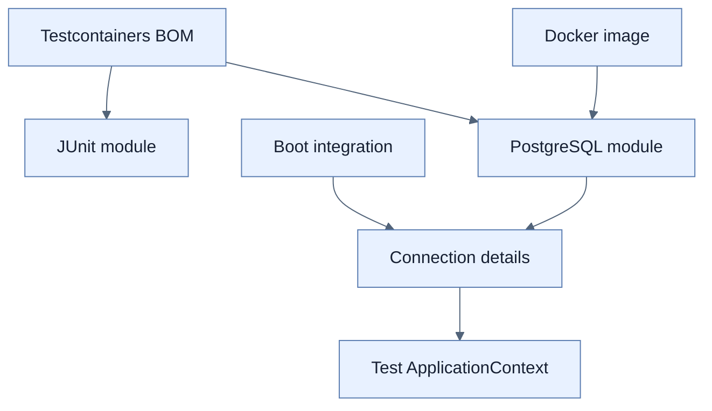

# Testcontainers 추가하기

## 한눈에 보기

Testcontainers는 JUnit lifecycle에서 Docker service를 시작하고 test 후 종료한다. 책은 PostgreSQL driver, Boot Testcontainers integration, JUnit Jupiter와 PostgreSQL 모듈을 추가하고 Testcontainers BOM으로 모듈 버전을 정렬한다.

## 1. 왜 이게 필요한가

운영과 같은 DB를 수동으로 미리 실행하면 개발자·CI 환경에 숨은 전제와 오염된 상태가 생긴다. Container 정의를 test 코드에 두면 필요한 product/version과 lifecycle이 재현 가능해진다.

## 2. 어떻게 동작하는가

PostgreSQL runtime driver가 JDBC 연결을 제공하고 `spring-boot-testcontainers`가 container connection detail을 Boot context에 통합한다. `testcontainers-junit-jupiter`가 annotation lifecycle을, product module이 typed container API를 제공한다. 여러 모듈은 BOM에서 같은 릴리스 선으로 맞춘다.

Container test는 실제 DB process를 제공하지만 production의 데이터 크기, topology, network latency, 운영 설정 전체를 복제하지는 않는다. Docker 이용 가능성과 image pull/cache 비용도 CI 설계에 포함한다.

## 3. 그림으로 보기

## 4. 이 노트에 나온 용어

- **Testcontainers**: test lifecycle에서 containerized dependency를 제어하는 library.
- **Docker image**: container filesystem·metadata를 고정한 실행 template.
- **BOM**: 여러 module의 호환 version을 정렬하는 dependency metadata.

## 7. 연결

- [[05-testing-repositories-with-embedded-databases]] — 대체하려는 in-process DB test다.
- [[07-testing-repositories-with-testcontainers]] — 설치한 모듈을 실제 JPA slice에 연결한다.
- [[chapter-7-releasing-an-application-with-spring-boot/02-building-a-docker-container|Docker container]] — 같은 container 기반을 배포 관점에서 본다.

## 8. 스스로 확인

- 전체 1차 정리 후: Testcontainers BOM과 Boot BOM이 맡는 version 범위를 구분한다.

<!-- ==== 아래는 내 영역 · 스킬 수정 금지 ==== -->

## 내 설명 시도

## 막혔던 지점

## 리뷰 이력

