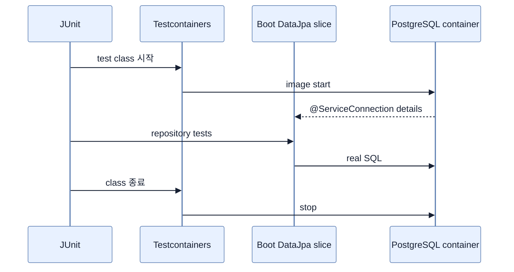

# Testcontainers로 Repository 테스트

## 한눈에 보기

`@Testcontainers` + `@DataJpaTest`에 static `PostgreSQLContainer`를 `@Container @ServiceConnection`으로 선언한다. embedded DB 자동 교체를 끄고 `create-drop` schema를 사용해 application repository query를 실제 PostgreSQL dialect에서 실행한다.

## 1. 왜 이게 필요한가

Embedded DB가 놓치는 DB product별 SQL·transaction 차이를 release 전에 발견해야 한다. 사람이 준비한 공유 test DB 대신 test class가 자신의 격리된 PostgreSQL instance와 connection을 소유하면 재현성과 신뢰가 올라간다.

## 2. 어떻게 동작하는가

JUnit extension이 `postgres:17-alpine` container를 class당 한 번 시작한다. `@ServiceConnection`은 URL·username·password를 읽어 Boot DataSource에 공급하고 `Replace.NONE`은 H2/HSQL로 바꾸지 못하게 한다. 각 test 전 fixture를 넣은 뒤 `findAll` smoke test와 custom finder 결과를 검증한다. 끝나면 container가 정리된다.

Static container는 method마다 시작하는 비용을 줄이지만 test data isolation은 transaction/schema 전략으로 별도 확보해야 한다. fixed image tag로 의도치 않은 DB upgrade도 막는다.

## 3. 그림으로 보기

## 4. 이 노트에 나온 용어

- **ServiceConnection**: container connection details를 Boot service auto-configuration에 연결하는 애노테이션.
- **AutoConfigureTestDatabase**: test DataSource 교체 정책을 정하는 애노테이션.
- **smoke test**: 핵심 경로가 최소한 기동·동작하는지 빠르게 확인하는 테스트.

## 7. 연결

- [[06-adding-testcontainers]] — 필요한 dependency와 BOM 구성이다.
- [[05-testing-repositories-with-embedded-databases]] — 속도와 product fidelity의 trade-off를 비교한다.
- [[chapter-3-querying-for-data-with-spring-boot/04-using-custom-finders-sorting-and-limits|Custom finder]] — 실제 PostgreSQL에서 검증할 application query다.

## 8. 스스로 확인

- 전체 1차 정리 후: `@ServiceConnection`과 `Replace.NONE`이 각각 막는 수동 설정·자동 교체 문제를 설명한다.

<!-- ==== 아래는 내 영역 · 스킬 수정 금지 ==== -->

## 내 설명 시도

## 막혔던 지점

## 리뷰 이력

