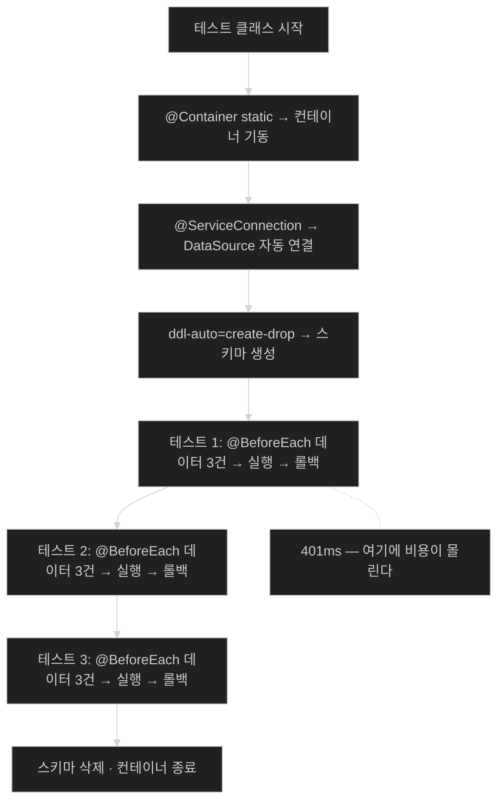

# Testcontainers로 리포지토리 테스트 — Boot의 친절을 거절하기

## 한눈에 보기

| 질문 | 핵심 답 |
|---|---|
| 애노테이션이 몇 개 필요한가 | **여섯 개**. 각각이 무언가를 켜거나 **막는다** |
| 가장 놓치기 쉬운 것 | `@AutoConfigureTestDatabase(replace = NONE)` |
| 그것을 빼면? | 컨테이너는 뜨는데 **테스트는 내장 DB로 통과**한다 |
| 컨테이너는 언제 뜨나 | `static`이라 **테스트 클래스당 한 번** |
| 그런데 왜 `@BeforeEach`인가 | 컨테이너는 한 번, **데이터는 매번** |
| 접속 설정은? | `@ServiceConnection`이 자동 연결. `spring.datasource.*` 불필요 |
| 실행 비용 | 총 460ms 중 **첫 테스트 하나가 401ms** |
| 이 전술의 범위 | Docker Hub에 이미지가 있으면 무엇이든 |

## 1. 왜 이게 필요한가

### 출발 장면: 재료는 갖췄는데 Boot가 도와준다

[[06-adding-testcontainers]]에서 의존성 네 개와 BOM을 넣었다. 이제 테스트를 쓰면 될 것 같다. [[05-testing-repositories-with-embedded-databases]]의 테스트 클래스에 컨테이너만 하나 얹으면 되지 않을까?

```java
@DataJpaTest
class VideoRepositoryTestcontainersTest {
    @Autowired VideoRepository repository;

    @Container
    static final PostgreSQLContainer database = new PostgreSQLContainer(...);
}
```

이렇게 쓰면 **컨테이너는 정상적으로 뜬다. 테스트도 통과한다.** 그리고 그것이 함정이다.

### 여기서 뭐가 무너지나

`@DataJpaTest`에는 우리가 원하지 않는 친절이 하나 들어 있다. **클래스패스에서 내장 데이터베이스를 발견하면 설정된 `DataSource`를 그것으로 갈아 끼운다.** 테스트를 빠르고 격리되게 만들려는 선의다.

그런데 지금 우리 목적은 정확히 그 반대다. [[05-testing-repositories-with-embedded-databases]]가 끝에서 지적한 **[[SQL-방언]]**(= 제품마다 다른 SQL 문법·동작의 차이) 문제를 잡으려고 진짜 PostgreSQL을 띄운 것이다. 그런데 Boot가 그것을 내장 DB로 바꿔 버리면 **컨테이너를 띄우는 비용만 치르고 검증은 하나도 못 얻는다.**

더 나쁜 것은 **아무 오류도 안 난다는 점**이다.

```text
  컨테이너 기동  ✅  (초 단위 비용 지불)
  테스트 실행    ✅
  테스트 통과    ✅
  실제 쓴 DB     ❌  내장 DB
  방언 검증      ❌  아무것도

  ▶ 빨간불이 하나도 안 뜨는데 목적만 사라진다.
```

### 그래서 나온 생각

**Boot의 친절을 명시적으로 거절한다.**

비유하자면 `@DataJpaTest`는 **눈치 빠른 조수**다. 책상에 내장 데이터베이스가 놓여 있으면 "테스트하시는 거죠? 이거 쓰시면 빨라요" 하고 알아서 바꿔 준다.

→ 비유가 깨지는 지점: 사람 조수는 한 번 거절하면 **다음부터 기억한다.** 하지만 `@AutoConfigureTestDatabase(replace = NONE)`은 **테스트 클래스마다 다시 말해야 한다.** 그리고 말하는 것을 잊어도 조수는 아무 말 없이 자기 판단대로 한다 — 오류도, 경고도 없다. **거절을 잊으면 조용히 목적을 잃는** 이 비대칭이 사람 조수 비유에는 없다.

## 2. 어떻게 동작하는가

### 2.1 테스트 클래스 골격 — 여섯 개의 애노테이션

```java
@Testcontainers
@DataJpaTest
@AutoConfigureTestDatabase(replace = Replace.NONE)
@TestPropertySource(properties = {
    "spring.jpa.hibernate.ddl-auto=create-drop"})
class VideoRepositoryTestcontainersTest {

    @Autowired
    VideoRepository repository;

    @Container
    @ServiceConnection
    static final PostgreSQLContainer database =
        new PostgreSQLContainer(DockerImageName.parse("postgres:17-alpine"))
                .withDatabaseName("testdb")
                .withUsername("postgres")
                .withPassword("postgres");
}
```

책의 항목별 설명에 "이 단계가 없으면 무엇이 깨지는가"를 붙여 본다.

| 애노테이션 | 책의 설명 | 없으면 |
|---|---|---|
| `@Testcontainers` | Testcontainers `junit-jupiter` 모듈의 애노테이션으로 **JUnit 6 테스트 케이스의 생명주기에 훅**을 건다 | 컨테이너가 자동으로 뜨고 지지 않는다 |
| `@DataJpaTest` | 모든 엔티티 클래스와 Spring Data JPA 리포지토리를 스캔하라는 Spring Boot Test 애노테이션 | 리포지토리 빈이 없다 |
| **`@AutoConfigureTestDatabase(replace = NONE)`** | 클래스패스에서 내장 데이터베이스가 감지될 때 Boot가 **설정된 `DataSource`를 자동으로 갈아 끼우는 것을 막는다** | **컨테이너 대신 내장 DB로 조용히 통과** |
| `@TestPropertySource(ddl-auto=create-drop)` | **[[DDL-자동화]]**(= 엔티티 매핑으로 표 생성·삭제를 자동 실행할지 정하는 설정) 값을 지정해, 테스트 컨텍스트가 시작될 때 **스키마를 자동 생성**하고 닫힐 때 **삭제**하도록 Hibernate에 지시한다. 실제 DB 컨테이너를 쓸 때 **매 테스트 실행이 깨끗한 스키마에서 시작**하게 한다 | 표가 없어 전부 실패 |
| `@Container` | 이 컨테이너를 **JUnit 생명주기로 제어**할 대상으로 표시하는 Testcontainers 애노테이션 | 컨테이너 객체는 있으나 기동되지 않는다 |
| `@ServiceConnection` | Testcontainers가 관리하는 서비스를 **Spring 애플리케이션 컨텍스트에 자동으로 바인딩**하는 Spring Boot 4 애노테이션 | 접속 정보를 손으로 넘겨야 한다 |

그리고 필드 둘.

- **`@Autowired VideoRepository`** — 애플리케이션의 진짜 Spring Data 리포지토리를 주입한다. **목이 아니라 진짜를 원한다. 이것이 우리가 테스트하는 대상이기 때문**이다.
- **`PostgreSQLContainer`** — 테스트 클래스용 공유 PostgreSQL 컨테이너를 선언한다. **`static`이므로 테스트 메서드마다가 아니라 테스트 클래스당 한 번 기동**된다. 설정은 Docker 이미지, 데이터베이스 이름, Boot가 `DataSource`를 초기화할 때 쓸 자격 증명을 지정한다.

### 2.2 `@ServiceConnection`이 없애 주는 일

**[[서비스-연결]]**(= 컨테이너의 접속 정보를 Spring 컨텍스트의 연결 설정에 자동으로 이어 주는 Boot 4 애노테이션)이 무엇을 대신해 주는지는 그것이 없을 때를 그려 보면 안다.

```text
  [@ServiceConnection 없이 — 예전 방식]

    컨테이너가 뜬 뒤에야 포트가 정해진다 (충돌을 피하려고 임의 포트를 쓴다)
              │
              ▼
    그 값을 Spring 이 읽을 프로퍼티로 밀어 넣어야 한다
              │
              ▼
    @DynamicPropertySource
    static void props(DynamicPropertyRegistry registry) {
        registry.add("spring.datasource.url",      database::getJdbcUrl);
        registry.add("spring.datasource.username", database::getUsername);
        registry.add("spring.datasource.password", database::getPassword);
    }

  [@ServiceConnection 으로]

    필드 위에 애노테이션 한 줄. 끝.
```

**컨테이너의 포트가 실행할 때마다 달라진다**는 것이 이 문제의 뿌리다. 고정된 설정 파일로는 표현할 수 없고, 그래서 "컨테이너가 뜬 뒤 값을 읽어 프로퍼티로 등록"하는 단계가 필요했다. `@ServiceConnection`은 컨테이너 타입을 보고 그 일을 알아서 한다.

### 2.3 `static` 컨테이너와 `@BeforeEach`의 조합

```java
@BeforeEach
void setUp() {
     repository.saveAll(
         List.of(
             new VideoEntity("alice", "Need HELP with your SPRING BOOT 4 App?", "..."),
             new VideoEntity("alice", "Don't do THIS to your own CODE!", "..."),
             new VideoEntity("bob", "SECRETS to fix BROKEN CODE!", "...")));
}
```

책이 이유를 한 줄로 준다 — **각 테스트 메서드가 깨끗한 데이터베이스에서 시작하므로 내용을 미리 채워야 한다.**

여기서 두 주기가 서로 다르다는 점을 잡아야 한다.

```text
  테스트 클래스 시작
        │
        ├─▶ 컨테이너 기동 (static · 클래스당 1회)
        │   스키마 생성 (ddl-auto=create-drop)
        │
        ├─▶ 테스트 1 ─ @BeforeEach: 데이터 3건 저장 ─ 실행 ─ 롤백
        ├─▶ 테스트 2 ─ @BeforeEach: 데이터 3건 저장 ─ 실행 ─ 롤백
        ├─▶ 테스트 3 ─ @BeforeEach: 데이터 3건 저장 ─ 실행 ─ 롤백
        │
        └─▶ 컨테이너 종료 · 스키마 삭제

  ▶ 비싼 것(컨테이너·스키마)은 한 번, 싼 것(데이터)은 매번.
  ▶ 이 분담이 컨테이너 기동의 "초 단위 비용"을 감당 가능하게 만든다.
```

[[06-adding-testcontainers]]에서 짚은 그 비용이 여기서 실제로 어떻게 분산되는지는 §2.5의 실행 결과에 숫자로 나온다.

책은 다른 데이터 시나리오가 필요하면 **테스트 클래스를 하나 더 쓰라**고 한다. 그리고 그것이 안전한 이유를 밝힌다 — Testcontainers가 JUnit과 긴밀히 통합되어 있어 **한 테스트 클래스의 정적 인스턴스가 떠돌며 다른 테스트 클래스를 망가뜨릴 걱정을 하지 않아도 된다.**

### 2.4 세 개의 테스트 — 그리고 첫 번째의 정체

**① 스모크 테스트**

```java
@Test
void findAllShouldProduceAllVideos() {
    List<VideoEntity> videos = repository.findAll();
    assertThat(videos).hasSize(3);
}
```

책이 이 테스트를 솔직하게 평가한다.

> `findAll()`이 Spring Data JPA가 제공하는 것임을 생각하면, 이것은 **우리 코드가 아니라 Spring Data JPA를 테스트하는 것에 가깝다.** 하지만 때로는 **모든 것이 제대로 설정됐는지 확인하기 위해** 이런 종류의 테스트가 필요하다.
>
> 이것을 때로 **[[스모크-테스트]]**(= 깊이 검증하기보다 전체가 일단 켜지고 돌아가는지 확인하는 테스트)라고도 부른다. 상황이 살아 있고 작동 중인지 검증하는 테스트 케이스다.

[[05-testing-repositories-with-embedded-databases]]에서 같은 테스트가 "가치가 낮다"고 평가됐던 것과 대비된다. **같은 코드인데 목적이 달라진다** — 거기서는 쿼리 검증의 일부였고, 여기서는 **"컨테이너가 뜨고 스키마가 생기고 접속이 되는가"**를 확인하는 관문이다.

`smoke test`라는 이름은 전자 기기에 처음 전원을 넣고 **연기가 나는지 보던** 관행에서 왔다. 성능을 재는 것이 아니라 "타지 않는가"를 본다.

**② 실제 PostgreSQL로 다시 검증**

```java
@Test
void findByName() {
    List<VideoEntity> videos = repository.findByNameContainsIgnoreCase("SPRING BOOT 4");
    assertThat(videos).hasSize(1);
}
```

책의 설명 — 이 테스트는 앞의 구조를 그대로 따르되, 인메모리 데이터베이스 대신 **실제 PostgreSQL 인스턴스에 저장된 데이터를 상대로** `findByNameContainsIgnoreCase`를 검증한다.

이 한 줄이 이 절 전체의 목적이다. [[05-testing-repositories-with-embedded-databases]]에서 같은 메서드를 HSQLDB로 검증했지만, **대소문자 처리는 데이터베이스마다 다른 대표적인 항목**이다. 그래서 같은 테스트를 다른 엔진으로 다시 돌리는 것이 중복이 아니다.

**③ 긴 이름이 보내는 신호**

```java
@Test
void findByNameOrDescription() {
    List<VideoEntity> videos = repository
        .findByNameContainsOrDescriptionContainsAllIgnoreCase("CODE", "your code");
    assertThat(videos).hasSize(2);
}
```

책의 반응이 재미있다.

> 이런! 저 메서드 이름이 너무 길어서 이 책의 편집을 망가뜨린다. 이것은 **이 시나리오가 Query by Example을 부르고 있다는 신호**일 수 있다. [[../chapter-3-querying-for-data-with-spring-boot/05-query-by-example-for-dynamic-search|Chapter 3]]로 돌아가 이 쿼리를 바꾸는 것을 고려해 볼 때다.

[[../chapter-3-querying-for-data-with-spring-boot/04-using-custom-finders|Chapter 3]]에서 "기계는 되는데 사람이 안 된다"고 한 그 지점이, **책의 조판이 깨지는 형태로** 다시 나타난 것이다.

### 2.5 실행 결과가 말해 주는 것

![[_assets/lsb4-p205-fig5-6-testcontainers-test-results.png]]
> 출처: *Learning Spring Boot 4*, p.180 (Figure 5.6)

이 화면의 숫자를 읽으면 §2.3의 설계가 왜 그런지가 확인된다.

| 테스트 | 시간 | 무엇을 포함하나 |
|---|---:|---|
| `findAllShouldProduceAllVideos()` | **401ms** | 컨테이너 기동 마무리 + 스키마 생성 + 첫 연결 + 실제 쿼리 |
| `findByName()` | 35ms | 데이터 적재 + 쿼리 |
| `findByNameOrDescription()` | 24ms | 데이터 적재 + 쿼리 |
| **합계** | **460ms** | |

**비용이 첫 테스트에 몰려 있다.** 두 번째부터는 [[03-testing-web-controllers-with-mockmvc]]의 MockMvc 테스트와 비슷한 수준이다. `static` 컨테이너가 클래스당 한 번만 뜨기 때문에 얻는 결과이며, 만약 메서드마다 컨테이너를 띄웠다면 세 테스트가 모두 400ms대였을 것이다.

동시에 [[02-testing-domain-objects]]의 49밀리초와 비교하면 **약 열 배**다. 이 장이 "각 전술에 트레이드오프가 있다"고 반복하는 것이 이 숫자에 있다.

### 2.6 데이터베이스만의 이야기가 아니다

책이 마지막으로 범위를 넓힌다.

> 이 절은 데이터베이스에 연결하는 리포지토리에 초점을 뒀지만, **이 전술은 다른 많은 곳에서도 통한다** — RabbitMQ, Apache Kafka, Redis, Hazelcast, 무엇이든. **Docker Hub 이미지를 찾을 수 있다면 Testcontainers로 코드에 엮을 수 있다.** 때로는 단축 애노테이션이 있고, 때로는 방금 우리가 한 것처럼 컨테이너를 직접 만들면 된다.

즉 **[[통합-테스트]]**(= 협력자의 실제·시뮬레이션 버전을 함께 띄우는 테스트)의 대상이 데이터베이스에 국한되지 않는다. **[[인메모리-데이터베이스]]**(= 애플리케이션과 같은 메모리 공간에서 도는 DB)에는 이런 확장성이 없다 — 인메모리 Kafka나 인메모리 Redis를 진짜와 같게 만들 방법이 마땅치 않기 때문이다.

## 3. 그림으로 보기

### 두 개의 생명주기



### 빼먹으면 조용히 실패하는 애노테이션

```text
  @AutoConfigureTestDatabase(replace = Replace.NONE)

  [있을 때]                              [없을 때]

  컨테이너 기동     ✅                    컨테이너 기동     ✅   (비용은 그대로 지불)
  DataSource        PostgreSQL            DataSource        내장 DB 로 교체됨
  테스트 실행       실제 PostgreSQL        테스트 실행       내장 DB
  결과              통과                   결과              통과
  방언 검증         ✅                     방언 검증         ❌

  ▶ 오류도 경고도 없다. 두 경우의 콘솔 출력이 거의 같다.
  ▶ 그래서 "Testcontainers 를 넣었는데 왜 방언 문제가 안 잡히지?" 가 생긴다.
```

### 세 전략의 비용과 소득 — 이 장의 결산

| | 목 | HSQLDB | Testcontainers |
|---|---|---|---|
| 노트 | [[04-testing-services-with-mocks]] | [[05-testing-repositories-with-embedded-databases]] | 이 노트 |
| 대략 시간 | 밀리초 미만 | 수십 ms | **첫 테스트 401ms** |
| 외부 전제 | 없음 | 없음 | **Docker** |
| 쿼리 검증 | ❌ | ✅ | ✅ |
| **[[SQL-방언]]** 검증 | ❌ | ❌ | ✅ |
| DB 외 서비스로 확장 | ❌ | ❌ | **✅ (Kafka·Redis·…)** |

## 4. 이 노트에 나온 용어

| 용어 | 한 줄 풀이 | 자세히 |
|---|---|---|
| Testcontainers | 테스트 중 컨테이너로 실제 서비스를 띄우고 내려 주는 라이브러리 | [[_glossary#Testcontainers]] |
| 컨테이너 | 애플리케이션과 실행 환경을 묶은 격리 실행 단위 | [[_glossary#컨테이너]] |
| 서비스 연결 | 컨테이너 접속 정보를 Spring 설정에 자동 연결하는 애노테이션 | [[_glossary#서비스-연결]] |
| DDL 자동화 | 엔티티 매핑으로 표 생성·삭제를 자동 실행할지 정하는 설정 | [[_glossary#DDL-자동화]] |
| 테스트 슬라이스 | 특정 계층만 띄워 검증하는 테스트 구성 | [[_glossary#테스트-슬라이스]] |
| 스모크 테스트 | 전체가 일단 켜지고 돌아가는지 확인하는 테스트 | [[_glossary#스모크-테스트]] |
| 통합 테스트 | 협력자의 실제·시뮬레이션 버전을 함께 띄우는 테스트 | [[_glossary#통합-테스트]] |
| SQL 방언 | 제품마다 다른 SQL 문법·동작의 차이 | [[_glossary#SQL-방언]] |
| 단언 | 기대와 실제를 비교해 다르면 실패시키는 문장 | [[_glossary#단언]] |
| 인메모리 데이터베이스 | 애플리케이션과 같은 메모리 공간에서 도는 DB | [[_glossary#인메모리-데이터베이스]] |

## 5. 자주 헷갈리는 것

### `@Container`와 `@ServiceConnection`

**하는 일이 다르다.** `@Container`는 **컨테이너를 띄우고 내리고**, `@ServiceConnection`은 **그 접속 정보를 Spring에 알려 준다.** 앞의 것만 있으면 컨테이너는 뜨지만 애플리케이션이 그걸 모른다.

### `replace = Replace.NONE`을 빼도 통과한다

**통과한다. 그것이 문제다.** 컨테이너 비용은 다 치르고 검증은 못 얻는다. 오류가 안 나므로 스스로 의심하지 않으면 발견하기 어렵다.

### `static` 컨테이너면 테스트끼리 데이터가 섞인다

컨테이너는 공유되지만 `@DataJpaTest`가 각 테스트를 트랜잭션으로 감싸 롤백하고, `@BeforeEach`가 매번 다시 채운다. **컨테이너 공유와 데이터 격리는 별개**로 처리된다.

### `findAll()` 테스트는 가치가 없다

문맥에 따라 다르다. [[05-testing-repositories-with-embedded-databases]]에서는 프레임워크를 테스트하는 것에 가까웠지만, 여기서는 **컨테이너·스키마·접속이 다 됐는지 확인하는 스모크 테스트**다.

### Testcontainers는 데이터베이스용이다

아니다. Docker Hub에 이미지가 있는 **무엇이든** 가능하다. 이것이 인메모리 대체물이 흉내 낼 수 없는 확장성이다.

## 6. 언제 안 쓰나 / 경계

- **Docker가 없으면 아예 못 돈다.** 개발자 머신과 CI 양쪽에 필요하며, 이 전제가 안 되는 조직에서는 HSQLDB 전략에 머물러야 한다.
- 첫 테스트에 400ms 이상이 붙는다. 테스트 **클래스**가 늘어날수록 이 비용이 반복되므로, 컨테이너를 재사용하는 별도 전략(싱글턴 컨테이너 패턴)이 필요해질 수 있다.
- `ddl-auto=create-drop`은 **엔티티 매핑에서 스키마를 만든다.** 운영 스키마가 마이그레이션 도구로 관리된다면, 이 테스트는 **엔티티가 옳은지**는 검증해도 **실제 운영 스키마와 일치하는지**는 검증하지 않는다.
- 이미지 태그(`postgres:17-alpine`)가 운영 버전과 다르면 방언 검증의 의미가 줄어든다. 버전을 맞추는 것이 이 전략의 전제다.
- 모든 테스트를 이 방식으로 쓰면 전체 스위트가 느려져 "자주 돌린다"는 [[02-testing-domain-objects]]의 원칙이 무너진다. 이 장이 세 전략을 다 보여 주는 이유다.

## 7. 연결

- [[06-adding-testcontainers]] — 여기서 쓰는 네 개의 의존성과 BOM이 그 절에서 갖춰졌다.
- [[05-testing-repositories-with-embedded-databases]] — 같은 세 테스트를 인메모리로 돌린 판이다. 무엇이 같고 무엇이 새로 검증되는지 나란히 보면 이 절의 값이 분명해진다.
- [[08-testing-security-policies]] — 남은 마지막 계층. 그리고 인메모리 절에서 미뤄 둔 `delete()` 테스트가 거기서 다뤄진다.

## 8. 스스로 확인

1. `@AutoConfigureTestDatabase(replace = NONE)`을 빼면 무슨 일이 벌어지는가? 왜 발견하기 어려운가?
2. 눈치 빠른 조수 비유가 깨지는 지점은 어디인가?
3. 여섯 개 애노테이션 각각이 없으면 무엇이 깨지는지 말할 수 있는가?
4. `@ServiceConnection`이 없던 시절에는 무엇을 해야 했는가? 그 문제의 뿌리는?
5. 컨테이너는 `static`인데 데이터는 `@BeforeEach`인 이유는?
6. Figure 5.6의 401ms / 35ms / 24ms가 무엇을 말해 주는가?
7. 같은 `findAll()` 테스트가 앞 절과 이 절에서 다른 평가를 받는 이유는?
8. Testcontainers가 인메모리 대체물보다 확장성이 큰 이유는 무엇인가?


> 여덟 문항을 스스로 답한 **뒤에** [[_07-testing-repositories-with-testcontainers]]에서 모범답안과 대조한다. 먼저 열면 이 문항들은 다시 인출 문제로 쓸 수 없다.

<!-- ==== 아래는 내 영역 · 스킬 수정 금지 ==== -->

## 내 설명 시도


## 막혔던 지점


## 리뷰 이력
