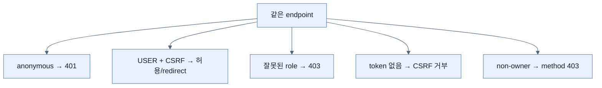

# Spring Security 정책 테스트

## 한눈에 보기

Security test는 같은 endpoint를 미인증, USER, ADMIN 등 서로 다른 principal로 호출해 허용·거부 행렬을 검증한다. `@WithMockUser`가 username/roles를 security context에 넣고 MockMvc POST에는 의도에 맞게 `.with(csrf())`를 추가한다.

## 1. 왜 이게 필요한가

보안 규칙은 허용 경로뿐 아니라 차단 경로가 요구사항이다. 정상 사용자만 시험하면 새 matcher 순서나 포괄 규칙 때문에 익명·잘못된 역할이 접근하는 회귀를 놓친다. 역할, HTTP 동사, CSRF, ownership마다 positive와 negative path를 갖는다.

## 2. 어떻게 동작하는가

애노테이션 없는 GET은 anonymous 요청으로 401을 기대한다. `@WithMockUser(username="alice", roles="USER")`는 ROLE_USER를 부여해 같은 요청의 200을 확인한다. POST 생성은 유효 CSRF token을 준 상태에서 미인증 401과 허용 사용자 redirect를 나란히 검증한다. 인증됐지만 role/owner가 부족한 경우는 403을 기대한다.

401 이름은 Unauthorized지만 의미는 주로 “인증 필요/실패”, 403 Forbidden은 “인증은 됐지만 인가 실패”다. CSRF token을 일부러 빼는 test와 인증을 빼는 test는 실패 원인이 다르므로 분리한다.

## 3. 그림으로 보기

## 4. 이 노트에 나온 용어

- **positive path**: 올바른 자격·입력으로 허용되는 동작을 검증하는 경로.
- **negative path**: 미인증·권한 부족·잘못된 token이 거부되는지 검증하는 경로.
- **WithMockUser**: test security context에 가상 인증 사용자를 넣는 애노테이션.

## 7. 연결

- [[03-testing-web-controllers-with-mockmvc]] — 정책이 실행되는 MVC test pipeline이다.
- [[chapter-4-securing-an-application-with-spring-boot/04-securing-web-routes-and-http-verbs|경로·동사 인가]] — 검증 대상 request matcher다.
- [[chapter-4-securing-an-application-with-spring-boot/06-securing-data-methods-and-object-ownership|객체 ownership]] — role만으로 부족한 negative path다.

## 8. 스스로 확인

- 전체 1차 정리 후: 401, 403, CSRF 실패를 한 테스트로 뭉치지 말아야 하는 이유를 설명한다.

<!-- ==== 아래는 내 영역 · 스킬 수정 금지 ==== -->

## 내 설명 시도

## 막혔던 지점

## 리뷰 이력

