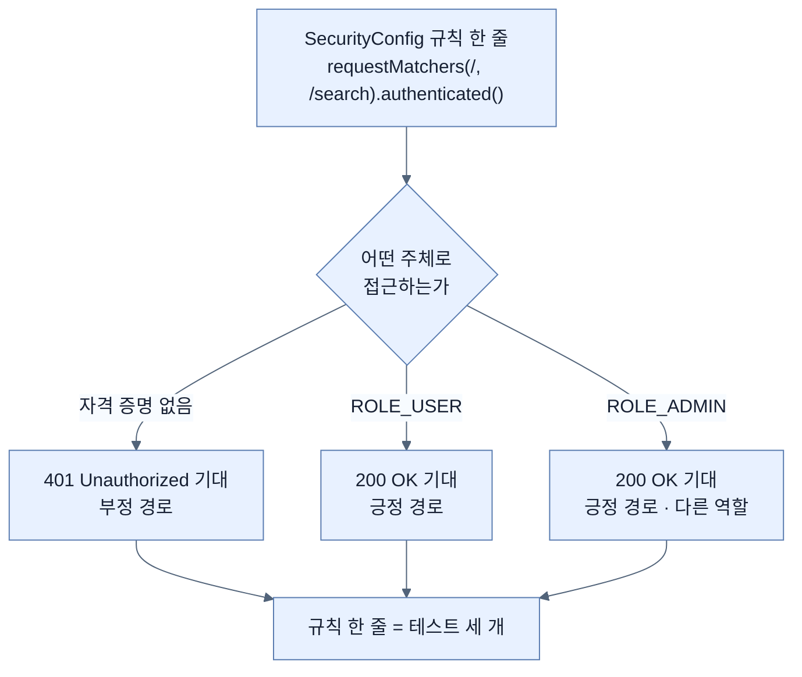

# 보안 정책 테스트 — 되는 것과 안 되는 것을 모두 증명하기

## 한눈에 보기

| 질문 | 핵심 답 |
|---|---|
| 앞에서 이미 보안을 다루지 않았나 | **"그렇기도 하고 아니기도 하다."** 경로를 다 덮지 않았다 |
| `@WebMvcTest`와 보안 | 기본적으로 **보안 정책이 켜진 채로** 온다 |
| 무엇을 먼저 보나 | `SecurityConfig`의 규칙 목록 |
| 가장 중요한 테스트 | **부정 경로** — 안 되는 것이 실제로 안 되는가 |
| `@WithMockUser` **부재** | 그 자체가 설정이다. 미인증 사용자를 뜻한다 |
| 역할이 여럿이면 | **역할마다 별도 테스트**가 필요하다 |
| 401과 403 | 401은 **미인증**, 403은 인증됐으나 **권한 없음** |
| `is3xxRedirection()` | `isFound()`보다 덜 깨지는 단언 |

## 1. 왜 이게 필요한가

### 출발 장면: 이미 한 것 아닌가

[[03-testing-web-controllers-with-mockmvc]]에서 `@WithMockUser`를 썼다. 그러면 보안도 이미 검증한 것 아닌가? 책이 이 질문을 먼저 던지고 답한다.

> 뭔가 떠오르지 않았는가? 이 장 앞에서 `HomeControllerTest`를 쓸 때 보안 관련된 것을 이미 확인하지 않았나?
>
> **그렇기도 하고, 아니기도 하다.**
>
> 이 장 앞에서 Spring Security Test의 `@WithMockUser` 애노테이션을 썼다. 그건 **`@WebMvcTest`가 붙은 어떤 테스트 클래스든 기본적으로 우리의 Spring Security 정책이 적용된 상태로 오기 때문**이다.
>
> 하지만 우리는 **필요한 보안 경로를 전부 덮지 않았다.** 그리고 보안에서는 덮어야 할 경로가 흔히 아주 많다.

### 여기서 뭐가 무너지나

앞 절의 테스트가 실제로 증명한 것은 이것뿐이다.

```text
  indexPageHasSeveralHtmlForms  (@WithMockUser 있음)
  → "인증된 사용자는 홈 페이지를 볼 수 있다"

  postNewVideoShouldWork        (@WithMockUser 있음)
  → "인증된 사용자는 새 비디오를 만들 수 있다"
```

두 테스트 모두 **"되는 것이 된다"**만 증명한다. 그런데 보안 정책의 핵심은 그 반대다 — **"안 되는 것이 안 되는가."**

여기서 무너지는 것이 결정적이다. **보안 설정을 통째로 지워도 위 두 테스트는 그대로 통과한다.** 인증을 아예 요구하지 않으면 인증된 사용자는 당연히 통과하기 때문이다.

```text
  SecurityConfig 를 삭제한다
        │
        ▼
  indexPageHasSeveralHtmlForms  → 통과 ✅   (인증 요구가 없으니 당연히 200)
  postNewVideoShouldWork        → 통과 ✅
        │
        ▼
  테스트는 전부 초록. 애플리케이션은 완전히 열려 있다.
```

### 그래서 나온 생각

**되는 것과 안 되는 것을 모두 증명한다.** 특히 안 되는 쪽을 **[[부정-경로-테스트]]**(= "되면 안 되는 것이 실제로 안 되는가"를 검증하는 테스트)라 하며, 보안에서는 이쪽이 더 중요할 때가 많다.

비유하자면 보안 테스트는 **자물쇠 점검**이다. 열쇠로 열리는지만 확인하면 부족하다 — **열쇠 없이 안 열리는지**도 확인해야 한다.

→ 비유가 깨지는 지점: 자물쇠는 물리적으로 상태가 하나다(잠김/열림). 하지만 보안 정책은 **주체마다 다른 답**을 낸다 — 미인증·`ROLE_USER`·`ROLE_ADMIN`이 각각 다르다. 게다가 **경로마다, HTTP 메서드마다** 또 갈린다. 그래서 "자물쇠 하나를 점검한다"가 아니라 **(주체 × 경로 × 메서드) 격자를 점검하는 일**이 된다. 책이 "역할마다 별도 테스트가 정말 필요하다"고 하는 이유이며, 자물쇠 비유로는 그 조합 폭발이 안 보인다.

## 2. 어떻게 동작하는가

### 2.1 테스트 클래스는 앞과 같다

```java
@WebMvcTest(controllers = HomeController.class)
public class SecurityBasedTest {
    @Autowired MockMvc mvc;
    @MockitoBean VideoService videoService;
}
```

책의 설명 — 이제 익숙해 보이기 시작할 것이다.

- **`@WebMvcTest`** — `HomeController`에 초점을 둔 웹 기반 테스트 클래스임을 나타낸다. **Spring Security 정책이 적용된 상태라는 점을 이해하는 것이 중요하다.**
- **`@Autowired MockMvc`** — 테스트 케이스를 짤 **[[MockMvc]]**(= 서버 없이 Spring MVC 처리 경로를 통과시키는 도구) 인스턴스를 자동 주입한다.
- **`@MockitoBean VideoService`** — 컨텍스트의 `VideoService` 빈을 Mockito 목으로 대체한다. **[[빈-오버라이드]]**(= 컨텍스트의 특정 빈을 가짜로 갈아 끼우는 기능)다.

앞 절과 **똑같은 [[테스트-슬라이스]]**(= 특정 계층만 띄워 검증하는 테스트 구성)를 쓰는데 목적만 다르다. 슬라이스가 보안 필터 체인을 켜 준다는 사실이 여기서는 **검증 대상 그 자체**가 된다.

### 2.2 먼저 정책을 읽는다

테스트를 쓰기 전에 무엇을 검증할지 알아야 한다. `SecurityConfig`를 본다.

```java
return http.authorizeHttpRequests(auth -> auth
    .requestMatchers("/login").permitAll()
    .requestMatchers("/", "/search").authenticated()
    .requestMatchers(HttpMethod.GET, "/api/**").authenticated()
    .requestMatchers(HttpMethod.POST,
        "/delete/**", "/new-video").authenticated()
    .anyRequest().denyAll())
    .formLogin(Customizer.withDefaults())
    .httpBasic(Customizer.withDefaults())
    .build();
```

책이 짚는 것은 위쪽의 한 줄이다 — **`/`에 접근하려면 인증된 접근이 필요하고 그 이상은 아니라는 것**을 나타낸다.

"그 이상은 아니다"가 중요하다. **[[인증]]**(= 당신이 누구인지 증명하는 일)만 요구하고 특정 **[[역할]]**(= 사용자에게 부여되는 권한 묶음의 이름)을 요구하지 않는다. 그래서 `ROLE_USER`든 `ROLE_ADMIN`이든 통과해야 한다 — 그리고 그것도 테스트해야 한다.

**정책을 먼저 읽는 것이 테스트 목록을 만드는 방법**이라는 점을 눈여겨볼 값이 있다. 규칙 한 줄이 테스트 몇 개를 부르는지 세어 보면 이렇다.

```text
  .requestMatchers("/", "/search").authenticated()
        │
        ├─▶ 미인증 → 거부되는가?              (부정 경로)
        ├─▶ ROLE_USER → 허용되는가?           (긍정 경로)
        └─▶ ROLE_ADMIN → 허용되는가?          (긍정 경로 · 다른 역할)

  규칙 한 줄 = 테스트 세 개
```

### 2.3 부정 경로 — 없는 것이 설정이다

```java
@Test
void unauthUserShouldNotAccessHomePage() throws Exception {
    mvc.perform(get("/"))
       .andExpect(status().isUnauthorized());
}
```

책의 항목별 설명이다.

- 이 메서드에는 **`@WithMockUser` 애노테이션이 없다.** 이는 서블릿 컨텍스트에 인증 자격 증명이 저장되지 않는다는 뜻이고, 따라서 **미인증 사용자를 시뮬레이션**한다.
- `mvc.perform(get("/"))` — 루트 경로에 GET 요청을 시뮬레이션한다.
- `status().isUnauthorized()` — 결과가 **HTTP 401 Unauthorized**임을 **[[단언]]**(= 기대와 실제를 비교해 다르면 실패시키는 문장)한다.

첫 항목이 이 테스트에서 가장 미묘하다. **애노테이션이 없다는 사실 자체가 설정**이다. 코드에 보이지 않는 것이 의미를 갖는 드문 경우이며, 그래서 실수로 `@WithMockUser`를 붙이면 이 테스트는 **여전히 통과하지만 아무것도 검증하지 않게 된다.**

책은 이름에 대해서도 한 번 더 강조한다 — 메서드 이름 `unauthUserShouldNotAccessHomePage`는 **기대를 아주 분명히 진술한다.** 그래서 언젠가 깨졌을 때 이 테스트의 요점이 무엇이었는지 정확히 알 수 있고, 더 빨리 고칠 수 있다.

> **원문의 조판 오류**: 책 p.182의 이 리스팅은 실제로 `void () throws Exception {`으로 인쇄되어 **메서드 이름이 비어 있다.** 바로 다음 문단이 "이 테스트의 메서드 이름 `unauthUserShouldNotAccessHomePage`에 주목하라"고 하므로 조판 사고가 분명하다. 위 코드는 그 이름을 복원한 것이다.

> **Note (책 p.182)**: 보안에서 **당신이 누구인지 증명하는 것**을 **인증(authentication)**이라 하고, **당신이 무엇을 할 수 있는지**를 **[[인가]]**(= 당신이 무엇을 해도 되는지 판단하는 일, authorization)라 한다. 그런데 미인증 사용자에 대한 HTTP 상태 코드는 **401 Unauthorized**다. 인증은 됐지만 권한이 없는 것에 접근하려 하면 상태 코드는 **403 Forbidden**이다. **용어가 다소 기묘하게 섞여 있으니** 알아 둘 필요가 있다.

이 Note가 짚는 어긋남을 표로 두면 헷갈리지 않는다.

| 상황 | 개념 | HTTP 상태 | 이름의 문제 |
|---|---|---|---|
| 로그인을 안 했다 | **인증** 실패 | **401 Unauthorized** | 이름은 "인가 안 됨"인데 실제로는 "인증 안 됨" |
| 로그인은 했는데 권한이 없다 | **인가** 실패 | **403 Forbidden** | 이름에 authorization이 없다 |

즉 **401의 이름이 잘못 붙어 있다.** HTTP 초기 명세의 유산이며, 지금 와서 바꿀 수 없어 그대로 남아 있다.

### 2.4 긍정 경로 — 역할마다 하나씩

```java
@Test
@WithMockUser(username = "alice", roles = "USER")
void authUserShouldAccessHomePage() throws Exception {
    mvc.perform(get("/"))
       .andExpect(status().isOk());
}
```

앞의 테스트와 다른 점은 둘뿐이다 — `@WithMockUser`가 사용자 이름 `alice`와 권한 `ROLE_USER`로 인증 토큰을 MockMvc 서블릿 컨텍스트에 밀어 넣고, 같은 `get("/")`에 대해 **다른 결과(200 OK)**를 기대한다.

그리고 책이 범위를 넓힌다.

> 그런데 미인증 사용자와 `ROLE_USER` 사용자만 우리 시스템의 사용자인 것은 아니다. **`ROLE_ADMIN`을 가진 관리자도 있다.** 그리고 **각 역할마다 보안 정책이 제대로 구성됐는지 확인하는 별도 테스트가 정말로 있어야 한다.**

```java
@Test
@WithMockUser(username = "alice", roles = "ADMIN")
void adminShouldAccessHomePage() throws Exception {
    mvc.perform(get("/"))
       .andExpect(status().isOk());
}
```

**앞의 코드와 거의 같다.** 유일한 차이는 `roles = "ADMIN"`이다. 그런데도 별도 테스트가 필요한 이유는, 정책이 `authenticated()`가 아니라 `hasRole("USER")`로 바뀌는 순간 **이 테스트만 빨갛게 되기** 때문이다. 즉 이 테스트는 지금 통과하는 것이 목적이 아니라 **미래의 변경을 감지하는 것**이 목적이다.

책의 정리 — 이 세 테스트가 홈 페이지 접근을 제대로 검증한다.

### 2.5 POST에 대한 부정·긍정 경로

`HomeController`는 새 비디오 추가도 제공하므로 그쪽도 검증해야 한다.

```java
@Test
void newVideoFromUnauthUserShouldFail() throws Exception {
       mvc.perform(
           post("/new-video")
               .param("name", "new video")
               .param("description", "new desc")
               .with(csrf()))
           .andExpect(status().isUnauthorized());
}
```

- 메서드 이름이 미인증 사용자가 새 비디오를 만들지 **못한다**는 것을 검증한다고 분명히 밝힌다. 역시 `@WithMockUser`가 없다.
- `.param("key", "value")` — HTML 폼으로 보통 입력하는 필드를 제공한다.
- **`.with(csrf())`** — **[[CSRF]]**(= 사용자의 브라우저로 의도치 않은 요청을 보내게 만드는 공격) 보호가 켜져 있으므로, 이 설정이 CSRF 값을 넣어 **정당한 접근 시도를 시뮬레이션**한다.
- `status().isUnauthorized()` — HTTP 401을 기대한다.

책이 이 테스트의 요지를 한 문장으로 못 박는다 — **"유효한 CSRF 토큰을 포함해 기대되는 값을 전부 제공해도 예상대로 실패한다."**

이것이 강한 테스트인 이유가 여기 있다. **CSRF 토큰이 없어서 실패하는 것이 아니라, 인증이 없어서 실패한다는 것**을 증명한다. 토큰을 안 넣었다면 실패 원인이 둘로 흐려졌을 것이다.

> **Note (책 p.184)**: Chapter 4에서 Spring Security가 CSRF 공격을 막기 위해 폼과 다른 동작에 CSRF 토큰 검사를 자동으로 켠다는 것을 알았다. **HTML 페이지에 렌더링된 CSRF 토큰이 없는 테스트 케이스에서는, CSRF를 끄지 않으려면 이 값을 여전히 제시해야 한다.**

"CSRF를 끄지 않으려면"이 핵심이다. 테스트를 통과시키는 방법은 둘인데 의미가 완전히 다르다.

```text
  방법 A: CSRF 보호를 끈다
    → 테스트는 통과한다
    → 운영과 다른 설정으로 검증한 것이므로, CSRF 관련 회귀를 못 잡는다

  방법 B: .with(csrf()) 로 올바른 토큰을 공급한다
    → 테스트는 통과한다
    → 운영과 같은 설정으로 검증한 것이다

  ▶ 결과는 같아 보이지만 무엇을 증명했는지가 다르다.
```

이어서 긍정 경로다.

```java
@Test
@WithMockUser(username = "alice", roles = "USER")
void newVideoFromUserShouldWork() throws Exception {
       mvc.perform(
           post("/new-video")
               .param("name", "new video")
               .param("description", "new desc")
               .with(csrf()))
           .andExpect(status().is3xxRedirection())
           .andExpect(redirectedUrl("/"));
}
```

- `@WithMockUser` — 이 사용자는 `ROLE_USER`를 갖는다.
- 같은 값과 CSRF 토큰으로 같은 `POST /new-video`를 하는데 **다른 응답 코드**를 얻는다.
- **`status().is3xxRedirection()`** — 300번대 응답 신호를 받는지 검증한다. **누군가 나중에 soft redirect에서 hard redirect로 바꿔도 테스트가 덜 깨지게** 만든다.
- `redirectedUrl("/")` — **[[리다이렉트]]**(= 다른 URL로 다시 요청하라는 지시) 목적지가 `/`인지 검증한다.

세 번째가 단언 설계에 대한 교훈이다.

| 단언 | 무엇을 고정하나 | 언제 깨지나 |
|---|---|---|
| `status().isFound()` | **302 정확히** | 301·303·307로 바꾸면 깨진다 |
| `status().is3xxRedirection()` | **리다이렉트라는 사실** | 리다이렉트가 아니게 되면 깨진다 |

**의도는 "리다이렉트한다"이지 "302다"가 아니다.** 의도 수준에서 단언하면 구현 변경에 덜 민감해진다.

### 2.6 이 절의 요지

책이 정리한다.

> 이 테스트 메서드의 기계 장치는 앞 테스트 메서드와 동일하다. 유일한 차이는 **설정(alice/`ROLE_USER`)과 결과(`/`로 리다이렉트)**다.
>
> 그리고 이것이 이 테스트 메서드들을 **보안 중심**으로 만드는 것이다. 요점은 **같은 엔드포인트를 서로 다른 자격 증명으로(또는 아무 자격 증명 없이) 접근했을 때 올바른 결과가 나오는지 보는 것**이다.

**같은 요청, 다른 주체, 다른 기대** — 이것이 보안 테스트의 형태다. 요청 부분이 반복되는 것이 중복이 아니라 **통제 변인**이다.

> **책이 지키지 않은 약속 하나**: [[05-testing-repositories-with-embedded-databases]]에서 책은 "아직 테스트하지 않은 리포지토리 메서드가 하나 있는데 `delete()`다. 이 장 뒤 *Testing security policies with Spring Security Test* 절에서 다루겠다"고 예고했다. 그러나 이 절에는 `delete()` 테스트가 **없다.** `delete`가 등장하는 곳은 `SecurityConfig`의 규칙 목록(`"/delete/**"`)뿐이다. 이 장을 따라가며 그 테스트를 찾고 있었다면 없는 것이 맞으며, 위 네 테스트의 형식을 그대로 `POST /delete/{id}`에 적용해 직접 써 보는 것이 자연스러운 연습이 된다.

## 3. 그림으로 보기

### 보안 테스트는 격자를 채우는 일이다



### 긍정 경로만 있으면 무엇을 놓치는가

```text
  [SecurityConfig 를 통째로 지웠다]

    authUserShouldAccessHomePage      → 200 → 통과 ✅
    adminShouldAccessHomePage         → 200 → 통과 ✅
    newVideoFromUserShouldWork        → 302 → 통과 ✅

    unauthUserShouldNotAccessHomePage → 200 → 실패 ❌  ← 유일하게 잡아낸다
    newVideoFromUnauthUserShouldFail  → 302 → 실패 ❌  ← 유일하게 잡아낸다

  ▶ 긍정 경로 테스트는 "보안이 없어도" 전부 통과한다.
  ▶ 정책이 실제로 존재한다는 증거는 부정 경로 테스트뿐이다.
```

### 401과 403 — 이름과 뜻의 어긋남

```text
                  개념                    HTTP 상태            이름이 말하는 것
  ─────────────  ────────────────────    ─────────────────   ──────────────────
  로그인 안 함    인증(authentication)     401 Unauthorized     "인가 안 됨"  ← 어긋남
                  실패
  ─────────────  ────────────────────    ─────────────────   ──────────────────
  로그인은 했으나  인가(authorization)      403 Forbidden        "금지됨"
  권한 없음        실패                                          (authorization 없음)

  ▶ 401 의 이름이 잘못 붙어 있다. HTTP 초기 명세의 유산이라 지금은 바꿀 수 없다.
  ▶ 테스트를 쓸 때는 이름이 아니라 위 왼쪽 열(개념)을 보고 고른다.
```

### 단언을 어느 수준에 두는가

| 검증하려는 의도 | 너무 좁은 단언 | 적절한 단언 |
|---|---|---|
| 리다이렉트한다 | `isFound()` (302 고정) | **`is3xxRedirection()`** |
| 목적지가 `/`다 | — | `redirectedUrl("/")` |
| 미인증은 막힌다 | 본문 문자열 비교 | **`isUnauthorized()`** |
| 화면에 폼이 있다 | HTML 전체 비교 | `contains("<form action=…")` |

## 4. 이 노트에 나온 용어

| 용어 | 한 줄 풀이 | 자세히 |
|---|---|---|
| 인증 | 당신이 누구인지 증명하는 일 | [[_glossary#인증]] |
| 인가 | 당신이 무엇을 해도 되는지 판단하는 일 | [[_glossary#인가]] |
| 역할 | 사용자에게 부여되는 권한 묶음의 이름 | [[_glossary#역할]] |
| 부정 경로 테스트 | 되면 안 되는 것이 실제로 안 되는지 검증 | [[_glossary#부정-경로-테스트]] |
| CSRF | 사용자의 브라우저로 의도치 않은 요청을 보내게 하는 공격 | [[_glossary#CSRF]] |
| MockMvc | 서버 없이 Spring MVC 처리 경로를 통과시키는 도구 | [[_glossary#MockMvc]] |
| 테스트 슬라이스 | 특정 계층만 띄워 검증하는 테스트 구성 | [[_glossary#테스트-슬라이스]] |
| 빈 오버라이드 | 컨텍스트의 특정 빈을 가짜로 갈아 끼우는 기능 | [[_glossary#빈-오버라이드]] |
| 리다이렉트 | 다른 URL로 다시 요청하라는 지시 | [[_glossary#리다이렉트]] |
| 단언 | 기대와 실제를 비교해 다르면 실패시키는 문장 | [[_glossary#단언]] |

## 5. 자주 헷갈리는 것

### 401 Unauthorized = 권한 없음

**아니다.** 401은 **인증되지 않음**이고, 권한 없음은 403 Forbidden이다. 이름이 뜻과 어긋나 있으므로 코드가 아니라 **개념으로** 골라야 한다.

### `@WithMockUser`가 없는 것은 실수다

이 절에서는 **의도된 설정**이다. 부정 경로 테스트에 실수로 붙이면 테스트는 통과하지만 아무것도 검증하지 않는다. 없는 것이 의미를 갖는 드문 경우다.

### `.with(csrf())`가 CSRF를 끈다

**반대다.** 보호를 켠 채로 올바른 토큰을 공급한다. 끄고 통과하는 것과 갖추고 통과하는 것은 **무엇을 증명했는지가 다르다.**

### 긍정 경로만 있어도 보안을 테스트한 것이다

**아니다.** 보안 설정을 통째로 지워도 긍정 경로는 전부 통과한다. 정책이 존재한다는 증거는 부정 경로뿐이다.

### `ROLE_USER`와 `ROLE_ADMIN` 테스트가 같으면 하나만 쓰면 된다

지금은 결과가 같지만, **정책이 바뀌면 갈린다.** 이 테스트들은 현재를 확인하는 것이 아니라 **미래의 변경을 감지**하는 장치다.

### `roles = "USER"`와 `ROLE_USER`

`@WithMockUser(roles = "USER")`는 내부적으로 `ROLE_` 접두어를 붙여 `ROLE_USER`를 만든다. 그래서 `roles = "ROLE_USER"`라고 쓰면 `ROLE_ROLE_USER`가 되어 정책과 안 맞는다.

## 6. 언제 안 쓰나 / 경계

- 이 절은 **경로 기반 규칙**만 테스트한다. 메서드 수준 보안(`@PreAuthorize`)이나 객체 소유권 검사는 다른 방식이 필요하다.
- `@WithMockUser`는 **가짜 인증**이다. 실제 로그인 흐름(폼 로그인, OAuth 리다이렉트, 토큰 검증)은 검증하지 않는다.
- (주체 × 경로 × 메서드) 격자를 다 채우면 테스트가 빠르게 늘어난다. 규칙이 많은 애플리케이션에서는 파라미터화 테스트로 격자를 표현하는 편이 현실적이다.
- 책이 예고한 `delete()` 테스트가 이 절에 없다. 형식은 위 네 테스트와 같으므로 직접 써 보는 것이 좋지만, **책을 따라가며 찾을 것은 아니다.**
- `@WebMvcTest` 슬라이스는 컨트롤러 계층까지만 본다. 서비스나 리포지토리 수준의 권한 검사는 여기서 안 드러난다.

## 7. 연결

- [[03-testing-web-controllers-with-mockmvc]] — 같은 슬라이스와 같은 도구를 쓰지만 목적이 다르다. 거기서 "보안을 통과하려고" 쓴 `@WithMockUser`가 여기서는 "보안을 검증하려고" 쓰인다.
- [[07-testing-repositories-with-testcontainers]] — 리포지토리 계층까지 검증을 마친 뒤 남은 마지막 계층이 보안이다.
- [[05-testing-repositories-with-embedded-databases]] — 그 절이 `delete()` 테스트를 이 절로 미뤘다는 예고와, 실제로는 다뤄지지 않았다는 사실을 함께 확인할 수 있다.

## 8. 스스로 확인

1. 앞 절의 보안 관련 테스트가 실제로 증명한 것은 무엇이고 증명하지 못한 것은 무엇인가?
2. `SecurityConfig`를 통째로 지웠을 때 어떤 테스트가 실패하고 어떤 테스트가 통과하는가? 그 사실이 뜻하는 바는?
3. 자물쇠 비유가 깨지는 지점은 어디인가? 격자의 세 축은 무엇인가?
4. 규칙 한 줄이 테스트 세 개를 부르는 이유를 설명할 수 있는가?
5. 부정 경로 테스트에서 `@WithMockUser`가 없는 것이 왜 "설정"인가?
6. 401과 403의 이름과 뜻이 어긋난 지점을 정확히 말할 수 있는가?
7. `.with(csrf())`를 넣고도 401이 나야 하는 것이 왜 더 강한 테스트인가?
8. `is3xxRedirection()`이 `isFound()`보다 나은 이유를 단언 수준으로 설명할 수 있는가?
9. `ROLE_USER`와 `ROLE_ADMIN` 테스트가 지금은 같은데도 둘 다 필요한 이유는?

<!-- ==== 아래는 내 영역 · 스킬 수정 금지 ==== -->

## 내 설명 시도


## 막혔던 지점


## 리뷰 이력
