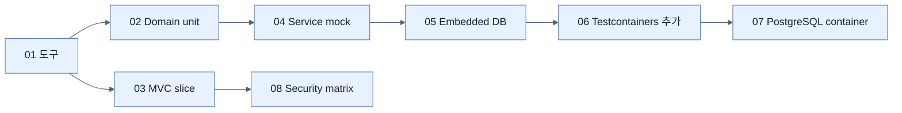

# Chapter 5 지도 — Testing with Spring Boot

## 현실성 ↔ 속도 축

| 범위 | 속도 | 실제성과 주요 목적 |
|---|---|---|
| Domain unit | 매우 빠름 | 순수 object 규칙 |
| Service + mocks | 빠름 | 분기와 collaborator protocol |
| MVC/Data slice | 중간 | framework mapping·query |
| Testcontainers | 느림 | 실제 DB product behavior |

## 위험 축

빠른 테스트를 많이 두고, mock이 숨기는 통합 위험은 slice와 container test로 선택적으로 덮는다. 보안은 허용과 거부 경로를 모두 검증한다.

