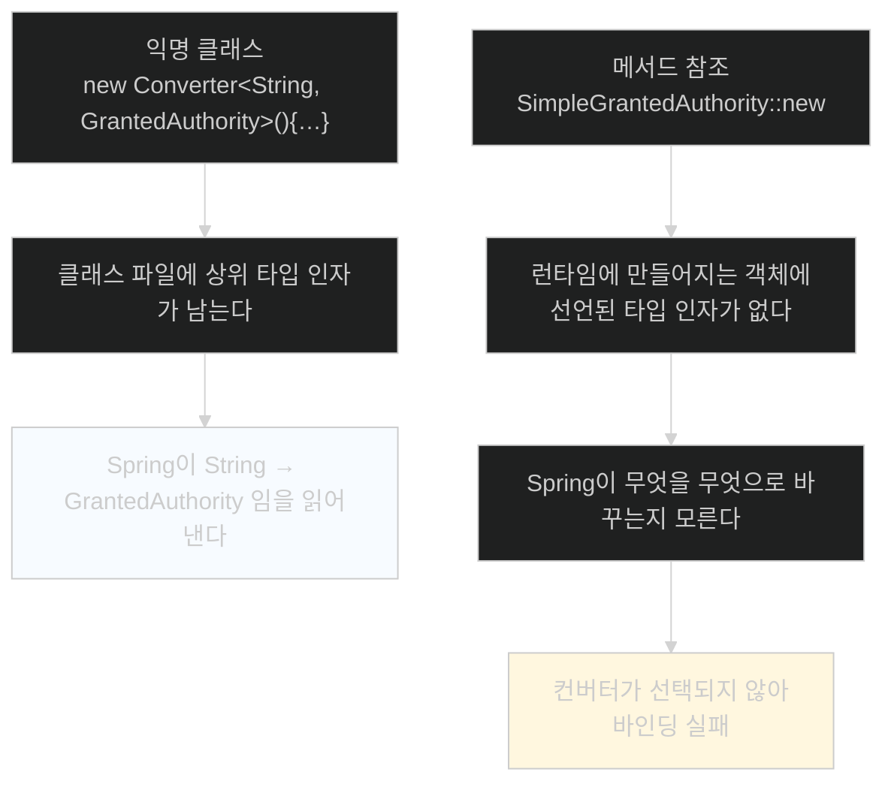
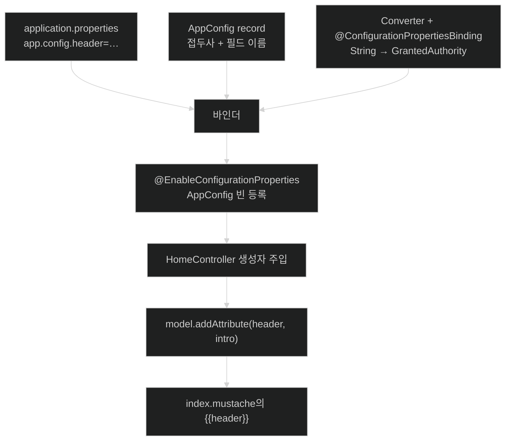

# 내 설정을 타입으로 선언하기 — @ConfigurationProperties

## 한눈에 보기

| 질문 | 핵심 답 |
|---|---|
| 무엇을 만드나 | 내 프로퍼티 묶음을 담는 **자바 타입** |
| 선언 | `@ConfigurationProperties("app.config")`가 붙은 record |
| 필드가 하는 일 | 필드 이름이 곧 프로퍼티 이름이 된다 (`header` → `app.config.header`) |
| record인 이유 | 정규 생성자가 하나뿐이라 **`@ConstructorBinding`이 필요 없다** |
| 등록 | `@EnableConfigurationProperties(AppConfig.class)` 또는 `@ConfigurationPropertiesScan` |
| 리스트는 | `app.config.users[0].username` 처럼 **대괄호 인덱스**로 편다 |
| 복합 타입이 안 되면 | `Converter`를 만들고 `@ConfigurationPropertiesBinding`을 붙인다 |
| 그 컨버터를 람다로 줄이면 | **동작하지 않는다.** 타입 소거로 제네릭 정보가 사라진다 |

## 1. 왜 이게 필요한가

### 출발 장면: 화면 문구가 소스 코드에 박혀 있다

Chapter 4까지 만든 동영상 사이트의 `index.mustache`는 이렇게 시작한다.

```html
<h1>Greetings Learning Spring Boot 4.0 fans!</h1>
<p>In this chapter, we are learning how to make a web app using Spring Boot 4.0</p>
```

테스트 팀에게 "테스트 환경입니다"라고 알려 주고 싶다면? 소스를 고쳐 다시 빌드하고 다시 배포해야 한다. 문구 하나 바꾸는 데 배포 파이프라인이 돈다.

같은 문제가 사용자 목록에도 있다. Chapter 4에서 alice·bob·admin을 `CommandLineRunner` 안에 하드코딩했다. 테스트 팀이 자기들 계정으로 시나리오를 돌리려면 역시 코드를 고쳐야 한다.

### `@Value` 하나씩 꺼내는 방식의 한계

값을 밖으로 빼는 가장 단순한 방법은 이것이다.

```java
@Value("${app.config.header}")
private String header;
@Value("${app.config.intro}")
private String intro;
```

동작은 한다. 그런데 문제가 셋이다.

| 문제 | 결과 |
|---|---|
| 키가 **문자열**이다 | 오타를 컴파일러가 못 잡는다. 값을 쓰는 순간 터진다 |
| 관련된 값들이 흩어진다 | "이 앱이 가진 설정이 뭐지?"에 답하려면 코드 전체를 grep 해야 한다 |
| 복합 구조를 못 담는다 | `List<UserAccount>` 같은 것을 `@Value` 하나로 받을 수 없다 |

**[[외부화된-설정]]**(= 연결 대상의 좌표와 자격 증명을 코드 밖에 두는 방식)을 제대로 하려면 값 하나가 아니라 **설정 한 벌**을 다룰 수 있어야 한다.

## 2. 어떻게 동작하는가

### 2.1 설정을 타입으로 선언한다

```java
@ConfigurationProperties("app.config")
public record AppConfig(String header, String intro,
    List<UserAccount> users) {
}
```

세 줄에 세 가지 결정이 들어 있다.

| 요소 | 하는 일 | 없으면 |
|---|---|---|
| **[[ConfigurationProperties]]**(= 접두사로 시작하는 프로퍼티들을 자바 타입에 묶어 주는 애노테이션) | 이 타입이 **[[설정-프로퍼티]]**(= `key=value` 한 쌍으로 표현되는 설정 항목)의 출처임을 표시 | 그냥 평범한 record가 된다 |
| `"app.config"` — **[[프로퍼티-접두사]]**(= 그 타입이 담당할 프로퍼티들의 공통 앞부분) | 필드 이름 앞에 붙어 전체 키를 만든다 | 키를 만들 수 없다 |
| record 컴포넌트 3개 | 각각 `app.config.header`, `app.config.intro`, `app.config.users`가 된다 | — |

이름이 `AppConfig`인 것은 아무 의미가 없다. 책도 "무슨 이름을 붙이든 상관없다"고 못 박는다. 키를 만드는 것은 **접두사와 필드 이름**뿐이다.

여기서 얻는 것이 **[[타입-안전-바인딩]]**(= 프로퍼티 값을 선언된 자바 타입으로 변환해 넣는 것)이다. `header`가 `String`이고 `users`가 `List<UserAccount>`라고 선언해 두면, 값이 그 모양이 아닐 때 **기동 시점에** 실패한다. 값을 쓰는 순간까지 오류가 미뤄지지 않는다.

### 2.2 record를 고른 이유

**[[record]]**(= 필드·정규 생성자·접근자를 자동 생성하는 자바의 불변 데이터 타입)를 쓰면 setter가 없다. 그러면 Spring은 어떻게 값을 넣을까.

**[[생성자-바인딩]]**(= setter 대신 생성자 인자로 프로퍼티를 주입하는 방식)이다. 책이 Note로 짚는다 — record는 컴포넌트와 일치하는 **정규 생성자**를 갖고, Spring Boot는 바인딩할 때 그것을 자동으로 쓴다.

그래서 **[[ConstructorBinding]]**(= 생성자가 여러 개일 때 어느 것으로 바인딩할지 지정하는 애노테이션)이 필요 없다. 이 애노테이션은 `@ConfigurationProperties` 타입에 생성자가 **여러 개**일 때만 필요하다.

생성자 바인딩이 주는 것은 편의가 아니라 성질이다.

| 성질 | 왜 좋은가 |
|---|---|
| 불변 | 기동 후 아무도 설정을 바꿀 수 없다. 런타임 중 값이 달라지는 사고가 없다 |
| 완전한 상태 | 객체가 만들어졌다면 모든 필드가 채워진 것이다. 반쯤 채워진 중간 상태가 없다 |
| `final` 가능 | 스레드 안전성을 공짜로 얻는다 |

### 2.3 값을 채운다

```properties
app.config.header=Greetings Learning Spring Boot 4.0 fans!
app.config.intro=In this chapter, we are learning how to
    make a web app using Spring Boot 4.0
app.config.users[0].username=alice
app.config.users[0].password=password
app.config.users[0].authorities[0]=ROLE_USER
app.config.users[1].username=bob
app.config.users[1].password=password
app.config.users[1].authorities[0]=ROLE_USER
app.config.users[2].username=admin
app.config.users[2].password=password
app.config.users[2].authorities[0]=ROLE_ADMIN
```

`header`와 `intro`는 그냥 문자열이다. 눈여겨볼 것은 `users`다.

**[[인덱스-표기법]]**(= 대괄호와 숫자로 리스트의 몇 번째 항목인지 지정하는 표기)이 필요한 이유는 `.properties` 형식의 한계다. 이 형식에는 **계층이 없다.** 한 줄이 키 하나와 값 하나뿐이다. 그래서 "리스트의 0번째 항목의 username"을 표현하려면 그 경로를 키 이름 안에 전부 적어야 한다.

`authorities[0]`처럼 **중첩 리스트**까지 나오면 줄이 급격히 길어진다. 사용자 3명에 11줄이다. 이 투박함이 [[03-switching-to-yaml-and-metadata]]로 넘어가는 동기가 된다.

### 2.4 등록해야 쓸 수 있다

프로퍼티 파일에 값을 적었다고 애플리케이션이 쓸 수 있는 것은 아니다. `AppConfig`를 빈으로 만들어 줄 무언가가 필요하다.

```java
@SpringBootApplication
@EnableConfigurationProperties(AppConfig.class)
public class Chapter6Application {
    public static void main(String[] args) {
        SpringApplication.run(Chapter6Application.class, args);
    }
}
```

**[[EnableConfigurationProperties]]**(= 지정한 설정 타입을 빈으로 등록해 주입 가능하게 만드는 애노테이션)를 붙이면 `AppConfig` 빈이 컨텍스트에 올라가고 값이 바인딩된다.

책은 Tip으로 "어디에 붙이는 게 좋은가"에 답한다.

| 상황 | 권장 위치 | 이유 |
|---|---|---|
| 특정 빈 하나만 쓰는 설정 | **그 빈 정의에** | "이 빈은 설정 한 벌을 동반한다"가 코드에 드러난다 |
| 여러 빈이 쓰는 앱 전역 설정 | **진입점 클래스에** | 소유자가 특정되지 않으므로 최상위에 둔다 |

기술적으로는 아무 데나 붙여도 된다 — **[[컴포넌트-스캔]]**(= 표시된 클래스를 찾아 빈으로 등록하는 동작)에 잡히는 Spring 빈이기만 하면 컨텍스트에 추가된다. 위치 선택은 동작이 아니라 **의도 표현**의 문제다.

대안도 있다. **[[ConfigurationPropertiesScan]]**(= `@ConfigurationProperties` 타입을 패키지에서 훑어 자동 등록하는 애노테이션)을 쓰면 타입을 하나하나 나열하지 않아도 된다. 설정 타입이 늘어날수록 유리하다.

### 2.5 주입해서 쓴다

```java
@Controller
public class HomeController {
     private final VideoService videoService;
     private final AppConfig appConfig;
     public HomeController(VideoService videoService,
         AppConfig appConfig) {
             this.videoService = videoService;
             this.appConfig = appConfig;
     }
     …rest of the class…
```

`AppConfig`는 이제 평범한 빈이므로 생성자 주입으로 받는다. 여기가 `@Value` 방식과 갈리는 지점이다. **설정이 객체 하나로 들어오므로 어떤 설정을 쓰는지가 생성자 시그니처에 드러난다.**

```java
@GetMapping
public String index(Model model,
    Authentication authentication) {
    model.addAttribute("videos", videoService.getVideos());
    model.addAttribute("authentication", authentication);
    model.addAttribute("header", appConfig.header());
    model.addAttribute("intro", appConfig.intro());
    return "index";
}
```

`appConfig.header()`는 record의 접근자다. 그 값을 모델에 담고 템플릿을 고친다.

```html
<h1>{{header}}</h1>
<p>{{intro}}</p>
```

하드코딩이 템플릿 변수가 됐다. 이제 문구를 바꾸는 데 재빌드가 필요 없다.

### 2.6 `users`가 안 되는 이유

책은 여기서 솔직하게 묻는다 — "문자열 두 개 빼낸 게 그렇게 대단한가?" 진짜 힘은 `users`에 있는데, 이건 그냥은 안 된다.

이유는 근본적이다. **프로퍼티 파일은 문자열 key-value 쌍이다.** 값에 따옴표가 없을 뿐 사실상 전부 문자열로 취급된다. 그런데 `UserAccount` 안의 `authorities`는 `List<GrantedAuthority>`이고, `GrantedAuthority`는 인터페이스다.

```text
"ROLE_USER"  --???-->  GrantedAuthority
```

`String → int`, `String → boolean` 같은 흔한 변환은 Spring이 내장 **[[컨버터]]**(= 한 타입의 값을 다른 타입으로 바꾸는 함수형 인터페이스)로 처리한다. 하지만 `String → GrantedAuthority`는 자명하지 않다. 어떤 구현체를 만들어야 하는지 Spring이 알 도리가 없다.

그래서 직접 만들어 등록한다. 사용자 계정 관련 코드이므로 이미 있는 `SecurityConfig`에 넣는다.

```java
@Bean
@ConfigurationPropertiesBinding
Converter<String, GrantedAuthority> converter() {
    return new Converter<String, GrantedAuthority>() {
         @Override
         public GrantedAuthority convert(String source) {
             return new SimpleGrantedAuthority(source);
         }
    };
}
```

| 요소 | 하는 일 |
|---|---|
| `@Bean` | 컨텍스트에 등록해야 발견된다 |
| **[[ConfigurationPropertiesBinding]]**(= 이 컨버터를 설정 바인딩에 쓰라고 표시하는 애노테이션) | 일반 변환이 아니라 **프로퍼티 바인딩용**임을 알린다 |
| `convert(String)` | 문자열을 `SimpleGrantedAuthority`로 감싼다 |

`@ConfigurationPropertiesBinding`에는 중요한 단서가 붙는다. **바인딩은 애플리케이션 생명주기의 아주 이른 시점에 일어난다.** 그래서 이 컨버터에 다른 Spring 빈을 주입하면 안 된다. 아직 만들어지지 않았을 수 있기 때문이다. 자기 완결적으로 유지해야 한다.

### 2.7 IDE의 조언을 따르면 깨진다

익명 클래스 여섯 줄을 보면 IDE가 줄이라고 권한다.

```java
return source -> new SimpleGrantedAuthority(source);   // 람다
return SimpleGrantedAuthority::new;                    // 메서드 참조
```

**둘 다 동작하지 않는다.** 원인은 자바의 **[[타입-소거]]**(= 컴파일 후 제네릭 타입 인자를 지워 버리는 성질)다.



핵심은 **선언으로 박혀 있는가**다. 익명 클래스는 `Converter<String, GrantedAuthority>`를 구현한다고 **클래스 파일에 적혀 있다.** **[[메서드-참조]]**(= 기존 메서드나 생성자를 람다 대신 가리키는 문법)로 만든 객체에는 그 선언이 없다. Spring의 **[[제네릭-타입-해석]]**(= 빈의 실제 제네릭 타입 인자를 알아내는 과정)이 읽을 것이 없어진다.

### 2.8 그래도 짧게 쓰고 싶다면

방법이 있다. **타입 인자를 선언에 박아 둔 이름을 만들면 된다.**

```java
interface GrantedAuthorityCnv extends Converter<String,
    GrantedAuthority> {}
@Bean
@ConfigurationPropertiesBinding
GrantedAuthorityCnv converter() {
    return SimpleGrantedAuthority::new;
}
```

`GrantedAuthorityCnv`는 메서드를 하나도 추가하지 않는다. 하는 일은 `Converter<String, GrantedAuthority>`라는 조합에 **이름을 붙이는 것**뿐이다. 그런데 그 이름이 인터페이스 선언이므로 타입 인자가 클래스 파일에 남는다. 이제 메서드 참조를 써도 Spring이 읽을 곳이 생긴다.

책의 평가가 솔직하다 — 코드량은 사실상 같고, **같은 정보를 어디에 두느냐의 차이**일 뿐이다. 빈 정의 안에 다 펼쳐 두는 게 읽기 쉬운지, 별도 인터페이스로 빼는 게 나은지는 취향이다.

> **원문 공백.** 이 절은 `app.config.users`를 정의하고 컨버터까지 만들지만, **그 사용자들이 Spring Security에 어떻게 도달하는지는 끝내 보여 주지 않는다.** Chapter 4의 `UserDetailsService`는 `UserRepository`(데이터베이스)를 보고 있었고, 이 장은 그것을 바꾸는 코드를 제시하지 않는다. 실제로 소비되는 경로가 나오는 것은 `header`와 `intro`뿐이다. 또 `UserAccount`를 재정의하지 않는데, Chapter 4의 `UserAccount`는 `@Id @GeneratedValue`가 붙은 JPA 엔티티다.

## 3. 그림으로 보기



| 축 | `@Value` | `@ConfigurationProperties` |
|---|---|---|
| 다루는 단위 | 값 하나 | **설정 한 벌** |
| 키 오타 | 런타임에 발견 | 바인딩 시점에 발견 |
| 복합 타입 | 어렵다 | `List<UserAccount>`도 된다 |
| 설정 목록 파악 | 코드 전체 grep | **타입 하나를 읽으면 끝** |
| 메타데이터 생성 | 안 된다 | 된다 ([[03-switching-to-yaml-and-metadata]]) |

## 4. 이 노트에 나온 용어

| 용어 | 한 줄 뜻 | 정의 위치 |
|---|---|---|
| 외부화된 설정 | 연결 대상의 좌표를 코드 밖에 두는 방식 | [[_glossary#외부화된-설정]] |
| 설정 프로퍼티 | `key=value` 한 쌍의 설정 항목 | [[_glossary#설정-프로퍼티]] |
| @ConfigurationProperties | 접두사로 시작하는 프로퍼티를 타입에 묶는 애노테이션 | [[_glossary#ConfigurationProperties]] |
| 프로퍼티 접두사 | 그 타입이 담당할 프로퍼티의 공통 앞부분 | [[_glossary#프로퍼티-접두사]] |
| 타입 안전 바인딩 | 값을 선언된 자바 타입으로 변환해 넣는 것 | [[_glossary#타입-안전-바인딩]] |
| record | 자동 생성 접근자를 갖는 불변 데이터 타입 | [[_glossary#record]] |
| 생성자 바인딩 | setter 대신 생성자로 값을 주입 | [[_glossary#생성자-바인딩]] |
| @ConstructorBinding | 생성자가 여럿일 때 바인딩 대상을 지정 | [[_glossary#ConstructorBinding]] |
| @EnableConfigurationProperties | 설정 타입을 빈으로 등록 | [[_glossary#EnableConfigurationProperties]] |
| @ConfigurationPropertiesScan | 설정 타입을 훑어 자동 등록 | [[_glossary#ConfigurationPropertiesScan]] |
| 컴포넌트 스캔 | 표시된 클래스를 찾아 빈으로 등록 | [[_glossary#컴포넌트-스캔]] |
| 인덱스 표기법 | 대괄호로 리스트 항목을 지정 | [[_glossary#인덱스-표기법]] |
| Converter | 타입 변환 함수형 인터페이스 | [[_glossary#컨버터]] |
| @ConfigurationPropertiesBinding | 설정 바인딩용 컨버터 표시 | [[_glossary#ConfigurationPropertiesBinding]] |
| 타입 소거 | 컴파일 후 제네릭 인자를 지우는 성질 | [[_glossary#타입-소거]] |
| 메서드 참조 | 기존 메서드·생성자를 가리키는 문법 | [[_glossary#메서드-참조]] |
| 제네릭 타입 해석 | 빈의 실제 제네릭 인자를 알아내는 과정 | [[_glossary#제네릭-타입-해석]] |

## 5. 자주 헷갈리는 것

**"`AppConfig`라는 이름이 프로퍼티 키에 영향을 준다"** — 주지 않는다. 키를 만드는 것은 접두사와 필드 이름뿐이다. 클래스 이름은 자유다.

**"record니까 `@ConstructorBinding`을 붙여야 한다"** — 생성자가 하나뿐이면 필요 없다. 여러 개일 때만 필요하다.

**"프로퍼티 파일에 적으면 바로 쓸 수 있다"** — 등록해야 한다. `@EnableConfigurationProperties`나 `@ConfigurationPropertiesScan` 없이는 빈이 만들어지지 않는다.

**"IDE가 권하는 대로 람다로 줄이면 된다"** — 컨버터에서는 깨진다. 타입 소거로 제네릭 정보가 사라져 Spring이 컨버터를 고르지 못한다. **컴파일은 통과하고 런타임에 바인딩이 실패한다.**

**"`@ConfigurationPropertiesBinding` 컨버터에 다른 빈을 주입해도 된다"** — 바인딩이 매우 이른 시점에 일어나므로 안전하지 않다. 자기 완결적으로 유지해야 한다.

## 6. 언제 안 쓰나 / 경계

- **값 하나만 필요하면 `@Value`가 간단하다.** 설정 묶음이 아니라 진짜로 값 하나라면 타입을 만들 이유가 없다.
- **런타임에 바뀌어야 하는 값은 이 방식이 맞지 않다.** 생성자 바인딩으로 만든 record는 불변이라 기동 후 갱신되지 않는다.
- **리스트가 길어지면 `.properties`가 버겁다.** 사용자 3명에 11줄이고, 인덱스를 손으로 관리해야 한다. 그 부담이 [[03-switching-to-yaml-and-metadata]]의 동기다.
- **비유의 한계.** `@ConfigurationProperties`는 "설정 값들을 담는 서식 있는 신청서"에 가깝다. 칸마다 무엇을 적어야 하는지(타입)가 정해져 있어서, 잘못 적으면 접수 단계에서 반려된다. 다만 이 비유는 **신청서를 제출한 뒤에는 고칠 수 없다**는 점을 흐린다. 실제로 이 객체는 기동 시점에 한 번 채워지고 그대로 굳는다. 접수 후 정정이 가능한 서류가 아니라, 봉인되는 서류에 가깝다.

## 7. 연결

- [[02-creating-profile-based-property-files]] — 여기서 만든 `AppConfig`의 값을 환경마다 다르게 공급하는 방법을 다룬다.
- [[03-switching-to-yaml-and-metadata]] — `users[0].authorities[0]` 같은 인덱스 표기의 투박함을 YAML이 해소하고, 이 타입이 IDE 코드 완성에 뜨게 만든다.
- [[05-ordering-property-overrides]] — 여기서 쓴 `application.properties`가 전체 우선순위 목록에서 어디쯤인지 확인한다.

## 8. 스스로 확인

1. `@Value`로 값을 하나씩 꺼내는 방식의 문제 세 가지를 각각의 결과와 함께 말할 수 있는가?
2. 프로퍼티 키를 결정하는 두 요소는 무엇이며, 클래스 이름은 왜 무관한가?
3. record에 setter가 없는데 값이 채워지는 메커니즘은?
4. `@EnableConfigurationProperties`를 특정 빈에 붙일 때와 진입점에 붙일 때의 판단 기준은?
5. `.properties`에서 리스트를 인덱스로 펴야 하는 근본 이유는?
6. `String → GrantedAuthority` 변환에 컨버터가 필요한 이유는?
7. 메서드 참조로 줄이면 깨지는 이유를 "선언에 남는가"로 설명할 수 있는가?
8. `GrantedAuthorityCnv`가 메서드를 하나도 추가하지 않는데도 문제를 푸는 이유는?
9. 봉인되는 서류 비유가 깨지는 지점은 어디인가?


> 아홉 문항을 스스로 답한 **뒤에** [[_01-creating-custom-properties]]에서 모범답안과 대조한다. 먼저 열면 이 문항들은 다시 인출 문제로 쓸 수 없다.

<!-- ==== 아래는 내 영역 · 스킬 수정 금지 ==== -->

## 내 설명 시도


## 막혔던 지점


## 리뷰 이력
