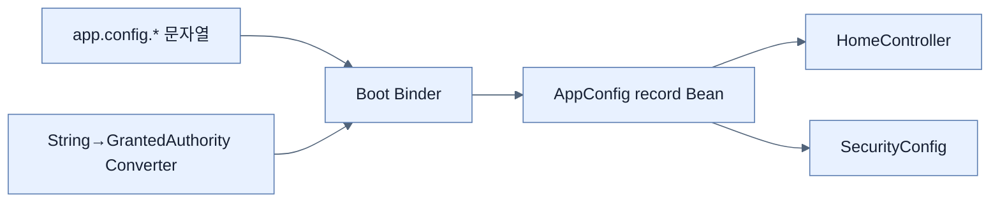

# Type-safe Custom Properties 만들기

## 한눈에 보기

`@ConfigurationProperties("app.config")` record는 header, intro, users 같은 관련 설정을 타입 있는 값 객체로 묶는다. `@EnableConfigurationProperties` 또는 scan으로 Bean을 등록하면 Boot binder가 properties 값을 생성자에 변환·주입한다.

## 1. 왜 이게 필요한가

여러 곳에서 `@Value` 문자열 키를 반복하면 rename·검증·IDE 탐색이 어렵다. 응집된 설정 타입은 application의 외부 계약을 코드로 표현하고 controller·security config가 constructor injection으로 안전하게 소비하게 한다.

## 2. 어떻게 동작하는가

Record의 canonical constructor가 자동 binding 지점이므로 단일 생성자에는 `@ConstructorBinding`이 필요 없다. list는 `users[0].username`처럼 index key로 채운다. 문자열을 `GrantedAuthority`처럼 domain type으로 바꿀 때 `@ConfigurationPropertiesBinding Converter`를 등록한다. Binder가 아주 이른 시점에 쓰므로 converter는 self-contained여야 한다.

Lambda의 generic type이 runtime type erasure로 사라져 converter 선택이 어려울 수 있다. 익명 class로 `Converter<String, GrantedAuthority>`를 보존하거나 generic을 고정한 named subinterface를 사용한다.

## 3. 그림으로 보기

## 4. 이 노트에 나온 용어

- **configuration binding**: 외부 key/value를 타입 있는 객체 graph로 변환하는 과정.
- **ConfigurationProperties**: prefix 기반 type-safe 설정 binding을 선언하는 애노테이션.
- **type erasure**: Java generic parameter 정보 일부가 runtime에 지워지는 규칙.

## 7. 연결

- [[02-creating-profile-based-property-files]] — 동일 설정 타입에 환경별 값을 덮는다.
- [[03-switching-to-yaml-and-metadata]] — 중첩 list 표현과 IDE metadata를 개선한다.
- [[chapter-1-core-features-of-spring-boot/03-customizing-the-setup-with-configuration-properties|외부 설정 기초]] — Boot의 일반 property model 위에 놓인다.

## 8. 스스로 확인

- 전체 1차 정리 후: record binding에 별도 constructor annotation이 필요 없는 조건과 custom converter의 type erasure 문제를 설명한다.

<!-- ==== 아래는 내 영역 · 스킬 수정 금지 ==== -->

## 내 설명 시도

## 막혔던 지점

## 리뷰 이력

