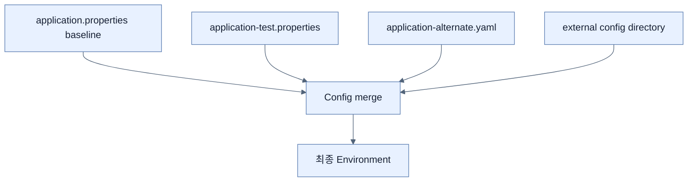

# Profile별 Property File 구성

## 한눈에 보기

`application-test.properties`는 `test` profile이 활성화될 때 기본 `application.properties` 위에 추가된다. 같은 scalar key는 뒤의 profile 값이 이기지만 list는 element별 merge가 아니라 전체 replacement가 된다. 여러 profile은 comma 순서대로 적용된다.

## 1. 왜 이게 필요한가

개발·테스트·운영은 DB, broker, 외부 API, 사용자 구성이 다르다. 바이너리를 다시 만들지 않고 환경만 바꾸려면 차이만 profile로 분리하고 공통 baseline은 한곳에 둬야 한다.

## 2. 어떻게 동작하는가

JVM option `-Dspring.profiles.active=test`, 환경 변수, IDE run config로 active profile을 정한다. Profile은 기본 파일을 없애지 않고 추가되므로 중복 key만 override한다. 운영을 기본으로 두면 profile 누락이 실제 운영 자원 연결로 이어질 수 있어 책은 development baseline + 명시적 production profile이 더 안전하다고 설명한다.

운영 설정은 보통 JAR 안에 넣지 않는다. `spring.config.additional-location`은 기본 search location을 유지한 채 외부 경로를 더하고, `spring.config.location`은 기본 위치를 교체한다. 대개 additional/import가 덜 놀랍다.

## 3. 그림으로 보기

## 4. 이 노트에 나온 용어

- **profile**: 환경·기능별로 함께 활성화할 설정과 Bean의 이름 붙은 집합.
- **additive configuration**: 기본 설정을 유지하고 선택한 source를 위에 겹치는 방식.
- **list replacement**: profile별 collection이 항목별 합쳐지지 않고 전체 교체되는 binding behavior.

## 7. 연결

- [[04-setting-properties-with-environment-variables]] — active profile을 runtime에서 주입한다.
- [[05-ordering-property-overrides]] — 여러 source와 profile의 최종 승자를 정한다.
- [[03-switching-to-yaml-and-metadata]] — alternate profile을 YAML로 표현할 수 있다.

## 8. 스스로 확인

- 전체 1차 정리 후: profile이 기본 파일을 대체하지 않는다는 말과 list 전체 교체를 함께 설명한다.

<!-- ==== 아래는 내 영역 · 스킬 수정 금지 ==== -->

## 내 설명 시도

## 막혔던 지점

## 리뷰 이력

