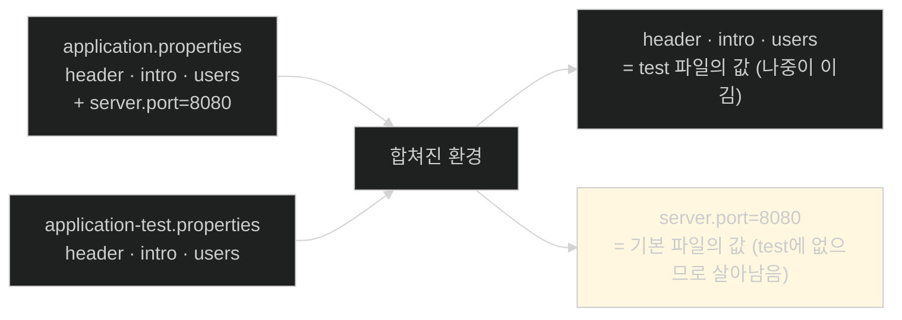
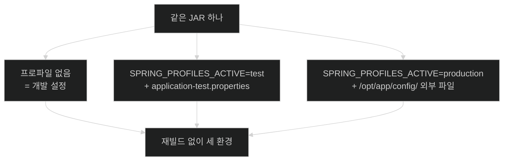

# 환경마다 다른 값 — 프로파일은 대체가 아니라 덧칠이다

## 한눈에 보기

| 질문 | 핵심 답 |
|---|---|
| 파일 이름 규칙 | `application-{프로파일}.properties` |
| 활성화 방법 3가지 | `-Dspring.profiles.active=test` · `export SPRING_PROFILES_ACTIVE=test` · IDE 실행 구성 |
| 프로파일 파일은 | 기본 파일을 **대체하지 않는다.** 위에 얹힌다(가산적) |
| 같은 키가 양쪽에 있으면 | **나중에 적용된 쪽**(프로파일)이 이긴다 |
| 리스트가 양쪽에 있으면 | **병합되지 않는다.** 통째로 교체된다 |
| 여러 개 켜려면 | 쉼표로 나열. 왼쪽에서 오른쪽으로 적용 |
| 기본값을 무엇으로 둘까 | **개발**을 기본으로 두는 쪽이 안전하다 |
| 운영 설정은 | 아티팩트에 넣지 않고 **실행 시점에 밖에서** 공급한다 |

## 1. 왜 이게 필요한가

### 출발 장면: 같은 JAR이 네 곳에서 돈다

[[01-creating-custom-properties]]에서 문구와 사용자를 `application.properties`로 뺐다. 그런데 현실의 애플리케이션은 한 맥락에서만 돌지 않는다.

| 환경 | 무엇이 다른가 |
|---|---|
| 개발 | 로컬 H2, 개발자 본인 계정 |
| 테스트 | 테스트 전용 DB, 테스트 팀 계정과 역할 |
| 스테이징 | 운영과 같은 구성의 별도 인프라 |
| 운영 | 실제 DB, 실제 메시지 브로커, 실제 인증 제공자 |

프로퍼티 파일이 하나뿐이면 이 넷을 어떻게 감당할까. 세 가지 나쁜 답이 있다.

1. **환경마다 다른 JAR을 빌드한다** → 배포한 것과 테스트한 것이 다른 바이너리가 된다. **[[불변-아티팩트]]**(= 한 번 빌드한 뒤로는 내용을 고치지 않는 배포물) 원칙이 깨진다.
2. **배포할 때 JAR을 열어 프로퍼티를 고친다** → [[04-setting-properties-with-environment-variables]]에서 책이 강하게 금지하는 방법이다.
3. **코드에 `if (env == "test")`를 넣는다** → 환경 목록이 코드에 박혀 새 환경을 추가할 때마다 재빌드다.

**[[프로파일]]**(= "이 설정 묶음은 이 상황에서만 쓴다"고 이름 붙이는 장치)이 네 번째 답이다.

## 2. 어떻게 동작하는가

### 2.1 파일 이름이 곧 선언이다

```properties
app.config.header=Greetings Test Team!
app.config.intro=If you run into issues while testing, let me know!
app.config.users[0].username=test1
app.config.users[0].password=password
app.config.users[0].authorities[0]=ROLE_NOTHING
app.config.users[1].username=test2
app.config.users[1].password=password
app.config.users[1].authorities[0]=ROLE_USER
app.config.users[2].username=test3
app.config.users[2].password=password
app.config.users[2].authorities[0]=ROLE_ADMIN
```

이 내용을 `application-test.properties`에 담는다. 특별한 애노테이션도 등록도 없다. **[[프로파일별-프로퍼티-파일]]**(= 파일 이름에 `-{프로파일}`을 붙인 설정 파일)의 규칙은 파일 이름뿐이다.

| 요소 | 하는 일 |
|---|---|
| `-test` 접미사 | 이 파일을 `test` 프로파일과 묶는다 |
| 맞춤 메시지 | 화면만 봐도 테스트 환경임을 알 수 있다 |
| 환경별 사용자 | 테스트 팀이 각자 역할로 시나리오를 돌린다 |

`test1`에게 붙은 `ROLE_NOTHING`을 눈여겨보자. Chapter 4의 인가 규칙([[../../part-2-creating-an-application-with-spring-boot/chapter-4-securing-an-application-with-spring-boot/05-securing-web-routes-and-http-verbs|Chapter 4 · 경로 인가]])에는 이런 역할이 없다. **아무 권한도 없는 사용자로 "막히는 경로"를 시험하기 위한 계정**이다. 성공 경로만이 아니라 실패 경로를 시험하려면 이런 계정이 필요하다.

### 2.2 활성화하는 세 가지 방법

```bash
-Dspring.profiles.active=test          # JVM 시스템 프로퍼티
export SPRING_PROFILES_ACTIVE=test     # 환경 변수 (Unix)
```

세 번째는 IDE다. IntelliJ IDEA라면 실행 구성의 **Active profiles** 필드에 `test`를 적는다. 그 필드 아래에는 "Comma-separated list of profiles"라는 힌트가 붙어 있어, 여러 개를 쉼표로 나열할 수 있다는 사실이 화면에 그대로 적혀 있다.

세 방법의 공통점이 중요하다. **셋 다 애플리케이션 바깥에서 정한다.** 코드에도, JAR 안에도 "지금 어느 프로파일인가"가 적혀 있지 않다. 같은 아티팩트가 실행 시점의 지시에 따라 다르게 동작한다.

> **원문이 짚지 않는 것.** 이 절은 `-D`(시스템 프로퍼티)와 `SPRING_PROFILES_ACTIVE`(환경 변수)를 **동등한 선택지**로 제시한다. 그런데 같은 장 뒤의 우선순위 목록([[05-ordering-property-overrides]])을 보면 **[[시스템-프로퍼티]]**(= `-D`로 JVM에 넘기는 값)가 **[[환경-변수]]**(= 셸이 프로세스에 넘겨주는 이름-값 쌍)보다 높다. 둘을 동시에 지정하면 `-D` 쪽이 이긴다는 사실이 언급되지 않는다.

### 2.3 프로파일은 덧칠이다

여기가 이 절에서 가장 오해하기 쉬운 지점이고, 책도 Tip 하나를 통째로 쓴다.

**프로파일 파일은 기본 파일을 대체하지 않는다.** `test` 프로파일을 켜면 `application-test.properties`가 **추가로** 읽힌다. 이 성질이 **[[가산적]]**(= 프로파일 설정이 기본 설정 위에 얹히는 성질)이다.



노란 칸이 "덧칠"의 실질적 의미다. `server.port`처럼 프로파일 파일에 **없는** 키는 기본 파일의 값이 그대로 남는다. 그래서 프로파일 파일에는 **달라지는 것만** 적으면 된다.

같은 키가 양쪽에 있으면 나중에 적용된 쪽이 이긴다. `application.properties`가 기본값을 제공하고 `application-test.properties`가 그 뒤에 적용되므로, `header`·`intro`·`users`는 테스트 값으로 덮인다.

### 2.4 리스트는 예외다

Tip의 두 번째 문단이 함정을 경고한다.

**리스트·컬렉션 프로퍼티는 병합되지 않는다.** `users`가 양쪽 파일에 있으면 프로파일 쪽 리스트가 **전체를 교체한다.**

| 상황 | 스칼라 값 (`header`) | 리스트 (`users`) |
|---|---|---|
| 기본에만 있음 | 기본값 | 기본 리스트 |
| 프로파일에만 있음 | 프로파일 값 | 프로파일 리스트 |
| 양쪽에 있음 | 프로파일 값 | **프로파일 리스트로 통째 교체** |
| 기본 3개 + 프로파일 1개 | — | **최종 1개** (4개가 아니다) |

마지막 줄이 **[[리스트-교체]]**(= 리스트는 병합되지 않고 우선순위가 높은 출처의 것으로 통째로 갈아치워지는 규칙)의 결과다. Spring Boot 공식 문서도 같은 규칙을 명시한다.

이 규칙이 왜 이런가. **병합 규칙을 정할 방법이 없기 때문이다.** 두 리스트를 합친다면 순서는? 중복은 어떻게 판정하나? 같은 인덱스를 겹쳐 쓰나? 답이 하나로 정해지지 않는다. 그래서 Spring Boot는 "합치지 않는다"는 단순하고 예측 가능한 규칙을 골랐다.

실무에서 이걸 모르면 이런 사고가 난다 — 기본 파일에 사용자 3명을 두고 테스트 프로파일에 1명만 추가했는데 **기본 3명이 전부 사라진다.**

### 2.5 무엇을 기본값으로 둘 것인가

개발 랩(축소된 서버), 테스트 베드(별도 서버 한 벌), 운영(정규 서버)이 있는 상황에서 책은 두 전략을 대비시킨다.

| 전략 | 기본 파일에 담기는 것 | 프로파일 없이 실행하면 | 평가 |
|---|---|---|---|
| **개발을 기본으로** | 개발 설정 | 개발 환경에 붙는다 | **더 안전하고 흔한 방법** |
| 운영을 기본으로 | 운영 설정 | **운영에 붙는다** | 위험 |

두 번째의 위험이 구체적이다. 프로파일 지정을 깜빡한 실행이 **의도치 않게 운영 시스템에 연결된다.** 로컬에서 테스트를 돌렸는데 운영 DB를 건드리는 상황이 여기서 나온다.

여기에도 같은 설계 원칙이 있다 — **실수했을 때 어느 쪽으로 넘어지는가.** [[../../part-2-creating-an-application-with-spring-boot/chapter-4-securing-an-application-with-spring-boot/01-spring-security-filter-chain-foundations|Chapter 4]]에서 Spring Security의 기본값이 "전부 잠김"이었던 것과 같은 판단이다.

### 2.6 운영 설정은 아티팩트 밖에 있다

책이 이 절 끝에서 한 걸음 더 나간다. **실무에서 운영 설정은 애플리케이션 아티팩트 안에 담기지 않는다.**

이유는 명확하다. `application-production.properties`를 JAR에 넣으면 그 안에 운영 DB 주소와 자격 증명이 들어간다. 그 JAR은 형상 관리에 들어가고, 개발자 노트북에 복사되고, CI 로그에 남는다.

대신 실행 시점에 밖에서 공급한다.

```bash
-Dspring.config.additional-location=file:/opt/app/config/
```

여기서 두 프로퍼티의 차이가 중요하다.

| 프로퍼티 | 하는 일 | 결과 |
|---|---|---|
| `spring.config.location` | Spring Boot의 **기본 탐색 위치를 대체한다** | classpath의 `application.properties`가 **더 이상 읽히지 않는다** |
| **[[spring.config.additional-location]]**(= 기본 탐색 위치에 추가로 볼 경로를 지정) | 기본 위치에 **더한다** | 기본값은 살아 있고 외부 값이 덮는다 |

책의 권고가 그래서 나온다 — 대부분의 경우 `spring.config.additional-location`이나 **[[spring.config.import]]**(= 설정 파일 안에서 다른 설정 소스를 끌어오는 프로퍼티)를 쓰라. 기본 탐색 동작을 유지한 채 필요한 위치만 더하는 쪽이 안전하다.

환경 변수 `SPRING_CONFIG_ADDITIONAL_LOCATION`으로도 같은 일을 할 수 있다. 이 방식은 **[[외부화된-설정]]**(= 연결 대상의 좌표를 코드 밖에 두는 방식)의 핵심을 지킨다 — 민감하거나 환경에 종속된 값이 애플리케이션 바이너리 밖에 머문다.

같은 원리가 클라우드에서도 그대로다. AWS든 Azure든 VMware Tanzu든, 코드를 고치는 게 아니라 **환경마다 알맞은 설정을 공급해** 애플리케이션을 적응시킨다.

## 3. 그림으로 보기



| 무엇이 | 어디에 있나 | 왜 |
|---|---|---|
| 코드 | JAR 안 | 환경에 무관하다 |
| 개발 기본값 | JAR 안 `application.properties` | 실수해도 안전한 쪽 |
| 테스트 설정 | JAR 안 `application-test.properties` | 민감하지 않다 |
| **운영 설정** | **JAR 밖** `/opt/app/config/` | 자격 증명이 바이너리에 남으면 안 된다 |
| 어느 프로파일인가 | 실행 명령 | 아티팩트가 불변으로 유지된다 |

## 4. 이 노트에 나온 용어

| 용어 | 한 줄 뜻 | 정의 위치 |
|---|---|---|
| 프로파일 | 상황별 설정 묶음에 이름을 붙이는 장치 | [[_glossary#프로파일]] |
| 프로파일별 프로퍼티 파일 | 이름에 `-{프로파일}`이 붙은 설정 파일 | [[_glossary#프로파일별-프로퍼티-파일]] |
| 가산적 | 프로파일 설정이 기본 위에 얹히는 성질 | [[_glossary#가산적]] |
| 리스트 교체 | 리스트는 병합되지 않고 통째로 갈리는 규칙 | [[_glossary#리스트-교체]] |
| 환경 변수 | 셸이 프로세스에 넘기는 이름-값 쌍 | [[_glossary#환경-변수]] |
| 시스템 프로퍼티 | `-D`로 JVM에 넘기는 값 | [[_glossary#시스템-프로퍼티]] |
| spring.config.additional-location | 기본 탐색 위치에 추가로 볼 경로 | [[_glossary#spring.config.additional-location]] |
| spring.config.import | 설정 파일 안에서 다른 소스를 끌어옴 | [[_glossary#spring.config.import]] |
| 외부화된 설정 | 연결 대상의 좌표를 코드 밖에 두는 방식 | [[_glossary#외부화된-설정]] |
| 불변 아티팩트 | 빌드 후 고치지 않는 배포물 | [[_glossary#불변-아티팩트]] |

## 5. 자주 헷갈리는 것

**"프로파일 파일이 기본 파일을 대체한다"** — 덧칠한다. 프로파일 파일에 없는 키는 기본값이 그대로 살아남는다. 그래서 프로파일 파일에는 **달라지는 것만** 적는다.

**"리스트도 덧칠된다"** — 안 된다. 리스트는 통째로 교체된다. 기본 3명 + 프로파일 1명 = **1명**이다.

**"`-D`와 환경 변수는 완전히 같다"** — 결과는 같지만 우선순위가 다르다. 둘 다 지정하면 `-D`가 이긴다.

**"`spring.config.location`을 쓰면 안전하다"** — 기본 탐색 위치를 **갈아치운다.** classpath의 `application.properties`가 읽히지 않아 기본값이 통째로 사라진다. 대개는 `additional-location`이 맞다.

## 6. 언제 안 쓰나 / 경계

- **프로파일이 많아지면 조합 폭발이 온다.** `dev`, `test`, `prod` × `mysql`, `postgres` × `cloud`, `onprem` 식으로 쌓이면 어느 조합이 실제로 쓰이는지 추적이 어려워진다.
- **프로파일은 비밀 관리 수단이 아니다.** 파일에 담기는 이상 그 파일을 볼 수 있는 사람은 값을 본다. 자격 증명은 전용 비밀 관리 도구가 맡아야 한다.
- **비유의 한계.** 프로파일은 "기본 도면 위에 올리는 투명 필름"에 가깝다. 필름에 그린 선만 바뀌고 나머지는 원래 도면이 비쳐 보인다. 다만 이 비유는 **리스트가 통째로 교체된다**는 예외를 담지 못한다. 필름 비유대로라면 사용자 목록도 겹쳐 보여야 하는데, 실제로는 필름에 사용자 칸이 하나라도 그려져 있으면 아래 도면의 사용자 칸 전체가 가려진다.

## 7. 연결

- [[01-creating-custom-properties]] — 여기서 만든 `AppConfig`의 값을 이 노트가 환경마다 다르게 공급한다.
- [[04-setting-properties-with-environment-variables]] — 프로파일을 명령줄에서 켜는 방법과 다중 프로파일의 적용 순서를 자세히 다룬다.
- [[05-ordering-property-overrides]] — `-D`와 환경 변수의 우선순위 차이, JAR 안팎 설정 파일의 순서가 그 노트에 정리돼 있다.

## 8. 스스로 확인

1. 프로퍼티 파일이 하나뿐일 때의 세 가지 나쁜 해법과 각각의 문제는?
2. 프로파일 파일을 만드는 데 필요한 것은 무엇인가? 애노테이션이 필요한가?
3. `ROLE_NOTHING` 계정이 존재하는 이유를 테스트 관점에서 설명할 수 있는가?
4. "가산적"이라는 성질이 프로파일 파일의 내용을 어떻게 바꾸는가?
5. 리스트가 병합되지 않는 이유를 "병합 규칙을 정할 수 없다"로 설명할 수 있는가?
6. 개발을 기본값으로 두는 것이 안전한 이유는? 어떤 사고를 막는가?
7. `spring.config.location`과 `additional-location`의 차이와, 후자를 권하는 이유는?
8. 투명 필름 비유가 깨지는 지점은 어디인가?


> 여덟 문항을 스스로 답한 **뒤에** [[_02-creating-profile-based-property-files]]에서 모범답안과 대조한다. 먼저 열면 이 문항들은 다시 인출 문제로 쓸 수 없다.

<!-- ==== 아래는 내 영역 · 스킬 수정 금지 ==== -->

## 내 설명 시도


## 막혔던 지점


## 리뷰 이력
