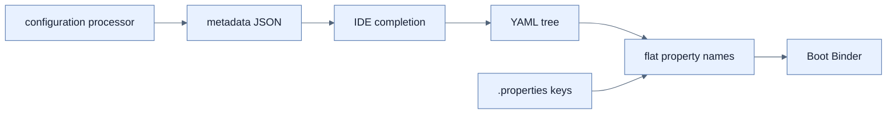

# YAML과 Configuration Metadata

## 한눈에 보기

YAML은 반복 prefix 대신 indentation과 hyphen으로 중첩 object/list를 표현한다. Properties와 같은 `Environment`에 binding되므로 형식 선택이 application code를 바꾸지는 않는다. configuration processor는 custom property metadata를 생성해 IDE completion과 설명을 제공한다.

## 1. 왜 이게 필요한가

`users[2].authorities[0]`처럼 중첩 collection을 properties로 쓰면 key 반복이 길어진다. YAML은 구조를 눈에 보이게 하지만 큰 파일에서는 indentation 한 칸의 실수가 멀리 영향을 줄 수 있다. 읽기 쉬운 단위로 파일을 나누고 schema-like metadata로 오타를 앞당겨 찾는다.

## 2. 어떻게 동작하는가

YAML map 계층은 dot-separated key로 평탄화되고 list hyphen은 index binding으로 바뀐다. 따라서 `app.config.users`가 같은 record list에 들어간다. `spring-boot-configuration-processor` annotation processor는 `@ConfigurationProperties` 타입에서 key, type, description metadata를 빌드해 IDE가 built-in property처럼 completion한다. 보통 optional build-time dependency로 둔다.

YAML은 tree를 보여주는 접힌 지도다. 중복은 줄지만 긴 tree의 위치 민감성과 anchor/복잡한 syntax는 새 부담이므로 무조건 더 낫지는 않다.

## 3. 그림으로 보기

## 4. 이 노트에 나온 용어

- **YAML**: indentation 기반 map/list 데이터 직렬화 형식.
- **configuration processor**: custom property metadata를 compile time에 생성하는 annotation processor.
- **metadata**: key·type·description·hint 등 설정 tooling용 정보.

## 7. 연결

- [[01-creating-custom-properties]] — metadata가 설명할 type-safe 설정 선언이다.
- [[02-creating-profile-based-property-files]] — profile마다 properties/YAML 중 원하는 형식을 쓸 수 있다.
- [[05-ordering-property-overrides]] — 형식이 달라도 동일한 precedence model에 들어간다.

## 8. 스스로 확인

- 전체 1차 정리 후: YAML로 바꿔도 `@ConfigurationProperties` code가 그대로인 이유를 설명한다.

<!-- ==== 아래는 내 영역 · 스킬 수정 금지 ==== -->

## 내 설명 시도

## 막혔던 지점

## 리뷰 이력

