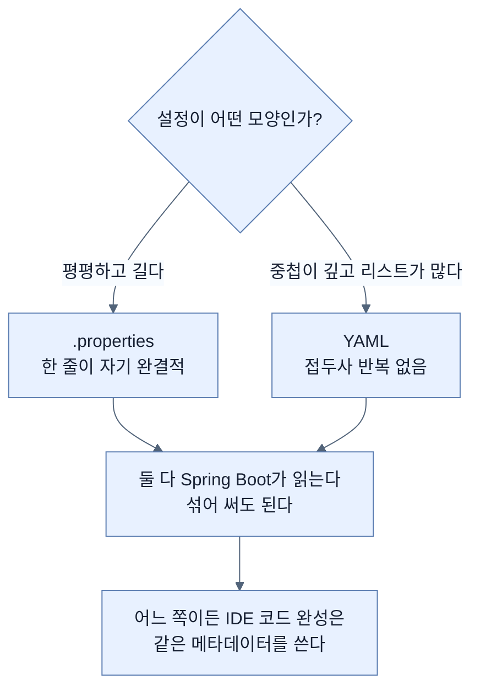

# 들여쓰기로 접두사를 없애기 — YAML과 설정 메타데이터

## 한눈에 보기

| 질문 | 핵심 답 |
|---|---|
| 왜 바꾸나 | 설정이 늘면 key/value 방식이 감당이 안 된다. 특히 **인덱스를 손으로 적는 리스트** |
| YAML이 하는 일 | 계층을 들여쓰기로 표현해 **접두사 반복을 없앤다** |
| 배열 표기 | 하이픈 `-` |
| 대가 | **들여쓰기가 곧 문법**이다. 긴 파일에서 오류를 찾기 어렵다 |
| 어느 쪽이 정답인가 | 둘 다 쓸 수 있다. Spring의 방식은 선택지를 주는 것 |
| 코드 완성이 되는 이유 | IDE가 **설정 메타데이터** JSON을 읽는다 |
| 내 프로퍼티도 뜨게 하려면 | `spring-boot-configuration-processor` 의존성 |
| 그 의존성의 scope | `<optional>true</optional>` — 빌드에만 필요하다 |

## 1. 왜 이게 필요한가

### 출발 장면: 사용자 세 명에 열한 줄

[[01-creating-custom-properties]]에서 만든 설정을 다시 보자.

```properties
app.config.users[0].username=alice
app.config.users[0].password=password
app.config.users[0].authorities[0]=ROLE_USER
app.config.users[1].username=bob
app.config.users[1].password=password
app.config.users[1].authorities[0]=ROLE_USER
app.config.users[2].username=admin
app.config.users[2].password=password
app.config.users[2].authorities[0]=ROLE_ADMIN
```

`app.config.users`가 **아홉 번** 반복된다. 그리고 `[0]`, `[1]`, `[2]`를 사람이 관리한다. 사용자를 중간에 하나 끼워 넣으려면 아래 인덱스를 전부 밀어야 한다.

이 투박함은 형식의 한계에서 온다. `.properties`에는 **계층이 없다.** 한 줄이 키 하나와 값 하나뿐이므로, 구조를 표현하려면 그 구조를 키 이름 안에 문자열로 인코딩할 수밖에 없다. **[[인덱스-표기법]]**(= 대괄호로 리스트 항목을 지정하는 표기)이 바로 그 인코딩이다.

책은 이 절을 "Spring의 방식은 선택지를 주는 것"이라는 말로 연다. 개발자마다 상황이 다르고, Spring은 같은 일을 하는 여러 길을 열어 둔다. Chapter 4의 OAuth2 설정에서 이미 YAML을 한 번 썼다([[../../part-2-creating-an-application-with-spring-boot/chapter-4-securing-an-application-with-spring-boot/08b-adding-oauth-client-to-a-spring-boot-project|Chapter 4 · OAuth 클라이언트 배선]]).

## 2. 어떻게 동작하는가

### 2.1 같은 설정을 YAML로

`src/main/resources/application-alternate.yaml`을 만든다.

```yaml
app:
    config:
      header: Greetings from YAML-based settings!
      intro: Check out this page hosted from YAML
      users:
           -
               username: yaml1
               password: password
               authorities:
                - ROLE_USER
           -
               username: yaml2
               password: password
               authorities:
                - ROLE_USER
           -
               username: yaml3
               password: password
               authorities:
                - ROLE_ADMIN
```

**[[YAML]]**(= 들여쓰기로 계층을 표현하는 데이터 표기 형식)이 하는 일을 항목별로 보자.

| 요소 | 하는 일 | `.properties`와 비교 |
|---|---|---|
| `app:` / `config:` 중첩 | **[[프로퍼티-접두사]]**(= 공통 앞부분)를 한 번만 쓴다 | 아홉 번 반복하던 것이 한 번 |
| 하이픈 `-` | 배열 항목 하나의 시작 | `[0]`, `[1]`을 손으로 세던 것이 사라진다 |
| 항목 안의 필드 줄들 | `users`가 복합 타입(`List<UserAccount>`)이라 각 필드가 별도 줄 | 같다 |
| `authorities:` 아래 하이픈 | `authorities` 자체도 리스트 | `authorities[0]`이 하이픈 하나로 |

책의 정리 그대로다 — **중복을 피해서 짧아지고, 중첩 구조 덕에 각 프로퍼티가 어디에 속하는지 눈에 보인다.**

인덱스가 사라진 것이 특히 크다. 항목을 중간에 끼워 넣어도 아래를 건드릴 필요가 없다. **순서 관리를 사람에서 형식으로 옮긴 것**이다.

### 2.2 짧아진 대가

책은 Note로 균형을 잡는다. **YAML은 작은 설정 파일에서 읽기 좋지만 파일이 길어지면 나빠진다.**

원인은 장점과 같은 것이다. **[[들여쓰기-유의]]**(= 들여쓰기 자체가 문법이 되어 공백 하나가 구조를 바꾸는 성질) 때문이다.

| | `.properties` | YAML |
|---|---|---|
| 한 줄의 의미 | **자기 완결적**. 그 줄만 봐도 전체 키를 안다 | 위쪽 들여쓰기에 의존한다 |
| 공백 실수의 영향 | 없다 | **구조가 바뀐다** |
| 200줄 파일에서 오류 찾기 | 그 줄만 보면 된다 | 위로 거슬러 올라가야 한다 |
| 병합 충돌 | 줄 단위로 명확 | 들여쓰기가 어긋나기 쉽다 |

책의 경고가 구체적이다 — **큰 파일에서 위쪽에 생긴 오류는 찾기 어렵다.** 300줄짜리 YAML에서 40번째 줄의 들여쓰기가 두 칸 어긋나면, 그 아래 260줄이 통째로 엉뚱한 부모 밑으로 들어간다. 그런데 오류는 저 아래 어딘가에서 "알 수 없는 프로퍼티" 형태로 보고된다.

그래서 이건 **우열이 아니라 트레이드오프**다. 짧고 중첩이 깊은 설정에는 YAML, 평평하고 긴 설정에는 `.properties`가 낫다.

### 2.3 IDE가 아는 이유

책은 여기서 화제를 하나 더 얹는다. 요즘 IDE는 `.properties`와 `.yaml` 양쪽에서 **[[코드-완성]]**(= 입력 중인 키에 맞는 후보를 띄워 주는 기능)을 지원한다.

이게 어떻게 가능할까. IDE가 Spring Boot의 소스를 읽는 게 아니다. **[[설정-메타데이터]]**(= 설정 키의 이름·타입·설명을 담은 `META-INF/spring-configuration-metadata.json`)라는 파일을 읽는다.

Spring Boot의 각 모듈은 자기가 제공하는 설정 키들을 이 JSON에 실어 배포한다. IDE는 classpath에서 그 파일들을 모아 완성 목록을 만든다. 그래서 `server.`까지 치면 `server.port`가 뜨는 것이다.

책이 짚는 부수 효과도 있다 — 완성 목록에는 표준 key/value 표기로 뜨지만, YAML 파일에서 고르면 **YAML 형식으로 자동 변환돼 삽입된다.**

### 2.4 내 프로퍼티도 뜨게 하려면

여기가 이 절이 [[01-creating-custom-properties]]와 이어지는 지점이다. IDE 지원은 내장 프로퍼티만의 것이 아니다. **내가 만든 `@ConfigurationProperties` 타입도 완성 목록에 띄울 수 있다.**

필요한 것은 의존성 하나다.

```xml
<dependency>
   <groupId>org.springframework.boot</groupId>
   <artifactId>spring-boot-configuration-processor
   </artifactId>
   <optional>true</optional>
</dependency>
```

**[[spring-boot-configuration-processor]]**(= `@ConfigurationProperties` 타입을 컴파일 시점에 훑어 설정 메타데이터를 생성하는 애노테이션 프로세서)가 하는 일은 이름 그대로다.


`<optional>true</optional>`가 붙는 이유가 명확하다. 이 프로세서는 **컴파일할 때만** 필요하다. 생성된 JSON은 JAR에 들어가지만 프로세서 자체는 런타임에 아무 일도 하지 않는다. `optional`로 두면 이 프로젝트를 의존하는 다른 프로젝트에 전이되지 않는다.

책은 실용적인 단서를 붙인다 — Spring Initializr가 설정 메타데이터 지원을 고르면 이미 넣어 주는 경우가 많으니, **손으로 추가하기 전에 `pom.xml`을 먼저 확인하라.**

### 2.5 실제로 무엇이 뜨는가

![[_assets/lsb4-p201-fig6-2-intellij-completion-for-custom-properties.png]]

이 화면이 이 절의 주장을 그대로 증명한다. `app`까지만 쳤는데 팝업 맨 위에 우리가 만든 것들이 떠 있다.

```text
app.config.users     List<UserAccount>
app.config.header    String
app.config.intro     String
```

**이름만이 아니라 선언한 타입까지 함께** 나온다. 메타데이터 JSON이 `@ConfigurationProperties` 타입의 필드 타입을 그대로 담기 때문이다. [[01-creating-custom-properties]]에서 얻은 **[[타입-안전-바인딩]]**(= 값을 선언된 자바 타입으로 변환해 넣는 것)이 여기서 편집기 지원으로 되돌아온다 — 타입을 선언해 뒀기 때문에 IDE가 그 타입을 보여 줄 수 있다.

목록 아래쪽에는 `server.jetty.accesslog.append`, `spring.application.name` 같은 내장 프로퍼티들이 섞여 있다. **내 프로퍼티와 프레임워크 프로퍼티가 같은 메커니즘 위에 있다**는 뜻이다.

편집 중인 파일 위쪽에 `spring.mustache.servlet.expose-request-attributes: true`가 보이는 것도 눈여겨볼 만하다. Chapter 4에서 Mustache에 CSRF 토큰을 노출하려고 넣었던 그 설정이 YAML 표기로 바뀌어 있다.

> **원문 불일치.** 본문은 `application-alternate.yaml`을 만들라고 하는데 이 화면의 편집기 탭은 `application-alt.yaml`이다. 실행 예제가 `SPRING_PROFILES_ACTIVE=alternate`([[04-setting-properties-with-environment-variables]])이므로 파일 이름은 `application-alternate.yaml`이어야 맞다.

## 3. 그림으로 보기



| 축 | `.properties` | YAML |
|---|---|---|
| 접두사 | 줄마다 반복 | 한 번 |
| 리스트 | `[0]`, `[1]` 수동 | 하이픈 |
| 한 줄의 독립성 | **완전하다** | 위쪽에 의존 |
| 공백 실수 | 무해 | **구조가 바뀐다** |
| 큰 파일 | 견딘다 | 오류 추적이 어렵다 |
| IDE 완성 | 지원 | 지원 |

## 4. 이 노트에 나온 용어

| 용어 | 한 줄 뜻 | 정의 위치 |
|---|---|---|
| YAML | 들여쓰기로 계층을 표현하는 표기 형식 | [[_glossary#YAML]] |
| 들여쓰기 유의 | 공백이 문법이 되는 성질 | [[_glossary#들여쓰기-유의]] |
| 인덱스 표기법 | 대괄호로 리스트 항목을 지정 | [[_glossary#인덱스-표기법]] |
| 설정 메타데이터 | 설정 키의 이름·타입을 담은 JSON | [[_glossary#설정-메타데이터]] |
| spring-boot-configuration-processor | 메타데이터를 생성하는 애노테이션 프로세서 | [[_glossary#spring-boot-configuration-processor]] |
| 코드 완성 | 입력 중인 키의 후보를 띄우는 기능 | [[_glossary#코드-완성]] |
| 타입 안전 바인딩 | 값을 선언된 자바 타입으로 변환 | [[_glossary#타입-안전-바인딩]] |
| 프로퍼티 접두사 | 프로퍼티들의 공통 앞부분 | [[_glossary#프로퍼티-접두사]] |

## 5. 자주 헷갈리는 것

**"YAML이 `.properties`보다 낫다"** — 트레이드오프다. 중첩이 깊으면 YAML이 짧지만, 파일이 길어지면 들여쓰기 오류를 찾기 어려워진다.

**"둘 중 하나를 골라야 한다"** — 섞어 쓸 수 있다. Spring Boot는 `application.properties`와 `application.yaml`을 둘 다 읽는다.

**"코드 완성은 IDE가 Spring 소스를 분석해서 해 준다"** — classpath의 메타데이터 JSON을 읽는 것이다. 그래서 내 프로퍼티도 같은 방식으로 띄울 수 있다.

**"`spring-boot-configuration-processor`가 런타임에도 필요하다"** — 컴파일 시점에만 동작한다. 그래서 `<optional>true</optional>`이다.

**"메타데이터가 없으면 프로퍼티가 동작하지 않는다"** — 동작한다. 메타데이터는 **편집기 편의**를 위한 것이지 바인딩의 조건이 아니다.

## 6. 언제 안 쓰나 / 경계

- **아주 긴 설정 파일에는 YAML이 불리하다.** 책이 직접 경고한다. 이럴 때는 파일을 나누거나 `.properties`를 쓰는 편이 낫다.
- **YAML의 암묵적 타입 변환에 주의.** `on`/`off`/`yes`/`no`가 불리언으로, 앞자리 0이 붙은 숫자가 다르게 해석되는 등의 함정이 있다. 문자열임을 확실히 하려면 따옴표를 쓴다.
- **메타데이터는 IDE 편의일 뿐이다.** 없어도 애플리케이션은 정상 동작하며, 있다고 잘못된 값이 막히지도 않는다.
- **비유의 한계.** `.properties`와 YAML의 관계는 "전체 주소를 매번 적는 것과 주소록에 시·구·동을 접어 두는 것"에 가깝다. 접어 두면 짧고 구조가 보인다. 다만 이 비유는 **접힌 계층이 깨졌을 때의 결과**를 가볍게 보이게 한다. 주소록이라면 한 항목만 틀리지만, YAML은 들여쓰기가 어긋나는 순간 **그 아래 전부**가 다른 부모로 들어간다. 한 글자가 아니라 문서의 나머지가 함께 무너진다.

## 7. 연결

- [[01-creating-custom-properties]] — 여기서 만든 `AppConfig`의 타입 선언이 코드 완성 목록의 타입 표시로 되돌아온다.
- [[02-creating-profile-based-property-files]] — `application-alternate.yaml`도 프로파일 파일이다. 형식만 바뀌었을 뿐 이름 규칙은 같다.
- [[04-setting-properties-with-environment-variables]] — 이 노트가 만든 `alternate` 프로파일을 실제로 켜서 YAML 계정이 적용되는지 확인한다.

## 8. 스스로 확인

1. `.properties`가 리스트에 인덱스를 요구하는 근본 이유는?
2. YAML이 짧아지는 이유와, 그 짧아짐의 대가가 같은 성질에서 나온다는 것을 설명할 수 있는가?
3. 300줄짜리 YAML에서 40번째 줄의 들여쓰기가 어긋나면 무슨 일이 생기는가?
4. IDE 코드 완성이 동작하는 메커니즘은 무엇인가?
5. `spring-boot-configuration-processor`가 `optional`인 이유는?
6. Figure 6.2에서 `List<UserAccount>`라는 타입 표시가 가능한 이유는?
7. 메타데이터가 없으면 프로퍼티 바인딩이 실패하는가?
8. 주소록 비유가 깨지는 지점은 어디인가?

<!-- ==== 아래는 내 영역 · 스킬 수정 금지 ==== -->

## 내 설명 시도


## 막혔던 지점


## 리뷰 이력
