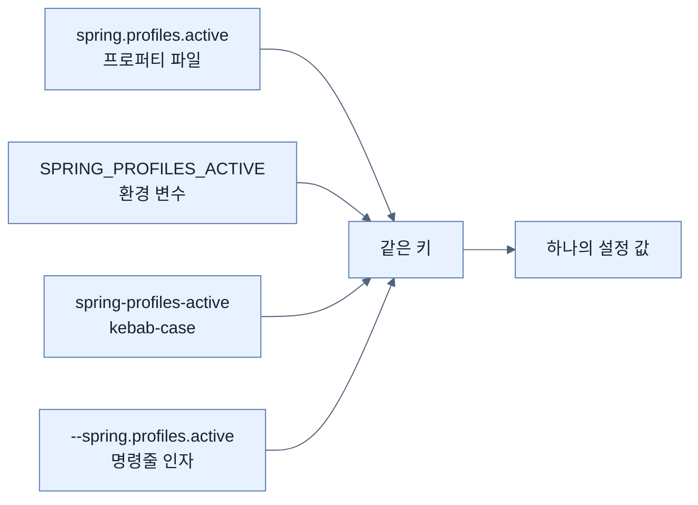
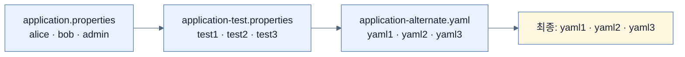
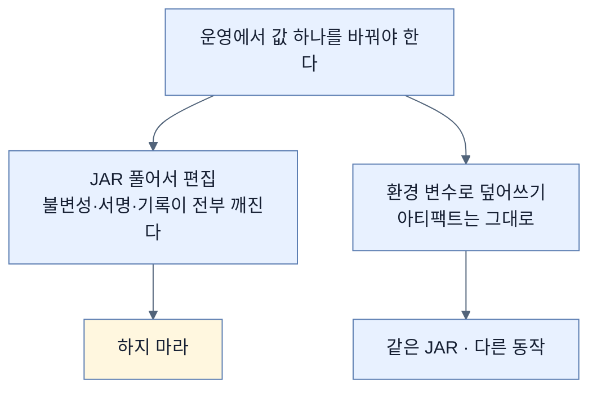

# JAR을 열지 않고 바꾸기 — 환경 변수와 완화된 바인딩

## 한눈에 보기

| 질문 | 핵심 답 |
|---|---|
| 왜 필요한가 | 아무리 설계해도 **무언가는 터진다.** 그때 손댈 수단이 없으면 막힌다 |
| 하면 안 되는 것 | JAR을 풀어 프로퍼티를 고치고 다시 묶기 |
| 대신 | 환경 변수로 **어떤 프로퍼티든** 덮어쓴다 |
| 이름 규칙 | `spring.profiles.active` → `SPRING_PROFILES_ACTIVE` |
| 왜 대문자·밑줄인가 | 많은 셸에서 환경 변수 이름에 **점을 쓸 수 없다** |
| 그걸 이어 주는 것 | 완화된 바인딩 |
| 적용 범위 | `VAR=x cmd`는 **그 명령 하나만.** 세션 전체는 `export` |
| 여러 프로파일 | 쉼표로 나열, **왼쪽에서 오른쪽으로** 적용 |

## 1. 왜 이게 필요한가

### 출발 장면: 배포한 뒤에 값 하나를 바꿔야 한다

[[02-creating-profile-based-property-files]]로 환경별 설정을 나눴고 [[03-switching-to-yaml-and-metadata]]로 형식도 정리했다. 그런데 새벽 두 시에 운영에서 문제가 터졌고, 로그 레벨 하나만 올려 보면 원인이 잡힐 것 같다.

JAR 안의 `application.properties`에 그 값이 있다. 어떻게 바꿀까.

책이 Note로 못 박는 답이 있다 — **이렇게 하지 마라.**

```text
JAR 압축 해제 → 프로퍼티 파일 편집 → 다시 압축 → 배포
```

왜 안 되는가. 책의 표현은 "20년 전에나 통했을 꼼수"다. 구체적으로는 이렇다.

| 문제 | 결과 |
|---|---|
| **[[불변-아티팩트]]**(= 빌드 후 고치지 않는 배포물)가 깨진다 | 배포된 것과 CI가 검증한 것이 다른 바이너리가 된다 |
| 서명·체크섬이 무효가 된다 | 통제된 파이프라인과 보안 릴리스 절차를 우회한다 |
| 기록이 남지 않는다 | 누가 무엇을 왜 고쳤는지 아무 데도 없다 |
| 다음 배포에 사라진다 | 새 JAR을 올리면 수정이 조용히 되돌아간다 |

책의 표현대로 "Spring 팀의 실전 경험 덕에 그럴 필요가 없다."

## 2. 어떻게 동작하는가

### 2.1 환경 변수 하나로

```bash
$ SPRING_PROFILES_ACTIVE=alternate ./mvnw spring-boot:run
```

한 줄에 네 가지가 들어 있다.

| 조각 | 하는 일 |
|---|---|
| `SPRING_PROFILES_ACTIVE` | **[[환경-변수]]**(= 셸이 프로세스에 넘겨주는 이름-값 쌍). `spring.profiles.active`로 매핑된다 |
| `alternate` | 켤 **[[프로파일]]**(= 상황별 설정 묶음에 붙인 이름). [[03-switching-to-yaml-and-metadata]]에서 만든 YAML 파일이 여기 대응한다 |
| `./mvnw` | **[[Maven-래퍼]]**(= 프로젝트에 함께 커밋된 `mvnw` 스크립트). Maven을 설치하지 않아도 돌아간다 |
| `spring-boot:run` | `spring-boot-maven-plugin`의 `run` 골 |

`./mvnw`가 왜 좋은지 책이 짚는다 — **CI 시스템에서 특히 편하다.** 빌드 머신에 Maven을 미리 깔아 둘 필요가 없고, 프로젝트가 지정한 버전으로 정확히 돌아간다.

실행하면 콘솔에 증거가 찍힌다.

```text
The following 1 profile is active: "alternate"
```

### 2.2 왜 이름이 대문자에 밑줄인가

`spring.profiles.active`인데 왜 `SPRING_PROFILES_ACTIVE`로 쓸까. 이유는 Spring이 아니라 **운영체제와 셸** 쪽에 있다.

많은 셸에서 환경 변수 이름에 **점(`.`)을 쓸 수 없다.** `spring.profiles.active=test` 같은 형태는 유효한 변수 이름이 아니다. 그렇다고 Spring이 점을 포기하면 프로퍼티 파일 표기가 망가진다.

그래서 **양쪽을 잇는 규칙**을 두었다. 그것이 **[[완화된-바인딩]]**(= 표기가 달라도 같은 설정 키로 묶어 주는 규칙)이다.



이 규칙 덕분에 **표기가 각 매체의 제약을 따르면서도 의미는 하나로 유지된다.** Chapter 4의 `clientId` / `client-id`도 같은 규칙이 작동한 예다([[../../part-2-creating-an-application-with-spring-boot/chapter-4-securing-an-application-with-spring-boot/08b-adding-oauth-client-to-a-spring-boot-project|Chapter 4 · OAuth 클라이언트 배선]]).

핵심은 이것이 **프로파일 전용이 아니라는 것**이다. 어떤 프로퍼티든 이 방식으로 덮을 수 있다. `server.port`는 `SERVER_PORT`, `app.config.header`는 `APP_CONFIG_HEADER`가 된다.

### 2.3 적용 범위에 주의

책이 짚는 실무 함정이다.

```bash
SPRING_PROFILES_ACTIVE=alternate ./mvnw spring-boot:run    # 이 명령에만
export SPRING_PROFILES_ACTIVE=test                          # 셸 세션 전체
```

앞의 형태는 **그 한 번의 실행에만** 적용된다. 셸로 돌아오면 변수는 없다.

`export`는 반대다. 그 셸이 살아 있는 동안 이후 모든 명령에 적용된다. 편할 때도 있지만 **잊어버리기 쉽다** — 30분 뒤에 "왜 테스트 계정으로 뜨지?" 하며 헤매는 상황이 여기서 나온다.

책은 셸별 세부는 각자 문서(Bash, Zsh)를 보라고 넘긴다. 알아야 할 것은 **범위가 다르다**는 사실 자체다.

### 2.4 여러 프로파일과 적용 순서

```bash
$ SPRING_PROFILES_ACTIVE=test,alternate ./mvnw spring-boot:run
```

쉼표로 나열하면 둘 다 켜진다. 그런데 `test`와 `alternate`가 **둘 다 `users` 목록을 정의한다.** 어느 쪽이 이길까.

규칙은 단순하다. **왼쪽에서 오른쪽으로 적용된다.**



`alternate`가 마지막이므로 새 프로퍼티를 얹고 중복은 덮는다. 결과는 **YAML 계정이 최종**이다.

여기서 [[02-creating-profile-based-property-files]]의 **[[리스트-교체]]**(= 리스트는 병합되지 않고 통째로 갈리는 규칙)가 다시 작동한다. `test`의 세 명과 `alternate`의 세 명이 합쳐져 여섯이 되지 **않는다.** `alternate`의 목록이 통째로 앞의 것을 갈아치워 셋만 남는다.

이 결과가 직관과 어긋나기 쉽다. "둘 다 켰으니 둘 다 들어가겠지"가 스칼라 값에는 부분적으로 맞지만(각각 다른 키라면 둘 다 살아남는다) 같은 리스트에는 틀리다.

## 3. 그림으로 보기



| 방법 | 범위 | 아티팩트 | 기록 |
|---|---|---|---|
| JAR 열어 편집 | 그 사본 | **훼손됨** | 없음 |
| `VAR=x cmd` | 그 명령 하나 | 무손상 | 명령 이력 |
| `export VAR=x` | 셸 세션 | 무손상 | 잊기 쉬움 |
| 프로파일 파일 + 외부 위치 | 그 배포 | 무손상 | **형상 관리 가능** |

## 4. 이 노트에 나온 용어

| 용어 | 한 줄 뜻 | 정의 위치 |
|---|---|---|
| 환경 변수 | 셸이 프로세스에 넘기는 이름-값 쌍 | [[_glossary#환경-변수]] |
| 완화된 바인딩 | 표기가 달라도 같은 키로 묶는 규칙 | [[_glossary#완화된-바인딩]] |
| Maven 래퍼 | 프로젝트에 커밋된 `mvnw` 스크립트 | [[_glossary#Maven-래퍼]] |
| 프로파일 | 상황별 설정 묶음에 붙인 이름 | [[_glossary#프로파일]] |
| 불변 아티팩트 | 빌드 후 고치지 않는 배포물 | [[_glossary#불변-아티팩트]] |
| 리스트 교체 | 리스트는 병합되지 않고 통째로 갈림 | [[_glossary#리스트-교체]] |
| 우선순위 | 같은 키가 여럿일 때 이기는 순서 | [[_glossary#우선순위]] |

## 5. 자주 헷갈리는 것

**"환경 변수는 프로파일 활성화 전용이다"** — 어떤 프로퍼티든 덮을 수 있다. `SERVER_PORT`, `APP_CONFIG_HEADER` 모두 된다.

**"`VAR=x cmd`와 `export VAR=x`는 같다"** — 범위가 다르다. 앞은 그 명령 하나, 뒤는 셸 세션 전체다.

**"프로파일을 두 개 켜면 리스트가 합쳐진다"** — 마지막 것이 **통째로 교체한다.** 3 + 3 = 3이다.

**"환경 변수가 가장 우선한다"** — 아니다. 시스템 프로퍼티(`-D`), `SPRING_APPLICATION_JSON`, 명령줄 인자가 모두 환경 변수보다 **높다.** 전체 순서는 [[05-ordering-property-overrides]]에 있다.

## 6. 언제 안 쓰나 / 경계

- **긴급 조치는 기록해야 한다.** 명령줄 오버라이드는 아무 데도 남지 않는다. 다음 노트가 이 위험을 Note로 다시 경고한다.
- **환경 변수는 비밀 관리 수단이 아니다.** 프로세스 목록이나 컨테이너 정의에서 값이 보일 수 있다.
- **이름 매핑에 함정이 있다.** 키에 하이픈이나 대문자가 섞여 있으면(`app.config.someValue`) 환경 변수 이름 규칙과 정확히 맞추기 까다롭다.
- **비유의 한계.** 환경 변수 오버라이드는 "봉인된 상자를 뜯지 않고 겉에 배송 지시를 붙이는 것"에 가깝다. 상자는 그대로고 취급 방식만 달라진다. 다만 이 비유는 **지시 스티커가 배송이 끝나면 사라진다**는 점을 흐린다. 실제로 환경 변수는 그 실행에만 남고 아무 기록도 남기지 않는다. 다음 배포에서 같은 지시가 필요하면 다시 붙여야 하고, 그걸 아는 사람이 자리를 비우면 아무도 모른다.

## 7. 연결

- [[02-creating-profile-based-property-files]] — 여기서 만든 프로파일 파일들을 이 노트가 실제로 켠다. 다중 프로파일의 결과가 그 노트의 리스트 교체 규칙으로 설명된다.
- [[03-switching-to-yaml-and-metadata]] — `alternate` 프로파일이 가리키는 YAML 파일을 그 노트가 만들었다.
- [[05-ordering-property-overrides]] — 환경 변수가 전체 우선순위 목록에서 어디쯤인지, 무엇이 그것을 덮을 수 있는지 확인한다.

## 8. 스스로 확인

1. JAR을 풀어 프로퍼티를 고치는 방법의 문제 네 가지를 말할 수 있는가?
2. `SPRING_PROFILES_ACTIVE`가 대문자와 밑줄인 이유는 Spring 쪽 사정인가, 셸 쪽 사정인가?
3. 완화된 바인딩이 없다면 무엇이 불가능해지는가?
4. `VAR=x cmd`와 `export VAR=x`의 차이가 실무에서 어떤 혼란을 만드는가?
5. `test,alternate`를 켰을 때 사용자가 6명이 아니라 3명인 이유는?
6. 환경 변수보다 우선순위가 높은 것을 세 가지 이상 말할 수 있는가?
7. 배송 지시 스티커 비유가 깨지는 지점은 어디인가?

<!-- ==== 아래는 내 영역 · 스킬 수정 금지 ==== -->

## 내 설명 시도


## 막혔던 지점


## 리뷰 이력
