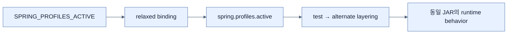

# 환경 변수로 Property 설정

## 한눈에 보기

Boot relaxed binding은 `SPRING_PROFILES_ACTIVE` 같은 uppercase underscore 환경 변수를 `spring.profiles.active`에 대응시킨다. `SPRING_PROFILES_ACTIVE=test,alternate ./mvnw spring-boot:run`처럼 한 process에만 적용하거나 shell에 export할 수 있다.

## 1. 왜 이게 필요한가

배포된 JAR를 풀어 내부 파일을 수정하면 artifact integrity와 pipeline 재현성이 깨진다. Container·CI·cloud에서는 같은 immutable artifact에 environment-specific 값을 process environment로 공급하는 편이 자연스럽다.

## 2. 어떻게 동작하는가

점은 많은 OS environment variable 이름에서 쓸 수 없으므로 key를 uppercase로 바꾸고 dot을 underscore로 치환한다. Boot Environment가 이를 property source로 읽어 file 값보다 높은 precedence로 적용한다. 여러 active profile은 왼쪽에서 오른쪽으로 겹쳐져 마지막 profile이 중복 scalar를 이긴다.

환경 변수도 완전한 secret vault는 아니다. process inspection, CI log, crash dump에 노출될 수 있고 복잡한 structured value는 관리하기 어렵다. 변화의 원본은 deployment configuration/version control에 남겨 일회성 shell override가 사라지지 않게 한다.

## 3. 그림으로 보기

## 4. 이 노트에 나온 용어

- **relaxed binding**: case·separator 변형을 같은 canonical property name으로 인식하는 Boot 규칙.
- **runtime override**: artifact를 다시 만들지 않고 process 시작 시 설정값을 바꾸는 것.
- **Maven wrapper**: project가 고정한 Maven version을 별도 전역 설치 없이 실행하는 script.

## 7. 연결

- [[02-creating-profile-based-property-files]] — 환경 변수가 어떤 profile 파일을 활성화할지 정한다.
- [[05-ordering-property-overrides]] — 환경 변수와 file이 충돌할 때 최종 값을 설명한다.
- [[chapter-7-releasing-an-application-with-spring-boot/02-building-a-docker-container|Docker]] — container runtime의 대표 설정 공급 방식이다.

## 8. 스스로 확인

- 전체 1차 정리 후: `spring.profiles.active`가 환경 변수 이름으로 변환되는 규칙을 설명한다.

<!-- ==== 아래는 내 영역 · 스킬 수정 금지 ==== -->

## 내 설명 시도

## 막혔던 지점

## 리뷰 이력

