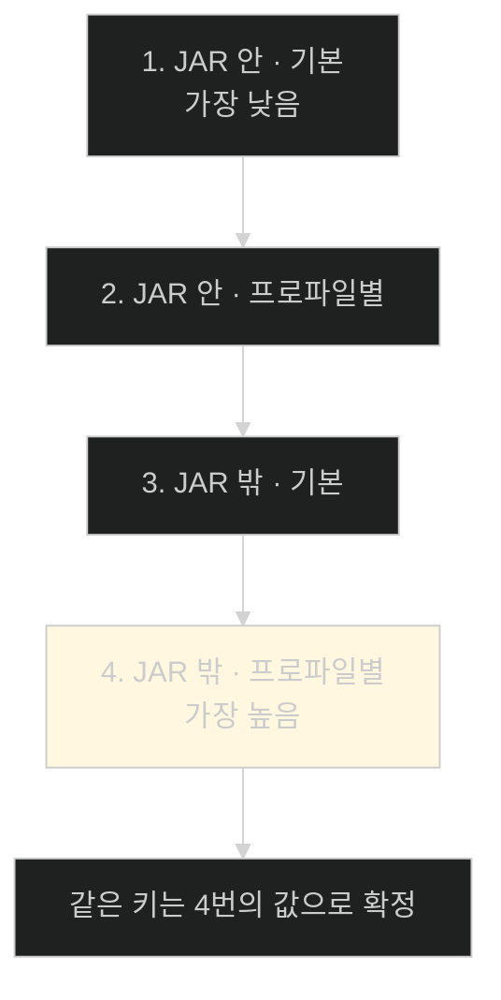

# 누가 이기는가 — 프로퍼티 소스 15단계와 Twelve-Factor

## 한눈에 보기

| 질문 | 핵심 답 |
|---|---|
| 규칙 한 줄 | **나중에 고려되는 소스가 앞의 값을 덮는다** |
| `application.properties`의 자리 | 15단계 중 **3번째.** 상대적으로 **낮다** |
| 그래서 그 파일의 역할 | 기준값(baseline)을 정하는 곳 |
| 환경 변수 | 5번째 |
| 시스템 프로퍼티(`-D`) | 6번째 — **환경 변수보다 높다** |
| 명령줄 인자 | 11번째 |
| 가장 높은 것 | DevTools 전역 설정(`$HOME/.config/spring-boot`) |
| Config data 안의 순서 | JAR 안 기본 → JAR 안 프로파일별 → **JAR 밖 기본 → JAR 밖 프로파일별** |
| 그래서 가능한 일 | 실행 가능 JAR **옆에** 프로퍼티 파일을 두면 오버라이드가 된다 |
| 뒤에 있는 사상 | Twelve-Factor App의 세 번째 factor, config |

## 1. 왜 이게 필요한가

### 출발 장면: 같은 키가 다섯 군데에 있다

지금까지 프로퍼티를 넣는 방법을 여럿 배웠다.

- `application.properties` ([[01-creating-custom-properties]])
- `application-test.properties` ([[02-creating-profile-based-property-files]])
- `application-alternate.yaml` ([[03-switching-to-yaml-and-metadata]])
- 환경 변수 ([[04-setting-properties-with-environment-variables]])
- JAR 밖의 외부 설정 디렉터리

이제 `app.config.header`가 이 다섯 군데에 전부 있다고 하자. **화면에는 무엇이 뜰까.**

추측으로 답할 수 없다. 규칙을 알아야 한다. 그리고 이 규칙을 모르면 다음 종류의 시간 낭비가 반복된다 — "분명히 프로퍼티 파일을 고쳤는데 값이 안 바뀐다."

## 2. 어떻게 동작하는가

### 2.1 규칙은 한 줄이다

Spring Boot는 여러 출처를 **[[프로퍼티-소스]]**(= 이름과 값들의 묶음 하나를 나타내는 추상)로 감싸 순서대로 쌓는다. 그리고 **[[우선순위]]**(= 같은 키가 여럿일 때 이기는 순서) 규칙은 단순하다.

> **나중에 고려되는 소스가 앞의 소스가 정한 값을 덮는다.**

아래 목록은 **낮은 우선순위 → 높은 우선순위** 순이다.

| # | 프로퍼티 소스 | 성격 |
|---:|---|---|
| 1 | `SpringApplication.setDefaultProperties()` | 코드로 심는 기본값 |
| 2 | `@PropertySource`가 붙은 `@Configuration` 클래스 | 코드에 박힌 파일 지정 |
| 3 | **[[Config-Data]]**(= `application.properties`·`.yaml`과 프로파일 변형) | **우리가 주로 쓰는 것** |
| 4 | **[[RandomValuePropertySource]]**(= `random.*` 키에 난수를 주는 소스) | `random.uuid` 등 |
| 5 | OS **[[환경-변수]]** | 배포 환경이 주입 |
| 6 | 자바 **[[시스템-프로퍼티]]**(`System.getProperties()`) | `-D`로 넘긴 값 |
| 7 | `java:comp/env`의 JNDI 속성 | 레거시 앱 서버 |
| 8 | `ServletContext` 초기화 파라미터 | 서블릿 컨테이너 |
| 9 | `ServletConfig` 초기화 파라미터 | 서블릿 개별 |
| 10 | **[[SPRING_APPLICATION_JSON]]**(= 환경 변수나 시스템 프로퍼티에 넣은 인라인 JSON) | 여러 값을 한 번에 |
| 11 | **[[명령줄-인자]]**(= `--key=value` 형태로 넘기는 값) | 실행 시점 최종 조정 |
| 12 | 테스트의 `properties` 속성 (`@SpringBootTest`, 슬라이스 테스트) | 테스트 전용 |
| 13 | 테스트의 `@DynamicPropertySource` | 실행 중 결정되는 값 |
| 14 | 테스트의 `@TestPropertySource` | 테스트 전용 |
| 15 | **[[DevTools]]**(= 개발 편의 모듈) 전역 설정 `$HOME/.config/spring-boot` | 개발자 개인 환경 |

이 순서에서 읽어야 할 것이 세 가지다.

**첫째, `application.properties`는 3번째로 아주 낮다.** 책의 결론이 그래서 나온다 — 이 파일은 **기준값을 정하기 좋은 자리**이고, 환경 변수·명령줄 인자·테스트 프로퍼티가 필요할 때 그 기준을 덮는다.

**둘째, `-D`가 환경 변수보다 높다.** [[04-setting-properties-with-environment-variables]]에서 두 방법을 동등하게 소개했지만, 둘 다 지정하면 시스템 프로퍼티가 이긴다.

**셋째, 테스트 관련 항목이 12–14번에 몰려 있다.** 테스트는 **무슨 일이 있어도** 자기가 정한 값으로 돌아야 하기 때문이다. `application.properties`에 무엇이 있든 `@TestPropertySource`가 이긴다. [[../../part-2-creating-an-application-with-spring-boot/chapter-5-testing-with-spring-boot/07-testing-repositories-with-testcontainers|Chapter 5 · Testcontainers 리포지토리 테스트]]에서 `@TestPropertySource`로 `ddl-auto`를 강제한 것이 이 성질에 기대고 있다.

DevTools가 가장 높은 것도 같은 논리다. 개발자 개인 기계의 편의 설정이 프로젝트 설정에 막히면 곤란하고, 운영에는 DevTools가 아예 없다.

### 2.2 Config Data 안에도 순서가 있다

3번 항목은 사실 파일 여러 개의 묶음이다. 그 안에서도 순서가 정해져 있다. 역시 **낮은 → 높은**이다.

| # | 파일 | 어디에 |
|---:|---|---|
| 1 | `application.properties` / `.yml` | **JAR 안** |
| 2 | `application-{profile}.properties` / `.yml` | **JAR 안** |
| 3 | `application.properties` / `.yml` | **JAR 밖** |
| 4 | `application-{profile}.properties` / `.yml` | **JAR 밖** |

두 축이 교차한다.



이 순서의 실질적 의미가 크다. **JAR 밖이 JAR 안을 이긴다.**

책이 여기서 앞의 경고를 회수한다. [[04-setting-properties-with-environment-variables]]에서 "JAR을 열어 프로퍼티를 고치지 마라"고 했는데, **그럴 필요가 없는 이유가 이것이다.** 실행 가능한 JAR **옆에** 프로퍼티 파일을 하나 두면 그 값이 안쪽 값을 덮는다.

```text
/opt/app/
├── myapp.jar                    ← 손대지 않는다
└── application.properties       ← 여기 적은 값이 이긴다
```

**[[불변-아티팩트]]**(= 빌드 후 고치지 않는 배포물)를 지키면서도 값을 바꿀 수 있다. 아티팩트는 그대로고 그 옆에 놓인 파일이 달라질 뿐이다.

**[[프로파일별-프로퍼티-파일]]**(= 이름에 `-{프로파일}`이 붙은 파일)이 각 위치에서 기본 파일보다 높은 것도 일관적이다. 더 구체적으로 지정한 쪽이 이긴다.

### 2.3 편할수록 위험하다

책이 Note로 균형을 잡는다. **명령줄에서 즉석으로 프로퍼티를 조정하는 데에는 여전히 위험이 있다.**

문제는 기술이 아니라 기록이다.

| 방법 | 어디에 남나 | 다음 배포 때 |
|---|---|---|
| 형상 관리된 프로파일 파일 | git | **살아남는다** |
| JAR 옆 외부 파일 | 서버 파일 시스템 | 배포 스크립트가 보존하면 남는다 |
| 명령줄 인자 | 그 실행뿐 | **사라진다** |
| 환경 변수 | 그 셸이나 컨테이너 정의 | 정의가 바뀌면 사라진다 |

책의 표현이 아프다 — **"공들여 해결책을 만들어 놨는데 그 변경을 반영하지 않은 패치에 덮여 사라지는 것보다 나쁜 건 없다."**

그래서 권고는 이렇다. 즉석 조정을 했으면 **기록해 두고, 형상 관리에 반영하는 것을 고려하라.** 아마도 별도 프로파일 형태로.

### 2.4 그 뒤의 사상

책은 이 장을 하나의 이름으로 마무리한다. **[[Twelve-Factor-App]]**(= 2011년 Heroku가 정리한, 클라우드에서 잘 돌아가는 애플리케이션의 12가지 원칙)이다. 설정은 그중 **세 번째 factor**다.

그 원칙의 요지는 한 줄이다 — **환경마다 달라질 만한 것은 전부 외부화하라.**

이 장에서 한 일이 전부 그 한 줄의 구현이었다.

| 이 장에서 한 일 | Twelve-Factor의 관점 |
|---|---|
| 문구를 `@ConfigurationProperties`로 뺐다 | 코드에서 설정을 분리 |
| 환경별 프로파일 파일을 만들었다 | 환경마다 다른 값을 다른 곳에 |
| 운영 설정을 아티팩트 밖에 두었다 | 코드와 설정의 완전한 분리 |
| 환경 변수로 덮을 수 있게 했다 | 실행 시점 주입 |

책의 태도가 균형 잡혀 있다. **12가지 factor가 전부 지금도 유효한지, 다음 프로젝트에 다 적용될지는 논쟁적이다.** 하지만 그중 다수는 애플리케이션을 배포하고 연결하고 쌓아 올리기 쉽게 만든다. 한 번 읽어 볼 만하다는 것이 책의 권유다.

책의 겸손한 한마디도 옮겨 둘 만하다 — 이 장의 프로퍼티 예제들은 다소 인위적이었지만, **무엇을 외부화하면 좋은지의 감각**은 전해졌기를 바란다는 것이다.

## 3. 그림으로 보기


| 질문 | 답 | 근거 |
|---|---|---|
| 기준값은 어디에 | `application.properties` | 3번째로 낮아서 무엇이든 덮을 수 있다 |
| 배포 환경 값은 | 환경 변수 또는 JAR 밖 파일 | 아티팩트를 건드리지 않는다 |
| 긴급 조정은 | 명령줄 인자 | 11번째로 높다 |
| 테스트는 | `@TestPropertySource` | 12–14번, 무엇이든 이긴다 |
| 개인 개발 편의는 | DevTools 전역 설정 | 15번, 가장 높다 |

## 4. 이 노트에 나온 용어

| 용어 | 한 줄 뜻 | 정의 위치 |
|---|---|---|
| PropertySource | 이름과 값들의 묶음 하나를 나타내는 추상 | [[_glossary#프로퍼티-소스]] |
| 우선순위 | 같은 키가 여럿일 때 이기는 순서 | [[_glossary#우선순위]] |
| Config Data | 설정 파일과 그 프로파일 변형 | [[_glossary#Config-Data]] |
| RandomValuePropertySource | `random.*`에 난수를 주는 소스 | [[_glossary#RandomValuePropertySource]] |
| SPRING_APPLICATION_JSON | 인라인 JSON으로 여러 값을 한 번에 | [[_glossary#SPRING_APPLICATION_JSON]] |
| 명령줄 인자 | `--key=value`로 넘기는 값 | [[_glossary#명령줄-인자]] |
| DevTools | 개발 편의 모듈 | [[_glossary#DevTools]] |
| 시스템 프로퍼티 | `-D`로 JVM에 넘기는 값 | [[_glossary#시스템-프로퍼티]] |
| 환경 변수 | 셸이 프로세스에 넘기는 이름-값 쌍 | [[_glossary#환경-변수]] |
| 불변 아티팩트 | 빌드 후 고치지 않는 배포물 | [[_glossary#불변-아티팩트]] |
| Twelve-Factor App | 클라우드 애플리케이션의 12원칙 | [[_glossary#Twelve-Factor-App]] |
| 프로파일별 프로퍼티 파일 | 이름에 `-{프로파일}`이 붙은 파일 | [[_glossary#프로파일별-프로퍼티-파일]] |

## 5. 자주 헷갈리는 것

**"`application.properties`가 최종 결정권을 갖는다"** — 15단계 중 3번째로 **아주 낮다.** 기준값을 두는 곳이지 최종값을 두는 곳이 아니다.

**"환경 변수가 `-D`보다 강하다"** — 반대다. 시스템 프로퍼티(6)가 환경 변수(5)보다 높다.

**"목록의 위쪽이 우선순위가 높다"** — 아래쪽이 높다. 책의 목록은 **낮음 → 높음** 순이다.

**"JAR 안의 프로파일 파일이 JAR 밖의 기본 파일보다 강하다"** — 아니다. **위치가 먼저다.** JAR 밖 기본 파일(3)이 JAR 안 프로파일 파일(2)보다 높다.

**"명령줄로 고쳤으니 다음에도 그렇게 뜰 것"** — 그 실행에만 적용된다. 기록해 두지 않으면 사라진다.

## 6. 언제 안 쓰나 / 경계

- **우선순위를 이용한 트릭은 읽기 어렵다.** 같은 키를 여러 층에 흩어 두면 실제 값이 어디서 왔는지 추적하기 힘들다. 층은 목적별로 나누는 편이 낫다(기준값 / 환경별 / 긴급 조정).
- **JAR 밖 파일은 배포 절차가 보존해야 한다.** 자동으로 따라가지 않으므로 배포 스크립트나 이미지 정의에 포함시켜야 한다.
- **DevTools가 운영에 들어가면 안 된다.** 가장 높은 우선순위를 갖는 소스가 개발용 모듈이므로, 운영 배포물에 포함되면 예측 불가능한 오버라이드가 생긴다.
- **비유의 한계.** 이 15단계는 "여러 장을 겹쳐 인쇄한 문서"에 비유할 수 있다. 나중에 찍힌 잉크가 앞의 글씨를 덮는다. 다만 이 비유는 **덮인 글씨가 여전히 거기 있다**는 인상을 준다. 실제로 Spring은 앞의 값을 지우지 않고 **더 높은 소스를 먼저 조회할 뿐**이다. 그래서 높은 소스에서 그 키가 사라지면 아래 값이 다시 드러난다. 지워진 게 아니라 가려져 있었던 것이다.

## 7. 연결

- [[01-creating-custom-properties]] — 여기서 만든 `application.properties`가 이 목록의 3번째 자리에 해당한다. 기준값의 자리다.
- [[02-creating-profile-based-property-files]] — 그 노트의 `spring.config.additional-location` 이야기가 이 노트의 "JAR 밖이 JAR 안을 이긴다"와 짝을 이룬다.
- [[04-setting-properties-with-environment-variables]] — 환경 변수(5)와 시스템 프로퍼티(6)의 높낮이 차이가 여기서 확정된다.

## 8. 스스로 확인

1. 우선순위 규칙을 한 문장으로 말할 수 있는가?
2. `application.properties`가 낮은 자리에 있는 것이 왜 **좋은** 설계인가?
3. 테스트 관련 항목이 12–14번에 몰려 있는 이유는?
4. DevTools가 가장 높은 이유와, 그것이 운영에서 위험한 이유는?
5. Config Data 안의 네 단계에서 "위치"와 "프로파일" 중 무엇이 먼저 결정하는가?
6. "JAR을 열지 마라"는 경고가 이 절에서 어떻게 회수되는가?
7. 명령줄 즉석 조정의 진짜 위험은 기술적인 것인가, 조직적인 것인가?
8. Twelve-Factor의 세 번째 factor를 이 장의 작업들과 대응시킬 수 있는가?
9. 겹쳐 인쇄한 문서 비유가 깨지는 지점은 어디인가?


> 아홉 문항을 스스로 답한 **뒤에** [[_05-ordering-property-overrides]]에서 모범답안과 대조한다. 먼저 열면 이 문항들은 다시 인출 문제로 쓸 수 없다.

<!-- ==== 아래는 내 영역 · 스킬 수정 금지 ==== -->

## 내 설명 시도


## 막혔던 지점


## 리뷰 이력
