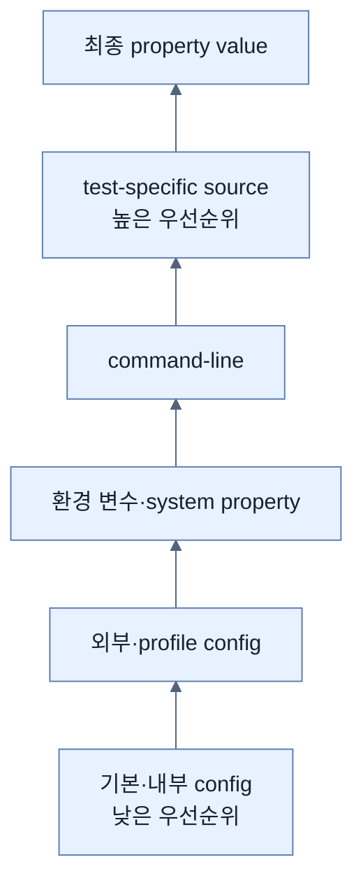

# Property Override 순서

## 한눈에 보기

Boot는 여러 property source를 낮은 우선순위에서 높은 순으로 겹친다. Baseline config data 위에 environment variable, system property, inline JSON, command-line, test-specific source 등이 덮는다. Config file 안에서는 JAR 내부 일반 → 내부 profile → 외부 일반 → 외부 profile 순으로 구체성이 높아진다.

## 1. 왜 이게 필요한가

같은 key가 여러 곳에 있으면 “왜 이 값이 들어왔나”를 설명할 수 있어야 운영 장애를 진단한다. 우선순위 model은 portable default를 artifact에 두고 deploy/test context가 필요한 값만 override하도록 한다.

## 2. 어떻게 동작하는가

낮은 쪽에는 `setDefaultProperties`, `@PropertySource`, config data가 있고 그 위로 random values, OS environment, Java system property, JNDI/servlet parameter, `SPRING_APPLICATION_JSON`, command-line이 올라간다. Test annotation과 dynamic property는 test context에서 더 높은 값을 제공한다. 외부 profile file은 패키지 내부 baseline보다 우선한다.

Precedence는 stack of transparent sheets와 같다. 위에 실제 key가 있을 때만 아래 값이 가려진다. 실행 중 임시 command-line fix는 다음 배포에서 사라질 수 있으므로 의도된 변경은 관리 가능한 config source로 되돌려 기록한다. 이는 환경마다 달라지는 config를 code에서 분리하라는 Twelve-Factor 원칙과 맞닿는다.

## 3. 그림으로 보기

## 4. 이 노트에 나온 용어

- **property source**: property key/value를 Environment에 제공하는 origin.
- **precedence**: 같은 key의 여러 값을 최종 하나로 고르는 우선순위.
- **config data**: application properties/YAML과 import된 configuration 자료.
- **Twelve-Factor App**: deploy 환경마다 변하는 config를 code 밖에 두는 등의 cloud application 원칙.

## 7. 연결

- [[02-creating-profile-based-property-files]] — config data 내부의 profile layering을 제공한다.
- [[04-setting-properties-with-environment-variables]] — file보다 높은 대표 property source다.
- [[chapter-7-releasing-an-application-with-spring-boot/04-tuning-an-application-in-production|운영 튜닝]] — 같은 artifact를 환경 설정으로 확장한다.

## 8. 스스로 확인

- 전체 1차 정리 후: JAR 내부 profile과 외부 일반 file이 같은 key를 가질 때 어느 쪽이 이기는지 설명한다.

<!-- ==== 아래는 내 영역 · 스킬 수정 금지 ==== -->

## 내 설명 시도

## 막혔던 지점

## 리뷰 이력

