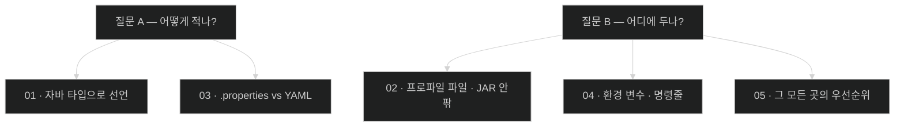

# Chapter 6 개념 지도 — Configuring an Application with Spring Boot

> 책 pp. 189–205 / PDF pp. 214–230. 노트 5개, 용어 41개, 책 이미지 1개.
> 원문 커버리지는 [[_coverage]], 용어 정의는 [[_glossary]]에 있다.

이 장은 짧지만 하나의 문장을 다섯 각도에서 푼다 — **코드는 그대로 두고, 달라지는 것을 밖으로 뺀다.** 책의 도입부가 그 관점을 직접 말한다. 설정은 "프로퍼티 몇 개 세팅"이 아니라 **코드와 현실 세계를 잇는 연결점**이고, 환경마다 애플리케이션의 행동을 빚는 도구다.

---

## 축 1 — 값이 코드에서 멀어지는 거리

다섯 노트를 "값이 코드로부터 얼마나 멀어졌는가"로 줄 세우면 장 전체가 한 방향임이 보인다.

| 단계 | 값이 사는 곳 | 바꾸려면 | 노트 |
|---|---|---|---|
| 0 | 자바 소스 | 재빌드 + 재배포 | (Chapter 4까지) |
| 1 | `application.properties` | 재빌드 | [[01-creating-custom-properties]] |
| 2 | `application-{profile}.properties` | 프로파일만 바꿔서 재실행 | [[02-creating-profile-based-property-files]] |
| 3 | JAR 밖 설정 디렉터리 | 파일만 교체 | [[02-creating-profile-based-property-files]] |
| 4 | 환경 변수 · 명령줄 | 실행 명령만 바꿈 | [[04-setting-properties-with-environment-variables]] |

아래로 갈수록 **같은 아티팩트가 더 많은 상황을 감당한다.** 이것이 [[05-ordering-property-overrides]]가 말하는 Twelve-Factor의 세 번째 factor다.

---

## 축 2 — 형식(어떻게 적나) vs 위치(어디에 두나)

이 장의 다섯 절은 사실 **두 개의 독립된 질문**을 다룬다. 섞어 읽으면 헷갈리고, 나눠 읽으면 단순해진다.

| 질문 | 답하는 노트 | 서로 독립인가 |
|---|---|---|
| 형식 — 어떤 표기로 적나 | [[01-creating-custom-properties]] · [[03-switching-to-yaml-and-metadata]] | **독립**. YAML로 적든 `.properties`로 적든 우선순위는 같다 |
| 위치 — 어디에 두고 어떻게 주입하나 | [[02-creating-profile-based-property-files]] · [[04-setting-properties-with-environment-variables]] | **독립**. 같은 값을 어느 층에 둬도 형식은 자유 |
| 충돌 — 누가 이기나 | [[05-ordering-property-overrides]] | 두 질문의 답이 만나는 곳 |

**YAML이 `.properties`를 이기는 게 아니다.** 형식은 우선순위에 아무 영향이 없다. 위치가 정한다.

---

## 축 3 — 이 장의 세 가지 "덮어쓰기" 규칙

같은 단어가 세 층위에서 다르게 작동한다. 헷갈리기 쉬운 지점이라 따로 모았다.

| 규칙 | 무엇이 무엇을 덮나 | 리스트는? | 노트 |
|---|---|---|---|
| **프로파일 가산성** | 프로파일 파일이 기본 파일 위에 얹힌다 | **통째로 교체** | [[02-creating-profile-based-property-files]] |
| **다중 프로파일 순서** | 쉼표 목록의 오른쪽이 왼쪽을 덮는다 | **통째로 교체** | [[04-setting-properties-with-environment-variables]] |
| **프로퍼티 소스 우선순위** | 15단계 목록의 아래쪽이 위쪽을 덮는다 | 같은 규칙 | [[05-ordering-property-overrides]] |

세 규칙 모두 **스칼라는 덮어쓰기, 리스트는 교체**로 동작한다. `test`와 `alternate`를 함께 켰을 때 사용자가 6명이 아니라 3명인 것이 이 규칙의 대표적 결과다.

---

## 축 4 — 앞 Chapter가 이 장에서 회수되는 지점

이 장은 새 개념을 별로 도입하지 않고, 앞에서 만든 것들을 **설정 가능하게** 바꾼다.

| 앞 Chapter에서 만든 것 | 이 장에서 어떻게 되나 | 노트 |
|---|---|---|
| Chapter 4의 하드코딩된 화면 문구 | `app.config.header` / `app.config.intro`로 외부화 | [[01-creating-custom-properties]] |
| Chapter 4의 alice·bob·admin | `app.config.users[*]`로 외부화 (다만 원문 공백 있음) | [[01-creating-custom-properties]] |
| Chapter 4의 `GrantedAuthority` | 문자열에서 변환할 `Converter`가 필요해진다 | [[01-creating-custom-properties]] |
| Chapter 4의 OAuth2 YAML 설정 | "이미 YAML을 써 봤다"는 회상으로 등장 | [[03-switching-to-yaml-and-metadata]] |
| Chapter 4의 `spring.mustache.servlet.expose-request-attributes` | Figure 6.2의 편집기 화면에 그대로 보인다 | [[03-switching-to-yaml-and-metadata]] |
| Chapter 5의 `@TestPropertySource` | 우선순위 목록 14번 — 무엇이든 이기는 이유가 밝혀진다 | [[05-ordering-property-overrides]] |

---

## 축 5 — 이 장이 남긴 원문의 공백

전체 표는 [[_coverage]] 5절에 있다. 노트를 읽다가 책과 다른 서술을 만나면 여기를 먼저 본다.

| 위치 | 문제 | 노트 |
|---|---|---|
| pp. 190–195 전체 | `app.config.users`가 **Spring Security에 도달하는 경로를 보여 주지 않는다.** 실제로 소비되는 것은 `header`·`intro`뿐 | [[01-creating-custom-properties]] |
| p. 190 | `UserAccount`를 재정의하지 않는다. Chapter 4의 것은 JPA 엔티티다 | [[01-creating-custom-properties]] |
| p. 196 vs pp. 203–204 | `-D`와 환경 변수를 동등하게 소개하지만 우선순위는 `-D`가 높다 | [[02-creating-profile-based-property-files]] |
| p. 200 vs Figure 6.2 | 본문은 `application-alternate.yaml`, 화면은 `application-alt.yaml` | [[03-switching-to-yaml-and-metadata]] |
| p. 194 | 메서드 이름을 `Convert()`로 대문자 표기 (실제는 `convert()`) | [[01-creating-custom-properties]] |

---

## 앞뒤 Chapter와의 연결

- **← Chapter 1** — [[../../part-1-the-basics-of-spring-boot/chapter-1-core-features-of-spring-boot/_map|Core Features of Spring Boot]]: 거기서 요약만 했던 프로퍼티 순서를 이 장이 15단계 전체로 펼치고, 타입 바인딩을 컨버터·메타데이터까지 확장한다.
- **← Chapter 4** — [[../../part-2-creating-an-application-with-spring-boot/chapter-4-securing-an-application-with-spring-boot/_map|Securing an Application]]: 이 장이 외부화하는 대상(화면 문구, 사용자 목록, `GrantedAuthority`)이 전부 그 장의 산물이다.
- **← Chapter 5** — [[../../part-2-creating-an-application-with-spring-boot/chapter-5-testing-with-spring-boot/_map|Testing with Spring Boot]]: 테스트 애노테이션이 우선순위 목록 12–14번을 차지하는 이유가 이 장에서 설명된다.
- **→ Chapter 7** — [[../chapter-7-releasing-an-application-with-spring-boot/_map|Releasing an Application]]: 불변 JAR을 만들고 그 **옆에** 설정을 두는 배포 형태가 이 장의 "JAR 밖이 JAR 안을 이긴다"를 전제로 한다.

특히 **Chapter 7과의 짝**이 중요하다. [[05-ordering-property-overrides]]가 확립한 "JAR 밖 파일이 JAR 안을 덮는다"는 규칙이 없으면, 다음 장의 실행 가능 JAR은 환경마다 다시 빌드해야 하는 물건이 된다.
