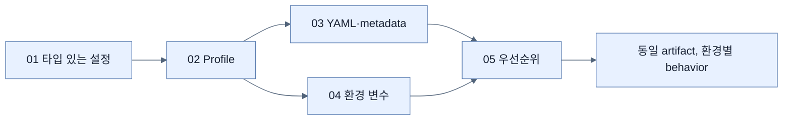

# Chapter 6 지도 — Configuring an Application

## 역할 축

| 관심사 | 도구 | 핵심 |
|---|---|---|
| 설정 소비 | `@ConfigurationProperties` | type-safe contract |
| 환경 변형 | profiles | baseline 위에 차이 layering |
| 표현 형식 | Properties/YAML | 같은 Environment model |
| 배포 주입 | env/external files | immutable artifact 유지 |
| 충돌 해결 | precedence | 최종 값의 origin 추적 |

