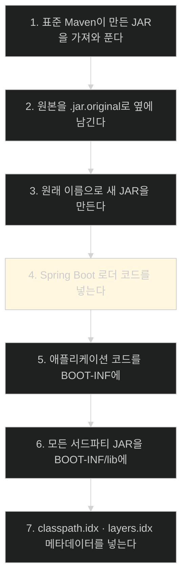
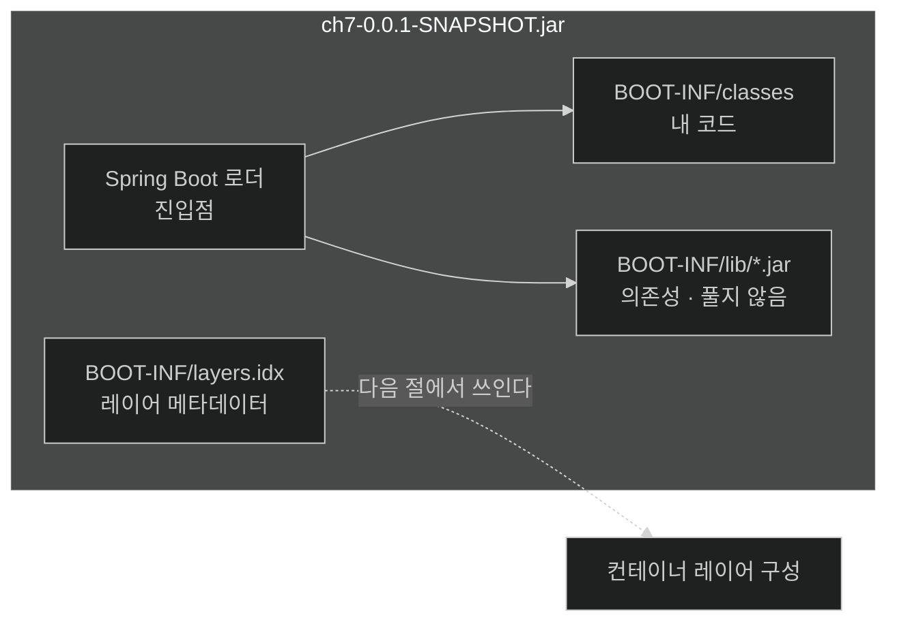

# java -jar 하나로 끝내기 — uber JAR이 만들어지는 일곱 단계

## 한눈에 보기

| 질문 | 핵심 답 |
|---|---|
| uber JAR이란 | 코드 + **모든 의존성** + **내장 서버**를 담아 `java -jar`로 도는 아카이브 |
| 만드는 명령 | `./mvnw clean package` |
| 누가 만드나 | `spring-boot-maven-plugin` — Initializr가 이미 넣어 뒀다 |
| 언제 도입됐나 | **2014년** |
| 실행에 필요한 것 | **JDK뿐.** Tomcat 설치도, WAR/EAR도 없다 |
| Boot 4의 내장 서버 | **Tomcat 11** (Jakarta Servlet 6.x 세대) |
| shaded JAR과 다른 점 | 서드파티 JAR을 **풀지 않고 그대로** 담는다 |
| 이 장의 소스 | 저장소 `ch7` 폴더 — Chapter 6 코드를 복사한 것 |

## 1. 왜 이게 필요한가

### 출발 장면: 개발하는 곳과 도는 곳은 언제나 다르다

책이 옛날이야기로 이 절을 연다. 예전에는 릴리스가 이랬다.

```text
컴파일 → 스크립트로 바이너리를 ZIP에 조립 → CD 굽기 또는 테이프에 적재
→ 출입 통제된 서버실이나 시내 반대편 시설로 물리적으로 운반 → 설치
```

저자는 1997년의 자기 경험을 Note로 덧붙인다 — **부서장들을 직접 걸어 다니며 서명을 받고, CD를 굽고, 17쪽짜리 절차를 따라 고객사에 설치하는 데 이틀이 걸렸다.**

사이버펑크 영화 같지만 요지는 시대가 아니다. **개발하는 곳과 애플리케이션이 살아야 하는 곳은 언제나 달랐다**는 것이다. 건물 이쪽 끝의 개발자 자리와 저쪽 끝의 서버실이든, 전 세계에 흩어진 다섯 명과 AWS든 마찬가지다.

그래서 가장 중요한 것은 하나다 — **IDE에서 서버까지 가는 단계 수를 최소화하는 것.**

### 그 전에는 몇 단계였나

Spring Boot 이전의 자바 웹 배포는 이랬다.

| 단계 | 하는 일 | 실패 지점 |
|---|---|---|
| 1 | 대상 서버에 애플리케이션 서버 설치 | 버전이 개발 환경과 다름 |
| 2 | WAR 파일 생성 | — |
| 3 | 서드파티 의존성을 조립 파일로 묶어 EAR 생성 | 조립 기술서가 난해함 |
| 4 | 관리 UI에 업로드 | 수동 작업 |
| 5 | 서버 재시작 | 다른 앱까지 영향 |

책의 표현이 신랄하다 — "레거시 절차… 흉한 조립 파일… 끔찍한 UI".

문제는 단계 수만이 아니다. **애플리케이션이 자기가 필요한 것을 전부 갖고 있지 않다.** 서버는 밖에 있고, 버전은 운영팀이 정하고, 개발 환경과 다를 수 있다.

## 2. 어떻게 동작하는가

### 2.1 정의

**[[uber-JAR]]**(= 코드·의존성·내장 서버를 한 파일에 담아 `java -jar`로 실행되는 아카이브)의 정의에서 셋이 다 중요하다.

| 담는 것 | 없으면 |
|---|---|
| 애플리케이션 코드 | 당연히 못 돈다 |
| **모든 의존성** | 클래스패스를 손으로 맞춰야 한다 |
| **[[내장-서버]]**(= 아카이브 안에 함께 담겨 프로세스 안에서 뜨는 서블릿 컨테이너) | 밖에 서버를 설치해야 한다 |

"fat JAR"이라는 별명도 여기서 온다 — 원래 JAR보다 훨씬 뚱뚱하다.

### 2.2 명령은 두 단어

```bash
% ./mvnw clean package
```

| 부분 | 하는 일 | 왜 필요한가 |
|---|---|---|
| `clean` | `target` 폴더와 생성물 삭제 | **이전 빌드의 잔재가 섞이지 않게** 한다 |
| `package` | Maven의 package 단계 실행 | 그 앞의 `validate`·`compile`·`test-compile`·`test`를 **순서대로 부른다** |

`package` 하나가 테스트까지 돌린다는 점이 중요하다. **테스트를 통과하지 못하면 아티팩트가 나오지 않는다.**

책은 Note로 실행 환경도 짚는다 — `mvnw`는 POSIX 셸 스크립트라 Linux·macOS에서 돌고, Windows에서는 `./mvnw.cmd`를 쓴다. Initializr로 만든 프로젝트에는 **둘 다** 들어 있다.

### 2.3 누가 하는가

명령에는 Spring Boot가 안 보이는데 결과는 Spring Boot 것이다. 범인은 pom에 들어 있다.

```xml
<plugin>
      <groupId>org.springframework.boot</groupId>
      <artifactId>spring-boot-maven-plugin</artifactId>
</plugin>
```

**[[spring-boot-maven-plugin]]**(= uber JAR과 컨테이너 이미지를 만드는 Spring Boot의 Maven 플러그인)을 Initializr가 자동으로 넣어 준다. 버전도 안 적혀 있는데, 부모 POM이 관리하기 때문이다.

### 2.4 일곱 단계

플러그인이 `package` 단계에 훅해 하는 일을 책이 일곱 단계로 나눈다. 각 단계의 이유를 붙여 보면 구조가 필연으로 읽힌다.



| 단계 | 왜 이렇게 하나 |
|---|---|
| 1 | 표준 결과물을 버리지 않고 **재료로 쓴다** |
| 2 | **[[repackage]]**(= 표준 JAR을 풀어 새 JAR로 다시 조립하는 작업) 전의 원본을 보존한다. 문제가 생기면 비교할 수 있다 |
| 3 | 이름이 같아야 빌드 스크립트와 배포 절차가 바뀌지 않는다 |
| 4 | **핵심.** 아래 참고 |
| 5 | **[[BOOT-INF]]**(= 애플리케이션 코드와 의존성이 놓이는 자리)로 분리해 표준 JAR 구조와 섞이지 않게 한다 |
| 6 | 의존성을 **JAR 그대로** 담는다. 아래 참고 |
| 7 | **[[layers.idx]]**(= 어떤 파일을 어느 컨테이너 레이어에 넣을지 적은 목록)가 다음 절의 재료가 된다 |

### 2.5 4단계가 핵심인 이유

표준 JVM에는 제약이 하나 있다. **JAR 안에 들어 있는 JAR을 클래스패스로 인식하지 못한다.**

`BOOT-INF/lib/spring-core-7.0.0.jar`을 넣어 둬도 JVM은 그냥 파일 하나로 본다. 그래서 **[[Spring-Boot-로더]]**(= JAR 안의 JAR을 읽을 수 있게 해 주는 접착 코드)가 필요하다.

이 코드가 새 JAR의 진입점이 되어, 안쪽 JAR들을 읽을 수 있는 클래스로더를 만들고 거기서 애플리케이션을 띄운다. 책의 표현대로 **"JAR 파일을 내부에서 읽을 수 있는 접착 코드로, 실행 가능한 JAR이 되게 해 준다."**

### 2.6 실행

```bash
% java -jar target/ch7-0.0.1-SNAPSHOT.jar
      .   ____          _            __ _ _
 /\\ / ___'_ __ _ _(_)_ __  __ _ \ \ \ \
( ( )\___ | '_ | '_| | '_ \/ _` | \ \ \ \
 \\/  ___)| |_)| | | | | || (_| |  ) ) ) )
  '  |____| .__|_| |_|_| |_\__, | / / / /
 =========|_|==============|___/=/_/_/_/
 :: Spring Boot ::                (v4.1.0)
```

책이 이 순간에 무엇이 달라졌는지 셋으로 정리한다.

| 달라진 것 | 구체적으로 |
|---|---|
| Tomcat 설치 불필요 | **내장 Tomcat 11**을 쓴다. Boot 4.x의 기본이며 Jakarta Servlet 6.x 세대에 맞춰져 있다 |
| WAR/EAR 절차 불필요 | 앞의 다섯 단계가 통째로 사라졌다 |
| 클라우드에 그대로 | "이 전체를 클라우드에 올리고 **1만 개 복제하라**고 명령할 수 있다" |

세 번째가 이 장 후반부([[04a-scaling-with-spring-boot]])의 예고다. **[[불변-아티팩트]]**(= 빌드 후 고치지 않는 배포물) 하나를 여러 벌 띄우는 것이 수평 확장의 전제다.

### 2.7 shaded JAR과의 차이

책이 공정하게 짚는다 — uber JAR은 Spring Boot의 발명이 아니다. **Maven Shade 플러그인이 2007년부터** 있었다.

하지만 방식이 다르다.

| | **[[shaded-JAR]]** | uber JAR |
|---|---|---|
| 서드파티 JAR을 | **푼다** | **풀지 않고 그대로 담는다** |
| 결과 | 모든 클래스가 한 덩어리로 섞임 | JAR 경계가 그대로 유지됨 |
| 필요한 것 | — | 중첩 JAR을 읽는 로더 |

풀어서 섞는 방식의 문제를 책이 셋으로 든다.

| 문제 | 왜 생기나 |
|---|---|
| 비클래스 파일이 엉뚱한 곳에 간다 | 여러 JAR에 같은 경로의 리소스가 있으면 충돌한다 |
| 서드파티가 예상 밖으로 동작한다 | 자기 JAR 구조를 전제로 만든 라이브러리가 있다 |
| **라이선스 위반 위험** | 재배포 형태에 조건을 거는 라이선스가 있다 |

여기에 실무적 결과가 하나 더 붙는다. **재패키징된 JAR로 버그를 신고하면 라이브러리 관리자가 지원을 거부할 수 있다** — 원래 배포된 형태로 쓰이지 않았기 때문이다.

책의 결론이 간결하다 — **"Spring Boot는 서드파티 JAR이 늘 그렇듯 거기 있는 것처럼 우리 코드가 돌게 해 준다. shading이 필요 없다."**

## 3. 그림으로 보기



| 축 | 옛 방식(WAR/EAR) | uber JAR |
|---|---|---|
| 서버 | 밖에 설치 | **안에 포함** |
| 실행 명령 | 서버 기동 스크립트 | `java -jar` |
| 필요한 것 | 애플리케이션 서버 + JDK | **JDK만** |
| 버전 일치 | 운영팀이 정함 | **빌드 시점에 고정** |
| 복제 | 서버마다 배포 | 같은 파일을 여러 벌 |

## 4. 이 노트에 나온 용어

| 용어 | 한 줄 뜻 | 정의 위치 |
|---|---|---|
| uber JAR | 코드·의존성·서버를 한 파일에 담은 실행 아카이브 | [[_glossary#uber-JAR]] |
| 내장 서버 | 아카이브 안에 함께 담긴 서블릿 컨테이너 | [[_glossary#내장-서버]] |
| spring-boot-maven-plugin | uber JAR·이미지를 만드는 Maven 플러그인 | [[_glossary#spring-boot-maven-plugin]] |
| repackage | 표준 JAR을 풀어 새 JAR로 다시 조립 | [[_glossary#repackage]] |
| Spring Boot 로더 | 중첩 JAR을 읽게 해 주는 접착 코드 | [[_glossary#Spring-Boot-로더]] |
| BOOT-INF | 코드와 의존성이 놓이는 자리 | [[_glossary#BOOT-INF]] |
| layers.idx | 파일을 어느 레이어에 넣을지 적은 목록 | [[_glossary#layers.idx]] |
| shaded JAR | 모든 JAR을 풀어 섞어 만든 JAR | [[_glossary#shaded-JAR]] |
| 불변 아티팩트 | 빌드 후 고치지 않는 배포물 | [[_glossary#불변-아티팩트]] |

## 5. 자주 헷갈리는 것

**"uber JAR은 Spring Boot가 발명했다"** — Maven Shade가 2007년부터 있었다. Spring Boot의 기여는 **푸는 대신 그대로 담는 방식**이다.

**"`clean`은 생략해도 된다"** — 생략하면 이전 빌드의 잔재가 섞일 수 있다. 릴리스 아티팩트를 만들 때는 넣는 편이 안전하다.

**"`package`는 컴파일만 한다"** — 앞 단계를 전부 부르므로 **테스트가 돈다.** 실패하면 아티팩트가 안 나온다.

**"JAR 안의 JAR은 원래 실행된다"** — 표준 JVM은 인식하지 못한다. 로더 코드가 있어서 되는 것이다.

**"`.jar.original`은 지워도 되는 쓰레기다"** — 표준 Maven이 만든 원본이라, 재패키징 전후를 비교할 때 쓸 수 있다.

## 6. 언제 안 쓰나 / 경계

- **JDK가 없는 대상에는 여전히 못 돈다.** 이 절의 끝에서 책이 던지는 질문이 그것이고, 답이 [[02-building-a-docker-container]]다.
- **파일 하나가 커진다.** 의존성을 다 담으므로 수십 MB가 된다. 그 대가로 배포 단계가 줄어든다.
- **JAR을 열어 안의 설정을 고치지 마라.** [[04-tuning-and-scaling-in-production]]에서 다루듯 밖에서 덮어쓰는 방법이 있다.
- **비유의 한계.** uber JAR은 "가구가 다 들어간 이동식 주택"에 가깝다. 부지만 있으면 그대로 산다. 다만 이 비유는 **여전히 부지(JDK)가 필요하다**는 점을 가볍게 보이게 한다. 실제로 그것이 이 절이 남기는 마지막 질문이고, 컨테이너는 부지까지 함께 싣는 방식이다.

## 7. 연결

- [[02-building-a-docker-container]] — "대상 머신에 JDK가 없다면?"이라는 이 노트의 마지막 질문에 답한다.
- [[02a-building-the-right-type-of-container]] — 7단계에서 만든 `layers.idx`가 컨테이너 레이어 구성의 재료가 된다.
- [[04-tuning-and-scaling-in-production]] — 여기서 만든 JAR을 열지 않고 밖에서 설정을 바꾸는 방법을 다룬다.

## 8. 스스로 확인

1. 개발하는 곳과 운영하는 곳이 다르다는 사실에서 어떤 요구가 도출되는가?
2. WAR/EAR 절차의 다섯 단계 중 uber JAR이 없애는 것은 몇 개인가?
3. `clean`과 `package`가 각각 하는 일과, `package` 하나가 테스트까지 도는 이유는?
4. 일곱 단계 중 4단계가 없으면 정확히 무엇이 깨지는가?
5. 원본을 `.jar.original`로 남기는 이유는?
6. shaded JAR 방식의 문제 세 가지와, 그것이 지원 요청에까지 영향을 주는 이유는?
7. "1만 개 복제"가 가능하려면 아티팩트가 어떤 성질을 가져야 하는가?
8. 이동식 주택 비유가 깨지는 지점은 어디인가?


> 여덟 문항을 스스로 답한 **뒤에** [[_01-creating-an-uber-jar]]에서 모범답안과 대조한다. 먼저 열면 이 문항들은 다시 인출 문제로 쓸 수 없다.

<!-- ==== 아래는 내 영역 · 스킬 수정 금지 ==== -->

## 내 설명 시도


## 막혔던 지점


## 리뷰 이력
