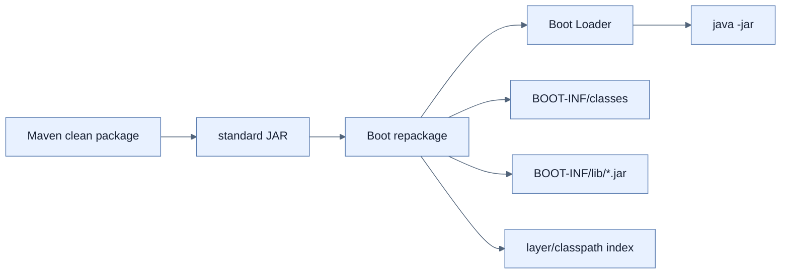

# 실행 가능한 Uber JAR 만들기

## 한눈에 보기

`./mvnw clean package`는 test를 거쳐 application code, dependency JAR, embedded server, Boot loader를 한 실행 archive로 repack한다. `java -jar ...`만으로 실행되며 application class와 library는 `BOOT-INF/classes`, `BOOT-INF/lib`에 구분된다.

## 1. 왜 이게 필요한가

외부 application server 설치·WAR/EAR 조립·수동 배포 절차가 길수록 개발과 운영의 차이가 커지고 release가 위험해진다. 실행 단위를 하나로 만들면 필요한 전제는 맞는 JVM과 외부 configuration뿐이다.

## 2. 어떻게 동작하는가

Maven `clean`은 이전 target을 지우고 `package`는 compile/test/package 단계를 실행한다. `spring-boot-maven-plugin`은 표준 JAR를 `.original`로 보존한 뒤 Boot loader와 nested dependency JAR를 추가하고 classpath/layer index metadata를 기록한다. Loader는 dependency를 풀어 서로 섞지 않고 nested JAR로 읽는다.

Shaded JAR는 dependency contents를 한 namespace에 풀어 합칠 수 있어 resource 충돌·license/support 문제가 생긴다. Boot executable JAR는 원래 library archive 경계를 유지한다.

## 3. 그림으로 보기

## 4. 이 노트에 나온 용어

- **uber/fat JAR**: application과 dependency·embedded runtime을 함께 담은 실행 archive.
- **BOOT-INF**: Boot executable JAR 내부에서 classes와 libraries를 보관하는 구조.
- **Spring Boot loader**: nested JAR classpath를 읽고 application을 시작하는 bootstrap code.

## 7. 연결

- [[02-building-a-docker-container]] — executable JAR를 runtime image 안에 계층화한다.
- [[04-tuning-and-scaling-in-production]] — 동일 JAR를 외부 설정으로 여러 환경에 실행한다.
- [[chapter-6-configuring-an-application-with-spring-boot/05-ordering-property-overrides|외부 설정 우선순위]] — immutable JAR 밖의 값이 내부 baseline을 덮는다.

## 8. 스스로 확인

- 전체 1차 정리 후: Boot executable JAR와 shaded JAR의 dependency packaging 차이를 설명한다.

<!-- ==== 아래는 내 영역 · 스킬 수정 금지 ==== -->

## 내 설명 시도

## 막혔던 지점

## 리뷰 이력

