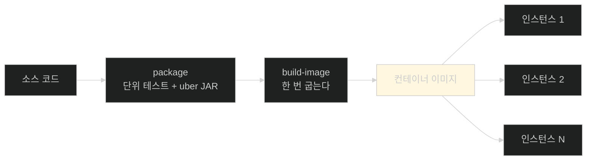
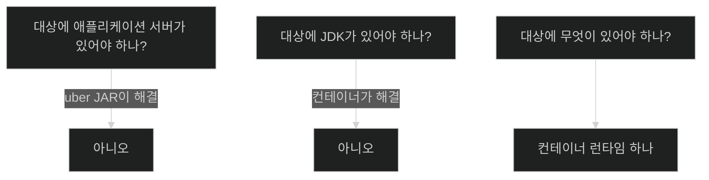

# JDK가 없는 기계에도 — 컨테이너 굽기

## 한눈에 보기

| 질문 | 핵심 답 |
|---|---|
| 왜 컨테이너인가 | uber JAR도 **대상에 JDK가 있어야** 돈다 |
| Docker의 비유 | **컨테이너선** — 세계 어디서나 같은 규격 |
| 내부 구현 | Linux namespace + cgroups, containerd·runc 같은 하위 런타임 |
| VM과 다른 점 | **호스트 커널을 공유**하면서 프로세스·메모리·네트워크만 격리 |
| 명령 | `./mvnw spring-boot:build-image` |
| `package`와 다른 점 | 표준 생명주기가 아니라 **커스텀 goal** |
| "baking"의 뜻 | 이미지를 **한 번** 구워 인스턴스를 여러 개 띄운다 |
| 먼저 하는 일 | `package`를 돌린다 — **단위 테스트 포함** |

## 1. 왜 이게 필요한가

### 출발 장면: JDK가 없는 대상

[[01-creating-an-uber-jar]]이 끝나는 지점의 질문이 이 절의 출발점이다.

> **"대상 머신에 JDK가 없다면?"**

uber JAR은 "JDK만 있으면 어디서나 돈다"였다. 그 조건이 만족되지 않는 상황이 실제로 흔하다.

| 상황 | 문제 |
|---|---|
| 대상에 자바가 아예 없다 | 설치해야 한다 |
| 자바 21이 깔려 있는데 앱은 25가 필요하다 | 업그레이드가 다른 앱에 영향을 준다 |
| 한 머신에서 여러 자바 버전이 필요하다 | 버전 관리 도구가 또 필요하다 |
| 개발 환경과 미묘하게 다르다 | "내 컴퓨터에서는 됐는데" |

**[[uber-JAR]]**(= 코드·의존성·서버를 한 파일에 담은 실행 아카이브)이 서버 설치를 없앴듯, 이번에는 **런타임 설치까지 없애는** 것이 목표다.

## 2. 어떻게 동작하는가

### 2.1 컨테이너선이라는 비유

**[[컨테이너]]**(= 호스트 커널을 공유하면서 프로세스·메모리·네트워크를 격리한 실행 단위)의 이름은 우연이 아니다. 책이 그 비유를 설명한다.

세계 화물의 대부분을 나르는 **선박 컨테이너**는 **규격이 같다.** 그래서 물건을 만드는 쪽은 세계 어디서나 같은 크기·구조의 컨테이너가 처리된다는 것을 알고 계획을 세울 수 있다.

소프트웨어도 같다. 안에 무엇이 들었든 **바깥 규격이 같으므로** 그것을 다루는 도구(엔진, 오케스트레이터, 레지스트리)가 내용물을 몰라도 된다.

### 2.2 VM보다 가벼운 이유

책이 내부 구현을 짚는다. Docker는 **Linux namespace와 control groups(cgroups)** 를 containerd·runc 같은 하위 런타임을 통해 쓴다. 그 결과 각 컨테이너는 **격리된 프로세스 트리, 메모리 뷰, 네트워크 스택**을 가지면서 **호스트 커널은 공유한다.**

이 한 줄에 VM과의 차이가 다 들어 있다.

| | 가상 머신 | 컨테이너 |
|---|---|---|
| 커널 | **자기 것** | **호스트와 공유** |
| 부팅 | OS 부팅 (수십 초) | 프로세스 시작 (수백 ms) |
| 크기 | GB 단위 | MB 단위 |
| 격리 수준 | 강함 | 커널을 공유하므로 상대적으로 약함 |
| 만드는 비용 | 무겁다 | **필요할 때 즉석에서** |

책의 표현대로 **"통째로 가상 머신을 만드느라 시간을 낭비하는 대신 필요할 때 컨테이너를 띄운다. 애플리케이션 지향적인 성격 덕에 훨씬 민첩한 선택이 된다."**

### 2.3 왜 지금 Docker인가

책이 Note로 도입 부담을 다룬다. Docker는 **업계 전반에 널리 채택**됐다.

| 근거 | 뜻 |
|---|---|
| 모든 주요 클라우드가 컨테이너 워크로드를 지원 | 배포 대상이 이미 준비돼 있다 |
| 대부분의 CI/CD가 컨테이너 기반 빌드를 지원 | 파이프라인이 이미 준비돼 있다 |
| 오케스트레이션 생태계가 형성됨 | 규모를 키울 길이 있다 |
| Docker가 2023년 AtomicJar를 인수해 **Testcontainers**를 유지보수 | Chapter 5에서 이미 Docker를 깔았다 |

결론이 명확하다 — **개발자와 시스템 관리자에게 로컬과 배포 환경에 Docker 설치를 요구하는 것은 일반적으로 운영 부담으로 여겨지지 않는다.**

마지막 줄이 특히 실용적이다. [[../../part-2-creating-an-application-with-spring-boot/chapter-5-testing-with-spring-boot/06-adding-testcontainers|Chapter 5 · Testcontainers 추가]]에서 이미 Docker를 깔았다면 **추가 요구가 없다.**

### 2.4 명령 한 줄

```bash
% ./mvnw spring-boot:build-image
```

책이 앞의 `package`와의 차이를 명시한다.

| | `./mvnw clean package` | `./mvnw spring-boot:build-image` |
|---|---|---|
| 무엇인가 | Maven **표준 생명주기 단계** | **[[Maven-goal]]**(= 플러그인이 제공하는 실행 단위) |
| 어떻게 불리나 | 앞 단계를 순서대로 부른다 | 직접 지정해 부른다 |
| 산출물 | uber JAR | **[[컨테이너-이미지]]** |
| 누가 훅했나 | **[[spring-boot-maven-plugin]]**이 package에 훅 | 같은 플러그인의 별도 goal |

`spring-boot:` 접두사가 플러그인 이름이고 `build-image`가 goal 이름이다. 표준 단계가 아니므로 **이름을 직접 적어야** 한다.

### 2.5 "굽는다"는 말

Docker 세계의 표현으로 **baking**은 컨테이너를 돌리는 데 필요한 모든 부품을 조립하는 것이다.

이 단어가 담는 함의가 중요하다. **한 번 구우면 그 이미지로 필요한 만큼 인스턴스를 띄운다.**



이미지가 **[[불변-아티팩트]]**(= 빌드 후 고치지 않는 배포물)라는 점이 [[04a-scaling-with-spring-boot]]의 전제가 된다. 같은 이미지를 세 벌 띄우고 **설정만 다르게** 주는 것이 이 장 후반부의 내용이다.

### 2.6 순서가 있다

책이 짚는 실행 순서가 중요하다. `build-image`는 먼저 **Maven의 `package` 단계를 돌린다.**

```text
build-image
  └ package 실행
      └ 표준 단위 테스트 실행
      └ uber JAR 조립
  └ 그 uber JAR을 재료로 이미지 조립
```

두 가지가 따라온다.

1. **테스트를 통과하지 못하면 이미지도 안 나온다.** 릴리스 아티팩트에 검증이 강제된다.
2. **이미지는 uber JAR 위에 세워진다.** [[01-creating-an-uber-jar]]의 결과물이 그대로 재료다.

### 2.7 그런데 아무 컨테이너나 좋은 게 아니다

책이 이 절을 이렇게 닫는다 — **"실행 가능한 uber JAR을 손에 넣었으니 다음은 애플리케이션을 컨테이너 이미지로 패키징하는 것이다. 그런데 모든 컨테이너가 똑같이 만들어지는 것은 아니다. 컨테이너를 조립하는 방식은 성능·재빌드 시간·효율에 직접 영향을 준다."**

무엇이 "제대로 된" 컨테이너인지가 [[02a-building-the-right-type-of-container]]의 주제다.

## 3. 그림으로 보기



| 단계 | 대상에 필요한 것 | 담당 노트 |
|---|---|---|
| WAR/EAR | 애플리케이션 서버 + JDK | (옛 방식) |
| uber JAR | **JDK** | [[01-creating-an-uber-jar]] |
| 컨테이너 이미지 | **컨테이너 런타임** | 이 노트 |

## 4. 이 노트에 나온 용어

| 용어 | 한 줄 뜻 | 정의 위치 |
|---|---|---|
| 컨테이너 | 커널을 공유하며 격리된 실행 단위 | [[_glossary#컨테이너]] |
| 컨테이너 이미지 | 컨테이너를 만들어 내는 읽기 전용 템플릿 | [[_glossary#컨테이너-이미지]] |
| Maven goal | 플러그인이 제공하는 실행 단위 | [[_glossary#Maven-goal]] |
| uber JAR | 코드·의존성·서버를 한 파일에 담은 아카이브 | [[_glossary#uber-JAR]] |
| spring-boot-maven-plugin | uber JAR·이미지를 만드는 Maven 플러그인 | [[_glossary#spring-boot-maven-plugin]] |
| 불변 아티팩트 | 빌드 후 고치지 않는 배포물 | [[_glossary#불변-아티팩트]] |

## 5. 자주 헷갈리는 것

**"컨테이너는 가벼운 가상 머신이다"** — 비슷해 보이지만 **커널을 공유한다**는 점이 근본적으로 다르다. 그래서 기동이 빠르고 격리는 상대적으로 약하다.

**"`build-image`도 표준 Maven 단계다"** — 아니다. **goal**이라 이름을 직접 적어야 한다.

**"`build-image`는 JAR과 별개로 이미지를 만든다"** — 먼저 `package`를 돌려 uber JAR을 만들고 **그 위에** 이미지를 세운다.

**"굽는 것과 실행하는 것은 같이 일어난다"** — 분리돼 있다. 한 번 굽고 여러 번 띄운다.

## 6. 언제 안 쓰나 / 경계

- **컨테이너 런타임이 없으면 여전히 못 돈다.** 요구가 JDK에서 런타임으로 옮겨 갔을 뿐이다. 다만 Note가 짚듯 그 요구는 이미 널리 충족돼 있다.
- **커널 공유는 격리의 한계다.** 강한 격리가 필요하면 VM이나 별도 방식이 필요하다.
- **이미지가 커질 수 있다.** 무엇을 담느냐에 따라 수백 MB가 된다. 그 최적화가 [[02a-building-the-right-type-of-container]]의 주제다.
- **비유의 한계.** 컨테이너선 비유는 "규격이 같아서 어디서나 처리된다"를 잘 설명한다. 다만 이 비유는 **컨테이너가 배와 무관하게 존재한다**는 인상을 준다. 실제로 컨테이너는 호스트 커널 위에서만 산다 — 배 없이 떠 있을 수 없고, 배(호스트 OS)의 종류가 바뀌면 실을 수 있는 것도 달라진다.

## 7. 연결

- [[01-creating-an-uber-jar]] — 그 노트가 남긴 "JDK가 없다면?"이라는 질문의 답이 이 노트다. 그리고 그 결과물이 이미지의 재료다.
- [[02a-building-the-right-type-of-container]] — "아무 컨테이너나 좋은 게 아니다"는 이 노트의 마지막 문장을 이어받는다.
- [[03-publishing-an-image-to-docker-hub]] — 구운 이미지를 실제로 배포한다.

## 8. 스스로 확인

1. uber JAR이 남긴 조건이 실제로 문제가 되는 상황을 세 가지 들 수 있는가?
2. 컨테이너선 비유가 설명하는 성질은 정확히 무엇인가?
3. 컨테이너가 VM보다 가벼운 근본 이유를 커널 관점에서 말할 수 있는가?
4. 책이 Docker 설치 요구를 부담으로 보지 않는 근거 네 가지는?
5. `package`와 `build-image`가 Maven에서 성격이 어떻게 다른가?
6. "baking"이라는 말이 담는 함의는?
7. `build-image`가 먼저 `package`를 도는 것이 만드는 두 가지 결과는?
8. 컨테이너선 비유가 깨지는 지점은 어디인가?


> 여덟 문항을 스스로 답한 **뒤에** [[_02-building-a-docker-container]]에서 모범답안과 대조한다. 먼저 열면 이 문항들은 다시 인출 문제로 쓸 수 없다.

<!-- ==== 아래는 내 영역 · 스킬 수정 금지 ==== -->

## 내 설명 시도


## 막혔던 지점


## 리뷰 이력
