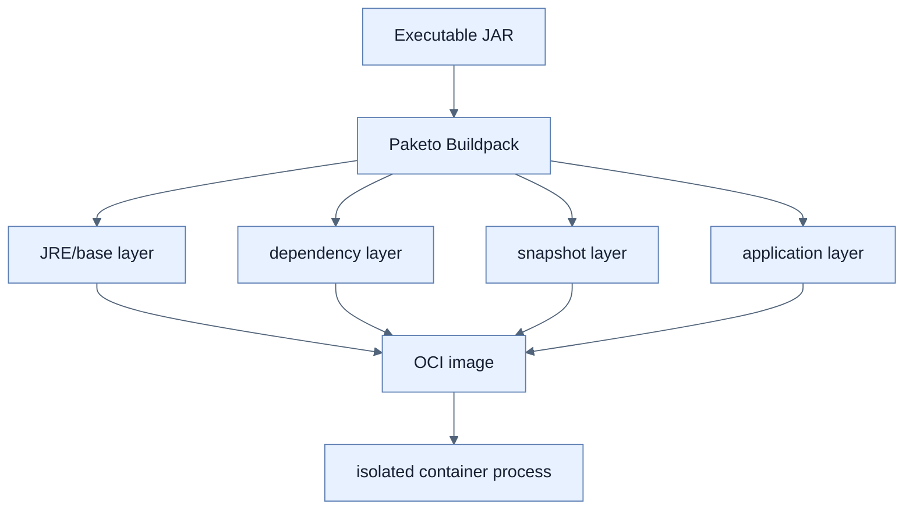

# Buildpack으로 Docker Container 만들기

## 한눈에 보기

`./mvnw spring-boot:build-image`는 test/package 후 Cloud Native Buildpacks, 책에서는 Paketo를 사용해 Java runtime과 application을 OCI image로 만든다. Dependency, Boot loader, snapshot, application code를 다른 layer로 나눠 변경된 부분만 rebuild/pull한다.

## 1. 왜 이게 필요한가

Uber JAR는 target machine에 맞는 JVM이 필요하다. Container image는 runtime과 filesystem을 함께 고정하고 host kernel을 공유하는 격리된 process로 어디서나 같은 실행 환경을 제공한다. Layer 분리는 매 코드 변경 때 변하지 않은 framework dependency를 다시 전송하지 않게 한다.

## 2. 어떻게 동작하는가

Buildpack lifecycle이 source/JAR를 감지하고 builder/run image, 적절한 JRE, launch process, memory 계산과 layer metadata를 구성한다. 사용자는 Dockerfile을 직접 쓰지 않아도 된다. `docker run -p 8080:8080 image`는 host 8080을 container 8080에 연결한다.

Container는 VM보다 가볍지만 host kernel을 공유하고 image가 보안·운영 책임을 없애지 않는다. base image update, SBOM, vulnerability scan, non-root, resource limit과 tag immutability가 production 단계에 필요하다.

## 3. 그림으로 보기

## 4. 이 노트에 나온 용어

- **container image**: filesystem layers와 실행 metadata를 담은 immutable template.
- **buildpack**: source/artifact를 감지해 runtime image로 변환하는 build component.
- **layer cache**: 변하지 않은 image layer를 재사용하는 저장 방식.
- **port mapping**: host port를 container 내부 port에 forwarding하는 설정.

## 7. 연결

- [[01-creating-an-uber-jar]] — image의 application 입력 산출물이다.
- [[03-publishing-an-image-to-docker-hub]] — local image를 registry에 배포한다.
- [[chapter-8-going-native-with-spring-boot/04-building-native-container-images|Native container]] — JVM 대신 native executable을 image에 넣는다.

## 8. 스스로 확인

- 전체 1차 정리 후: application code와 third-party dependency를 다른 layer에 두는 이유를 설명한다.

<!-- ==== 아래는 내 영역 · 스킬 수정 금지 ==== -->

## 내 설명 시도

## 막혔던 지점

## 리뷰 이력

