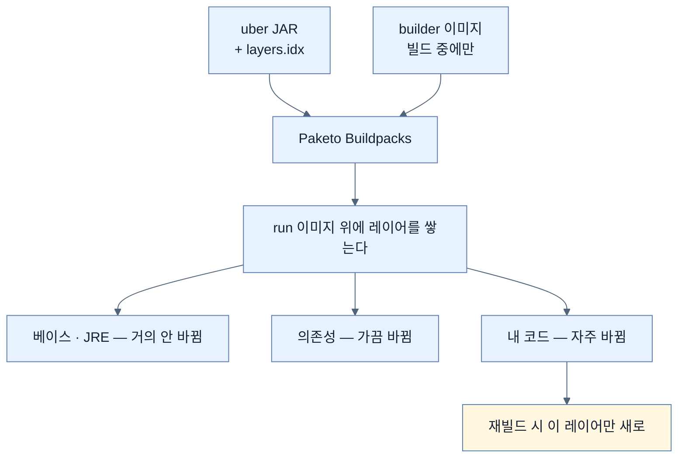

# 자바 파일 한 줄에 Spring을 다시 받지 않으려면 — 레이어 설계

## 한눈에 보기

| 질문 | 핵심 답 |
|---|---|
| "제대로 된" 컨테이너란 | **레이어 캐싱이 잘 듣는** 컨테이너 |
| 하면 안 되는 것 | 내 코드와 서드파티 의존성을 **같은 레이어에** |
| 왜 | 자바 파일 하나가 바뀌면 **레이어 전체가 무효화**된다 |
| 예전에는 | 수동으로 여러 단계를 밟아야 했다 |
| 지금은 | Spring Boot가 **계층형을 기본값으로** 만들었다 |
| 누가 이미지를 만드나 | **Paketo Buildpacks** — Spring Boot는 위임한다 |
| 이미지 이름 | pom의 module과 version에서 나온다 |
| 실행 | `docker run -p 8080:8080 ...`, 조회 `docker ps`, 중지 `docker stop <이름>` |

## 1. 왜 이게 필요한가

### 출발 장면: 오타 하나 고쳤는데 200MB를 다시 받는다

[[02-building-a-docker-container]]가 남긴 질문 — "모든 컨테이너가 똑같이 만들어지는 것은 아니다"가 무슨 뜻인가.

**[[컨테이너-이미지]]**를 통짜 하나로 만들었다고 하자. 그 안에는 이런 것들이 함께 있다.

```text
[ 베이스 OS + JRE + Spring Boot + Spring Framework + Mustache + ... + 내 코드 ]
```

이제 컨트롤러의 문자열 하나를 고치고 다시 빌드한다. 무슨 일이 벌어질까.

**전부 다시 만들어진다.** 그리고 배포할 때 **전부 다시 전송된다.** 바뀐 것은 몇 바이트인데 수백 MB가 오간다.

### **[[레이어-캐싱]]**이 있는데 왜 안 듣나

Docker에는 캐싱이 내장돼 있다. 이미지를 여러 **레이어**의 합으로 보고, 어떤 단계에서 이전 빌드와 달라진 것이 없으면 캐시된 레이어를 재사용한다.

문제는 **무효화 규칙**이다. 한 레이어의 내용이 바뀌면 **그 레이어와 그 위의 모든 레이어**가 무효가 된다.


책의 예가 정확하다 — **Spring Framework 7.0.0 GA 릴리스**는 캐시해 두기에 딱 좋은 것이다. 계속 다시 받을 이유가 없다. 그런데 내 코드가 같은 레이어에 섞여 있으면 **자바 파일 하나가 바뀔 때마다 그것까지 통째로 다시 받아야 한다.**

그래서 결론이 나온다 — **Spring Boot·Spring Framework·Mustache 같은 라이브러리는 한 레이어에, 내 코드는 별도 레이어에.** 이것이 **[[계층형-이미지]]**(= 자주 바뀌는 것과 안 바뀌는 것을 다른 레이어로 나눈 이미지)다.

## 2. 어떻게 동작하는가

### 2.1 기본값이 됐다

책이 짚는 변화가 중요하다. **예전에는 이 계층 분리에 여러 수동 단계가 필요했다.** 지금은 Spring Boot 팀이 **계층형 방식을 기본 설정으로** 만들었다.

그 재료가 [[01-creating-an-uber-jar]]의 7단계 중 마지막이다 — `BOOT-INF` 아래의 **[[layers.idx]]**(= 어떤 파일을 어느 레이어에 넣을지 적은 목록)와 `classpath.idx`. uber JAR을 만들 때 이미 **어떤 파일이 어느 레이어에 속하는지 적어 두었다.**

그래서 아무것도 설정하지 않아도 제대로 나뉜다.

### 2.2 로그가 알려 주는 것

```text
[INFO] --- spring-boot-maven-plugin:4.0.0:build-image (default-cli) @ ch7 ---
[INFO] Building image 'docker.io/library/ch7:0.0.1-SNAPSHOT'
[INFO]  > Pulling builder image 'docker.io/paketobuildpacks/builder-noble-java-tiny:latest' 100%
[INFO]  > Pulled builder image 'paketobuildpacks/builder-noble-java-tiny@sha256:cab14ec…'
[INFO]  > Pulling run image 'docker.io/paketobuildpacks/ubuntu-noble-run-tiny:0.0.53' for platform 'linux/arm64' 100%
[INFO]  > Pulled run image 'paketobuildpacks/ubuntu-noble-run-tiny@sha256:33b7be8…'
[INFO]  > Executing lifecycle version v0.21.1
[INFO]  > Using build cache volume 'pack-cache-564d5464b59a.build'
…
[INFO] Successfully built image 'docker.io/library/ch7:0.0.1-SNAPSHOT'
```

책이 이 발췌에서 셋을 읽어 낸다.

| 읽히는 것 | 근거 |
|---|---|
| 이미지 이름이 `docker.io/library/ch7:0.0.1-SNAPSHOT` | **pom의 module 이름과 version**에서 나온다 |
| Docker Hub에서 Paketo 컨테이너를 받는다 | `paketobuildpacks/builder`와 `paketobuildpacks/run` |
| 성공적으로 조립됐다 | 마지막 줄 |

첫 줄이 실무적으로 중요하다. **이미지 이름을 따로 지정하지 않았는데도 나온다.** pom을 바꾸면 이미지 이름도 따라 바뀐다.

> **원문 불일치.** 이 로그는 `spring-boot-maven-plugin:**4.0.0**`인데, 바로 아래 2.4절에 인용한 컨테이너 실행 로그의 배너는 `Spring Boot (v**4.1.0**)`이다. 같은 프로젝트의 두 출력이 서로 다른 버전을 가리킨다.

### 2.3 Paketo에 위임한다

**[[Paketo-Buildpacks]]**(= 애플리케이션 종류를 감지해 컨테이너 이미지를 조립해 주는 재사용 컴포넌트 모음)가 실제 작업자다.

책이 정리하는 역할이 넷이다.

| 하는 일 | 없으면 내가 해야 하는 일 |
|---|---|
| 애플리케이션 종류 자동 감지(여기서는 자바) | Dockerfile에 직접 적는다 |
| **베이스 이미지 선택** | 어느 OS·어느 배포판을 쓸지 정한다 |
| **올바른 자바 런타임 설치** | JDK 버전과 배포판을 고르고 설치 스크립트를 쓴다 |
| **캐싱 효율을 최대화하도록 레이어 구성** | 무엇을 어느 레이어에 둘지 손으로 설계한다 |

책이 Note로 관계를 분명히 한다 — **Spring Boot는 컨테이너화를 직접 하지 않고 Paketo에 위임한다.** 일을 대신 해 주는 컨테이너를 내려받아 쓰는 구조다.

로그에 두 종류의 이미지가 나오는 것도 그래서다.

| 이미지 | 언제 쓰이나 | 최종 결과물에 |
|---|---|---|
| **[[빌더-이미지]]**(= 이미지를 만드는 과정에서만 쓰이는 컨테이너) `builder-noble-java-tiny` | 빌드 중 | **포함되지 않는다** |
| **[[런-이미지]]**(= 최종 컨테이너의 바탕이 되는 이미지) `ubuntu-noble-run-tiny` | 실행 시 | 포함된다 |

이름의 `tiny`가 힌트다. 런타임에 필요한 최소한만 담아 최종 이미지를 작게 만든다.

### 2.4 띄우기

```bash
% docker run -p 8080:8080 docker.io/library/ch7:0.0.1-SNAPSHOT
Calculating JVM memory based on 7163580K available memory
…
:: Spring Boot ::                (v4.1.0)
2026-02-12T00:52:20.331Z  INFO 1 --- [main] c.l.Chapter7Application : Starting Chapter7Application v0.0.1-SNAPSHOT using Java 25.0.2 with PID 1 (/workspace/BOOT-INF/classes started by cnb in /workspace)
```

| 조각 | 뜻 |
|---|---|
| `docker run` | 컨테이너를 실행 |
| `-p 8080:8080` | **[[포트-매핑]]**(= 컨테이너 내부 포트를 호스트 포트에 연결) |
| `docker.io/library/ch7:0.0.1-SNAPSHOT` | 이미지 이름. **접두사를 생략하면 `docker.io/library/`가 기본** |

출력에서 읽을 게 더 있다.

- `Calculating JVM memory based on 7163580K available memory` — Paketo가 **컨테이너에 할당된 메모리를 보고 JVM 옵션을 계산**한다. 손으로 `-Xmx`를 주지 않아도 된다.
- `PID 1` — 컨테이너 안에서 애플리케이션이 **1번 프로세스**다. 컨테이너의 수명이 곧 이 프로세스의 수명이다.
- `/workspace/BOOT-INF/classes` — [[01-creating-an-uber-jar]]에서 본 그 구조가 컨테이너 안에 풀려 있다.
- `started by cnb` — Paketo가 만든 비루트 사용자. **보안상 root로 돌지 않는다.**

### 2.5 확인과 중지

```bash
% docker ps
CONTAINER ID   IMAGE                COMMAND              CREATED         STATUS         PORTS                    NAMES
5e4fb7fdead2   ch7:0.0.1-SNAPSHOT   "/cnb/process/web"   5 minutes ago   Up 5 minutes   0.0.0.0:8080->8080/tcp   angry_cray
```

| 열 | 뜻 |
|---|---|
| `5e4fb7fdead2` | 컨테이너의 해시 ID |
| `ch7:0.0.1-SNAPSHOT` | 이미지 이름(`docker.io` 접두사 없이) |
| `/cnb/process/web` | **Paketo가 앱을 띄우는 데 쓰는 명령** |
| `5 minutes ago` / `Up 5 minutes` | 시작 시각과 가동 시간 |
| `0.0.0.0:8080->8080/tcp` | 내부-외부 매핑 |
| `angry_cray` | Docker가 붙인 **사람 친화적 임의 이름** |

```bash
% docker stop angry_cray
```

책이 Note로 짚듯 이름은 **띄울 때마다 다르게** 생성된다. 해시 ID, 이 이름, Docker Desktop의 클릭 중 무엇으로든 제어할 수 있다.

임의 이름이 편리한 동시에 함정이기도 하다. **스크립트에 이름을 박아 둘 수 없다.** [[04c-running-the-setup-with-docker-compose]]에서 `container_name`을 고정하는 이유가 그것이다.

## 3. 그림으로 보기



| 무엇이 바뀌면 | 다시 만들어지는 레이어 | 다시 전송되는 양 |
|---|---|---|
| 베이스 OS·JRE 버전 | 전부 | 크다 |
| 의존성 버전 | 의존성 + 코드 | 중간 |
| **내 코드 한 줄** | **코드 레이어만** | **작다** |

## 4. 이 노트에 나온 용어

| 용어 | 한 줄 뜻 | 정의 위치 |
|---|---|---|
| 레이어 캐싱 | 바뀌지 않은 레이어를 재사용하는 최적화 | [[_glossary#레이어-캐싱]] |
| 계층형 이미지 | 변경 빈도로 레이어를 나눈 이미지 | [[_glossary#계층형-이미지]] |
| Paketo Buildpacks | 이미지를 조립해 주는 재사용 컴포넌트 | [[_glossary#Paketo-Buildpacks]] |
| 빌더 이미지 | 빌드 과정에서만 쓰이는 컨테이너 | [[_glossary#빌더-이미지]] |
| 런 이미지 | 최종 컨테이너의 바탕 이미지 | [[_glossary#런-이미지]] |
| layers.idx | 파일을 어느 레이어에 넣을지 적은 목록 | [[_glossary#layers.idx]] |
| 포트 매핑 | 컨테이너 포트를 호스트 포트에 연결 | [[_glossary#포트-매핑]] |
| 컨테이너 이미지 | 컨테이너를 만드는 읽기 전용 템플릿 | [[_glossary#컨테이너-이미지]] |
| 컨테이너 | 커널을 공유하며 격리된 실행 단위 | [[_glossary#컨테이너]] |

## 5. 자주 헷갈리는 것

**"레이어를 나누면 이미지가 커진다"** — 총 크기는 비슷하고 **재빌드·재전송되는 양**이 줄어든다.

**"계층 분리를 직접 설정해야 한다"** — Spring Boot 4에서는 기본값이다. `layers.idx`가 uber JAR 안에 이미 들어 있다.

**"Spring Boot가 이미지를 만든다"** — Paketo에 **위임한다.** 그래서 로그에 `paketobuildpacks/...`가 나온다.

**"builder 이미지가 최종 이미지에 들어간다"** — 들어가지 않는다. 빌드에만 쓰이고, 최종은 run 이미지 위에 세워진다.

**"컨테이너 이름은 내가 정한 것이다"** — Docker가 임의로 붙인다. 고정하려면 `--name`이나 Compose의 `container_name`을 쓴다.

## 6. 언제 안 쓰나 / 경계

- **레이어를 나눠도 베이스가 바뀌면 소용없다.** JRE 버전을 올리면 그 위가 다 무효가 된다.
- **`docker.io/library/` 기본 접두사에 의존하면 헷갈린다.** 배포용 이미지는 [[03-publishing-an-image-to-docker-hub]]에서 보듯 네임스페이스를 명시한다.
- **임의 이름은 자동화에 쓸 수 없다.** 스크립트에서는 고정 이름이나 ID를 써야 한다.
- **비유의 한계.** 레이어 캐싱은 "옷을 겹쳐 입는 것"에 비유할 수 있다. 안에 입은 옷은 그대로 두고 겉옷만 갈아입는다. 다만 이 비유는 **아래 것을 바꾸면 위를 다 벗어야 한다**는 방향성을 담지 못한다. Docker에서는 아래 레이어가 바뀌면 그 **위의 모든 레이어**가 무효가 되므로, 변경 빈도가 낮은 것을 반드시 **아래에** 두어야 한다. 순서가 성능을 결정한다.

## 7. 연결

- [[02-building-a-docker-container]] — "아무 컨테이너나 좋은 게 아니다"는 그 노트의 마지막 문장에 이 노트가 답한다.
- [[01-creating-an-uber-jar]] — 7단계의 마지막에서 만든 `layers.idx`가 여기서 실제로 쓰인다.
- [[03-publishing-an-image-to-docker-hub]] — 여기서 만들고 확인한 이미지를 레지스트리로 보낸다.

## 8. 스스로 확인

1. 통짜 이미지에서 자바 파일 한 줄을 고치면 무슨 일이 생기는가?
2. 레이어 무효화 규칙이 "변경 빈도가 낮은 것을 아래에"라는 설계를 요구하는 이유는?
3. `layers.idx`가 언제 만들어졌고 여기서 어떻게 쓰이는가?
4. build-image 로그에서 이미지 이름의 출처를 말할 수 있는가?
5. Paketo가 하는 네 가지 일 중 직접 하려면 가장 까다로운 것은?
6. builder 이미지와 run 이미지의 차이는?
7. `Calculating JVM memory…` 로그가 알려 주는 Paketo의 기능은?
8. 컨테이너의 임의 이름이 함정이 되는 상황은?
9. 옷을 겹쳐 입는 비유가 깨지는 지점은 어디인가?

<!-- ==== 아래는 내 영역 · 스킬 수정 금지 ==== -->

## 내 설명 시도


## 막혔던 지점


## 리뷰 이력
