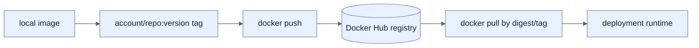

# Docker Hub에 Image 배포

## 한눈에 보기

Local image를 Docker Hub account namespace가 포함된 tag로 다시 표시하고 로그인 후 push하면 다른 host가 pull/run할 수 있다. Tag는 registry/repository와 version을 나타내는 배포 좌표다.

## 1. 왜 이게 필요한가

개발자 laptop의 local image는 운영 host나 고객이 접근할 수 없다. Registry는 build와 run 사이에 versioned binary distribution point를 제공하고 CI가 생성한 동일 image를 여러 환경이 소비하게 한다.

## 2. 어떻게 동작하는가

1. Docker Hub에 repository와 접근 권한을 준비한다.
2. `docker tag local-image account/repository:version`으로 remote 좌표를 부여한다.
3. `docker login` credential로 인증한다.
4. `docker push`가 content-addressed layer 중 registry에 없는 것만 전송한다.
5. 소비자는 같은 full tag 또는 digest로 pull한다.

Mutable tag, 특히 `latest`는 시간이 지나 같은 이름이 다른 bits를 가리킬 수 있다. 재현 가능한 release에는 version tag와 immutable digest, provenance/signing, private visibility와 least-privilege token을 함께 쓴다.

## 3. 그림으로 보기

## 4. 이 노트에 나온 용어

- **container registry**: image manifest와 layer를 저장·배포하는 service.
- **image tag**: image repository의 사람이 읽는 version label.
- **digest**: image content에서 계산한 immutable identifier.

## 7. 연결

- [[02-building-a-docker-container]] — push할 local image를 만든다.
- [[04-tuning-and-scaling-in-production]] — registry image를 여러 instance에서 실행한다.
- [[chapter-13-observability-with-spring-boot-4/02-designing-an-observability-architecture|관측 아키텍처]] — 배포 version/digest도 telemetry resource에 기록해야 한다.

## 8. 스스로 확인

- 전체 1차 정리 후: version tag만으로 완전한 immutability가 보장되지 않는 이유를 설명한다.

<!-- ==== 아래는 내 영역 · 스킬 수정 금지 ==== -->

## 내 설명 시도

## 막혔던 지점

## 리뷰 이력

