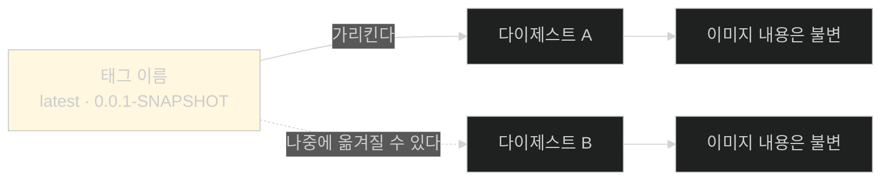
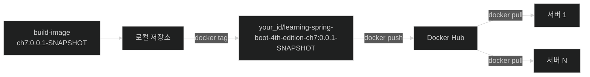

# 이름을 붙여야 나갈 수 있다 — tag와 push

## 한눈에 보기

| 질문 | 핵심 답 |
|---|---|
| 왜 별도 절인가 | **만드는 것과 릴리스하는 것은 다르다** |
| 명령 셋 | `docker login` → `docker tag` → `docker push` |
| 태깅이란 | 로컬 이미지에 **완전한 이름**을 붙여 원격 레지스트리로 보낼 수 있게 하는 것 |
| 이름 형식 | `namespace/name:tag` |
| 왜 namespace가 필요한가 | Docker Hub가 **계정 ID 접두사**를 요구한다 |
| 로컬 이름과 같아야 하나 | **아니다.** 더 서술적인 이름을 고를 수 있다 |
| `latest`는 | 규칙이 아니라 **관례**다. 태그는 옮길 수 있다 |
| 이 절이 다루지 않는 것 | Docker 자체의 심화 — 별도 책의 몫 |

## 1. 왜 이게 필요한가

### 출발 장면: 내 노트북에만 있는 이미지

[[02a-building-the-right-type-of-container]]까지 하면 이미지가 만들어지고 실행도 된다. 그런데 그 이미지는 **내 기계의 로컬 저장소에만** 있다.

```text
docker.io/library/ch7:0.0.1-SNAPSHOT   ← 이름은 그럴듯하지만 로컬 전용
```

배포 대상 서버가 이 이미지를 어떻게 가져갈까. 파일로 뽑아 복사할 수도 있지만, 그러면 [[01-creating-an-uber-jar]]이 없앤 "물리적으로 운반하는" 시대로 되돌아간다.

**[[컨테이너-레지스트리]]**(= 이미지를 보관하고 배포하는 저장소 서비스)가 그 자리를 대신한다. 이미지를 거기 올려 두면 어느 기계에서든 `docker pull`로 받는다.

책의 표현이 이 절의 요지다 — **"컨테이너를 만드는 것이 하나라면, 그 컨테이너를 운영에 릴리스하는 것은 결정적이다."** Spring 애드보킷 Josh Long의 말도 인용한다 — "Production is the happiest place on Earth!"

## 2. 어떻게 동작하는가

### 2.1 세 명령

```bash
% docker login -u <your_id>
Password: *********

% docker tag ch7:0.0.1-SNAPSHOT <your_id>/learning-spring-boot-4th-edition-ch7:0.0.1-SNAPSHOT
% docker push <your_id>/learning-spring-boot-4th-edition-ch7:0.0.1-SNAPSHOT
```

| 명령 | 하는 일 | 없으면 |
|---|---|---|
| `docker login` | 레지스트리에 인증 | push가 거부된다 |
| `docker tag` | 로컬 이미지에 **완전한 이름**을 붙인다 | 어디로 보낼지 알 수 없다 |
| `docker push` | 그 이름으로 업로드 | — |

### 2.2 태깅이 필요한 이유

가운데 명령이 이 절의 핵심이고, 처음 보면 불필요해 보인다. 이미 `ch7:0.0.1-SNAPSHOT`이라는 이름이 있는데 왜 또 이름을 붙일까.

책의 정의가 답이다 — **태깅은 로컬 이미지에 완전히 정규화된 이름을 부여해 원격 레지스트리로 push할 수 있게 하는 과정**이다.

**[[이미지-태그]]**(= `namespace/name:tag` 형식으로 이미지의 특정 버전을 가리키는 이름표)의 세 부분이 각각 다른 질문에 답한다.

| 부분 | 이 예에서 | 무엇을 정하나 |
|---|---|---|
| namespace | `<your_id>` | **누구의 것인가** |
| name | `learning-spring-boot-4th-edition-ch7` | **무엇인가** |
| tag | `0.0.1-SNAPSHOT` | **어느 버전인가** |

`docker.io/library/ch7`의 `library`는 Docker Hub의 **공식 이미지 전용 네임스페이스**다. 우리 이미지를 거기 올릴 수는 없다. 그래서 계정 ID를 네임스페이스로 갈아 끼운다.

책이 짚는 자유도도 중요하다 — **이 이름이 로컬 이름과 같을 필요가 없다.** 로컬에서는 `ch7`이라는 짧은 이름이 편하지만, 공개 레지스트리에서는 그것만으로 무엇인지 알 수 없다. 그래서 `learning-spring-boot-4th-edition-ch7`처럼 **서술적인 이름**을 고른다. 책도 "이미지가 공개될 수 있으므로 더 서술적이거나 표준화된 이름을 고를 수 있다"고 덧붙인다.

### 2.3 태그는 옮길 수 있다

책이 Note로 다루는 주제가 실무에서 자주 사고를 낸다.

**`latest`는 규칙이 아니라 관례다.**

| 오해 | 사실 |
|---|---|
| `latest`는 Docker가 자동으로 최신을 가리킨다 | **발행자가 직접 옮겨야** 그렇게 된다 |
| `0.0.1-SNAPSHOT`은 고정된 버전이다 | **이것도 옮길 수 있다.** 스냅숏을 갱신할 때마다 같은 태그로 push하는 것이 흔하다 |
| 태그가 같으면 내용도 같다 | **보장되지 않는다** |

**[[latest-태그]]**(= "가장 최근 릴리스"를 뜻하는 것으로 널리 쓰이는 관례적 태그 이름)에 대한 책의 경고가 명확하다 — 여러 릴리스를 관리하는 발행자들이 여러 태그를 함께 운영하게 되면서, **어떤 컨테이너의 태그든 채택하기 전에 그 태깅 전략을 확인해야** 한다.

이것이 **[[불변-아티팩트]]**(= 빌드 후 고치지 않는 배포물) 원칙과 미묘하게 충돌하는 지점이다.



**이미지 내용 자체는 불변**이지만 **태그는 가변**이다. 그래서 재현 가능한 배포가 필요하면 태그가 아니라 다이제스트(`@sha256:...`)로 고정한다. [[02a-building-the-right-type-of-container]]의 build-image 로그에 Paketo 이미지들이 다이제스트와 함께 찍혀 있던 것이 그 예다.

### 2.4 올라간 결과

push가 끝나면 Docker Hub의 Repositories 목록에 한 행이 생긴다. 책의 Figure 7.1이 그 화면이다.

| 열 | 이 예에서 | 확인할 것 |
|---|---|---|
| Name | `<your_id>/learning-spring-boot-4th-edition-ch7` | **namespace/name** 형식이 그대로 |
| Last Pushed | 방금 | push 성공 |
| Contains | IMAGE | 이미지 저장소 |
| **Visibility** | **Public** | **누구나 받을 수 있다** |

마지막 줄이 중요하다. 기본이 공개라면 **소스에 담긴 것이 전부 공개된다.** 설정 파일에 자격 증명이 들어 있으면 그대로 새어 나간다. 이 장의 [[04-tuning-and-scaling-in-production]]이 설정을 이미지 밖에 두는 이유 중 하나다.

책이 Note로 덧붙이듯 스크린샷은 **저자의 저장소**이고, 태깅과 push에는 **자기 Docker Hub ID를 써야** 한다.

### 2.5 여기까지가 이 책의 몫

책이 범위를 명확히 한다. Docker, Docker Hub, 컨테이너 세계를 훨씬 깊이 파고들 수 있지만 **그것만 다루는 책들이 따로 있다.** *Docker Deep Dive*(Nigel Poulton), *Docker: Up & Running*(Karl Matthias·Sean Kane)을 가리킨다.

이 장의 목표는 Docker 숙달이 아니라 **Spring Boot가 그 과정을 얼마나 단순하게 만드는가**다. 그리고 결과가 그것을 뒷받침한다 — **커스텀 코드를 한 줄도 쓰지 않고** 완성된 애플리케이션을 컨테이너로 패키징해 사용자에게 전달했다.

Dockerfile도, 빌드 스크립트도 없었다. [[02a-building-the-right-type-of-container]]의 Paketo 위임 구조가 그 자리를 대신했다.

## 3. 그림으로 보기



| 단계 | 이름 | 어디에 있나 |
|---|---|---|
| 빌드 직후 | `ch7:0.0.1-SNAPSHOT` | 내 기계 |
| 태그 후 | `<id>/learning-…-ch7:0.0.1-SNAPSHOT` | 내 기계(같은 이미지, 이름 둘) |
| push 후 | 같은 이름 | **Docker Hub** |
| pull 후 | 같은 이름 | 어느 서버든 |

## 4. 이 노트에 나온 용어

| 용어 | 한 줄 뜻 | 정의 위치 |
|---|---|---|
| 컨테이너 레지스트리 | 이미지를 보관·배포하는 저장소 서비스 | [[_glossary#컨테이너-레지스트리]] |
| 이미지 태그 | `namespace/name:tag` 형식의 이름표 | [[_glossary#이미지-태그]] |
| latest 태그 | "최신"을 뜻하는 관례적 태그 이름 | [[_glossary#latest-태그]] |
| 컨테이너 이미지 | 컨테이너를 만드는 읽기 전용 템플릿 | [[_glossary#컨테이너-이미지]] |
| 불변 아티팩트 | 빌드 후 고치지 않는 배포물 | [[_glossary#불변-아티팩트]] |

## 5. 자주 헷갈리는 것

**"`docker tag`가 이미지를 복사한다"** — 복사하지 않는다. **같은 이미지에 이름을 하나 더** 붙인다.

**"로컬 이름과 원격 이름이 같아야 한다"** — 같을 필요 없다. 공개 저장소에서는 더 서술적인 이름이 낫다.

**"`latest`는 항상 최신이다"** — 발행자가 옮겨야 그렇게 된다. **관례일 뿐**이다.

**"태그가 같으면 내용도 같다"** — 태그는 옮길 수 있다. 재현이 필요하면 다이제스트로 고정한다.

**"push하면 자동으로 비공개다"** — 기본 공개일 수 있다. Figure 7.1의 `Visibility: Public`이 그 예다.

## 6. 언제 안 쓰나 / 경계

- **공개 레지스트리에 민감한 것이 들어가면 안 된다.** 이미지 안의 설정 파일까지 함께 공개된다.
- **Docker Hub만이 선택지는 아니다.** 책도 "어느 클라우드 제공자든 Docker를 지원한다"고 짚는다.
- **태그 전략이 없으면 배포가 재현되지 않는다.** 같은 태그가 시점에 따라 다른 이미지를 가리킬 수 있다.
- **비유의 한계.** 태깅은 "택배 송장에 받는 사람 주소를 적는 것"에 가깝다. 물건은 그대로고 이름표만 붙는다. 다만 이 비유는 **주소가 나중에 다른 물건으로 옮겨 갈 수 있다**는 성질을 담지 못한다. 태그는 물건에 붙는 라벨이 아니라 **물건을 가리키는 포인터**라, 같은 이름이 다음 주에는 다른 이미지를 가리킬 수 있다.

## 7. 연결

- [[02a-building-the-right-type-of-container]] — 그 노트가 만들고 로컬에서 확인한 이미지를 이 노트가 밖으로 내보낸다.
- [[02-building-a-docker-container]] — "만드는 것과 릴리스하는 것은 다르다"는 구분이 이 노트가 별도 절인 이유다.
- [[04-tuning-and-scaling-in-production]] — 이미지가 공개될 수 있다는 사실이 설정을 이미지 밖에 두어야 하는 이유가 된다.

## 8. 스스로 확인

1. 이미지를 만들어 실행까지 했는데도 릴리스가 아닌 이유는?
2. `docker tag`가 필요한 이유를 `docker.io/library` 네임스페이스로 설명할 수 있는가?
3. 태그의 세 부분이 각각 어떤 질문에 답하는가?
4. 로컬 이름과 다른 이름을 고르는 실질적 이유는?
5. `latest`에 대한 흔한 오해 세 가지를 사실과 짝지을 수 있는가?
6. 이미지 내용은 불변인데 배포가 재현되지 않을 수 있는 이유는?
7. `Visibility: Public`이 이 장 뒷부분의 설계와 어떻게 이어지는가?
8. 택배 송장 비유가 깨지는 지점은 어디인가?


> 여덟 문항을 스스로 답한 **뒤에** [[_03-publishing-an-image-to-docker-hub]]에서 모범답안과 대조한다. 먼저 열면 이 문항들은 다시 인출 문제로 쓸 수 없다.

<!-- ==== 아래는 내 영역 · 스킬 수정 금지 ==== -->

## 내 설명 시도


## 막혔던 지점


## 리뷰 이력
