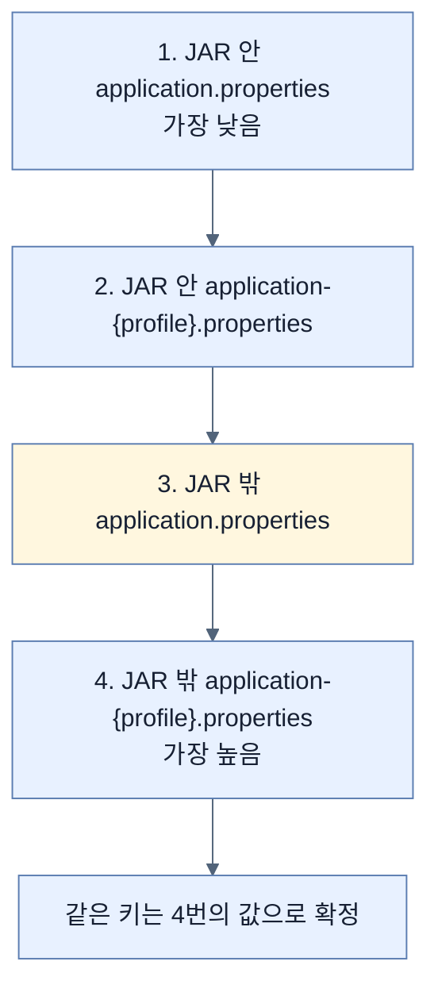
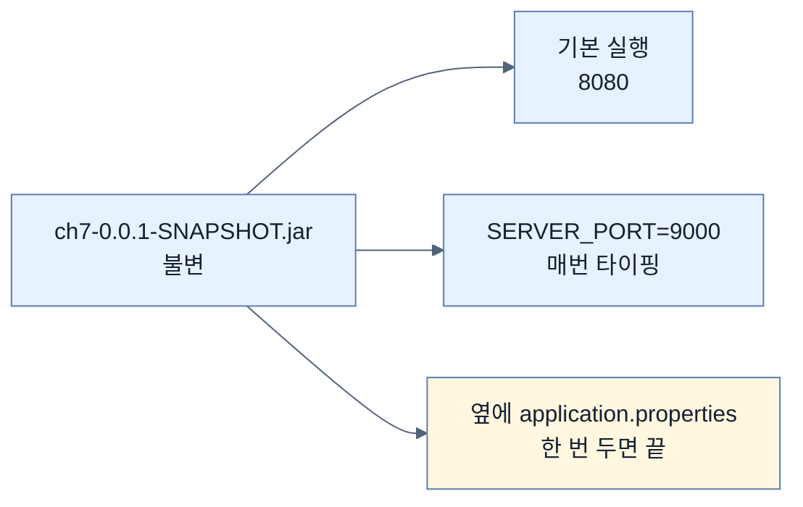

# 손대기 시작해야 진짜 운영이다 — JAR을 열지 않고 바꾸기

## 한눈에 보기

| 질문 | 핵심 답 |
|---|---|
| 운영의 본질 | 배포 후 **조정하고 만지작거리는 것** |
| 흔한 조정 대상 | 서버 포트 · DB 연결 · 로그 레벨 · 프로파일 활성화 |
| 방법 1 | `SERVER_PORT=9000 java -jar ...` — 환경 변수 |
| 그 한계 | **매번 타이핑해야 한다** |
| 방법 2 | JAR **옆에** `application.properties`를 둔다 |
| 왜 그게 이기나 | JAR 밖 설정이 JAR 안 설정보다 **우선순위가 높다** |
| 적용 범위 | 어떤 프로퍼티든 — 포트 하나에 그치지 않는다 |
| 다음 단계 | 서로 다른 설정으로 **여러 인스턴스** |

## 1. 왜 이게 필요한가

### 출발 장면: 옆자리 앱이 이미 8080을 쓰고 있다

[[03-publishing-an-image-to-docker-hub]]까지 하면 배포가 끝났다. 그런데 책의 표현대로 **"릴리스 후에 조정하고, 만지작거리고, 손보기 시작해야 애플리케이션이 진짜 운영에 있는 것이다. 그것이 운영이라는 일의 본질이다."**

구체적인 상황을 보자. 어제 설치한 다른 Spring Boot 웹 애플리케이션이 이미 8080을 쓰고 있다. 우리 앱은 다른 포트로 떠야 한다.

이 요구를 처리하는 나쁜 방법들이 있다.

| 방법 | 문제 |
|---|---|
| 소스의 `application.properties`를 고치고 재빌드 | **[[불변-아티팩트]]**(= 빌드 후 고치지 않는 배포물) 원칙이 깨진다. 테스트한 것과 다른 바이너리가 나간다 |
| **[[uber-JAR]]** 을 풀어 안의 설정을 고치고 다시 묶기 | Chapter 6이 강하게 금지한 방법(아래 2.2절 참고) |
| 환경마다 다른 JAR을 빌드 | 아티팩트가 환경 수만큼 늘어난다 |

책이 드는 조정 대상은 포트만이 아니다 — **서버 포트, 데이터베이스 연결, 로그 레벨, 특정 프로파일 활성화.** 그리고 이것은 **uber JAR로 돌든 컨테이너로 돌든 마찬가지**다.

## 2. 어떻게 동작하는가

### 2.1 기본 실행

```bash
% java -jar target/ch7-0.0.1-SNAPSHOT.jar
```

기본 설정으로 뜬다. 서블릿 표준 포트 8080이다.

### 2.2 환경 변수 하나로

```bash
% SERVER_PORT=9000 java -jar target/ch7-0.0.1-SNAPSHOT.jar
…
2026-02-11T22:02:58.010-03:00  INFO 5610 --- [main]
o.s.boot.tomcat.TomcatWebServer : Tomcat started on port 9000 (http) with context path '/'
```

**[[환경-변수-오버라이드]]**(= 실행 시점에 환경 변수로 설정 값을 덮어쓰는 것)다. 로그 마지막 줄이 9000을 확인해 준다.

이것이 되는 근거가 [[../chapter-6-configuring-an-application-with-spring-boot/04-setting-properties-with-environment-variables|Chapter 6]]에 있다. `SERVER_PORT`가 완화된 바인딩으로 `server.port`에 매핑되고, 환경 변수는 우선순위 목록에서 config data보다 **위**에 있다.

**아티팩트는 손대지 않았다.** 같은 JAR이 명령만 달라져 다르게 동작한다.

### 2.3 그런데 매번 치기 번거롭다

책이 바로 한계를 짚는다 — **"그건 좋은데, 매번 그 추가 파라미터를 치는 건 좀 번거롭지 않은가?"**

더 나은 방법이 있다. **로컬 폴더에 `application.properties`를 하나 만드는 것**이다.

```properties
server.port=9000
```

그리고 평범하게 실행한다.

```bash
% java -jar target/ch7-0.0.1-SNAPSHOT.jar
…
o.s.boot.tomcat.TomcatWebServer : Tomcat started on port 9000 (http) with context path '/'
```

명령은 처음과 똑같은데 결과가 다르다.

### 2.4 왜 밖의 파일이 이기는가

책의 설명이 정확하다 — **"Spring Boot가 기동할 때 주위를 둘러보고 로컬 폴더의 `application.properties`를 발견한다. 그리고 그 설정을 JAR 안에 있는 것에 대한 오버라이드로 적용한다."**

이것이 **[[외부-설정-파일]]**(= 실행 가능한 JAR 옆에 두는 설정 파일)의 성질이고, 근거는 [[../chapter-6-configuring-an-application-with-spring-boot/05-ordering-property-overrides|Chapter 6 · 프로퍼티 우선순위]]의 Config Data 4단계다.



노란 칸이 방금 만든 파일이다. **위치가 우선순위를 결정한다.**

이 배치가 만드는 배포 형태가 이렇다.

```text
/opt/app/
├── ch7-0.0.1-SNAPSHOT.jar        ← 손대지 않는다. 모든 환경에서 같은 파일
└── application.properties        ← 환경마다 다르다
```

[[../chapter-6-configuring-an-application-with-spring-boot/05-ordering-property-overrides|Chapter 6]]이 "JAR을 열지 마라"고 경고하면서 동시에 "그럴 필요가 없다"고 한 이유가 바로 이 구조다.

### 2.5 포트 하나에 그치지 않는다

책이 이 절을 확장으로 닫는다 — **"설정 오버라이드는 작은 조정에 그치지 않는다. 어떤 프로퍼티든 오버라이드할 수 있고, 서로 다른 설정으로 여러 애플리케이션 인스턴스를 지원할 수도 있다."**

그리고 현실적인 요구를 든다 — 매니저가 트래픽 증가에 대응하려고 **같은 애플리케이션의 인스턴스를 여러 개 돌리라**고 요청하는 상황.

인스턴스가 여럿이면 각자 다른 포트가 필요하고, 각자 다른 설정이 필요하다. 파일 하나로는 안 된다. 그때 쓰는 것이 **[[프로파일]]**(= 상황별 설정 묶음에 이름을 붙이는 장치)이고, [[04a-scaling-with-spring-boot]]의 주제다.

## 3. 그림으로 보기



| 방법 | 지속되나 | 기록되나 | 언제 |
|---|---|---|---|
| `SERVER_PORT=9000 java -jar` | 그 실행뿐 | 명령 이력 | 일회성 확인 |
| `export SERVER_PORT=9000` | 셸 세션 | 잊기 쉬움 | 개발 중 |
| JAR 옆 `application.properties` | **배포에 남는다** | **형상 관리 가능** | 운영 |
| 소스 수정 후 재빌드 | 남지만 | 아티팩트가 바뀐다 | **하지 마라** |

## 4. 이 노트에 나온 용어

| 용어 | 한 줄 뜻 | 정의 위치 |
|---|---|---|
| 환경 변수 오버라이드 | 실행 시점에 환경 변수로 설정을 덮어쓰기 | [[_glossary#환경-변수-오버라이드]] |
| 외부 설정 파일 | JAR 옆에 두는 설정 파일 | [[_glossary#외부-설정-파일]] |
| 불변 아티팩트 | 빌드 후 고치지 않는 배포물 | [[_glossary#불변-아티팩트]] |
| uber JAR | 코드·의존성·서버를 한 파일에 담은 아카이브 | [[_glossary#uber-JAR]] |
| 프로파일 | 상황별 설정 묶음에 이름을 붙이는 장치 | [[_glossary#프로파일]] |

## 5. 자주 헷갈리는 것

**"설정을 바꾸려면 다시 빌드해야 한다"** — 밖에서 덮어쓰면 된다. 같은 JAR이 그대로 돈다.

**"JAR 안의 설정이 최종이다"** — **JAR 밖이 이긴다.** 위치가 우선순위를 정한다.

**"환경 변수와 외부 파일 중 하나만 써야 한다"** — 둘 다 쓸 수 있고 우선순위가 다르다. 환경 변수가 config data보다 높다.

**"이 방법은 uber JAR에만 통한다"** — 컨테이너에도 통한다. 다만 파일을 **컨테이너 안에서 보이는 위치**에 두어야 하며, 그 함정이 [[04c-running-the-setup-with-docker-compose]]에 있다.

## 6. 언제 안 쓰나 / 경계

- **즉석 조정은 기록되지 않는다.** 명령줄 오버라이드는 그 실행에만 남는다. Chapter 6이 형상 관리에 반영하라고 권한 이유다.
- **외부 파일도 배포 절차가 보존해야 한다.** 자동으로 따라가지 않는다.
- **자격 증명을 여기 두는 것은 별개 문제다.** 파일을 볼 수 있는 사람은 값을 본다.
- **비유의 한계.** 이 구조는 "가전제품의 설정 스위치"에 가깝다. 제품을 뜯지 않고 겉의 스위치로 동작을 바꾼다. 다만 이 비유는 **스위치가 제품에 붙어 있다**는 인상을 준다. 여기서는 설정 파일이 아티팩트 **밖에** 따로 있어서, 제품을 옮길 때 스위치가 따라오지 않는다. 배포 절차가 둘을 함께 옮겨 주어야 한다.

## 7. 연결

- [[01-creating-an-uber-jar]] — 여기서 만든 JAR을 열지 않고 동작을 바꾸는 방법이 이 노트다.
- [[04a-scaling-with-spring-boot]] — "여러 인스턴스를 서로 다른 설정으로"라는 이 노트의 마지막 문장을 이어받는다.
- [[03-publishing-an-image-to-docker-hub]] — 이미지가 공개될 수 있다는 사실이 설정을 아티팩트 밖에 두어야 하는 또 다른 이유다.

## 8. 스스로 확인

1. "손대기 시작해야 진짜 운영"이라는 말이 배포 후 무엇을 요구하는가?
2. 포트를 바꾸는 세 가지 나쁜 방법과 각각의 문제는?
3. `SERVER_PORT=9000`이 동작하는 근거를 Chapter 6의 어느 규칙으로 설명할 수 있는가?
4. 명령이 똑같은데 결과가 달라지는 이유는?
5. JAR 밖 파일이 JAR 안 파일을 이기는 규칙의 이름과 순서는?
6. `/opt/app/`에 JAR과 프로퍼티 파일을 나란히 두는 배치가 지키는 원칙은?
7. 이 절이 다음 절로 넘어가는 요구는 무엇인가?
8. 설정 스위치 비유가 깨지는 지점은 어디인가?

<!-- ==== 아래는 내 영역 · 스킬 수정 금지 ==== -->

## 내 설명 시도


## 막혔던 지점


## 리뷰 이력
